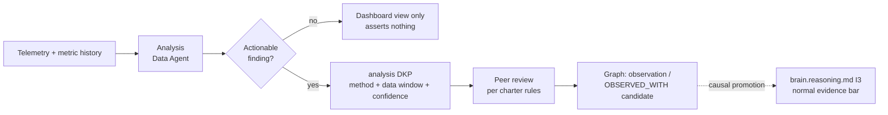

# Intelligence Analytics

Purpose: how aggregate insight is produced from the layers below it — telemetry ([brain.telemetry.md](brain.telemetry.md)) and the metric registry ([brain.metrics.md](brain.metrics.md)) — and, crucially, how analytical findings become knowledge instead of dashboards. The founding position: **a finding that lives only in a dashboard decays; a finding packed as a DKP compounds.** This completes the Data Agent's document cluster (telemetry → metrics → analytics) and defines the division of labor with the Dot.Analytics platform.

> **Related documents:** [brain.telemetry.md](brain.telemetry.md) — the raw signals · [brain.metrics.md](brain.metrics.md) — the committed metrics and §5 Goodhart review this document operationalizes · [brain.dkp.md](brain.dkp.md) — the pack format findings ship in · [brain.reasoning.md](brain.reasoning.md) — inference rules analytical claims must pass to become graph edges · [brain.community.md](brain.community.md) §3 — aggregation floor applies to every cohort analysis.

---

## 1. Principles

1. **Findings become packs, not pixels.** Any analysis whose conclusion someone might act on is published as a DKP with evidence, confidence, and a Why block — entering the graph, searchable, contradiction-checked. Dashboards are *views over* packed findings and live telemetry; they assert nothing themselves.
2. **Analytics observes; reasoning concludes.** An analytical finding is descriptive ("acceptance rate fell 12 points in Q3, coincident with the model-version bump") and enters as observation or `OBSERVED_WITH` candidate. Causal claims go through [brain.reasoning.md](brain.reasoning.md) I2→I3 like everything else — analysts get no causal shortcut.
3. **Every cohort is a floor check.** Cohort analyses (per-platform, per-persona, per-agent) obey the n ≥ 20 rule where the cohort is people; agent and platform cohorts are exempt (systems, not persons) but named-individual analysis never ships.
4. **Recurring products, registered consumers.** Every scheduled analysis names who reads it and what decision it feeds — an analysis product with no consumer at two consecutive quarterly reviews is retired, same discipline as telemetry's hoarding rule.

## 2. The analysis product catalog

| Product | Cadence | Producer → Consumer | Feeds which decision |
|---|---|---|---|
| **Colony health report** | quarterly | Data Agent → Governance Agent + Chief AI Engineer | Trust-score reviews, roster changes, gate calibration ([brain.agents.md](brain.agents.md) KPIs rolled up) |
| **Goodhart review dossier** | quarterly (one sampled metric) | Data Agent → Governance Agent | Target/pairing adjustments in [brain.metrics.md](brain.metrics.md) §5 |
| **Knowledge-flow trends** | monthly | Data Agent → Knowledge + Architecture Agents | Pipeline capacity, publisher outreach (which platforms go quiet) |
| **Recommendation outcome analysis** | quarterly | Data Agent → Learning Agent + Executive Sponsor | Loop B calibration evidence; the executive's "is the Brain worth it" answer |
| **Guard-metric baseline review** | quarterly | Data Agent → Dopamine Agent | Anomaly-band updates for [brain.dopemine.md](brain.dopemine.md) guards |
| **Ad-hoc investigations** | on request | Data Agent → requester | Whatever prompted them — but the finding still packs if actionable |

Each product's rendering follows the persona catalog ([brain.personas.md](brain.personas.md)): the same colony health findings render at `engineer` depth for the Chief AI Engineer and `executive` depth for the sponsor — depth, not truth, as always.

## 3. From analysis to knowledge — the packing rule

The analysis pack payload carries: the question asked, method (named, reproducible — a finding that can't be recomputed from the stated window is opinion), data window, cohort definition with floor check, the finding with confidence, and known confounds. Confounds are mandatory: an analysis pack without a stated alternative explanation is returned at review, because analytics is where spurious correlation enters the graph if anywhere.

## 4. Division of labor with Dot.Analytics

| | Data Agent (Brain-side) | Dot.Analytics (platform) |
|---|---|---|
| Subject matter | The Brain itself — colony, pipeline, knowledge flow | Ecosystem business/domain analytics for tenants |
| Output | Analysis DKPs into the Brain's graph | Its own products; publishes domain findings as DKPs like any platform |
| Relationship | Consumes Dot.Analytics-published packs as evidence | Receives Brain recommendations via PR like any platform |

The boundary matters: the Brain does not run tenant business analytics (platform-owned per manifesto principle 4), and Dot.Analytics gets no privileged pipe — its findings earn graph entry through validation like everyone's.

## 5. Worked example — the Goodhart dossier that caught a pairing gap

Q3 Goodhart review samples `dkp.pr_acceptance_rate` (≥ 40%, rising).

1. **Question:** if the colony optimized only this, what breaks? Analysis over 13 months of telemetry: acceptance rate rose 6 points while proposal *volume* fell 18% — the colony is proposing more conservatively, not proposing better.
2. **Confound check:** two platforms were mid-onboarding (lower-quality early proposals ending naturally). Volume drop net of onboarding effects: 9% — finding stands, weaker.
3. **Pack:** analysis DKP, confidence 0.74 (provisional), `OBSERVED_WITH` between acceptance-rate rise and volume decline; confound documented.
4. **Action:** the declared pair (`identity.cross_platform_lesson_reuse`) hadn't moved — pairing worked as designed, but the dossier recommends adding a volume guard directly on `dkp.pr_acceptance_rate`'s registry row. [brain.metrics.md](brain.metrics.md) §5 adjustment PR'd; the finding is in the graph, so next year's reviewer starts from it instead of rediscovering it. That difference — compounding versus rediscovering — is this document's entire argument.

## 6. Health metrics

Registered in [brain.metrics.md](brain.metrics.md): the Goodhart review cadence itself is governed by §5; `governance.audit_findings_closed_within_quarter ≥ 90%` covers dossier follow-ups. Also registered (§4.9): `analytics.findings_packed_ratio` (≥ 80% of actionable findings shipped as DKPs within 30 days — the dashboard-decay guard) and `analytics.product_consumer_attestation` (100% of catalog products attested by their named consumer at quarterly review).

---

## Change Log

| Version | Date | Author | Change |
|---|---|---|---|
| 1.0.0 | 2026-08-01 | Brain Document Generator (prompt 03, AI) | Initial spec: findings-become-packs rule, six-product catalog with named consumers, analysis-pack payload contract with mandatory confounds, Dot.Analytics division of labor, Goodhart dossier worked example |

## Open Questions

| Question | Owner → Approver |
|---|---|
| ~~Register `analytics.findings_packed_ratio` and `analytics.product_consumer_attestation` in brain.metrics.md §4.9 (pending batch now 6 IDs with semantic's and telemetry's)~~ Registered in [brain.metrics.md](brain.metrics.md) §4.9 (1.3.0) | Data Agent → Executive Sponsor |
| Does the analysis-pack payload need its own schema (schemas/analysis payload) or does the generic knowledge payload suffice with the method/confound fields as conventions? | Architecture Agent → Chief Architect |
| Should ad-hoc investigation requests above a cost threshold require Governance sign-off, or is Data Agent discretion sufficient? | Data Agent → Executive Sponsor |
