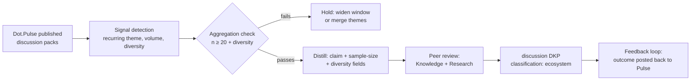

# Community Knowledge (Pulse)

Purpose: how the voices of the ecosystem's community — forum discussions, product feedback, contributor signals from Dot.Pulse — become verifiable knowledge without becoming surveillance. This document is owed by the [Community Agent charter](agents/community.charter.md) and by the dopemine gate's `community contribution quality` human-outcome target; its two load-bearing rules are the **n ≥ 20 aggregation floor** and the **reputation ≠ trust separation**.

> **Related documents:** [brain.dopemine.md](brain.dopemine.md) — the engagement gate community mechanics pass through · [brain.governance.md](brain.governance.md) §6 — POPIA/GDPR floors · [brain.dkp.md](brain.dkp.md) — the `discussion` payload · [brain.security.md](brain.security.md) §2 — classification levels · [brain.relationships.md](brain.relationships.md) — discussion nodes and feedback edges.

---

## 1. Principles

1. **Discussions are evidence about sentiment, not about reality.** A hundred posts saying a feature is slow is strong knowledge that *users experience it as slow* — and only a hypothesis that it *is* slow. Discussion-derived claims enter the graph as `OBSERVED_WITH` at best; promotion to `CAUSES` follows the standard causal bar in [brain.relationships.md](brain.relationships.md) §4.2, with telemetry or experiment as the mechanism evidence, never more posts.
2. **Aggregate or abstain.** No community-derived pack may make a claim about a cohort smaller than 20 identifiable contributors (§3). If the signal is real but the cohort is small, the pack waits or widens — it does not ship with a caveat.
3. **Reputation never sets trust.** Community standing (upvotes, badges, tenure on Dot.Pulse) may appear as a *corroboration input* on a claim, capped like any corroboration factor; it never feeds an agent or source trust score directly. The failure this prevents: a charismatic wrong contributor out-trusting a correct unknown one.
4. **Only published knowledge is harvested.** The Community Agent ingests packs Dot.Pulse *publishes*, never raw feeds, DMs, or draft threads. The platform decides what leaves its walls; the Brain works with what arrives at the DKP boundary like everything else.

## 2. From discussion to DKP — the distillation pipeline

Distillation steps (Community Agent, ≤ 7-day median lag per charter KPI):

1. **Signal detection** — a theme qualifies when it recurs across independent threads; single viral threads are flagged, not distilled (loud-minority guard).
2. **Aggregation check** — §3 floor plus diversity: contributors must span ≥ 3 platforms/tenants or ≥ 2 personas, or the claim is labeled cohort-specific.
3. **Distillation** — the pack carries mandatory `sample_size`, `distinct_contributors`, `time_window`, and `diversity` fields in its `discussion` payload; a sentiment claim without them fails schema validation (`DKP_SCHEMA_INVALID`).
4. **Peer review** — Knowledge Agent (graph fit) and Research Agent (is this sentiment or evidence?) per the charter's mandatory dual review.
5. **Feedback closure** — when a discussion-derived insight influences a shipped recommendation, the outcome is posted back to the originating community (`feedback loops closed ≥ 70%` KPI). Closure is itself a `community.feedback_closed` event inside a DKP per [brain.events.md](brain.events.md) naming.

## 3. The aggregation floor, operationalized

The n ≥ 20 floor from [brain.governance.md](brain.governance.md) §6 applies to community knowledge as follows:

| Rule | Detail |
|---|---|
| **Counting unit** | Distinct contributors, not posts — one prolific author is n = 1 |
| **Scope** | Any claim from which a cohort member's view or behavior could be inferred; pure product-fact claims ("the API returns 500 on X") carry no floor since they describe the system, not people |
| **Intersection attacks** | Combining two floor-compliant packs must not reconstruct a sub-20 cohort; validation checks the intersection of `time_window` × `diversity` fields on packs sharing a theme, and holds the later pack if the intersection is identifying |
| **Named individuals** | Never below T4 human approval (charter §3), regardless of consent claims — and then classification `sensitive`, subject to [ADR-0009](adr/ADR-0009-crypto-shredding-legal-erasure.md) erasure |
| **Held signals** | A held claim is not lost: it lives in `colony/drafts/community` and re-checks the floor as the window widens; a signal that never reaches 20 in a year is dropped and the drop is logged |

## 4. Reputation ≠ trust — the separation mechanics

- Community reputation may contribute to a claim's **corroboration factor** (the standard ×1.10/source, capped 1.30) when reputable contributors independently confirm — reputation makes the *corroboration* slightly stronger, never the *source trust*.
- Trust scores for Dot.Pulse-as-source follow the universal formula (0.5·accuracy + 0.3·review + 0.2·(1−incidents)); the platform's accuracy is measured by the corroboration rate of its distilled insights (≥ 60% charter KPI), not by its community's enthusiasm.
- The Governance Agent audits quarterly for contamination: any trust-score change whose ledger justification cites reputation signals is reverted and incident-logged.
- Corollary for the dopemine gate: `community contribution quality` as a target metric means *quality of contributions* (corroboration rate, problem-resolution rate) — never contribution *volume* or reputation-point accumulation, which are engagement metrics in community clothing and fail the [brain.dopemine.md](brain.dopemine.md) §3 proxy trace.

## 5. Worked example — the haul-road complaint cluster

Over three weeks, Dot.Pulse publishes discussion packs where mine-site operators complain that cycle-time recommendations "ignore the wet season."

1. **Signal:** 34 distinct contributors across 4 tenant sites (floor and diversity pass), recurring across 11 threads.
2. **Distilled claim:** "Operators report cycle-time recommendations are perceived as unreliable during wet-season months" — sentiment framing, `OBSERVED_WITH` edge to the Kolomela cycle-time knowledge, confidence 0.72 (provisional).
3. **Review:** Research Agent notes the claim is corroborated by an existing telemetry pattern (wet-season variance already visible in `mining` domain packs) — corroboration ×1.10, and a *hypothesis* pack is opened proposing a seasonal-adjustment factor for the Mining Agent.
4. **Outcome:** the Mining Agent's seasonal recalibration ships (through the normal W1–W6 pipeline); the Community Agent posts the outcome back to the originating threads. Feedback loop closed; the community learns its input moved the Brain — which is the healthiest contribution incentive available and needs no gamification.

## 6. Health metrics

Registered in [brain.metrics.md](brain.metrics.md): `governance.ethics_gate_bypasses = 0` (community mechanics pass the gate like everything else). Charter KPIs (corroboration ≥ 60%, loop closure ≥ 70%, privacy violations 0, lag ≤ 7 days) are agent-level. Also registered (§4.10): `community.aggregation_floor_holds` (reviewed quarterly — chronically high means themes are sliced too thin) and `community.reputation_contamination_incidents` (0, always).

---

## Change Log

| Version | Date | Author | Change |
|---|---|---|---|
| 1.0.0 | 2026-08-01 | Brain Document Generator (prompt 03, AI) | Initial policy: four principles, distillation pipeline, operationalized n ≥ 20 floor with intersection-attack rule, reputation/trust separation mechanics, wet-season worked example |

## Open Questions

| Question | Owner → Approver |
|---|---|
| ~~Register `community.aggregation_floor_holds` and `community.reputation_contamination_incidents` in brain.metrics.md §4.9 (batch now 10 pending IDs)~~ Registered in [brain.metrics.md](brain.metrics.md) §4.10 (1.2.0) | Community Agent → Chief Knowledge Engineer |
| Does the intersection-attack check need automated tooling, or is validation-time review sufficient at current pack volumes? | Security Agent → Security Officer |
| Should the diversity requirement (≥ 3 platforms/tenants or ≥ 2 personas) be schema-enforced or reviewer-judged? | Community Agent → Chief Knowledge Engineer |
