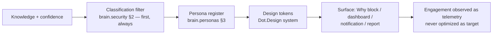

# Design Standards

Purpose: how Brain knowledge surfaces in human interfaces — Why blocks, dashboards, reports, notifications — and the visual/interaction expression of the rendering contracts [brain.personas.md](brain.personas.md) §3 defines in prose. This is the calm-technology counterpart to [brain.dopemine.md](brain.dopemine.md): dopemine says what interfaces must never *optimize for*; this document says what they should *feel like* instead. Built with Dot.Design's token and component system so Brain surfaces are consistent with the rest of the ecosystem, not a parallel visual language.

> **Related documents:** [brain.personas.md](brain.personas.md) — the contracts these standards render · [brain.dopemine.md](brain.dopemine.md) — prohibitions these principles positively restate · [brain.api.md](brain.api.md) §5 — where renderings are served · [brain.analytics.md](brain.analytics.md) — products these standards dress · [brain.telemetry.md](brain.telemetry.md) — how interface engagement is observed without being optimized.

---

## 1. Principle: calm by default, loud by evidence

A Brain surface earns attention with confidence and impact, never with color, motion, or repetition. Four principles, each the positive form of a dopemine prohibition:

| Principle | Positive rule | Dopemine counterpart |
|---|---|---|
| **Calm** | Default state is quiet; visual weight is proportional to *decision relevance*, not recency | No attention-capture optimization |
| **Legible confidence** | Every displayed claim carries its confidence band visually (solid ≥ 0.80, outlined 0.50–0.79, never-render < 0.50 without explicit request) | No certainty theater |
| **Finishable** | Every surface has an end: a dashboard answers its question and stops; no infinite feeds, no "you might also like" | No engagement loops |
| **Reversible attention** | Everything dismissible, nothing re-surfaces unchanged; a dismissed item returns only with *new evidence*, stated | No streaks, no re-notification nagging |

## 2. Surface standards

- **Why blocks** — the canonical component: claim, confidence band, evidence links, weakest-link callout, rendered per persona register. The weakest link is always visible without expansion — hiding it inverts the epistemics. Depth toggles switch persona register (operator ↔ engineer) without navigation.
- **Dashboards** — question-shaped, not data-shaped: each is titled with the question it answers and retired when nobody has the question (`analytics.product_consumer_attestation` applies to dashboards too). Metrics render with their paired guard metric adjacent, never alone — the anti-gaming pairing ([brain.metrics.md](brain.metrics.md) §5) is a *layout rule* here.
- **Notifications** — the scarcest surface, three triggers only: hard-invariant breach (pages, per metrics policy), a decision awaiting *this* user past SLA, or a sentinel/guard trip on something the user owns. Everything else lands in cadence digests. Notification copy states the decision needed, never just the event.
- **Reports** — the evolution-report family: narrative sections visually separated from verified-number sections ([brain.business.md](brain.business.md) §1's line, drawn literally); every figure links to its registered metric ID.

## 3. Rendering contracts, expressed

Per-persona expression of the §3 contracts: **engineer** — dense, monospace evidence IDs, raw confidence values; **operator** — one decision per screen, plain-language weakest link, large dismiss/accept affordances; **executive** — trend-first, money-denominated where the platform priced it, one page; **auditor** — chronological, immutable-feeling (no hover-reveals — everything printed is everything there is). All four are token variants of the same components: content identical, register different — the personas invariant, enforced at the component library level so a surface *cannot* diverge content by persona.

## 4. The measurement boundary

Interface improvement follows Loop C ([brain.learning.md](brain.learning.md)): comprehension checks and task completion, not engagement. Dwell time, open rates, and click-through are collected as telemetry families for *diagnosis* (a Why block nobody expands may be too shallow) and are prohibited as design targets — a design change justified by "engagement went up" is returned by the Dopamine gate exactly like a recommendation would be. Design changes to decision-bearing surfaces are E2-class experiments ([brain.experiments.md](brain.experiments.md)) with comprehension as the registered outcome.

## 5. Worked example — the dwell-guard, redesigned

The [brain.telemetry.md](brain.telemetry.md) dwell-guard example, closed at the interface: telemetry showed operators dwelling 4× longer on wet-season Why blocks. Diagnosis (not celebration): the operator register buried the weakest link below the fold. Redesign per §2 — weakest link surfaced unexpanded, one decision per screen. E2 experiment, pre-registered outcome: comprehension check pass-rate, *not* dwell. Result: dwell fell 60% (fine — dwell was never the target), comprehension rose from 3.1 to 4.4/5. Packed as a process success (S-entry): "surfacing the weakest link unexpanded raises operator comprehension" — a candidate design pattern once a second surface replicates it.

## 6. Health metrics

Registered in [brain.metrics.md](brain.metrics.md): `explainability.human_comprehension_score ≥ 4/5` (the design system's defining outcome) · `personas.escalation_rate` / `personas.default_fallback_rate` (register fit) · `dopemine.guard_breach_rate = 0` (calm principles hold under pressure). Also registered (§4.9, 1.5.0): `design.notification_precision` (≥ 90% of notifications lead to the stated decision being taken or explicitly declined — a notification that prompts nothing was noise) and `design.surface_retirement_rate` (reviewed — dashboards retired per year; zero means unanswered questions are accumulating pixels).

---

## Change Log

| Version | Date | Author | Change |
|---|---|---|---|
| 1.0.0 | 2026-08-01 | Brain Document Generator (prompt 03, AI) | Initial standards: four calm principles as positive forms of dopemine prohibitions, surface standards (Why blocks, dashboards, notifications, reports), per-persona token-variant rendering, Loop C measurement boundary, dwell-guard redesign example |

## Open Questions

| Question | Owner → Approver |
|---|---|
| ~~Register `design.notification_precision` and `design.surface_retirement_rate` in brain.metrics.md §4.9 (batch now 4 with business's)~~ Registered in [brain.metrics.md](brain.metrics.md) §4.9 (1.5.0) | UX Agent → UX Architect |
| Component-library enforcement of content-identical persona variants: build-time check in Dot.Design or review-time rubric? | UX Agent → Chief Architect |
| Accessibility standards (WCAG level, screen-reader treatment of confidence bands) — adopt Dot.Design's baseline or set a stricter Brain-surface bar? | UX Agent → UX Architect |
