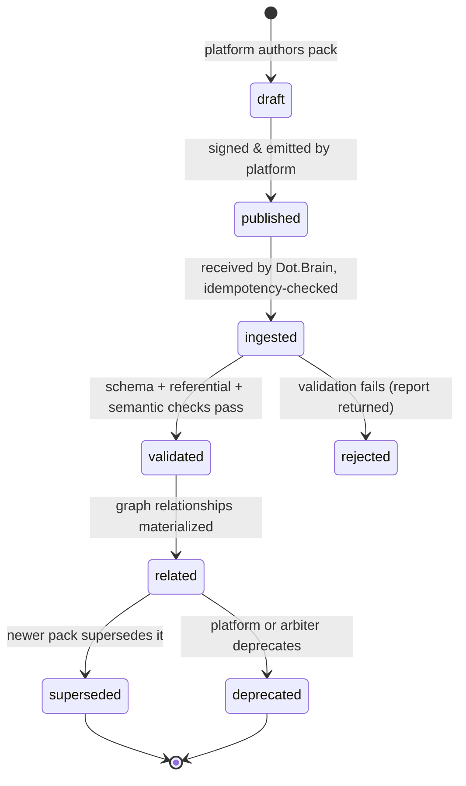
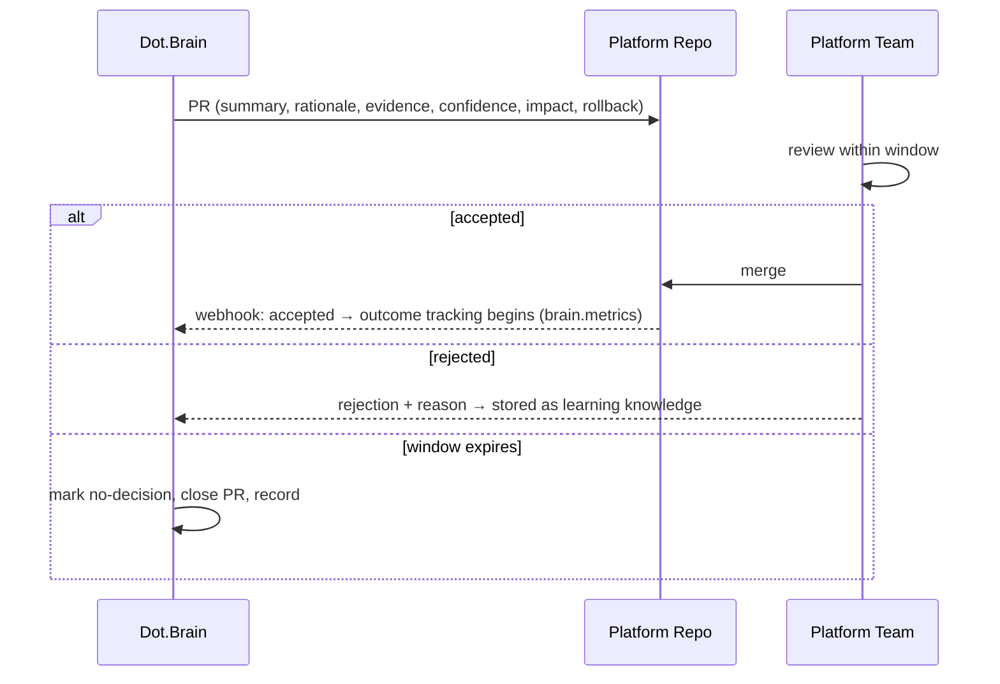
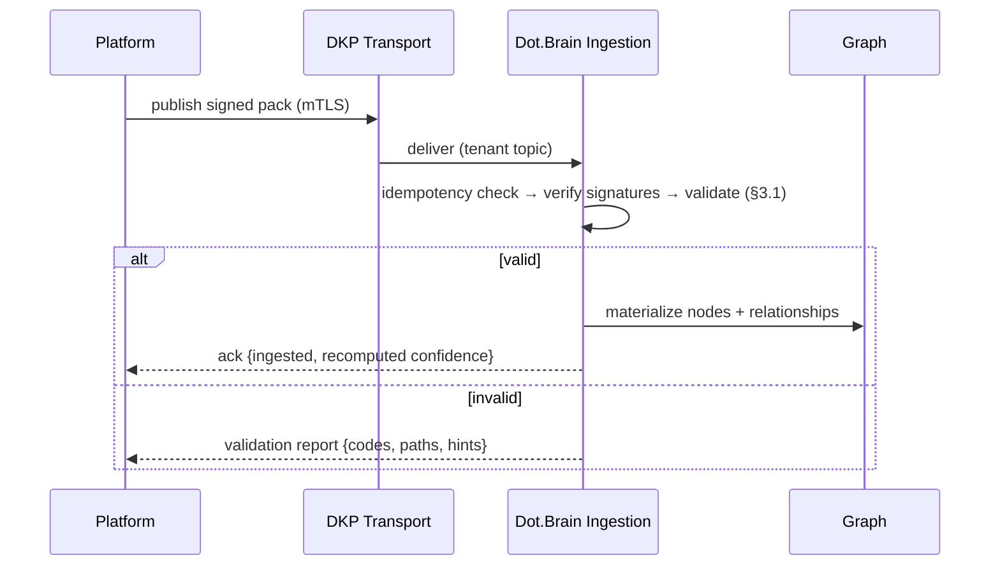

# brain.dkp — The Dot Knowledge Protocol

Purpose: DKP is the versioned, signed, auditable protocol through which platforms publish knowledge to Dot.Brain and Dot.Brain returns intelligence as Pull Requests. It is the **only** way knowledge crosses the ownership boundary. This spec is complete enough for a platform that does not yet exist to implement a compliant publisher and consumer with no further questions.

> **Related documents:** [README.md](../README.md) · [brain.platforms.md](brain.platforms.md) · [brain.recommendations.md](brain.recommendations.md) · [brain.relationships.md](brain.relationships.md) · [brain.security.md](brain.security.md) · [schemas/knowledge-pack.schema.json](schemas/knowledge-pack.schema.json) · [templates/knowledge-pack.template.md](templates/knowledge-pack.template.md) · ADRs [0002](adr/ADR-0002-dkp-signature-scheme.md), [0003](adr/ADR-0003-dkp-versioning-policy.md), [0004](adr/ADR-0004-dkp-conflict-resolution.md)

---

## 1. Knowledge Packs

### 1.1 Definition

A **Knowledge Pack (pack)** is a signed, versioned, self-describing envelope containing one or more typed knowledge payloads plus provenance, relationships, and impact declarations. A pack is immutable once published: corrections are new packs that `supersedes` the old one.

### 1.2 Lifecycle


*A pack moves strictly forward; rejected packs are returned with a machine-readable validation report and never enter the graph.*

Every state transition is appended to the pack's immutable change log (§6.3) with timestamp, actor, and reason.

### 1.3 Envelope structure

Canonical JSON, validated by [schemas/knowledge-pack.schema.json](schemas/knowledge-pack.schema.json):

| Field | Type | Req | Meaning |
|---|---|---|---|
| `dkp_version` | semver | ✔ | Protocol version the pack conforms to |
| `pack_id` | `dkp:<platform>:<uuid>` | ✔ | Globally unique, permanent |
| `pack_version` | semver | ✔ | Version of this pack's content |
| `platform` | registry ID | ✔ | Publishing platform (must exist in `brain.platforms.md`) |
| `title`, `summary` | string | ✔ | Human-readable |
| `created_at` | RFC 3339 UTC | ✔ | Authoring time |
| `contributors[]` | Contributor | ✔ | Humans and AI, both first-class (§5.3) |
| `payloads[]` | typed payloads | ✔ | ≥ 1, each with `payload_type` (§1.4) |
| `relationships[]` | Relationship | – | Graph edges declared by the pack (§4.1) |
| `provenance` | Provenance | ✔ | Full source→transform chain (§5.1) |
| `confidence` | 0.00–1.00 | ✔ | Publisher's asserted confidence (recomputed on ingestion, §3.3) |
| `signatures[]` | Signature | ✔ | ≥ 1 platform signature; contributor signatures as applicable (§5.2) |
| `supersedes` | pack_id | – | Pack this replaces |
| `x-*` | any | – | Forward-compatible extensions (§2.4) |

### 1.4 Payload types

Each payload carries `payload_type`, a type-specific `body` (own schema), and optional `x-*` fields.

| `payload_type` | Schema | Content |
|---|---|---|
| `entity_model` | [entity.schema.json](schemas/entity.schema.json) | Domain entities, attributes, identity rules |
| `event_model` | [event.schema.json](schemas/event.schema.json) | Event definitions, triggers, consumers |
| `workflow_model` | [workflow.schema.json](schemas/workflow.schema.json) | Process steps, actors, transitions |
| `metric` | [metric.schema.json](schemas/metric.schema.json) | Metric definition + observations |
| `insight` | [insight.schema.json](schemas/insight.schema.json) | Analyzed finding with evidence |
| `recommendation` | [recommendation.schema.json](schemas/recommendation.schema.json) | Proposed change with impact declarations (§4.2) |
| `document` | envelope-inline | Markdown knowledge document + metadata |
| `discussion` | envelope-inline | Curated community/expert discussion distillate |
| `learning_history` | envelope-inline | Experiment runs, model training outcomes |
| `incident_report` | [incident.schema.json](schemas/incident.schema.json) | Incidents, outages, security events, failed experiments (§9) |

---

## 2. Versioning & Compatibility

Full rationale: [ADR-0003](adr/ADR-0003-dkp-versioning-policy.md).

### 2.1 Two independent versions

- **`dkp_version`** — the protocol. Owned by Dot.Brain. Current: `1.0.0`.
- **`pack_version`** — each pack's content. Owned by the publisher.

### 2.2 Semantics

| Change | Protocol (`dkp_version`) | Pack (`pack_version`) |
|---|---|---|
| MAJOR | Removed/renamed required field, changed validation semantics — consumers MUST upgrade | Assertion reversal or breaking model change — dependents must re-evaluate |
| MINOR | New optional fields/payload types — old consumers ignore safely | Additive knowledge, new evidence |
| PATCH | Clarifications, doc fixes, no wire change | Typos, metadata corrections |

### 2.3 Older-protocol packs & deprecation

- Dot.Brain accepts packs from protocol `N-1` MAJOR (translated on ingestion by a versioned adapter; translation recorded in provenance).
- A MAJOR release starts a **sunset window of 18 months** for the previous MAJOR. Warnings are attached to every ingestion ack in the final 6 months; after sunset, packs are rejected with `DKP_VERSION_SUNSET`.
- Deprecated fields remain readable for one full MAJOR cycle before removal.

### 2.4 Future extension

Any object may carry `x-` prefixed fields. Validators MUST ignore unknown `x-*` fields (never fail). Extensions that prove useful are promoted into the schema at the next MINOR; the `x-` form remains accepted until the next MAJOR.

---

## 3. Validation & Trust

### 3.1 Validation pipeline

1. **Schema validation** — envelope and each payload against JSON Schemas; unknown non-`x-` fields fail.
2. **Referential validation** — every referenced graph node ID (`dot:node:*`), pack ID, and platform ID must exist; dangling references fail with `DKP_REF_MISSING`.
3. **Semantic validation** — contradiction detection against the graph: if a payload asserts `A` while the graph holds verified `¬A`, the pack is flagged `contradicts` and routed to conflict resolution (§6.2) rather than rejected.

### 3.2 Trust Scores

Maintained per **publishing platform** and per **contributor** (human or AI), range 0.00–1.00, recomputed on every review outcome:

```
trust = w1·historical_accuracy + w2·review_outcome_rate + w3·(1 − incident_involvement_rate)
        (w1=0.5, w2=0.3, w3=0.2; new publishers start at 0.50)
```

- `historical_accuracy`: fraction of past assertions later corroborated (rolling 24 months).
- `review_outcome_rate`: fraction of packs passing review without required changes.
- `incident_involvement_rate`: fraction of published recommendations later implicated in incidents.
- Trust scores are themselves knowledge: versioned, explainable, queryable.

### 3.3 Knowledge Confidence

Every assertion carries confidence recomputed by Dot.Brain on ingestion:

```
confidence = source_trust × validation_score × corroboration_factor × age_decay

  validation_score      = 1.0 if all checks pass; 0.8 if semantic warnings
  corroboration_factor  = min(1.0, 0.7 + 0.1 × independent_corroborations)
  age_decay             = e^(−λ · age_in_days), λ per payload type
                          (metrics λ=0.010, insights λ=0.004, entity/workflow models λ=0.001,
                           incident lessons λ=0 — lessons never decay)
```

The publisher's asserted `confidence` is retained in provenance; the recomputed value is authoritative in the graph.

---

## 4. Relationships & Impact

### 4.1 Knowledge Relationships

Packs declare edges referencing graph node IDs (`dot:node:<domain>:<uuid>`) or pack IDs:

| Type | Meaning |
|---|---|
| `relates-to` | Contextual association |
| `supersedes` | Replaces prior knowledge (predecessor kept, marked superseded) |
| `contradicts` | Asserted conflict — triggers §6.2 |
| `depends-on` | Valid only while target is valid |
| `derived-from` | Produced by transformation of target |

### 4.2 Impact declarations (mandatory on every Recommendation)

Every `recommendation` payload MUST declare all three, each with `metric`, `baseline`, `target`, and measurement window:

- **Business Impact** — revenue, cost, throughput, risk metric.
- **User Impact** — usability, time-saved, error-rate, satisfaction metric.
- **Dopamine Impact** — ethical engagement effect per Dot.Dopemine principles: MUST target learning/achievement/mastery/progress metrics; MUST NOT target raw session time or open counts. Validators reject recommendations whose dopamine metric is on the prohibited list in [brain.dopemine.md](brain.dopemine.md).

Recommendations without a measurable metric are rejected: *define the metric before the feature.*

---

## 5. Provenance & Signatures

Full rationale for the signature scheme: [ADR-0002](adr/ADR-0002-dkp-signature-scheme.md).

### 5.1 Knowledge Provenance

`provenance` records the full chain: `sources[]` (raw origin: system, dataset, sensor, discussion, model run — with URIs and timestamps) → `transformations[]` (ordered steps: tool/model, version, parameters, actor) → `published_by` (contributor ID). Every ingestion-side transformation (protocol translation, confidence recomputation) is appended by Dot.Brain. Provenance is never truncated.

### 5.2 Digital Signatures

- **Algorithm:** Ed25519 over the RFC 8785 (JCS) canonicalized envelope minus the `signatures` array.
- **Keys:** each platform holds a signing key registered in its `platform.dkp.json` manifest; AI contributors and human contributors hold individual keys registered in the contributor registry.
- **Verification:** on ingestion, every signature is verified against the registry; an unverifiable platform signature ⇒ hard reject `DKP_SIG_INVALID`.
- **Rotation:** manifests list `keys[]` with `valid_from`/`valid_to`; overlap windows allow zero-downtime rotation; revoked keys invalidate nothing retroactively (packs verified at ingestion remain valid — verification time is recorded).

### 5.3 AI and Human Contributors

Both are first-class and identified: `{ id, kind: "human" | "ai", display_name, key_id }`. AI contributions are **permanently** flagged (`kind: "ai"` is immutable in the graph). Accountability is identical: trust scores, review outcomes, and incident involvement accrue to both kinds.

---

## 6. Approval Workflow & Review

### 6.1 Review tiers

1. **Automated checks** — §3.1 pipeline.
2. **Agent peer review** — the domain-owning agent (per README ownership matrix) reviews content quality, relationship correctness, and impact plausibility.
3. **Human approval by impact tier:**

| Tier | Criteria | Approver |
|---|---|---|
| T1 | Informational payloads, no recommendation | Auto-approve after agent review |
| T2 | Recommendation, single-platform impact | Platform owner |
| T3 | Recommendation, cross-platform impact | Chief Knowledge Engineer |
| T4 | Security-relevant, financial, or ethics-flagged | Security Officer / Ethics Officer + CKE |

### 6.2 Merge Strategy & Conflict Resolution

Full model: [ADR-0004](adr/ADR-0004-dkp-conflict-resolution.md).

Accepted knowledge merges into the graph additively; contradictions never silently overwrite:

```mermaid
sequenceDiagram
    participant P as Incoming Pack
    participant V as Semantic Validator
    participant CR as Conflict Resolver
    participant H as Human Arbiter
    participant G as Knowledge Graph
    P->>V: assertion A
    V->>V: detects verified ¬A in graph
    V->>CR: contradiction case opened
    CR->>CR: weigh evidence: confidence, trust, corroboration, recency
    alt decisive (Δconfidence ≥ 0.20)
        CR->>G: higher-confidence assertion wins; loser marked superseded
    else indecisive
        CR->>H: escalate with full evidence dossier
        H->>G: ruling recorded
    end
    G->>G: resolution itself stored as new knowledge (derived-from both)
```
*Every conflict resolution — automated or human — becomes a new, permanent knowledge node with full provenance.*

### 6.3 Change Logs

Every pack and every resolution appends to an **immutable, append-only log** (hash-chained; each entry references the previous entry's hash). Logs are queryable via the audit API ([brain.api.md](brain.api.md)).

---

## 7. Pull Request Contract

The only channel by which Dot.Brain proposes changes to a platform. **Silence ≠ consent** — an unanswered PR expires after its stated review window and is recorded as `no-decision`.

Required PR structure (body is machine-parseable YAML front-matter + Markdown):

| Section | Content |
|---|---|
| `summary` | One-paragraph, plain-language proposal |
| `rationale` | Why — reasoning chain, linked graph nodes |
| `evidence[]` | Links to packs, metrics, incidents supporting the proposal |
| `confidence` | 0.00–1.00 with formula inputs shown |
| `impact` | Business / User / Dopamine impact estimates (metric, baseline, target) |
| `rollback` | How to revert, blast radius, monitoring signals to watch |
| `review_window` | Days until expiry (default 30) |
| `provenance` | Chain back to originating knowledge |


*Every PR outcome — accept, reject, or silence — is ingested back as knowledge that tunes future recommendations and trust scores.*

## 8. Transport & Registry

- **Model:** publish/subscribe. Platforms publish packs to their tenant-scoped topic; Dot.Brain subscribes. Dot.Brain publishes acks, validation reports, and advisories to per-platform response topics.
- **Registration:** a platform registers by committing `platform.dkp.json` ([schema](schemas/platform-manifest.schema.json)) — identity, endpoints, signing keys, subscribed advisory categories — and adding one row to [brain.platforms.md](brain.platforms.md). Nothing else changes (registry-driven extensibility invariant).
- **Authentication:** mutual TLS per tenant + envelope signatures (defense in depth). Transport identity must match `platform` claim.
- **Idempotency:** `pack_id` + `pack_version` is the idempotency key; duplicates ack success without re-ingestion.
- **Retry:** publisher retries with exponential backoff (base 2 s, max 15 min, jitter); acks are at-least-once; consumers must be idempotent.
- **Rate limits:** default 100 packs/min per platform (raised via registry); over-limit ⇒ `429` with `retry_after`.
- **Multi-tenant isolation:** per-tenant topics, keys, and storage partitions; no cross-tenant reads except through the graph API's explicit sharing policies ([brain.security.md](brain.security.md)).


*Publication is fire-and-acknowledge: the publisher always receives either an ingestion ack or a machine-readable validation report.*

## 9. Incident Knowledge (Anti-Fragility)

### 9.1 Incident Reporting pack type

`incident_report` payloads ([incident.schema.json](schemas/incident.schema.json)) are mandatory for: incidents, outages, security events, failed experiments, rollbacks, disasters. Required fields: `severity`, `detection` (how/when detected, MTTD), `impact` (systems, users, business), `timeline[]` (timestamped events), `root_cause` (with contributing factors), `corrective_actions[]` (with owners and due dates), `lessons[]` (each with `verified: bool` and the verification evidence). Incident lessons have **zero age decay** (§3.3).

### 9.2 Lesson propagation

```mermaid
sequenceDiagram
    participant M as Dot.Mines (incident source)
    participant B as Dot.Brain
    participant G as Graph
    participant O as Other platforms sharing the pattern
    M->>B: incident_report pack
    B->>G: ingest; match root-cause pattern against graph
    G-->>B: platforms with the vulnerable pattern (e.g., same workflow model)
    B->>O: advisory PRs (per §7 contract, evidence = incident + lesson)
    O-->>B: accept / reject / expire — outcomes recorded
```
*Verified lessons fan out as advisory PRs only to platforms whose registered models match the vulnerable pattern — never broadcast noise.*

Propagation rule: only `verified: true` lessons propagate; unverified lessons stay attached to the incident node until verified by the Resilience Agent per [brain.resilience.md](brain.resilience.md).

---

## Error Codes (normative)

`DKP_SCHEMA_INVALID` · `DKP_REF_MISSING` · `DKP_SIG_INVALID` · `DKP_VERSION_SUNSET` · `DKP_RATE_LIMITED` · `DKP_DUPLICATE` (non-error ack) · `DKP_CONTRADICTION_OPENED` (informational) · `DKP_IMPACT_MISSING` · `DKP_DOPAMINE_METRIC_PROHIBITED`

---

## Change Log

| Version | Date | Author | Change |
|---|---|---|---|
| 1.0.0 | 2026-08-01 | DKP Architect (prompt 02) | Initial complete protocol specification |

## Open Questions

- Should T1 auto-approval require two independent agent reviews for packs from publishers with trust < 0.40?
- Advisory PR fan-out cap per incident (proposed: 25, then batched digest) — needs load data.
- Formal grammar for graph node IDs to be ratified in brain.relationships.md.
