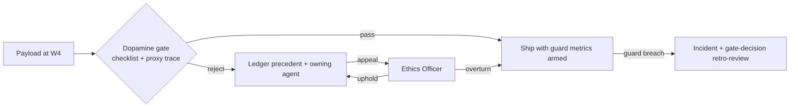

# Ethical Engagement Intelligence (Dopemine)

Purpose: the full policy behind the ecosystem's engagement conscience — what may and may not be optimized when knowledge touches human motivation, how the ethics gate decides, and how Dot.Dopemine (the platform) and the Dopamine Agent (the colony's gate) divide the work. This document owes its existence to three standing references: the prohibition in [brain.metrics.md](brain.metrics.md) §5, the ethics gate in [brain.workflows.md](brain.workflows.md) §5, and the [Dopamine Agent charter](agents/dopamine.charter.md).

> **Related documents:** [brain.governance.md](brain.governance.md) §5 — the gate checklist (canonical there, operationalized here) · [MANIFESTO.md](MANIFESTO.md) principle 5 — knowledge helps people make better decisions · [brain.agents.md](brain.agents.md) §8c — the worked gate rejection · [brain.platforms.md](brain.platforms.md) — Dot.Dopemine's registry entry.

---

## 1. The core distinction: measure vs. optimize

Engagement signals are legitimate *knowledge* and prohibited *targets*:

- **Measuring** session length, open rates, or notification response is allowed and often necessary — they are observations about reality, and refusing to see them would blind the guard metrics.
- **Optimizing** them as terminal goals is prohibited ecosystem-wide. No recommendation, experiment, agent objective, or learning-loop reward may treat an engagement-mechanic metric as the thing to maximize.

The line is the `impact.metrics[]` block: engagement signals may appear as **guard metrics** (watched for harm) but never as **target metrics** (declared benefits). [schemas/recommendation.schema.json](schemas/recommendation.schema.json) encodes the distinction; the Dopamine gate enforces it on the whole provenance chain, not just the declared block — laundering an engagement target through a proxy metric (see §3) is the failure mode the gate exists for.

## 2. The prohibited and preferred lists

Canonical checklist: [brain.governance.md](brain.governance.md) §5. This document maintains the lists it references.

**Prohibited as targets** (extending requires Ethics Officer sign-off; shrinking requires an ADR):
raw session time · app-open counts · scroll depth · notification click-through as terminal goal · streak length for its own sake · variable-reward schedule effectiveness · time-to-return after notification · any metric whose improvement is consistent with the user being *worse off*.

**Preferred human-outcome targets** (the §5-checklist point 1 catalog):
learning and mastery · task completion and productivity · achievement of user-stated goals · community contribution quality · confidence and momentum · healthy habit formation · progress visibility.

The acid test for a proposed target: *describe a user for whom this metric improves while their life gets worse.* If that user is easy to imagine, the metric is prohibited or needs a guard.

## 3. Proxy laundering — the gate's hard problem

Prohibited targets rarely arrive labeled. They arrive as proxies:

| Proposed target | Laundered prohibited target | Gate response |
|---|---|---|
| "daily learning touchpoints" | app-open count | Reject: touchpoints without comprehension delta is opens |
| "community response latency" | time-to-return after notification | Reject unless paired with response *quality* guard |
| "habit consistency score" | streak length | Conditional: passes only if breaking the streak carries zero in-app penalty and the habit is user-declared |
| "progress reminder effectiveness" | notification CTR | Reject as target; allowed as guard under a user-goal-attainment target |

Gate procedure for suspected proxies: trace the metric's causal ancestry in the graph ([brain.relationships.md](brain.relationships.md) `DERIVED_FROM` edges) — if the proposed target's strongest causal parent is a prohibited metric, it inherits the prohibition. Ambiguity escalates to the Ethics Officer; the ruling becomes a ledger-recorded precedent added to the table above.

## 4. Division of labor

| Role | Holder | Duties |
|---|---|---|
| **Gate** (colony-side) | Dopamine Agent | W4 ethics gate ([brain.workflows.md](brain.workflows.md) §5); reviews `impact.metrics[]` + provenance; maintains §2/§3 lists; co-reviews MANIFESTO-tier documents |
| **Platform** (product-side) | Dot.Dopemine | Builds ethical engagement mechanics for the ecosystem's apps; publishes engagement research as DKPs; owns its own repo — the Brain proposes to it via PRs like any platform |
| **Appeal & precedent** | Ethics Officer (human) | Appeals on gate rejections; prohibited-list changes; precedent rulings |

The deliberate tension: Dot.Dopemine *wants* effective engagement mechanics; the Dopamine Agent *gates* them. They share a name and a domain but not an interest — the platform's packs get no gate discount, and the agent's rejections of Dot.Dopemine-derived recommendations are the strongest evidence the separation works (`colony.override_rate` and appeal overturn rates are the calibration check).

## 5. Gate outcomes and learning

Every gate decision is knowledge:
- **Rejections** are ledger-recorded with the failed checklist point and become searchable precedents ([brain.agents.md](brain.agents.md) §8c is the founding example).
- **Overturned appeals** feed Loop B double-weight — the gate was miscalibrated in the strict direction, which is survivable but costly.
- **Passed recommendations** carry their guard metrics into W6 outcome tracking; a guard metric breaching its harm threshold auto-opens an incident *and* retro-flags the gate decision for review — a pass that later harms is treated with the same severity as an unexplained recommendation.

## 6. Worked example — the streak that didn't ship

Dot.Farms proposes (via a colony recommendation) a "planting-log streak" to improve agronomic record quality — genuinely useful records, gamified entry.

1. Declared target: `agriculture.record_completeness` (legitimate human-outcome metric — record quality serves the farmer's own agronomy).
2. Proxy trace: the mechanism is a streak; streak length appears in `DERIVED_FROM` ancestry. §3 conditional applies.
3. Gate ruling: pass **with conditions** — no penalty on streak break (a farmer returning after two weeks sees encouragement, not a broken chain); streak display opt-out (checklist point 5); guard metrics armed: log-entry quality score (records padded to keep streaks would show here) and entry-time-of-day dispersion (late-night compliance logging is a harm signal).
4. Three months in: completeness +18%, quality guard flat, dispersion normal. The conditional-pass pattern is packed as a success pattern ([brain.success.md](brain.success.md)) — the gate's job is not to say no; it is to make yes safe.

## 7. Health metrics

Registered in [brain.metrics.md](brain.metrics.md): `governance.ethics_gate_bypasses = 0, always` (the gate is not optional) · `governance.why_block_comprehension ≥ 4/5` (rejection reasoning must be understood to become precedent). Also registered (§4.10): `dopemine.gate_overturn_rate` (≤ 10% — higher means the gate is miscalibrated strict; zero over a year means nobody is appealing, which is its own finding) and `dopemine.guard_breach_rate` (0 sustained breaches — a breached guard that stays breached means shipped harm).

---

## Change Log

| Version | Date | Author | Change |
|---|---|---|---|
| 1.0.0 | 2026-08-01 | Brain Document Generator (prompt 03, AI) | Initial policy: measure-vs-optimize distinction, prohibited/preferred lists with acid test, proxy-laundering table and trace procedure, gate/platform/appeal division, conditional-pass worked example |

## Open Questions

| Question | Owner → Approver |
|---|---|
| ~~Register `dopemine.gate_overturn_rate` and `dopemine.guard_breach_rate` in brain.metrics.md §4.9 (batch: 8 pending IDs)~~ Registered in [brain.metrics.md](brain.metrics.md) §4.10 (1.2.0) | Dopamine Agent → Ethics Officer |
| Should guard-metric harm thresholds be set by the proposing agent (contextual) or by this document (uniform)? Precedents will decide within a year | Dopamine Agent → Ethics Officer |
| Do gate agents need deputies to avoid single-point review bottlenecks? (Shared with brain.agents.md's open question) | Governance Agent → Chief AI Engineer |
