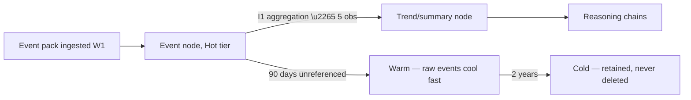

# Event Taxonomy & Event-Driven Contracts

Purpose: the canonical taxonomy of events flowing through the Dot ecosystem — naming rules, payload contracts, delivery guarantees, and how events relate to (but never bypass) the DKP boundary. Also settles the open architecture question: **event-driven vs. polling for the PR-outcome return path.**

> **Related documents:** [brain.dkp.md](brain.dkp.md) — events are one DKP payload type ([schemas/event.schema.json](schemas/event.schema.json)) · [brain.workflows.md](brain.workflows.md) — the pipeline events drive · [brain.architecture.md](brain.architecture.md) — the components that emit and consume · [brain.metrics.md](brain.metrics.md) — observations events carry.

---

## 1. One boundary, two tempos

Events do not create a second door into the brain. **Every event crossing the platform boundary travels inside a signed Knowledge Pack** (`event` payload type, validated in W1 like everything else). What events add is *tempo*: a lightweight, high-frequency payload shape for things that happen, distinct from insights (things concluded) and entities (things that exist).

Internal events (colony signals, workflow transitions) never leave the brain and are not part of this taxonomy — they live in `colony/signals` ([brain.agents.md](brain.agents.md)) and the ledger.

## 2. Naming rules

`<domain>.<subject>_<past-tense-verb>` — lower snake_case, past tense (events are facts, not commands):

- ✅ `route.completed`, `vehicle.delayed` (the Dot.Logistics hello pack, [brain.platforms.md](brain.platforms.md) §4), `recommendation.decided`, `conclusion.overridden`
- ❌ `sendNotification` (command), `truck.delay` (not past tense), `MinesCycleUpdate` (wrong case, no domain)

Rules: domain prefix must match a registered namespace ([brain.metrics.md](brain.metrics.md) §3 registry doubles as the domain authority); new event types are registered in the emitting platform's manifest — zero-change extensibility, no central approval for domain events; brain-emitted event types (below) require this document.

## 3. Brain-emitted event types (canonical set)

The brain itself emits few event types, all through the front door as packs:

| Event | Emitted by | When | Primary consumer |
|---|---|---|---|
| `recommendation.decided` | PR Generator (W6) | PR merged / closed / expired | Learning Loop A/B |
| `conclusion.overridden` | Governance workflow | Human override recorded | Learning Loop B (double weight) |
| `knowledge.superseded` | Knowledge Agent | Supersession lands | Subscribing platforms holding stale references |
| `contradiction.opened` / `contradiction.resolved` | Validation / arbiter | Conflict lifecycle | Involved platforms, Governance |
| `lesson.verified` | Resilience Agent | Incident lesson passes verification | Loop D, all domain agents |
| `advisory.issued` | Resilience Agent | Lesson-driven advisory PRs go out | Receiving platforms |

## 4. Payload contract

Per [schemas/event.schema.json](schemas/event.schema.json); the contract highlights:

| Field | Rule |
|---|---|
| `event_type` | §2-compliant name, registered |
| `occurred_at` / `observed_at` | Both mandatory — when reality happened vs. when the publisher noticed; the gap is itself signal |
| `subject_refs[]` | Graph IDs (`dot:node:*`) or platform-local IDs with entity-resolution hints |
| `payload` | Type-specific fields; free text is data, never instructions ([brain.security.md](brain.security.md) T8) |
| `sequence` | Publisher-scoped monotonic counter — gap detection without global ordering |

## 5. Delivery guarantees

| Direction | Mechanism | Guarantee |
|---|---|---|
| Platform → Brain | DKP publish (W1) | At-least-once; `DKP_DUPLICATE` ack makes retries idempotent; ordering per publisher via `sequence`, no global order promised |
| Brain → Platform | Signed webhook per manifest subscription, **with polling fallback** (`GET /v1/query/events?since=`) | At-least-once webhook, delivery receipts ledger-logged; the poll endpoint is the guarantee of last resort — a platform that ignores webhooks loses latency, never events |

**Decision (closing the brain.architecture.md open question):** the PR-outcome return path is **event-driven with polling fallback**, not polling-primary. Rationale: the PR Generator already observes decisions synchronously via the repository API, so `recommendation.decided` emission is reliable at the source; webhooks give platforms and loops sub-minute freshness; the poll endpoint keeps the guarantee independent of any platform's webhook uptime. Recorded here rather than a separate ADR — it is a contract detail within the existing W5/W6 design, not a new architectural commitment.

## 6. Event → knowledge lifecycle

Raw events are the fastest-cooling knowledge in the graph ([brain.memory.md](brain.memory.md) §2): their value concentrates into I1 aggregations and the edges those support. An event that never contributes to an aggregation or edge within 90 days demotes without ceremony — orphan pressure is managed at the event tier first (`graph.orphan_node_ratio` excludes raw events older than 30 days from its numerator for exactly this reason — they are expected to be transient).

## 7. Worked example — `vehicle.delayed` earns its keep

1. Dot.Logistics publishes `vehicle.delayed` events (hello-pack event type, ~200/day) with `occurred_at`, route refs, and delay cause codes.
2. W2 relates them to route entities; 30 days of I1 aggregation produces `logistics.delay_p50` trend nodes per corridor.
3. I2 correlates the N4-corridor trend with Dot.Central border-post congestion feeds → `OBSERVED_WITH` 0.71.
4. The raw events demote to Warm on schedule; the trend nodes and edge stay Hot — the knowledge outlives the events that built it.
5. A `knowledge.superseded` event later tells Dot.Logistics its cached corridor baseline moved; the webhook lands in seconds, and the one week its endpoint was down, the poll fallback caught it up losslessly.

## 8. Health metrics

Registered in [brain.metrics.md](brain.metrics.md): `dkp.ingest_latency_p95 ≤ 15 min` (event packs are the volume driver), `graph.orphan_node_ratio` (with the §6 raw-event carve-out), `dkp.pr_decision_rate` (fed by `recommendation.decided`). Also registered (§4.9): `events.webhook_delivery_p95` (≤ 60 s) and `events.sequence_gap_rate` (per publisher, ≤ 0.1% — gaps mean lost reality).

---

## Change Log

| Version | Date | Author | Change |
|---|---|---|---|
| 1.0.0 | 2026-08-01 | Brain Document Generator (prompt 03, AI) | Initial taxonomy: one-boundary/two-tempos principle, naming rules, brain-emitted canonical set, delivery guarantees, event-driven-with-polling-fallback decision for the PR-outcome path |

## Open Questions

| Question | Owner → Approver |
|---|---|
| ~~Register `events.webhook_delivery_p95` and `events.sequence_gap_rate` in brain.metrics.md §4.9~~ Registered in [brain.metrics.md](brain.metrics.md) §4.9 (1.2.0) | Architecture Agent → Chief Architect |
| Formalize the `graph.orphan_node_ratio` raw-event carve-out in brain.metrics.md's definition (currently stated here) | Data Agent → Chief Knowledge Engineer |
| Event volume tiering: should high-frequency publishers (> 10k events/day) get a batch-pack envelope to reduce signature overhead? | Architecture Agent → Chief Knowledge Engineer |
