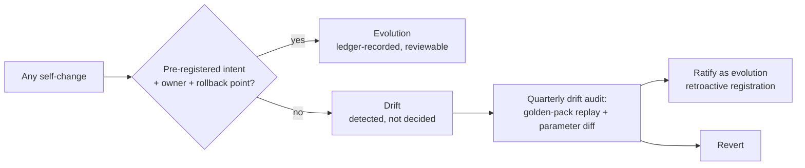

# Evolution & Self-Change Governance

Purpose: how the ecosystem changes *itself* — deliberately, with evidence, and distinguishably from drift. [brain.experiments.md](brain.experiments.md) defines how changes are tested; this document defines which changes may be pursued, who may pursue them, and the discipline that separates **evolution** (intentional, pre-registered, reversible-by-design) from **drift** (accumulated unreviewed change nobody decided). The governing rule: *the Brain may improve anything about itself except the things that make improvement safe.*

> **Related documents:** [brain.experiments.md](brain.experiments.md) — E1/E2 classes are evolution's test bench · [brain.learning.md](brain.learning.md) §6 — guardrails and the frozen floor · [ADR-0005](adr/ADR-0005-colony-roster-extension.md) — the roster-extension precedent · [brain.agents.md](brain.agents.md) — roster canon · [brain.semantic.md](brain.semantic.md) §4 — the model-upgrade pattern generalized here · [MANIFESTO.md](MANIFESTO.md) — the unamendable-by-agents layer.

---

## 1. The change hierarchy — what may evolve, and how hard it is

| Layer | Examples | Change path |
|---|---|---|
| **Frozen floor** | MANIFESTO principles, ethics gate existence, ledger-before-* invariants, hard-invariant metrics (`0, always`), learning guardrails themselves | Human-only, ADR + Executive Sponsor; agents may *propose* via recommendation, never execute |
| **Structural** | Roster changes, new document types, schema MAJOR versions, classification levels, edge types | ADR + owning human approver (ADR-0005 is the template: charter + matrix row, no architecture change) |
| **Parametric** | Trust-step caps, confidence factors, gate thresholds, retention windows, PR budgets | E2 experiment → Governance review → registered change with rollback point |
| **Operational** | Search weights, templates, queue tuning, index configs | E1 experiment or Loop C; Evolution Agent + peer review |

Descending the table, change gets cheaper and faster — by design. Ossification at the operational layer is as much a failure as recklessness at the frozen floor.

## 2. Evolution vs. drift

Drift detection is mechanical, not moral:
- **Golden-pack replay** ([brain.learning.md](brain.learning.md) §6): the same reference packs must produce the same confidences within tolerance; deviation without a registered change is drift.
- **Parameter diff:** every tunable's current value is compared quarterly against its last registered change; unexplained deltas are incidents (`learning.parameter_rollbacks` counts the late catches).
- Detected drift is either *ratified* (it was an improvement — register it retroactively with honest paperwork) or *reverted*. Silent persistence is the one forbidden outcome.

## 3. Colony roster evolution

ADR-0005 set the precedent; this generalizes it:
- **Add an agent** when an ownership-matrix row or recurring duty has no rightful owner and assigning it would violate an existing agent's separation of concerns. Cost: charter + matrix row + README tree annotation — never architecture change. New agents start at trust 0.50 like everyone did.
- **Retire an agent** when its duties dissolve or merge; its owned documents transfer *before* retirement (no orphaned canon), its lessons and ledger history are never-forget.
- **Split an agent** when trust-score volatility or KPI breadth shows one identity doing two jobs badly (the co-ownership notes in charters — e.g., Reasoning's semantic duties — are the watch list).
- Roster changes are structural-layer: ADR + Chief AI Engineer, with the Governance Agent checking that review-graph properties survive (no new self-merge or two-cycles — `colony.review_loop_size2_count = 0`).

## 4. Model & parameter upgrade governance

The embedding-model pattern ([brain.semantic.md](brain.semantic.md) §4) is the general template for any learned or versioned component (embedding models, reasoning prompts/templates, gate rubrics, future model families):

1. **Versioned artifact** — pinned, registered, never a mutable setting.
2. **Evaluation gate** — must beat or match the incumbent on the relevant golden suite *before* adoption; the suite itself is version-controlled and only grows.
3. **Atomic cutover with rollback point** — old version retained through one full review cadence; no blended serving.
4. **Incommensurability rule** — scores/outputs across versions are not compared as if continuous; recalibration is part of the upgrade cost, budgeted up front.
5. **Family change = ADR** — swapping within a family is parametric; changing families is structural.

## 5. Capability roadmapping

The Evolution Agent maintains the capability roadmap as *knowledge, not planning theater*: each candidate capability is a node carrying the problem evidence that motivates it (unserved queries from [brain.search.md](brain.search.md), chronic gate findings, expired-recommendation patterns from [brain.analytics.md](brain.analytics.md) trend products), its layer in §1, and its measure-before-feature metric ([brain.metrics.md](brain.metrics.md) §1 applies to the Brain's own features first). Prioritization defers to [brain.future.md](brain.future.md) for horizon strategy; this document owns the *mechanics* — a roadmap entry without problem evidence is deleted at quarterly review, the same no-vanity rule as metrics.

## 6. Worked example — the gate-rubric upgrade that wasn't drift

Q4: the Dopamine Agent's rejection reasoning quality varies; the Evolution Agent proposes a structured rubric template (parametric layer).

1. **Pre-registration:** E2 experiment — new rubric on 50% of gate reviews for one quarter; success metric `governance.why_block_comprehension` on rejection records; guard: `workflows.gate_rejection_rate` must not shift > 20% (a rubric that changes *decisions* rather than *explanations* exceeded its mandate).
2. **Result:** comprehension 3.8 → 4.4; rejection rate stable. Registered change, old rubric retained one quarter as rollback.
3. **The counterfactual that justifies this document:** without pre-registration, the same improvement adopted informally would have shown up in the next golden-pack replay as unexplained gate-behavior deviation — indistinguishable from manipulation (threat T9, [brain.security.md](brain.security.md)). Evolution and drift can have identical diffs; the ledger entry is the entire difference.

## 7. Health metrics

Registered in [brain.metrics.md](brain.metrics.md): `learning.parameter_rollbacks = 0` (drift caught late) · `colony.review_loop_size2_count = 0` (roster changes preserve review integrity) · `resilience.repeat_incident_rate declining` (the ecosystem-level proof self-change works). Also registered (§4.9): `evolution.unregistered_change_findings` (0 per drift audit — the evolution/drift boundary held) and `evolution.rollback_points_verified` (100% — a rollback point that was never tested is a hope, not a control).

---

## Change Log

| Version | Date | Author | Change |
|---|---|---|---|
| 1.0.0 | 2026-08-01 | Brain Document Generator (prompt 03, AI) | Initial governance: four-layer change hierarchy, evolution/drift boundary with mechanical detection, roster add/retire/split rules generalizing ADR-0005, versioned-artifact upgrade template, evidence-based roadmapping, gate-rubric worked example |

## Open Questions

| Question | Owner → Approver |
|---|---|
| ~~Register `evolution.unregistered_change_findings` and `evolution.rollback_points_verified` in brain.metrics.md §4.9 (pending batch now 10 IDs — registration pass due)~~ Registered in [brain.metrics.md](brain.metrics.md) §4.9 (1.3.0) | Evolution Agent → Chief AI Engineer |
| Retroactive ratification of beneficial drift (§2) — does it need a stricter bar (e.g., mandatory incident even when ratified) to avoid normalizing unregistered change? | Governance Agent → Executive Sponsor |
| Agent *split* procedure has no precedent ADR yet — write the template now or wait for the first real split? | Evolution Agent → Chief AI Engineer |
