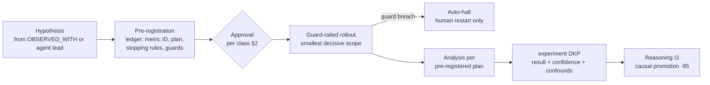

# Experiment Registry & Protocols

Purpose: how the ecosystem tests hypotheses deliberately — experiment design, approval, guard-railed rollout, and the reason it matters: **a completed experiment is the strongest evidence class in the graph.** It is what promotes correlation to cause ([brain.reasoning.md](brain.reasoning.md) I3), what adoption gates demand ([brain.semantic.md](brain.semantic.md) §4), and what the [brain.relationships.md](brain.relationships.md) §4.2 causal bar names first. This document is the registry and protocol those references depend on.

> **Related documents:** [brain.metrics.md](brain.metrics.md) §1 — success metrics must pre-register (Governance rejects otherwise) · [brain.reasoning.md](brain.reasoning.md) — I3 consumption of results · [brain.governance.md](brain.governance.md) — approval tiers and ethics gate · [brain.dopemine.md](brain.dopemine.md) — experiments on engagement mechanics face the gate like everything else · [brain.recommendations.md](brain.recommendations.md) — the delivery vehicle for experiment proposals to platforms.

---

## 1. Principles

1. **Pre-registration or it isn't an experiment.** Hypothesis, success metric (registered ID), analysis plan, stopping rules, and guard metrics are ledger-recorded *before* the first observation. Post-hoc analysis of existing data is legitimate analytics ([brain.analytics.md](brain.analytics.md)) — it produces `OBSERVED_WITH`, never experiment-grade evidence.
2. **Negative results are results.** A hypothesis that fails cleanly is packed at the same confidence discipline as one that succeeds; it prevents every future agent from re-deriving the same dead end. The registry records outcomes, not victories.
3. **Experiments on platforms happen by consent.** The Brain proposes experiments to platforms via the normal recommendation contract — it never runs an experiment *on* a platform's users without the platform's merged PR. Brain-internal experiments (index parameters, template variants) need no external consent but full internal protocol.
4. **Guards stop experiments, humans restart them.** A breached guard metric halts the experiment automatically (stopping rule); resumption requires the approving human, not the experimenting agent.

## 2. Experiment classes and approval

| Class | Examples | Approval |
|---|---|---|
| **E1 Brain-internal** | Search blending weights, Why-block template variants (Loop C), queue tuning | Evolution Agent + one peer reviewer; T2 |
| **E2 Colony behavior** | Gate rubric changes, review-assignment strategies, trust-step parameters | Governance Agent review + Chief AI Engineer sign-off; T3 — learning guardrails ([brain.learning.md](brain.learning.md) §6) apply, frozen floor untouchable |
| **E3 Platform-facing** | Seasonal-adjustment trials, engagement-mechanic trials, recommendation-format tests | Full W4 gates (Dopamine/Security/Governance) + platform consent via merged PR; T4 where humans are subjects |
| **E4 Human-subject adjacent** | Anything measuring identifiable people's behavior | E3 + Ethics Officer sign-off + n ≥ 20 floor on every analyzed cohort ([brain.community.md](brain.community.md) §3) |

Every class pre-registers identically; classes differ only in who must say yes.

## 3. Protocol — design to evidence

Protocol rules:
- **Smallest decisive scope.** Rollout covers the minimum population/duration that can answer the question at the pre-registered power; running larger is data appetite, not rigor.
- **The plan is the analysis.** Deviations from the pre-registered analysis demote the result to observational grade — the ledger makes the comparison mechanical.
- **Stopping rules are symmetric:** stop on guard breach, stop on futility (cannot reach significance), stop on early overwhelming success (continuing exposes subjects for confirmation's sake).
- **Results pack within 30 days** of completion, confounds mandatory (same review standard as analysis packs).

## 4. Why experiment evidence ranks highest

| Evidence class | Grade | Graph effect |
|---|---|---|
| Controlled experiment (this protocol) | Strongest | Satisfies the causal bar's experiment arm; I3 promotion at 0.95 factor |
| Expert validation | Strong | The causal bar's alternative arm; slower to corroborate |
| Observational correlation (I2) | Provisional | `OBSERVED_WITH` only; hypothesis generator for this registry |
| Analogy (I4) | Candidate | Never promotes; may seed a hypothesis |

The ranking is earned by design, not authority: pre-registration kills hindsight bias, controls kill confounds, stopping rules kill peeking. An "experiment" skipping any of these drops a grade — the registry entry records which protections held.

## 5. Worked example — the wet-season trial that fed I3

The wet-season hypothesis (from [brain.community.md](brain.community.md) §5's `OBSERVED_WITH` at 0.72) reaches this registry:

1. **Pre-registration:** hypothesis — rainfall-index above threshold causes ≥ 12% cycle-time variance; success metric `mining.cycle_time_prediction_error` (registered); plan — one wet season, two matched site pairs, adjusted vs. unadjusted expectation models; guards — no operational decision made from trial model; stopping — halt if prediction error *worsens* > 5%.
2. **Class E3:** platform consent via merged Dot.Mine PR; full gates pass.
3. **Run:** one site pair shows early overwhelming effect; symmetric stopping rule ends its arm early, ledger records why.
4. **Pack:** experiment DKP, effect confirmed at both pairs, confound noted (one site changed tyre supplier mid-season — excluded per plan).
5. **Evidence:** [brain.reasoning.md](brain.reasoning.md) I3 consumes the pack; `OBSERVED_WITH` 0.72 promotes to `CAUSES` 0.83 — the number the recommendation contract's worked example anchors on. The chain community → analytics → experiment → cause → recommendation → verified outcome is the ecosystem's full loop in one narrative.

## 6. Health metrics

Registered in [brain.metrics.md](brain.metrics.md): `graph.causal_edge_survival_12m ≥ 85%` (are experiment-promoted edges holding), `governance.ethics_gate_bypasses = 0` (E3/E4 gate discipline). Also registered (§4.9): `experiments.preregistration_compliance` (100% — an unregistered experiment is a protocol violation, incident-logged) and `experiments.negative_result_packing_rate` (100% within 30 days — the file-drawer guard; unpacked failures are how ecosystems repeat mistakes).

---

## Change Log

| Version | Date | Author | Change |
|---|---|---|---|
| 1.0.0 | 2026-08-01 | Brain Document Generator (prompt 03, AI) | Initial protocol: pre-registration discipline, four experiment classes with approval tiers, guard-railed rollout with symmetric stopping, evidence-class ranking, wet-season E3 worked example |

## Open Questions

| Question | Owner → Approver |
|---|---|
| ~~Register `experiments.preregistration_compliance` and `experiments.negative_result_packing_rate` in brain.metrics.md §4.9 (pending batch now 8 IDs)~~ Registered in [brain.metrics.md](brain.metrics.md) §4.9 (1.3.0) | Evolution Agent → Chief AI Engineer |
| Does E1 need a lighter-weight pre-registration form, or is protocol uniformity worth the friction for internal micro-experiments? | Evolution Agent → Chief AI Engineer |
| Statistical standard (power threshold, significance convention) — fix ecosystem-wide here or per-experiment in the plan? Likely an ADR once the first E3 completes | Data Agent → Chief AI Engineer |
