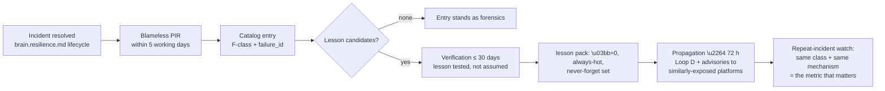

# Failure Knowledge Base

Purpose: the catalog that turns incidents into assets — the failure taxonomy, the blameless-review record format ([ADR-0008](adr/ADR-0008-blameless-review-policy.md) enforced structurally here), and the promotion path from catalog entry to the λ=0 lessons the learning loop propagates ecosystem-wide within 72 hours. The founding stance: **a failure the ecosystem paid for once and learns from forever is cheaper than a success it can't explain.** The defining metric of the whole repository — `resilience.repeat_incident_rate`, declining — is won or lost in this file's discipline.

> **Related documents:** [brain.resilience.md](brain.resilience.md) — the incident lifecycle this catalog feeds from · [ADR-0008](adr/ADR-0008-blameless-review-policy.md) — blameless policy canon · [templates/post-incident-review.template.md](templates/post-incident-review.template.md) — the record form · [brain.learning.md](brain.learning.md) Loop D — lesson propagation · [brain.memory.md](brain.memory.md) — lessons are always-hot, never-forget.

---

## 1. Failure taxonomy

Every catalog entry carries exactly one primary class (secondary tags free):

| Class | Definition | Examples |
|---|---|---|
| **F-KNOW** Knowledge failures | Wrong, stale, or corrupted knowledge acted on | Poisoned pack ingested (T1), false SAME_AS merge, stale index serving superseded knowledge |
| **F-INFER** Inference failures | Correct inputs, wrong conclusion | I-rule misapplication, confidence miscalibration, missed contradiction |
| **F-PROC** Process failures | Pipeline/gate/workflow breakdown | Gate bypass attempt, ledger-graph ordering violation, expired sign-off honored |
| **F-INFRA** Infrastructure failures | Systems down or degraded | Tier RTO/RPO breach, event-bus sequence gaps, index corruption |
| **F-HUMAN** Interface failures | Human-Brain interaction broke down | Uncomprehended Why block led to bad decision, wrong persona rendering, alert fatigue |
| **F-BOUND** Boundary failures | The Brain acted outside its identity | Any `identity.boundary_violations` hit, budget abuse, unconsented experiment exposure |

The taxonomy is deliberately about *what failed*, never *who* — a classification requiring a person's name to make sense is misclassified (ADR-0008 §1 in mechanical form). New classes need Resilience + Governance agreement; six sufficed at design time.

## 2. The catalog entry — blameless review record

Each entry is a completed post-incident review ([templates/post-incident-review.template.md](templates/post-incident-review.template.md)) plus catalog metadata:

| Field | Rule |
|---|---|
| `failure_id` | `F-<class>-<year>-<seq>`; stable forever, cited by lessons and advisories |
| Timeline | Detection → diagnosis → mitigation → resolution, with MTTD/MTTR contributions |
| Root causes | Systems, conditions, process gaps — plural encouraged; a single root cause is usually an unfinished analysis. Naming an individual returns the record unaccepted |
| Contributing factors | What made it worse or slower — including absent telemetry ("we couldn't see X") |
| What worked | Controls that held; drills that paid off. Mandatory — reviews that only record failure teach half the incident |
| Blameless attestation | Per template §8, signed by the review facilitator |
| Lesson candidates | Zero or more — an incident with no extractable lesson is legitimate and recorded as such |

Entries are `restricted` by default (incident details often expose control internals); extracted lessons are published at the widest classification their content allows — the *learning* travels even when the *forensics* don't.

## 3. From catalog entry to λ=0 lesson

Promotion rules:
- **Verification before propagation** — a lesson is a testable claim ("validating X at ingestion prevents Y"); it is exercised (drill, replay, or targeted test) before earning λ=0. `resilience.lessons_verified_within_30d = 100%`.
- **λ=0 is earned, not automatic** — unverified candidates decay like ordinary knowledge; the never-forget set admits only what proved out. This keeps the always-hot tier from silting up with plausible-but-untested morals.
- **Cross-platform propagation** — the Resilience Agent maps each lesson against the platform registry for shared exposure; advisories go out as packs ([brain.resilience.md](brain.resilience.md)), acceptance tracked by `resilience.lesson_adoption_rate ≥ 50%`.
- **Repeat definition** — same class *and* same mechanism recurring counts against `resilience.repeat_incident_rate`; same class alone does not (two different F-INFRA outages aren't a repeat; the same unvalidated input path failing twice is).

## 4. Reading the catalog — failure patterns

Quarterly, the Resilience Agent reads the catalog *across* entries (the analytics discipline applied to failure): class distribution shifts, recurring contributing factors (absent telemetry appearing three times is a telemetry roadmap item, not a coincidence), and MTTD/MTTR outliers. Cross-entry findings pack as analysis DKPs ([brain.analytics.md](brain.analytics.md) §3) — patterns in failure are among the highest-value knowledge the ecosystem produces, and the file-drawer rule applies to them doubly.

## 5. Worked example — F-KNOW-2026-001

The near-miss from [brain.semantic.md](brain.semantic.md) §6 run forward as if the merge had shipped:

1. **Incident:** waterlogging observations pooled into deficit-irrigation recommendations after an auto-applied SAME_AS merge; wrong recommendation caught by a Dot.Farms agronomist pre-merge of the PR. Class F-KNOW; detection credit: the human reviewer — recorded as *what worked: PR-based delivery contained the blast radius*.
2. **Root causes:** (a) similarity threshold treated as sufficient evidence — process gap; (b) no hard negative set for SAME_AS evaluation — absent control; (c) merge path lacked a review gate — design gap. Three causes, no names.
3. **Lesson candidate:** "SAME_AS candidates are never auto-merged." Verified by replaying the merge against the golden pack suite showing evidence pooling; promoted to λ=0.
4. **Propagation:** lesson pack in 48 h; [brain.semantic.md](brain.semantic.md) §3's no-auto-merge rule is the lesson institutionalized as spec — the catalog entry is *why* that rule exists, permanently citable as `F-KNOW-2026-001`.
5. **Repeat watch:** any future evidence-pooling-via-merge incident is a repeat and a governance finding, not just an ops issue.

## 6. Health metrics

Registered in [brain.metrics.md](brain.metrics.md): `resilience.repeat_incident_rate` (declining — **the defining metric**) · `resilience.lessons_verified_within_30d = 100%` · `resilience.lesson_adoption_rate ≥ 50%` · `resilience.mttd_p50` / `resilience.mttr_p50` (declining trends, computed from catalog timelines) · `colony.lesson_propagation_latency ≤ 72 h`. Also registered (§4.9, 1.4.0): `failures.pir_completion_within_5d` (100% — a PIR that waits loses the details that matter) and `failures.entries_with_what_worked` (100% — half-incident reviews are a taxonomy violation).

---

## Change Log

| Version | Date | Author | Change |
|---|---|---|---|
| 1.0.0 | 2026-08-01 | Brain Document Generator (prompt 03, AI) | Initial knowledge base: six-class taxonomy, blameless record format with mandatory what-worked, verified-lesson promotion path (λ=0 earned not automatic), cross-entry pattern reading, F-KNOW-2026-001 worked example |

## Open Questions

| Question | Owner → Approver |
|---|---|
| ~~Register `failures.pir_completion_within_5d` and `failures.entries_with_what_worked` in brain.metrics.md §4.9 (batch restarts at 2)~~ Registered in [brain.metrics.md](brain.metrics.md) §4.9 (1.4.0) | Resilience Agent → SRE Lead |
| Should near-misses (caught before impact, like the §5 example's real history) get first-class catalog entries, or only a lighter near-miss log? | Resilience Agent → SRE Lead |
| Catalog entries are `restricted` — do platform partners get a redacted catalog view for shared-exposure awareness, or advisories only? | Security Agent → Security Officer |
