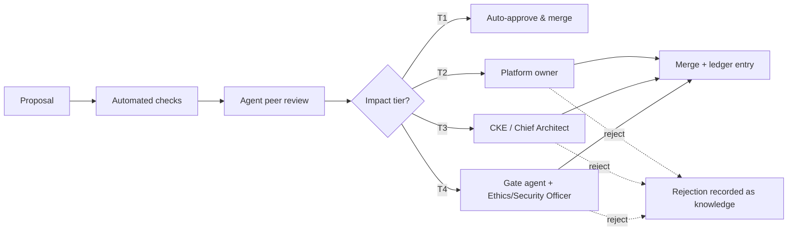

# brain.governance — Governance Framework

Purpose: the framework that makes everything auditable, versioned, explainable, traceable, and reviewable — the human authority structure above the Agent Colony and the rules by which any AI decision can be reconstructed end-to-end. Read by human approvers, the Governance Agent (enforcer), auditors, and every agent whose authority it bounds.

> **Related documents:**
> - [MANIFESTO.md](MANIFESTO.md) — principles 2 (explainable) and 4 (autonomous platforms) that this framework enforces.
> - [brain.agents.md](brain.agents.md) — the colony this governance sits above; topology and override mechanics.
> - [brain.dkp.md](brain.dkp.md) — review tiers (§6), immutable change logs (§6.3), and trust scores (§3.2) referenced throughout.
> - [brain.resilience.md](brain.resilience.md) — the sibling framework; governance audits resilience drills.
> - [brain.security.md](brain.security.md) — classification and compliance controls governance verifies.

---

## 1. Decision Rights Matrix

Impact tiers refine DKP §6.1 into governance language:

| Tier | Scope | Propose | Review | Approve | Veto |
|---|---|---|---|---|---|
| **Informational** (T1) | Knowledge with no recommendation | Any agent/human | Domain-owning agent | Auto after agent review | Governance Agent (flag) |
| **Operational** (T2) | Single-platform recommendation | Any agent/human | Peer agent per topology | Platform owner | Platform owner, Security Agent |
| **Architectural** (T3) | Cross-platform, structural, canonical-metric, onboarding | Domain/Architecture agents | Peer + gate agents | Chief Knowledge Engineer / Chief Architect | Chief Intelligence Architect |
| **Ethical** (T4) | Engagement, security, financial, safety, PII | Any (auto-escalated) | Dopamine/Security/Resilience gates | Ethics Officer / Security Officer + CKE | Ethics Officer (absolute on engagement) |

Universal rules: no actor approves their own proposal; no agent merges its own PR; veto reasons are recorded as knowledge; escalation always available upward, never downward.

*Every path — approval or rejection — terminates in the immutable ledger; nothing is decided off the record.*

## 2. Immutable Audit Trail

- **Ledger:** append-only, hash-chained (each entry references the previous entry's hash — design in [ADR-0006](adr/ADR-0006-audit-ledger-design.md)). Entries: every pack state transition, PR open/decide/expire, review verdict, override, merge, conflict resolution, drill result.
- **Retention: forever.** Supersession, never deletion — a superseded entry remains verifiable with its full chain.
- **Queryable:** via the audit API ([brain.api.md](brain.api.md)); every entry carries actor (human or AI, permanently flagged), timestamp, evidence links, and the confidence at decision time.
- **Verification:** quarterly chain-integrity check by the Governance Agent; any hash break is itself a sev2 incident.

## 3. Explainability Standard — the "Why" Block

Mandatory on every recommendation, in this exact structure (machine-parseable, human-readable):

| Field | Content |
|---|---|
| `evidence_chain` | Ordered links: raw source → packs → graph nodes → this conclusion |
| `reasoning_steps` | Numbered inference steps a domain expert can follow |
| `confidence` | Value + formula inputs (source_trust × validation × corroboration × age_decay) |
| `assumptions` | Explicit, each marked verified/unverified |
| `alternatives_rejected` | ≥ 1 alternative considered, with why it lost |

**If a human cannot understand why, it does not ship.** The UX Agent samples Why blocks for comprehension (target ≥ 4/5); failures return the recommendation to draft.

## 4. AI Accountability

- AI contributions permanently flagged (`kind: "ai"`, immutable — DKP §5.3).
- Per-agent trust scores public within the ecosystem (`colony/trust`), explainable, recomputed on every outcome.
- Human override always available: pause, revert, adjust authority, force probation ([brain.agents.md](brain.agents.md) §7) — every override logged and fed back as a learning event.
- An AI decision trail must answer, end-to-end: *who proposed, on what evidence, who reviewed, who approved, what happened next.* Missing any link = audit finding.

## 5. Ethics Gate (Dot.Dopemine review)

Every engagement-related recommendation passes this checklist before T4 approval:

1. Target metric is a **human-outcome metric** (learning, achievement, mastery, productivity, community, purpose, confidence, momentum, habit formation, progress)?
2. Target metric is **not** on the prohibited list (raw session time, open counts, scroll depth, notification CTR as terminal goals)?
3. Paired **guard metric** declared (what harm would show up where)?
4. Benefit accrues to the **user's stated goals**, not only platform revenue?
5. User can **see and opt out** of the engagement mechanic?

Any "no" ⇒ rejection with recorded reasoning; the rejection is knowledge ([brain.agents.md](brain.agents.md) §8c shows the worked path). Appeals go to the Ethics Officer; overturn rates feed the Dopamine Agent's KPIs.

## 6. Compliance Posture

| Control | Implementation |
|---|---|
| Data classification | Four levels (`public` / `ecosystem` / `restricted` / `sensitive`) per [brain.security.md](brain.security.md) §2; classification labels travel with knowledge |
| POPIA / GDPR | Lawful-basis recorded per personal-data class; aggregation floors (n ≥ 20; stricter for HR under review); right-to-explanation served by the Why block; data-subject requests honored via supersession + access logs |
| Multi-tenant confidentiality | Tenant-scoped topics, keys, storage partitions (DKP §8); cross-tenant inference prohibited except explicit sharing policies |
| Right to explanation | Any affected party may request the Why block and full decision trail for any decision touching them |

## 7. Cadences

| Cadence | Body | Agenda template |
|---|---|---|
| **Weekly review board** | Platform owners + CKE + Governance Agent report | Open T3/T4 items · PR decision backlog · conflict cases awaiting arbiters · trust-score movements |
| **Monthly evolution report** | Evolution Agent → executives | Patterns detected · adoption & ROI of accepted recommendations · duplicate-effort savings · experiment results |
| **Quarterly governance audit** | Governance Agent + human sample review | Ledger chain integrity · decision-trail completeness sample (n ≥ 30) · override pattern analysis · rubber-stamp detection results · compliance spot checks |

## 8. Worked Example: Auditing an AI Decision

An auditor asks: *"Why did Dot.Central adopt dispatch warm-handover?"* Reconstruction from the ledger alone:

1. Ledger entry: pack `dkp:dot-mines:7f3e2a10…` ingested 2026-07-28, confidence recomputed 0.83 (inputs shown).
2. Entries: Knowledge Agent relation review (pass), Reasoning Agent evidence review (pass, rubric 5/4/5/5/4).
3. Entry: T3 approval by Chief Knowledge Engineer, 2026-07-30, with Why block (evidence chain to Kolomela telemetry; alternative "staggered shift starts" rejected — higher labor cost, weaker effect).
4. Entry: PR opened on dot-central; entry: accepted 2026-08-14 by platform owner.
5. Entries: 60-day outcome measurements against declared impact targets; trust-score updates to Dot.Mines and the Mining Agent.

Every step has an actor, timestamp, evidence, and confidence — the exit criterion of this framework, demonstrated.

## 9. Metrics of Success

| Metric | Target |
|---|---|
| `governance.decision_trails_complete` (audit sample) | 100% |
| `governance.ledger_integrity_checks_passed` | 4/4 per year |
| `governance.unexplained_recommendations_shipped` | 0 |
| `governance.ethics_gate_bypasses` | 0 |
| `governance.audit_findings_closed_within_quarter` | ≥ 90% |
| `governance.why_block_comprehension` (sampled) | ≥ 4/5 |

## 10. Open Questions

| Question | Owner |
|---|---|
| External auditor read access to the ledger: scope and redaction rules | Security Agent → Security Officer |
| Should T2 platform-owner approvals require a second reviewer above a PR-size threshold? | Governance Agent → CKE |
| ~~Data-subject erasure requests vs never-delete ledger~~ Resolved 2026-08-01 by [adr/ADR-0009-crypto-shredding-legal-erasure.md](adr/ADR-0009-crypto-shredding-legal-erasure.md) | Security Agent → Security Officer |

## Change Log

| Version | Date | Author | Change |
|---|---|---|---|
| 1.0.0 | 2026-08-01 | Governance & Resilience Architect (prompt 06, AI) | Initial governance framework |
| 1.0.1 | 2026-08-01 | Brain Document Generator (prompt 03, AI) | §6: aligned classification level names to the canonical set in brain.security.md §2 |
