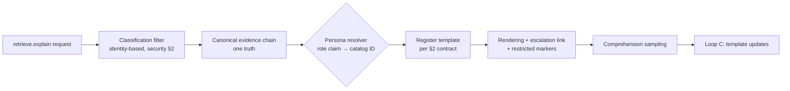

# Reader Personas

Purpose: the canonical catalog of who the Brain speaks to, and the rendering contract each persona is owed. This document is referenced by [brain.api.md](brain.api.md) §5 (persona-scoped `retrieve.explain` renderings) and by [brain.community.md](brain.community.md)'s diversity rule (≥ 2 personas as a claim-diversity dimension). Its governing invariant, restated from the API surface: **personas change presentation depth, never content truth.**

> **Related documents:** [brain.api.md](brain.api.md) §5 — where renderings are served · [brain.learning.md](brain.learning.md) Loop C — how renderings improve · [brain.security.md](brain.security.md) §2 — classification filters compose with (and precede) persona rendering · [brain.design.md](brain.design.md) — visual/interaction expression of these registers.

---

## 1. Principles

1. **Depth, not truth.** Every persona rendering is a projection of the *same* canonical evidence chain. No persona sees a claim another persona would see contradicted; abbreviation may hide steps, never conclusions or their uncertainty.
2. **Escalation is a right.** Every rendering carries a path to the full chain. A persona is a default register, not a ceiling — the operator who wants the confidence math gets it.
3. **Persona ≠ permission.** Classification filtering ([brain.security.md](brain.security.md) §2) runs *before* persona rendering and is identity-based; persona is a role claim that shapes prose after access is decided. An executive without `restricted` access sees `[restricted: n items]` markers like anyone else.
4. **Uncertainty survives compression.** The shortest rendering (executive) still states the confidence band and the weakest link. Compressing away doubt is the one forbidden compression.

## 2. The persona catalog

Canonical roster — the four registers [brain.api.md](brain.api.md) §5 renders, plus their definition of done:

| ID | Persona | Wants to know | Rendering contract | Comprehension check (Loop C) |
|---|---|---|---|---|
| `engineer` | Platform engineer | *Exactly how* — chain mechanics, integration behavior | Full chain, inference rules named (I1–I7), confidence math shown, error codes and schema refs linked | Can reproduce the confidence figure from the shown inputs |
| `operator` | Domain operator (site manager, agronomist, trader) | *What to do and why it's safe* | Mechanism paragraph in domain vocabulary, plain-language uncertainty ("about 4 in 5 similar cases held up"), no formula internals; always a "show full chain" link | Can state the mechanism and the main caveat in own words |
| `executive` | Executive / sponsor | *What it's worth and what could go wrong* | Impact framing (metric, magnitude, horizon), confidence band, single weakest-link sentence | Can answer "why might this be wrong?" with the weakest link |
| `auditor` | Auditor / compliance officer | *That it happened as claimed* | Chain + ledger hashes + sign-off records + review timestamps; nothing summarized that can be cited | Can trace any statement to a ledger entry |

Persona resolution: the `role` claim in the caller's token maps to one catalog ID; unmapped or absent roles default to `operator` (the safest register — actionable, honest, escapable). Multi-role tokens render at the *deepest* claimed persona.

## 3. Extending the catalog

New personas are proposed by the UX Agent when comprehension sampling shows an audience that no existing register serves (e.g., a future `contributor` persona for community members reading feedback-loop closures per [brain.community.md](brain.community.md) §2). A new persona requires:

1. A distinct "wants to know" that no existing rendering contract satisfies — depth variants of existing personas are configuration, not new personas.
2. A rendering contract and a testable comprehension check.
3. UX Architect approval; the API §5 table and this catalog update in the same change.

The catalog is deliberately small: every persona multiplies Loop C sampling cost and template maintenance. Four registers served the ecosystem's whole audience at design time; the burden of proof is on the fifth.

## 4. Rendering pipeline

Templates are versioned artifacts owned by the UX Agent and improved only through Loop C ([brain.learning.md](brain.learning.md)) — a template change is a learning event with before/after comprehension scores, not an ad-hoc edit.

## 5. Worked example — one chain, four voices

The Kolomela wet-season cycle-time recalibration ([brain.community.md](brain.community.md) §5 outcome) explained per persona:

- **engineer:** "I2 correlation (0.80) between rainfall-index and cycle-time variance, promoted via I3 (experiment DKP `dkp:mining:2026-07-...`) to CAUSES at 0.83 = min(0.87, 0.91) × 0.95 × 1.10 corroboration. Seasonal factor applied in `impact.metrics[]` …"
- **operator:** "Wet-season road conditions genuinely slow cycles — the recommendation now expects that instead of flagging your fleet as underperforming. In about 4 of 5 comparable site-seasons this adjustment matched reality. Main caveat: only one full wet season of trial data so far. [Show full chain]"
- **executive:** "Removes ~R2.1m/yr of false underperformance findings across wet-season months; confidence 0.83 (recommendable). Weakest link: validated against a single wet season."
- **auditor:** Chain nodes with ledger hashes, the experiment pack signature, Mining Agent + Testing Agent review records, T3 human sign-off timestamp.

Same claim, same confidence, same caveat — four depths.

## 6. Health metrics

Registered in [brain.metrics.md](brain.metrics.md): `governance.why_block_comprehension ≥ 4/5`, sampled *per persona* — an aggregate pass hiding a failing persona is a Loop C finding. Also registered (§4.10): `personas.escalation_rate` (reviewed semi-annually — chronically high for one persona means its default register is too shallow; near-zero everywhere may mean the link is invisible) and `personas.default_fallback_rate` (reviewed — high unmapped-role traffic means the resolver's mapping table lags the ecosystem's actual audience).

---

## Change Log

| Version | Date | Author | Change |
|---|---|---|---|
| 1.0.0 | 2026-08-01 | Brain Document Generator (prompt 03, AI) | Initial catalog: four principles, four-persona roster with rendering contracts and comprehension checks, extension procedure, rendering pipeline, one-chain-four-voices worked example |

## Open Questions

| Question | Owner → Approver |
|---|---|
| ~~Register `personas.escalation_rate` and `personas.default_fallback_rate` in brain.metrics.md §4.9 (batch now 12 pending IDs)~~ Registered in [brain.metrics.md](brain.metrics.md) §4.10 (1.2.0) | UX Agent → UX Architect |
| Is `operator` the right default for unmapped roles, or should unmapped callers be asked to self-select once? | UX Agent → UX Architect |
| Does the auditor persona need a machine-readable export format (beyond rendered prose) for external audit tooling? | UX Agent → Security Officer |
