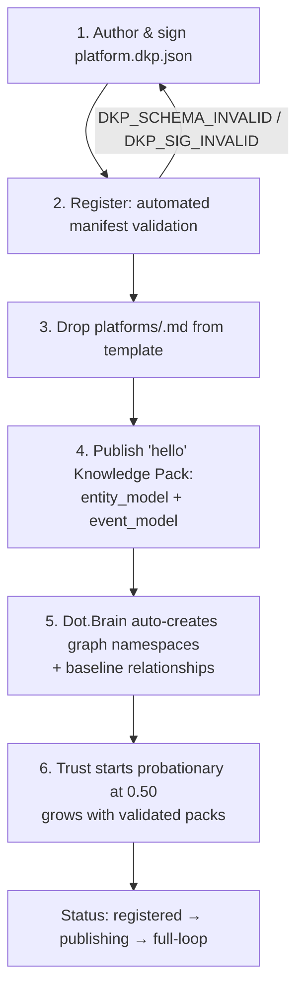

# brain.platforms — The Platform Registry

Purpose: the single registration point for every platform in the Dot Ecosystem and the definition of the invariant onboarding path any future platform follows. A platform exists to Dot.Brain if and only if it has a row here and a validated manifest. Read by the Registry Agent (owner), platform teams onboarding, and every agent resolving a `platform` claim.

> **Related documents:**
> - [brain.dkp.md](brain.dkp.md) — the protocol every registered platform speaks; transport & registry rules in §8.
> - [schemas/platform-manifest.schema.json](schemas/platform-manifest.schema.json) — validation contract for `platform.dkp.json`.
> - [templates/platform-knowledge.template.md](templates/platform-knowledge.template.md) — structure of each `platforms/<platform>.md`.
> - [brain.future.md](brain.future.md) — reserved namespaces and extension surface for platforms that don't exist yet.
> - [README.md](README.md) — the registration invariant this document enforces.

---

## 1. The Registration Invariant

> **A new platform joins by adding one manifest, one knowledge document, and one row in this registry. Nothing else in Dot.Brain changes.**
> If a platform cannot onboard this way, file an ADR — the architecture, not the platform, is at fault.

## 2. Platform Registry

Integration status: `registered` (manifest validated) → `publishing` (packs ingested) → `full-loop` (accepting/deciding PRs). Trust baselines start at 0.50 per DKP §3.2.

| Platform ID | Responsibility | Status | DKP | Trust | Domain Agent | Knowledge Doc | Open Gaps |
|---|---|---|---|---|---|---|---|
| dot-brain | Collective intelligence layer (this system) | full-loop | 1.0.0 | — | Colony | [doc](platforms/dot-brain.md) | — |
| infodot | Ecosystem hub — SSO identity provider + community/Q&A product | registered | 1.0.0 | 0.50 | Documentation* | [doc](platforms/dot-infodot.md) | Domain-agent home unresolved; see doc §Open Questions |
| dot-memory | Long-term semantic memory | publishing | 1.0.0 | 0.58 | Memory | [doc](platforms/dot-memory.md) | — |
| dot-analytics | Business intelligence & analytics | publishing | 1.0.0 | 0.58 | Data | [doc](platforms/dot-analytics.md) | — |
| dot-pulse | Social & community platform | publishing | 1.0.0 | 0.58 | Community | [doc](platforms/dot-pulse.md) | — |
| dot-plug | Developer marketplace & extensions | publishing | 1.0.0 | 0.58 | Extension | [doc](platforms/dot-plug.md) | — |
| dot-mines | Mining ERP | publishing | 1.0.0 | 0.62 | Mining | [doc](platforms/dot-mines.md) | — (integration package complete; worked pack is the canonical thread) |
| dot-notify | Universal notification platform | publishing | 1.0.0 | 0.58 | Documentation | [doc](platforms/dot-notify.md) | — |
| dot-billing | Payments & subscriptions | publishing | 1.0.0 | 0.58 | Finance | [doc](platforms/dot-billing.md) | — |
| dot-charts | AI-powered trading platform | publishing | 1.0.0 | 0.58 | Trading | [doc](platforms/dot-charts.md) | — |
| dot-farms | Agriculture ERP | publishing | 1.0.0 | 0.58 | Agriculture | [doc](platforms/dot-farms.md) | seasonal scope fields (tracked in doc OQ) |
| dot-hr | Human Resource platform | publishing | 1.0.0 | 0.58 | People | [doc](platforms/dot-hr.md) | — |
| dot-dopemine | Engagement intelligence engine | publishing | 1.0.0 | 0.58 | Dopamine | [doc](platforms/dot-dopemine.md) | — |
| dot-emall | Marketplace platform | publishing | 1.0.0 | 0.58 | Marketplace | [doc](platforms/dot-emall.md) | — |
| dot-ehail | E-hailing entrepreneurship platform | publishing | 1.0.0 | 0.58 | Logistics | [doc](platforms/dot-ehail.md) | — |
| dot-agents | AI agent orchestration platform | publishing | 1.0.0 | 0.58 | Colony | [doc](platforms/dot-agents.md) | — |
| dot-auction | Auction marketplace | publishing | 1.0.0 | 0.58 | Marketplace | [doc](platforms/dot-auction.md) | — |
| dot-central | Operational Intelligence Center | publishing | 1.0.0 | 0.58 | Mining | [doc](platforms/dot-central.md) | — (dispatch workflow node IDs defined in doc §2) |
| dot-projects | Project management | publishing | 1.0.0 | 0.58 | Delivery | [doc](platforms/dot-projects.md) | — |
| dot-tasks | Task management | publishing | 1.0.0 | 0.58 | Delivery | [doc](platforms/dot-tasks.md) | — |
| dot-design | Enterprise design system | publishing | 1.0.0 | 0.58 | UX | [doc](platforms/dot-design.md) | — |
| dot-finance | Financial platform | publishing | 1.0.0 | 0.58 | Finance | [doc](platforms/dot-finance.md) | — |
| dot-files | File & folder manager | registered | 1.0.0 | 0.50 | Documentation* | [doc](platforms/dot-files.md) | No versioning/sharing/S3 yet — see doc §1 |
| dot-docs | Real-time collaborative document/wiki | registered | 1.0.0 | 0.50 | Documentation* | [doc](platforms/dot-docs.md) | Public share-link auth not fully reviewed — see doc §10 OQ |
| dot-forms | Form builder & submission dispatch | registered | 1.0.0 | 0.50 | Extension* | [doc](platforms/dot-forms.md) | Custom-CSS theming sanitizer non-exhaustive — see doc §Open Questions (webhook SSRF hardening, listed here in error, was closed in the platform's own wiki v1.1.0/0.2.0 — corrected 2026-08-07) |
| dot-sheet | Spreadsheet platform | registered | 1.0.0 | 0.50 | Data* | [doc](platforms/dot-sheet.md) | Settings-mutation authorization subset still coarse — see doc §7 |
| dot-engage | Contract sharing, chat & video signing | registered | 1.0.0 | 0.50 | Community* | [doc](platforms/dot-engage.md) | Registry `campaign` icon mismatches real domain — see doc §1, §10 OQ |
| dot-press | Slide-deck design tool | registered | 1.0.0 | 0.50 | UX* | [doc](platforms/dot-press.md) | Registry `newspaper` icon mismatches real domain — see doc §1, §10 OQ |
| dot-tutor | Tutoring marketplace | registered | 1.0.0 | 0.50 | People* | [doc](platforms/dot-tutor.md) | Booking UI unbuilt — schema + dashboard only, see doc §1 |

\* interim assignment pending open question below. The 7 platforms added 2026-08-02 (dot-files through dot-tutor) inherit domain-agent assignments by closest-fit analogy (storage→Documentation, forms→Extension, spreadsheets→Data, contracts/chat→Community, design tool→UX, tutoring→People) — none formally ratified, same interim status as the platforms this note originally covered.

Per-platform `platforms/<platform>.md` documents are produced one per session by prompt 05 ("Using 05, integrate Dot.<Platform>").

## 3. Universal Onboarding Procedure (invariant)

*Six steps, never more, never fewer — identical for a mining ERP, a trading platform, or a domain that does not exist yet.*

| Step | Actor | Automated check | Failure handling |
|---|---|---|---|
| 1. Manifest | Platform team | Schema + signature round-trip test | Errors returned with hints |
| 2. Register | Registry Agent | Manifest validation, tenant topic provisioning, key registration | T3 human activation approval |
| 3. Knowledge doc | Platform team + domain agent | Template contract check (Documentation Agent) | PR review cycle |
| 4. Hello pack | Platform team | Full DKP validation pipeline (§3.1) | Validation report returned |
| 5. Namespaces | Dot.Brain (automatic) | Graph namespace + baseline `relates-to` edges created | Auto-retry; Registry Agent alerted |
| 6. Trust | Automatic | Starts 0.50; probationary rules per DKP §3.2 | — |

**Deactivation** is the reverse path, gated T4: knowledge-retention plan required; the platform's knowledge is never deleted — its nodes are marked deprecated with provenance and its tenant topics closed.

## 4. Worked Example: Onboarding a Platform That Doesn't Exist Yet

Suppose **Dot.Logistics** (fleet routing SaaS) launches in 2029:

1. Team authors `platform.dkp.json`: `platform: dot-logistics`, Ed25519 key, publishes `entity_model`, `event_model`, `metric`, `insight`; subscribes to `reliability` and `workflow` advisories.
2. Registry Agent validates; Chief Knowledge Engineer approves activation (T3); tenant topics `dkp/dot-logistics/{publish,response}` provisioned.
3. Team drops `platforms/dot-logistics.md` from the template; adds one row to §2 above.
4. Hello pack publishes entities (Vehicle, Route, Depot) and events (`route.completed`, `vehicle.delayed`).
5. Graph namespace `dot:node:logistics:*` auto-created; baseline edges inferred: `relates-to` Dot.Mines haulage and Dot.Farms harvest-logistics patterns (shared vehicle-routing ontology) — flagged at confidence 0.60 for Knowledge Agent review.
6. Trust 0.50, probationary. After ~20 validated packs and 2 accepted PRs, trust reaches 0.65; status `full-loop`. **Zero Dot.Brain files changed except `platforms/dot-logistics.md` and one registry row.**

## 5. Metrics of Success

| Metric | Target |
|---|---|
| `registry.onboarding_invariant_violations` | 0, always |
| `registry.median_onboarding_time` (manifest → first ingested pack) | ≤ 5 days |
| `registry.stale_entries` at monthly audit | 0 |
| `registry.platforms_at_full_loop` | 100% within 2 quarters of registration |
| `registry.manifest_validation_turnaround` | ≤ 24 h |

## 6. Open Questions

| Question | Owner |
|---|---|
| Domain-agent home for Dot.Notify (infrastructure platform, not commerce) — dedicated Platform-Infra agent or Architecture Agent? | Governance Agent → Chief AI Engineer |
| Dot.HR knowledge involves employee PII — does it need a stricter aggregation floor than Finance's n ≥ 20? | Security Agent → Security Officer |
| ~~Should `dot-brain` itself publish packs about its own operation (self-knowledge), and under which trust rules?~~ **Resolved 2026-08-01:** yes, under stricter-than-tenant rules — human verification only (no self-grading), unsuppressable drift channel; see platforms/dot-brain.md §4/§7 | Governance Agent → Chief Intelligence Architect |

## Change Log

| Version | Date | Author | Change |
|---|---|---|---|
| 1.0.0 | 2026-08-01 | Platform Integrator (prompt 05, AI) | Initial registry (21 platforms) + universal onboarding procedure |
| 1.0.1 | 2026-08-01 | Platform Integrator (prompt 05, AI) | dot-farms and dot-mines integration packages published: status → publishing, trust baselines advanced (0.58/0.62), open gaps updated |
| 1.0.2 | 2026-08-01 | Platform Integrator (prompt 05, AI) | dot-central integration package published: status → publishing (0.58); dispatch-workflow node ID gap closed |
| 1.0.3 | 2026-08-01 | Platform Integrator (prompt 05, AI) | dot-emall integration package published: status → publishing (0.58) |
| 1.0.4 | 2026-08-01 | Platform Integrator (prompt 05, AI) | dot-billing integration package published: status → publishing (0.58); aggregation-floor config gap closed |
| 1.0.5 | 2026-08-01 | Platform Integrator (prompt 05, AI) | dot-analytics integration package published: status → publishing (0.58); KPI-catalog sync gap closed |
| 1.0.6 | 2026-08-01 | Platform Integrator (prompt 05, AI) | dot-dopemine integration package published: status → publishing (0.58); prohibited-metric list gap closed |
| 1.0.7 | 2026-08-01 | Platform Integrator (prompt 05, AI) | dot-pulse integration package published: status → publishing (0.58); discussion-pack privacy review gap closed |
| 1.0.8 | 2026-08-01 | Platform Integrator (prompt 05, AI) | dot-notify integration package published: status → publishing (0.58); domain-agent assignment resolved (Marketplace* → Documentation) |
| 1.0.9 | 2026-08-01 | Platform Integrator (prompt 05, AI) | dot-hr integration package published: status → publishing (0.58); PII classification review gap closed; agent Business* → People |
| 1.0.10 | 2026-08-01 | Platform Integrator (prompt 05, AI) | dot-ehail integration package published: status → publishing (0.58); fleet entity model gap closed; agent Marketplace → Logistics |
| 1.0.11 | 2026-08-01 | Platform Integrator (prompt 05, AI) | dot-auction integration package published: status → publishing (0.58); auction-mechanism scoping gap closed |
| 1.0.12 | 2026-08-01 | Platform Integrator (prompt 05, AI) | dot-projects and dot-tasks integration packages published (paired session — shared boundary contract): status → publishing (0.58); agent Business → Delivery |
| 1.0.13 | 2026-08-01 | Platform Integrator (prompt 05, AI) | dot-charts integration package published: status → publishing (0.58); compliance gate wiring gap closed (bidirectional, MNPI screen) |
| 1.0.14 | 2026-08-01 | Platform Integrator (prompt 05, AI) | dot-finance integration package published: status → publishing (0.58); regulatory watch setup gap closed; three queued cross-platform questions answered |
| 1.0.15 | 2026-08-01 | Platform Integrator (prompt 05, AI) | dot-plug integration package published: status → publishing (0.58); extension entity model gap closed; agent Marketplace → Extension |
| 1.0.16 | 2026-08-01 | Platform Integrator (prompt 05, AI) | dot-memory integration package published: status → publishing (0.58); retrieval SLA contract gap closed; brain.memory.md straggler metrics homed |
| 1.0.17 | 2026-08-01 | Platform Integrator (prompt 05, AI) | dot-agents integration package published: status → publishing (0.58); colony runtime contract gap closed; five domain-agent assignments recorded pending brain.agents.md promotion |
| 1.0.18 | 2026-08-01 | Platform Integrator (prompt 05, AI) | dot-design integration package published: status → publishing (0.58); token-consumption contract gap closed; four inherited open questions settled |
| 1.0.19 | 2026-08-01 | Platform Integrator (prompt 05, AI) | dot-brain self-referential doc published: final gap closed, self-knowledge OQ resolved. F-06 complete — 21 of 21 platforms documented |
| 1.0.20 | 2026-08-02 | Repository Steward Agent | 7 platforms formally registered (dot-files, dot-docs, dot-forms, dot-sheet, dot-engage, dot-press, dot-tutor) — real, previously-untracked repos discovered via InfoDot's platform registry, audited and integrated same day. Ecosystem is now 28 of 28 platforms registered (21 original + 7 new), all `registered` status pending real DKP publishing. |
| 1.0.21 | 2026-08-07 | Dot.Brain truth-reconciliation pass | **Ecosystem-wide verified-infrastructure pass across all 26 real, buildable Dot Ecosystem platforms** (InfoDot + the 25 named dot-* rows in §2, excluding dot-mines and dot-charts which were not in scope of this pass and are not independently re-verified here). Three workstreams, each individually verified per-platform (tests green before/after, no regressions) and each recorded in the corresponding `platforms/<platform>.md` §"Verified Infrastructure State (2026-08-07)": (1) **Legal/branding/auth standardization** — every platform ships a branded transactional-email theme (hardcoded hex, real logo, matches each platform's own welcome-page palette), complete POPIA-aligned Privacy Policy + Terms & Conditions + Cookie Policy naming **BluePin Inc** as the responsible party, and all guest auth pages (login/register/forgot-reset-password/verify-email/etc.) restyled to match each platform's own welcome-hero background and token system — piloted on InfoDot, then propagated identically to all 25 siblings. (2) **Laravel Boost** (`laravel/boost` ^2.5) installed ecosystem-wide via `composer require --dev` + `php artisan boost:install --guidelines --mcp`; every platform now has `.mcp.json`, `boost.json`, and Boost's Laravel/PHP/PHPUnit/Pint guideline block in `CLAUDE.md` (or `AGENTS.md`/`.github/instructions/` where a non-Claude-Code agent — GitHub Copilot CLI on dot-agents, both agents on dot-pulse — was auto-detected). (3) **Code-quality & security pass** — Pint applied ecosystem-wide (2 platforms, infodot and dot-files, were missing the dependency entirely despite the freshly-installed `pint/core` guideline assuming its presence — installed and run); `composer audit` and `npm audit` run and fixed on every platform. Baseline `league/commonmark` DoS/link-filter advisories (6, sometimes bundled with more) patched everywhere. Elevated blast-radius platforms fully resolved: **dot-engage** (25 advisories/10 packages: laravel/framework signed-URL + CRLF injection, dompdf 3.1.6 SSRF/DoS chain, symfony/* transitive bumps, spatie/laravel-medialibrary file-upload-bypass + SSRF), **dot-forms & dot-sheet** (26/9 each: same laravel/framework + symfony set plus phpoffice/phpspreadsheet 1.30.6, closing a real SSRF/RCE-via-`IOFactory::load` + XSS + memory-exhaustion-DoS chain — required the same `--ignore-platform-req=php` workaround as their original Boost install, since phpoffice/phpspreadsheet still caps at php <8.5.0 even at its latest 1.30.x), **dot-press & dot-docs** (23/9 each: same set minus medialibrary), **dot-farms & dot-plug** (12/2 each: guzzlehttp/guzzle host/cookie/proxy-header advisories). npm-side: dot-forms and dot-docs had `axios` pinned to a bizarre `>=1.11.0 <=1.14.0` upper bound blocking 7 real advisories (prototype pollution, proxy-credential leak on redirect) from being patched — loosened to `^1.19.0` after confirming minimal usage (bootstrap.js default headers only) and a clean production build. One accepted residual, not force-fixed: dot-agents has a low-severity, Windows-only esbuild advisory (GHSA-g7r4-m6w7-qqqr) that needs a Vite 7→8 major-version bump — left as a documented follow-up rather than pushed through an unattended security pass. **Registry corrections made alongside this pass:** added the previously-unregistered `infodot` row (the ecosystem's own SSO hub had no platform document or registry entry at all — see [doc](platforms/dot-infodot.md)); corrected dot-forms' Open Gaps cell, which still claimed an open webhook-SSRF gap the platform's own wiki.md had already closed in v1.1.0/0.2.0. |
