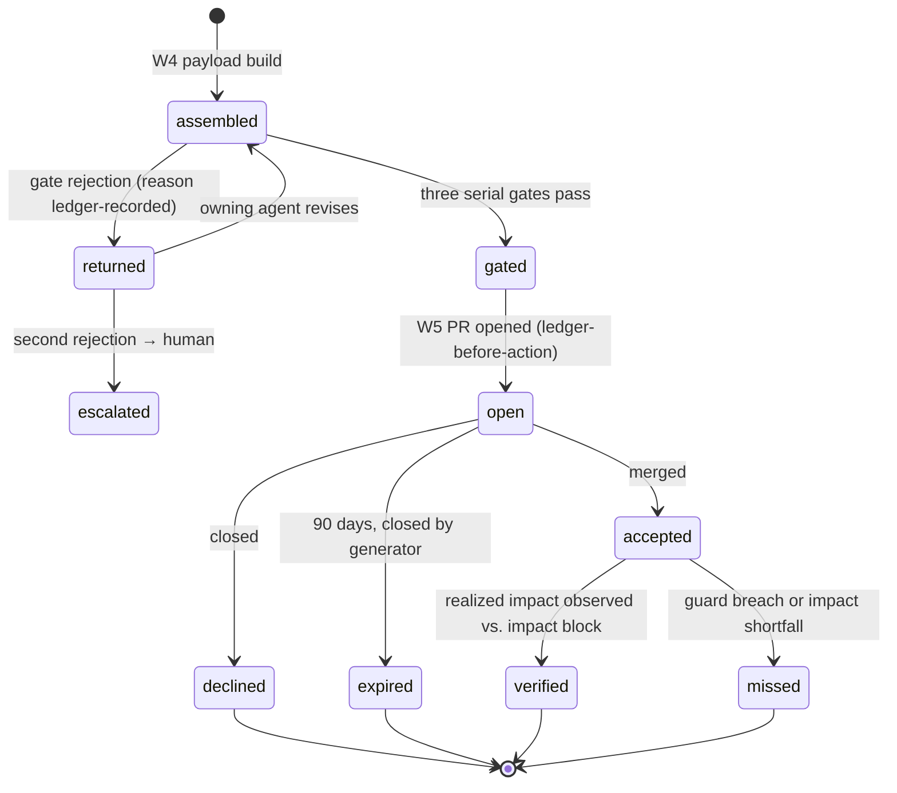

# Recommendation Contract

Purpose: the end-to-end definition of the recommendation object — the single artifact the Brain produces for the outside world. Six documents reference it piecemeal (workflows' gates and PR Generator, the api's evidence links, metrics' impact-block gate, dopemine's target/guard distinction, learning's outcome loop, reasoning's conclusions); this document is where the pieces are one thing. A recommendation is **a conclusion that asks for a decision**: it packages evidence a human can interrogate, commits to measurable impact, and accepts any answer — including silence — as knowledge.

> **Related documents:** [schemas/recommendation.schema.json](schemas/recommendation.schema.json) — the machine form · [brain.workflows.md](brain.workflows.md) §5–7 — gates, delivery, outcome return · [brain.reasoning.md](brain.reasoning.md) — the conclusions recommendations are built from · [brain.api.md](brain.api.md) §4 — capability-URL evidence links · [brain.metrics.md](brain.metrics.md) §1 — the impact-block registration gate · [brain.dopemine.md](brain.dopemine.md) — target/guard rules.

---

## 1. The object

| Field group | Contents | Canonical rules |
|---|---|---|
| **Identity** | `recommendation_id`, producing agent, target platform + repo, created/expires timestamps | Expiry 90 days default, manifest-overridable ([brain.workflows.md](brain.workflows.md) §6) |
| **Claim** | One-line proposal + the conclusion(s) it rests on, with their confidence | Only conclusions ≥ 0.80 (recommendable band) may anchor; provisional inputs may appear as context, never as the anchor |
| **Why block** | Human-readable reasoning: evidence chain summary, mechanism, uncertainty statement | Synthesized per [brain.reasoning.md](brain.reasoning.md); rendered per persona at read time ([brain.personas.md](brain.personas.md)) |
| **Evidence** | Capability URLs into the read-only Query API — frozen-at-open chain + current diff | [brain.api.md](brain.api.md) §4; raw internals never linked |
| **Impact block** | `impact.metrics[]`: target metrics (registered IDs, direction, magnitude, horizon) + declared guard metrics | Every ID resolves against [brain.metrics.md](brain.metrics.md) or the build fails; targets must be human-outcome metrics, guards armed per [brain.dopemine.md](brain.dopemine.md) |
| **Decision record** | Filled by lifecycle events: gate results, platform decision, outcome observations | Ledger-backed; the record is knowledge whatever the answer |

## 2. Decision lifecycle

Rules the diagram encodes:
- **No silent states.** Every transition emits into the ledger; `recommendation.decided` packs ([brain.events.md](brain.events.md)) carry terminal decisions back through W1 — the loop closes through the front door.
- **Expiry is an answer.** `expired` counts in `dkp.pr_decision_rate`'s denominator; a platform that lets proposals lapse is telling the Brain something, and Loop B hears it.
- **Acceptance isn't success.** `accepted` is a waypoint; `verified`/`missed` is the outcome. A merged PR whose guard metric breaches is a `missed` with an incident, not a win ([brain.dopemine.md](brain.dopemine.md) §5).
- **Revision is bounded.** One revision cycle after gate rejection; the second rejection escalates to a human rather than looping — gates must not become negotiation partners.

## 3. Quality bar — what may not be recommended

- Anchored on provisional (< 0.80) or dormant (< 0.50) conclusions.
- Missing any impact-block field: a recommendation without a measurable commitment is an opinion and stays internal.
- Targeting a prohibited or proxy-laundered engagement metric ([brain.dopemine.md](brain.dopemine.md) §2–3).
- Duplicating an open recommendation to the same platform on the same claim — revise the open one or wait for its decision; parallel pressure is budget abuse.
- Exceeding the platform's PR budget (default 5 open): the generator queues by expected impact magnitude, oldest evidence refreshed at open time.

## 4. Decline and expiry are first-class knowledge

The asymmetry most systems get wrong: they learn only from acceptance. Here every terminal state teaches —

| Terminal state | What it feeds |
|---|---|
| `verified` | Corroboration on the anchoring conclusions and their edges; Loop B calibration confirms |
| `missed` | Incident + retro-review of gates that passed it; anchoring confidence penalized via normal contradiction machinery |
| `declined` | Loop B double-weight if a human recorded a reason (the depot-capacity rejection in [brain.learning.md](brain.learning.md) §7 is the founding example — the decline *created* the constraint knowledge) |
| `expired` | Platform-engagement signal; chronic expiry triggers Knowledge-flow trend review ([brain.analytics.md](brain.analytics.md) §2) before proposing more |

## 5. Worked example — one recommendation, whole contract

The wet-season cycle-time recalibration ([brain.community.md](brain.community.md) §5, [brain.personas.md](brain.personas.md) §5) as a recommendation object:

1. **Claim:** apply seasonal adjustment factor to cycle-time expectation model; anchored on the promoted CAUSES edge at 0.83.
2. **Impact block:** target `mining.false_underperformance_findings` (declining, −60%, two quarters); guards: `mining.cycle_time_prediction_error` (must not rise) and the model-drift audit.
3. **Gates:** Dopamine — targets an operational-truth metric, trivial pass; Security — no classification leakage in evidence links; Governance — within Mining Agent's proposal rights.
4. **PR:** `[Dot.Brain] Apply wet-season adjustment to cycle-time expectations`, Why block, capability URLs, expiry 2026-10-30, standing footer.
5. **Decision:** merged day 12 → `accepted`; two quarters later findings −64%, prediction error flat → `verified`; corroboration flows to the CAUSES edge, and next wet-season the Brain starts from knowledge instead of complaints.

## 6. Health metrics

Registered in [brain.metrics.md](brain.metrics.md): `dkp.pr_decision_rate ≥ 80%` · `dkp.pr_acceptance_rate ≥ 40%, rising` (paired per §5 anti-gaming) · `api.evidence_resolution_rate ≥ 60%` (are they reading before deciding) · `workflows.gate_rejection_rate` (reviewed) · `colony.override_rate ≤ 5%`. No new metrics proposed — this document is the consumer contract over already-registered commitments, which is itself evidence the registry-first discipline is working.

---

## Change Log

| Version | Date | Author | Change |
|---|---|---|---|
| 1.0.0 | 2026-08-01 | Brain Document Generator (prompt 03, AI) | Initial contract: unified object definition over six piecemeal references, decision-lifecycle state machine, quality bar, terminal-states-as-knowledge table, end-to-end worked example |

## Open Questions

| Question | Owner → Approver |
|---|---|
| Impact-magnitude queueing under PR budget (§3) — is expected impact comparable enough across domains, or does the generator need per-platform queues only? | Reasoning Agent → Chief AI Engineer |
| Should `missed` outcomes auto-lower the producing agent's trust score, or only via the normal Loop A accuracy channel? (Double-counting risk) | Learning Agent → Chief AI Engineer |
| Does the one-revision bound need an exception for gate rejections on formal grounds (e.g., unregistered metric ID) vs. substantive ones? | Governance Agent → Chief Knowledge Engineer |
