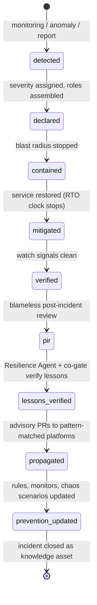

# brain.resilience — Resilience & Continuity Framework

Purpose: the anti-fragility backbone of the ecosystem — deliberately broader than a DR plan. Six connected capabilities (Prevention → Detection → Response → Recovery → Learning → Continuous Improvement) that turn every incident, outage, security event, failed experiment, rollback, and disaster into a verified knowledge asset that strengthens every platform. Read by operators (it must be runnable from the playbooks alone), the Resilience Agent, SREs, and security reviewers.

> **Related documents:**
> - [brain.dkp.md](brain.dkp.md) §9 — the `incident_report` pack type and lesson-propagation protocol this framework operates.
> - [brain.governance.md](brain.governance.md) — audit ledger and cadences that record and review everything here.
> - [brain.failures.md](brain.failures.md) — the failure knowledge base (anti-fragility ledger) this framework populates.
> - [agents/resilience.charter.md](agents/resilience.charter.md) — the agent that owns these loops.
> - Templates: [incident report](templates/incident-report.template.md) · [post-incident review](templates/post-incident-review.template.md) · [resilience scorecard](templates/resilience-scorecard.template.md).

---

## Capability 1 — Prevention

- **Secure-by-design gates:** every T3+ change passes Security Agent review; schema/adapter changes require green conformance suites (Testing Agent) before merge.
- **Chaos engineering program:** quarterly injected-failure experiments per service tier (message-loss, dependency-latency, key-rotation-failure, region-loss scenarios); each experiment pre-registers hypothesis and pass criteria in [brain.experiments.md](brain.experiments.md).
- **Predictive failure analysis:** the Reasoning Engine forecasts failure risk from leading indicators — ingestion-lag trends, error-rate drift, dependency health, capacity headroom — and opens preventive advisories when forecast risk exceeds threshold (confidence-scored like any insight).
- **Capacity & dependency risk models:** per-service dependency graphs with single-point-of-failure detection; capacity reviewed monthly against growth projections.

## Capability 2 — Detection

- **Automated health monitoring:** golden signals (latency, traffic, errors, saturation) per pipeline stage — ingestion, validation, graph, reasoning, recommendation, delivery ([brain.telemetry.md](brain.telemetry.md) owns definitions).
- **Anomaly detection:** statistical baselines per platform and pipeline; anomalies open detection events automatically with evidence attached.
- **Alert taxonomy** (routed through Dot.Notify):

| Class | Meaning | Route | Response SLA |
|---|---|---|---|
| `page` | Service-impacting now | On-call human + Incident Commander | 15 min |
| `urgent` | Degradation trending to impact | On-call human | 2 h |
| `advisory` | Anomaly, no impact yet | Resilience Agent triage | 24 h |
| `info` | Notable, no action | Ledger only | — |

## Capability 3 — Response

**Severity matrix:**

| Sev | Definition | Commander | Escalation |
|---|---|---|---|
| sev1 | Ecosystem-wide or data-integrity loss | Senior on-call (human) | Executives within 1 h |
| sev2 | One platform's brain loop down, or security event | On-call human | SRE Lead within 4 h |
| sev3 | Degraded pipeline, workaround exists | Resilience Agent + on-call | Daily summary |
| sev4 | Minor, self-healed | Resilience Agent | Weekly digest |

**Roles:** Incident Commander (human, decides), Resilience Agent (timeline keeper, evidence collector, pack drafter), Security Agent (co-gate on security events, containment advisor), human on-call (executes playbook steps).

**Playbooks** (operational + cybersecurity variants) share one spine: *detect → declare severity → assemble roles → contain → communicate → mitigate → verify → close into learning.* The cybersecurity variant adds: isolate affected tenants, freeze key trust (no new key registrations), preserve forensic evidence before mitigation, notify Security Officer regardless of severity.

**Communication templates:** initial notice (what/impact/next update time), update (every 30 min for sev1, 2 h for sev2), resolution notice (impact summary + PIR date). All via Dot.Notify; all ledger-logged.


*An incident is not closed when service is restored — it is closed when its lessons are verified, propagated, and prevention is updated.*

## Capability 4 — Recovery

**Service tiers with RTO/RPO targets** (rationale: [ADR-0007](adr/ADR-0007-rto-rpo-tier-model.md)):

| Tier | Services | RTO | RPO | HA target |
|---|---|---|---|---|
| **0 — Ledger & keys** | Audit ledger, key registry | 1 h | 0 (sync replication) | 99.99% |
| **1 — Knowledge core** | Graph store, ingestion, DKP transport | 4 h | 5 min | 99.9% |
| **2 — Intelligence** | Reasoning, recommendation, search | 12 h | 1 h | 99.5% |
| **3 — Periphery** | Dashboards, reports, colony drafts | 48 h | 24 h | 99% |

- **Backup & restore:** continuous ledger replication (tier 0); graph snapshots every 5 min + event-sourced replay (tier 1); restores tested in quarterly drills — an untested backup is not a backup.
- **Multi-region failover:** active-passive per region pair; tier 0–1 fail over automatically on region loss; tiers 2–3 rebuild from tier-1 state.
- **Rollback & version recovery:** knowledge rolls back by supersession (never deletion); schemas roll back by version pinning + adapter replay; **agent behavior** rolls back by reverting to a prior versioned behavior release (behavior changes are versioned artifacts per [brain.agents.md](brain.agents.md)).
- **BCP:** if Dot.Brain is fully unavailable, platforms continue autonomously by design (ownership boundary) — publishers queue packs locally with at-least-once retry; nothing in any platform's critical path depends on a live brain. This is the deepest continuity guarantee and it is architectural, not procedural.

## Capability 5 — Learning (anti-fragility core)

The pipeline that makes failure an asset:

1. **Blameless PIR** ([template](templates/post-incident-review.template.md), policy in [ADR-0008](adr/ADR-0008-blameless-review-policy.md)) within 5 business days of sev1/sev2, 10 for sev3.
2. **AI-assisted root cause analysis:** Reasoning Engine proposes causal chains from the timeline + telemetry; humans confirm or correct; contributing factors captured, not just the trigger.
3. **Verified lessons:** each lesson requires verification evidence (the fix demonstrably prevents recurrence); verified by Resilience Agent + co-gate; unverified lessons stay attached to the incident until proven.
4. **Propagation:** `incident_report` pack published; graph pattern-matching finds platforms sharing the vulnerable pattern; advisory PRs fan out per DKP §9.2 with full provenance. Lessons never decay (age_decay λ = 0).
5. **Prevention update:** monitors, chaos scenarios, and review-gate rules updated to catch the pattern class — closing the loop into Capability 1.

Knowledge preservation: the immutable ledger holds every PIR, lesson, verification, and propagation outcome — forever.

## Capability 6 — Continuous Improvement

- **Quarterly drills:** one recovery drill (restore + failover, pass = within RTO/RPO) and one chaos experiment per quarter, alternating tiers; failed drills are sev3 incidents feeding Capability 5.
- **Resilience Scorecard** ([template](templates/resilience-scorecard.template.md)) per platform and for Dot.Brain itself: drill results, MTTD/MTTR trends, repeat-incident rate, lesson-adoption rate.
- **The defining metric of anti-fragility:** the Evolution Agent tracks whether **repeat incidents of a propagated-lesson pattern decline quarter over quarter**. If lessons propagate but repeats don't fall, the learning loop is broken — that finding is itself a sev3.

## Worked Example: Dot.Central Control-Room Outage

**T+0 (02:14):** Anomaly detection flags dispatch-recommendation latency at Dot.Central spiking 40× — `page` alert via Dot.Notify. **Declared sev2** (one platform's brain loop down); Incident Commander (on-call SRE) + Resilience Agent + Mining Agent assemble.

**T+25 min — Containment:** root symptom is telemetry-ingestion backlog: a malformed high-frequency sensor feed from a new pit sensor passed schema validation but exploded semantic-validation costs. Feed quarantined (tenant-scoped, no other platform affected); dispatch falls back to platform-local logic — **BCP holds: mining operations continue** (ownership boundary means Dot.Central never had the brain in its critical path).

**T+2 h 10 — Mitigated:** validation given a per-source cost budget (circuit breaker); backlog drained. RTO met (tier 2: 12 h; actual 2 h 10). Watch signals clean by T+4 h → verified.

**T+4 days — Blameless PIR:** Reasoning Engine's causal chain, human-confirmed: *(1)* new sensor onboarded without frequency declaration; *(2)* semantic validation had no per-source cost bound; *(3)* alert fired on latency, not on validation-cost drift (detection gap). Contributing factor: onboarding checklist lacked a telemetry-profile step. Nobody blamed; three system fixes owned.

**Lessons verified:** L1 — "semantic validation must be cost-bounded per source" (verified: replay of the malformed feed now trips the breaker in < 30 s). L2 — "sensor onboarding requires a declared telemetry profile" (verified: checklist gate deployed). L3 — detection rule added for validation-cost drift.

**Propagation:**

```mermaid
sequenceDiagram
    participant C as Dot.Central (incident source)
    participant B as Dot.Brain
    participant G as Graph
    participant M as Dot.Mines
    participant F as Dot.Farms
    C->>B: incident_report pack (root_cause.pattern_refs: unbounded-ingest-validation)
    B->>G: pattern match: who ingests high-frequency sensor telemetry?
    G-->>B: Dot.Mines (fleet sensors), Dot.Farms (field sensors)
    B->>M: advisory PR: cost-bounded validation + telemetry-profile onboarding gate
    B->>F: advisory PR: same pattern, farm-sensor context
    M-->>B: accepted (merged 2026-08-20)
    F-->>B: accepted with modification (seasonal sensor bursts noted)
    B->>G: outcomes ingested; lesson corroboration factor rises
```
*A control-room outage becomes a hardened pattern across mining and agriculture within three weeks — the anti-fragility loop, end to end.*

**Prevention updated:** chaos scenario "malformed high-frequency feed" added to the quarterly rotation; the pattern class is now tested, not just patched.

## Metrics of Success

| Metric | Target |
|---|---|
| `resilience.repeat_incident_rate` (propagated patterns) | declining every quarter — the defining metric |
| `resilience.mttd_p50` / `resilience.mttr_p50` | declining trend, per scorecard |
| `resilience.lessons_verified_within_30d` | 100% |
| `resilience.lesson_adoption_rate` (advisory PRs accepted) | ≥ 50% |
| `resilience.drills_passed` | 8/8 per year (2 per quarter) |
| `resilience.rto_rpo_breaches` | 0 |

## Open Questions

| Question | Owner |
|---|---|
| Cross-region ledger replication cost vs RPO-0 for tier 0 in all geographies | Architecture Agent → Chief Architect |
| Should sev4 self-healed incidents also require lessons, or is the weekly digest sufficient? | Resilience Agent → SRE Lead |
| Chaos experiments against the colony itself (agent-failure injection) — scope and safety rails | Governance Agent → Chief AI Engineer |

## Change Log

| Version | Date | Author | Change |
|---|---|---|---|
| 1.0.0 | 2026-08-01 | Governance & Resilience Architect (prompt 06, AI) | Initial six-capability framework with worked outage example |
