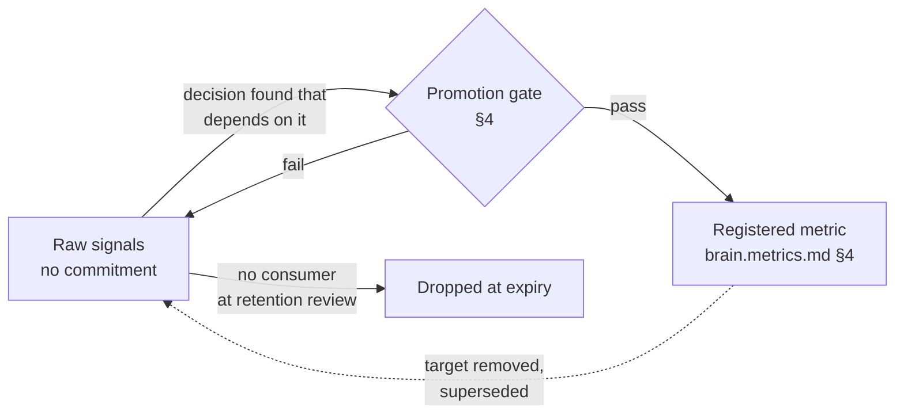

# Telemetry & Observability

Purpose: what the Brain measures about itself — the raw signals below the metric line, their retention and classification defaults, and the one-way door between *observing* a signal and *committing* to it as a registered metric. This document is owed by [brain.metrics.md](brain.metrics.md) §2 ("if no target or trend commitment can be stated, it is telemetry, not a metric") and by [brain.dopemine.md](brain.dopemine.md) §1's measure-vs-optimize distinction: telemetry is where prohibited-as-target engagement signals legitimately live as observations.

> **Related documents:** [brain.metrics.md](brain.metrics.md) — the registry telemetry promotes into · [brain.resilience.md](brain.resilience.md) — golden signals consumer · [brain.security.md](brain.security.md) — classification levels and detection feeds · [brain.memory.md](brain.memory.md) — storage tiers telemetry rides · [brain.dopemine.md](brain.dopemine.md) — guard metrics draw on telemetry.

---

## 1. The telemetry/metric boundary

- **Telemetry** is observed without commitment: no target, no owner accountability for its value, no `impact.metrics[]` eligibility. It exists to answer questions not yet asked — incident forensics, Goodhart reviews, guard-metric baselines.
- **Metrics** are commitments: target + owner + window + Why, registered in [brain.metrics.md](brain.metrics.md).
- The boundary is enforced where metrics are consumed: any `impact.metrics[]` entry, experiment success criterion, or agent KPI referencing an unregistered signal fails validation — telemetry cannot be optimized *by construction*, which is what makes it a safe home for engagement observations.

## 2. Signal catalog (what is collected)

| Family | Signals (examples) | Emitting stage |
|---|---|---|
| **Golden signals** | latency, traffic, errors, saturation — per pipeline stage (ingestion, validation, graph, reasoning, recommendation, delivery) | All stages; definitions canonical here per [brain.resilience.md](brain.resilience.md) §monitoring |
| **Pipeline flow** | packs received/validated/rejected per publisher, queue depths, retry counts, W1–W6 stage timings | Workflows |
| **Agent activity** | state transitions per [brain.agents.md](brain.agents.md) lifecycle, review durations, gate decisions with checklist point | Colony |
| **Interaction** | query volumes per endpoint/persona, evidence-link opens, escalation clicks, why-block dwell | API surface — collected at persona granularity, never individual profiles below the n ≥ 20 floor ([brain.community.md](brain.community.md) §3 applies) |
| **Engagement observations** | session length, open counts, notification responses — *observations only*; the §1 boundary is their containment | Platform-published packs |
| **Security events** | auth failures, classification-filter hits, signature rejections, capability-URL misuse | Per [brain.security.md](brain.security.md) detection column |

Collection rule: signals are emitted as structured events on the internal bus (same envelope discipline as [brain.events.md](brain.events.md): `occurred_at` + `observed_at`), aggregated before storage wherever individual-level resolution serves no registered consumer.

## 3. Retention & classification defaults

| Class of signal | Default classification | Retention | Tier ([brain.memory.md](brain.memory.md)) |
|---|---|---|---|
| Golden signals, pipeline flow | `ecosystem` | 13 months (year-over-year comparison) | Hot 90 days → Warm |
| Agent activity | `ecosystem` | 25 months (trust-score history depth) | Warm |
| Interaction (persona-aggregated) | `restricted` | 13 months | Warm |
| Engagement observations | `restricted` | 6 months, aggregated monthly thereafter | Warm |
| Security events | `restricted` | 25 months minimum (audit) | Warm → Cold |
| Anything individual-level `sensitive` | `sensitive`, ADR-0009 envelope | Shortest legal-basis window | Per [ADR-0009](adr/ADR-0009-crypto-shredding-legal-erasure.md) |

Defaults are overridable only *upward* (longer retention needs a named consumer and Security review; stricter classification is always allowed). The monthly review drops signal families with no consumer in two consecutive reviews — telemetry hoarding is a liability, not an asset.

## 4. Promotion path: telemetry → metric

A signal is promoted when a decision is found that depends on it. The gate:

1. **Named decision** — the Why field: which recurring decision consumes this value. "Might be useful" fails.
2. **Statable commitment** — a target or trend direction the owner will be accountable for.
3. **Standard fields** — the full 8-field definition per [brain.metrics.md](brain.metrics.md) §2, PR'd to the registry.
4. **Dopamine check** — if the signal is in the engagement family, the promotion routes through the [brain.dopemine.md](brain.dopemine.md) gate: engagement telemetry may promote to *guard* metrics freely, to *target* metrics never (§2 prohibited list) — the promotion gate is where measure-vs-optimize is physically enforced.
5. **Baseline attached** — the telemetry history that motivated promotion ships with the registration, so the initial target is evidenced, not guessed.

Demotion is the reverse door: a metric whose target is retired (superseded, Goodhart finding) drops back to telemetry rather than vanishing — the observations usually remain useful even when the commitment doesn't.

## 5. Worked example — the dwell signal that became a guard

Why-block dwell time (interaction family) is collected as telemetry with no commitment.

1. A Loop C review notices operator-persona comprehension scores dropping while dwell *rises* — people re-reading without understanding.
2. The UX Agent finds the decision: template changes need a fast early-warning between quarterly comprehension samples. Promotion proposed: `personas.why_dwell_anomaly` as a **guard** paired with `governance.why_block_comprehension`.
3. Dopamine check: dwell is engagement-adjacent — promotion as guard passes trivially; the record notes it may never flip to a target (maximizing dwell is optimizing attention, §2 prohibited in spirit).
4. Baseline: 13 months of dwell telemetry sets the anomaly band. Registered; the signal now has an owner, a window, and a Why — and the raw telemetry keeps flowing unchanged beneath it.

## 6. Health metrics

Registered in [brain.metrics.md](brain.metrics.md): `dkp.ingest_latency_p95` and the resilience MTTD/MTTR trends are *computed from* telemetry defined here — this document owns the signal definitions, the registry owns the commitments. Also registered (§4.9): `telemetry.unconsumed_signal_families` (reviewed monthly, trending to 0 — hoarding indicator) and `telemetry.collection_gap_minutes` (≤ 5 min/month per golden-signal stream — you cannot observe an outage with an observability outage).

---

## Change Log

| Version | Date | Author | Change |
|---|---|---|---|
| 1.0.0 | 2026-08-01 | Brain Document Generator (prompt 03, AI) | Initial spec: telemetry/metric boundary, six-family signal catalog, retention/classification defaults with upward-only override, five-step promotion gate with dopamine check, dwell-guard worked example |

## Open Questions

| Question | Owner → Approver |
|---|---|
| ~~Register `telemetry.unconsumed_signal_families` and `telemetry.collection_gap_minutes` in brain.metrics.md §4.9~~ Registered in [brain.metrics.md](brain.metrics.md) §4.9 (1.3.0) | Data Agent → Security Officer |
| Is 6-month individual-resolution retention for engagement observations shorter than guard-metric baselining needs (dopemine guards may want 12)? | Data Agent → Ethics Officer |
| Should telemetry dashboards be persona-scoped like `/v1/why` renderings, or is engineer-register-only acceptable for internal observability? | UX Agent → SRE Lead |
