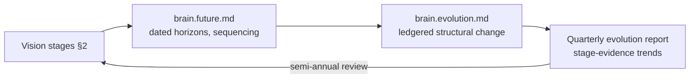

# Vision

Purpose: the long-horizon picture — what the Dot ecosystem becomes when the Brain works, over twenty years. This is the north star [MANIFESTO.md](MANIFESTO.md)'s principles serve and the destination [brain.identity.md](brain.identity.md) says the identity leads to. It is deliberately *not* a roadmap: concrete horizons, dated capabilities, and sequencing live in [brain.future.md](brain.future.md) — this document states what would have to be true for the roadmap to have been worth executing. Like everything here, the vision is falsifiable: each stage names what "smarter every day" means measurably, so the ecosystem can know whether it is arriving or drifting.

> **Related documents:** [MANIFESTO.md](MANIFESTO.md) — the principles that constrain every path to this destination · [brain.identity.md](brain.identity.md) — what the Brain is on the way there · [brain.evolution.md](brain.evolution.md) — the change machinery that walks the stages · [brain.business.md](brain.business.md) §2 — the crossover prediction each stage must honor.

---

## 1. The destination, in one paragraph

An ecosystem where **no platform solves a solved problem, no failure teaches only once, and no decision is made without the option of knowing why** — where a farmer's moisture lesson prices a trader's risk, a mine's near-miss hardens a hospital's checklist, and the connective intelligence doing this is boring: trusted the way infrastructure is trusted, auditable the way ledgers are auditable, and calm the way good tools are calm. The Brain succeeds when it stops being remarkable.

## 2. Stages — each falsifiable, none dated

Dates belong to brain.future.md; the vision owns the *order* and the *evidence of arrival*:

| Stage | The ecosystem when it's true | Arrival evidence (registered metrics) |
|---|---|---|
| **S1 — Memory** | Knowledge survives its authors; nothing published is re-derived from scratch | `knowledge.provenance_completeness = 100%`, `dkp.ingest_latency_p95` at contract |
| **S2 — Learning** | The colony's calibration visibly improves; lessons propagate faster than mistakes recur | `resilience.repeat_incident_rate` declining, `colony.override_rate` falling |
| **S3 — Transfer** | Cross-domain reuse is routine, not remarkable; patterns outnumber single-context successes | `identity.cross_platform_lesson_reuse` rising, patterns catalog net growth |
| **S4 — Compounding** | Verified value exceeds full cost; the crossover prediction lands ([brain.business.md](brain.business.md) §2) | ROI_q > 1 sustained, realized-vs-projected within calibration |
| **S5 — Quiet ubiquity** | Platforms design *assuming* the Brain, as they assume DNS; explainability is an end-user expectation | `explainability.human_comprehension_score` at target across personas, unserved-query rate near zero |

Stages overlap and never close: S1's invariants are load-bearing at S5. A stage claimed without its evidence is vision inflation — the Business Agent's realized-vs-projected discipline, applied to the destination itself.

## 3. What we refuse to become

The north star is bounded by anti-goals, each anchored to an existing hard invariant:

- **Not an oracle.** The Brain recommends; platforms decide — sovereignty (`identity.boundary_violations = 0`) holds at every scale, including S5.
- **Not an attention machine.** Growth never comes from engagement capture; [brain.dopemine.md](brain.dopemine.md)'s prohibitions are permanent, not a startup phase.
- **Not a monoculture.** Convergence on shared knowledge must not become convergence of judgment — contradiction handling and the CONTRADICTS edge stay first-class; a graph with no live contradictions is a warning sign, not an achievement.
- **Not a black box.** Every "why" answerable at every stage; explainability debt is never traded for capability.
- **Not a toll road.** Knowledge exchange stays unmetered ([brain.business.md](brain.business.md) §4) at any scale.

## 4. How the vision is governed

The vision is quasi-frozen: stages and anti-goals change only with Executive Sponsor sign-off at the semi-annual review, with the same ceremony as MANIFESTO re-affirmation ([brain.operating_model.md](brain.operating_model.md) §3) — a vision edited casually is a vision nobody steers by. The evidence columns, by contrast, are living: as better metrics register, the arrival tests sharpen. Drift check: if two consecutive quarterly reports show stage-evidence trends moving *away* while activity metrics rise, the ecosystem is busy but off-course — that finding goes to the Executive Sponsor as a strategic incident, not a dashboard footnote.

## 5. Worked example — the wet-season thread, read as a vision test

One thread, five stages: the Kolomela lesson was packed and survived its authors (S1); the near-miss hardened the no-auto-merge rule and no repeat occurred (S2); the pattern replicated at Sishen and was queued for dry-climate probing (S3); the Q3 ledger closed at realized ROI 2.7 (S4); and the operator who acted on the Why block never knew or cared which agents built the chain — it was just how the platform worked (S5, in miniature). The vision doesn't need new machinery to be tested; every thread the ecosystem completes is a core sample of how far along the stages it actually is.

## 6. Health metrics

This document introduces no metrics of its own — deliberately: a vision with private KPIs becomes a second, competing registry. Its arrival evidence (§2) cites only metrics registered in [brain.metrics.md](brain.metrics.md), and its drift check runs on the quarterly evolution report's existing trends. Proposed pending registration: none — the first direction doc to add zero IDs, which is itself the design.

---

## Change Log

| Version | Date | Author | Change |
|---|---|---|---|
| 1.0.0 | 2026-08-01 | Brain Document Generator (prompt 03, AI) | Initial vision: one-paragraph destination, five falsifiable undated stages with registered-metric arrival evidence, five anti-goals anchored to hard invariants, quasi-frozen governance with strategic-incident drift check, wet-season thread as core sample |

## Open Questions

| Question | Owner → Approver |
|---|---|
| S5's "unserved-query rate" arrival evidence has no registered metric yet — register when the query-lead pipeline ([brain.operating_model.md](brain.operating_model.md) §5) matures, or now? | Governance Agent → Executive Sponsor |
| Should the anti-goals (§3) be promoted into MANIFESTO text at its next re-affirmation, or remain vision-level? | Governance Agent → Executive Sponsor |
| Stage-evidence thresholds (e.g., how long must ROI_q > 1 hold to claim S4?) — fix here or leave to the semi-annual review's judgment? | Business Agent → Executive Sponsor |
