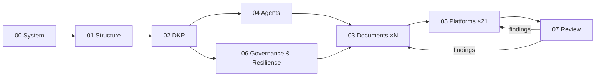

# Dot.Brain Prompt Repository

The prompt system that builds and maintains **Dot.Brain** — the collective intelligence layer of the Dot Ecosystem. The prompt repository is a first-class project: versioned, modular, and designed to mirror the ecosystem it creates — independent components connected by shared intelligence.

## Why modular

One ultra-long prompt exceeds reliable context limits and mixes responsibilities. Instead:

- Each prompt has a **single, well-defined responsibility**.
- Prompts are **reusable independently** and by different AI agents in parallel.
- The system stays **within model context limits**.
- The repository can **evolve without rewriting** one massive prompt.

## The prompts

| File | Responsibility | Run when |
|---|---|---|
| `00-System-Prompt.md` | Permanent role, Dot Intelligence Manifesto, ecosystem definitions, non-negotiable rules | **Every session, always first** |
| `01-Repository-Architect.md` | Repository structure, README, indexes, ownership matrix | Once, first working session |
| `02-DKP-Architect.md` | The Dot Knowledge Protocol — schemas, trust, provenance, signatures, incident packs | Once, before documents that depend on DKP |
| `03-Brain-Document-Generator.md` | Generates one `brain.*.md` or `platforms/*.md` document per session, production-ready | Repeatedly, one document at a time |
| `04-Agent-Colony-Architect.md` | The autonomous agent colony — charters, topology, trust, human override | Once, after 02 |
| `05-Platform-Integrator.md` | Connects one platform per session; defines the universal future-platform path | Repeatedly, one platform at a time |
| `06-Governance-And-Resilience.md` | Governance + the Resilience & Continuity Framework (anti-fragility backbone) | Once, then quarterly refresh |
| `07-Repository-Reviewer.md` | Adversarial audit, scoring, contradiction sweep, continuous improvement | After every 3–5 sessions, and quarterly |

## Recommended build order

1. `00` + `01` — skeleton and navigation.
2. `00` + `02` — the DKP (everything else depends on it).
3. `00` + `04` and `00` + `06` — agents and governance/resilience.
4. `00` + `03` — generate `brain.*` documents, dependency-first (`identity`, `architecture`, `relationships`, `metrics` early).
5. `00` + `05` — integrate platforms one at a time (start with Dot.Mines + Dot.Central, the richest operational pair).
6. `00` + `07` — review, fix, repeat until internally consistent.

## The Dot Intelligence Manifesto (governing every prompt)

Every interaction should make the ecosystem smarter. Every improvement should be explainable. Every recommendation should be measurable. Every platform should remain autonomous. Every piece of knowledge should ultimately help people and businesses make better decisions. Every failure should strengthen the ecosystem through learning, resilience, and continuous improvement.

## Versioning

Prompts follow semantic versioning in their change logs. Changing `00` is a MAJOR event — re-review all downstream prompts. Treat this repository with the same governance rigor Dot.Brain applies to knowledge: propose changes via PR, never overwrite silently.
