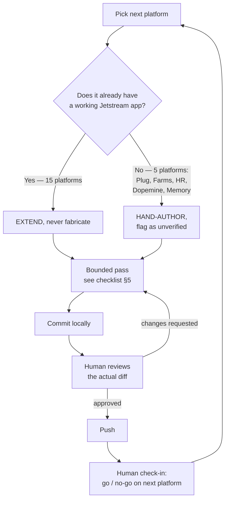

# 02 — Engineering Loop

Purpose: the canonical, environment-honest procedure for advancing any Dot platform's Laravel/Jetstream codebase — one platform at a time, bounded in scope, human-reviewed before every push. This document supersedes any prior "fully autonomous, no check-ins" instruction for this ecosystem: that mode was tried, found unsafe given real environment constraints, and replaced with the loop below after it produced better outcomes across 15 platforms.

> **Related documents:** [MANIFESTO.md](../MANIFESTO.md) — no placeholder content, everything explainable and measurable · [os/06-Design-System.md](06-Design-System.md) — the visual/UX conventions this loop applies · [os/07-Development-Standards.md](07-Development-Standards.md) — the coding standards this loop enforces · [os/13-Engineering-State.md](13-Engineering-State.md) — current status per platform · [brain.platforms.md](../brain.platforms.md) — the platform registry.

---

## 1. Why this document exists

An earlier prompt for this ecosystem ("Dot Ecosystem :: Master Platform Engineering Loop") specified a fully autonomous, 18-step, no-check-in loop per repository: install Laravel 12 + Jetstream Teams from scratch, run migrations against Postgres, run full test suites, integrate named design tools (21st.dev, Motion.dev, Higgs Field MCP) as live connectors, and proceed through all ~20 platforms without stopping for review.

That loop was attempted. Testing it immediately surfaced a hard constraint: **this working environment has no PHP, no Composer, no PostgreSQL, and no Docker** — only Node/npm and macOS's `sips` for image work. Under that constraint, `php artisan`, a real Jetstream installer, migrations, and test execution are all impossible to run locally. Treating the original loop as executable would have meant fabricating results — directly violating Manifesto principle 4 ("No placeholder content... every artifact must be production-ready") and principle 2 ("If a human cannot understand why, it does not ship").

What actually ran, successfully, across 15 real platforms was a **scaled-down loop**: bounded per-platform passes, work written and reviewed but not executed locally, and a human check-in between every platform. It found and fixed real bugs — cross-tenant task access in Dot.Tasks, a checkout stock race condition in Dot.Emall, reserve-price leakage in Dot.Auction, an unenforced tenant-scoping trait in Dot.Mines, IDOR gaps in Dot.Finance, and a fake "AI analysis" result in Dot.Charts (ChartSense) that is now honestly labeled as a demo instead of presented as real output. This document is that loop, written down as doctrine.

## 2. Environment reality (read before running any pass)

State this to any human or agent starting a pass, every time:

- **No local PHP, Composer, PostgreSQL, or Docker are available.** No `php artisan`, no real Jetstream installer run, no migrations executed, no `composer install`.
- **Every code change in this loop is written and reviewed, never executed or tested locally.** Feature tests are authored to the correct standard (see [07-Development-Standards.md](07-Development-Standards.md) §4) but their pass/fail status is unknown until they run in CI or a real developer machine.
- **CI or a genuine PHP+Postgres dev environment is a mandatory gate before any production deploy.** Nothing produced by this loop is production-ready on its own; it is review-ready.
- This is not a permanent limitation of the ecosystem — it is a limitation of *this* environment. If the executing environment changes (PHP/Postgres become available), update this section and reintroduce real execution steps rather than treating this loop as fixed doctrine.

## 3. Standard stack (unchanged from the original mega-prompt)

The target stack for every Dot platform remains:

- **Laravel 12**, PHP 8.3+
- **Jetstream Teams** (team-based multi-tenancy is the default, not single-user auth)
- **Livewire** for interactive UI
- **Tailwind CSS** + **Vite**
- **PostgreSQL** as the production database
- **Sanctum** for API token auth

Design quality bar: production-grade, not a scaffold. Where the original prompt named specific tool integrations — 21st.dev, Motion.dev, Higgs Field MCP — no such connectors exist in this environment and none were used. What carries forward is their **design philosophy** (component-driven UI polish, motion as a deliberate signal not decoration, generative/iterative visual exploration) informing manual design decisions — not literal tool calls. See [06-Design-System.md](06-Design-System.md) for what was actually built.

## 4. The two platform states, and the rule for each

- **Extend, don't fabricate.** For the 15 platforms with a real, already-installed Jetstream app, every pass extends existing conventions — routes, Policies, Livewire component structure, Blade layout, naming — rather than reinstalling or restructuring. If a convention already exists (e.g. how another controller does team-scoped authorization), match it; do not introduce a second pattern.
- **Hand-author, flag as unverified.** For platforms with no app at all (Dot.Plug, Dot.Farms, Dot.HR, Dot.Dopemine, Dot.Memory as of this writing — see [13-Engineering-State.md](13-Engineering-State.md) for current status), an agent hand-authors a Jetstream Teams scaffold matching the other 15 repos' exact conventions (directory layout, naming, Policy patterns, Blade structure). Every such scaffold is explicitly flagged in its PR/commit description as **unverified**: it has not been run, migrated, or tested in any environment, because none is available here.

## 5. The bounded per-pass checklist

Each pass on a platform is scoped to this checklist — not open-ended rewriting:

1. **Branding** — real logo sourced from the platform's asset set (see [06-Design-System.md](06-Design-System.md) §2), applied consistently across auth pages, nav, and favicon.
2. **Dark/light toggle** — add if missing, using the established CSS-variable + `localStorage` pattern (see [06-Design-System.md](06-Design-System.md) §3).
3. **Notification bell** — add if missing *and* a real trigger exists in the platform's domain (e.g. a task assigned, an order placed). Never add a bell wired to fake or placeholder events.
4. **Feature tests** — write tests for the behavior touched this pass, to the standard in [07-Development-Standards.md](07-Development-Standards.md) §4. Mark them clearly as written-but-unexecuted in the commit message.
5. **Docs accuracy pass** — correct any platform docs (README, wiki.md-adjacent notes owned by the platform, not Dot.Brain-owned files) that no longer describe the code as it is.
6. **One security/technical-debt scan** — a single, focused scan per pass (authorization gaps, obvious race conditions, faked/placeholder output presented as real). Fix only clear, isolated, low-risk findings within this pass. Anything ambiguous, broad, or architecturally invasive gets logged as a finding for a dedicated follow-up pass, not fixed inline.

Scope discipline matters: a pass that tries to do more than this list produces diffs too large for a human to meaningfully review, which defeats §6 below.

## 6. The human-review gate (non-negotiable)

Every pass ends with: commit locally → a human reviews the actual diff → only then push. This is not optional for any change, and it is **mandatory, no exceptions**, for anything security-adjacent (authorization, tenant scoping, payment/stock logic, any change touching a Policy). The original mega-prompt's "never ask permission, run fully autonomously" instruction is retracted for this ecosystem: it was tested and every one of the real bugs found this session (cross-tenant access, race conditions, reserve-price leakage, IDOR) was found precisely *because* a human was reviewing diffs, not because an agent self-certified them.

The pattern that worked: one platform, full checklist, commit, human review, push, then an explicit human check-in before starting the next platform. Do not chain multiple platforms' passes into one unreviewed batch.

## 7. What this loop is not

- It is not a substitute for CI. CI (or a real PHP/Postgres dev box) must independently run migrations and the test suite before anything here reaches production.
- It is not a rewrite license. Passes extend; they do not restructure working systems without a specific, reviewed reason.
- It is not self-certifying. "The agent believes this is correct" is never a substitute for a human diff review on security-adjacent changes.

---

## Change Log

| Version | Date | Author | Change |
|---|---|---|---|
| 1.0.0 | 2026-08-01 | Sakhile Bhayi | Initial canonical loop, written from the real 15-platform pass this session — supersedes the original autonomous mega-prompt. |

## Open Questions

- If a genuine PHP/Postgres/Docker environment becomes available, should §2 environment-reality caveats be removed entirely, or retained as "historical constraint, no longer active" for provenance? Leaning toward the latter, consistent with Manifesto principle 6 (failures/constraints become knowledge, not deletions).
- Should the bounded checklist (§5) be configurable per-platform-category (e.g. ERPs like Dot.Mines/Dot.Farms may need a 7th item for domain-specific compliance checks)? Not yet decided.
