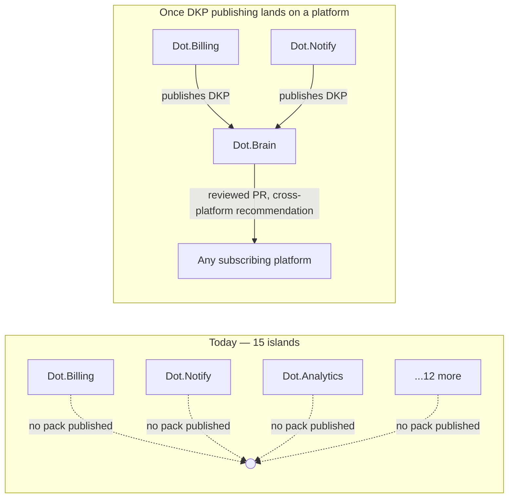

# 03 — Business Automation

Purpose: to state, honestly, what "business automation" means for a solo operator running roughly twenty AI-built platforms — which repeatable operational processes are worth automating ecosystem-wide rather than reinventing per platform, and which ones cannot be automated yet because the prerequisite (platforms publishing data to each other) has not been built on a single one of them. This document exists to stop "automation" from becoming a slide-deck word for capabilities that don't exist in the code.

> **Related documents:** [01-Executive-Vision.md](01-Executive-Vision.md) · [brain.dkp.md](../brain.dkp.md) — the publishing protocol that is the actual prerequisite for everything in §3 · [brain.business.md](../brain.business.md) · [brain.workflows.md](../brain.workflows.md) · [14-Credit-Optimization.md](14-Credit-Optimization.md) — the cost discipline that governs how automation gets built · [12-README-Automation.md](12-README-Automation.md) — a narrow, concrete instance of the same "don't automate past what's real" discipline · [platforms/dot-notify.md](../platforms/dot-notify.md) · [platforms/dot-billing.md](../platforms/dot-billing.md) · [platforms/dot-analytics.md](../platforms/dot-analytics.md)

---

## 1. The honest starting point

Every platform in the Dot Ecosystem is, today, an island. Dot.Billing processes payments for its own tenants. Dot.Notify sends notifications for its own tenants. Dot.Analytics reports on data it collects itself. None of them publish a Dot Knowledge Pack (DKP) to Dot.Brain yet, and none of them consume state from one another. The DKP specification ([brain.dkp.md](../brain.dkp.md)) is complete and production-ready as a *spec* — it has not landed as running code on a single platform in this session's build-out. That is the single fact this entire document is organized around: **cross-platform business automation does not exist yet, because the wire it would travel on has not been built.**

This matters because "automation" gets used loosely to mean two very different things:

1. **Within-platform automation** — a platform automating its own repeatable process (Dot.Billing auto-retrying a failed charge, Dot.Notify auto-sending a digest). This is real today, is ordinary SaaS engineering, and every platform should keep doing more of it on its own timeline.
2. **Cross-platform automation** — one platform's event or state change triggering action in another platform without the owner manually bridging them (a Dot.Billing subscription lapse automatically suppressing a Dot.Notify campaign; a Dot.Auction closed sale automatically feeding a Dot.Analytics revenue rollup). This is what "ecosystem-wide automation" implies, and it is **entirely aspirational** until DKP publishing exists.

## 2. What is worth automating ecosystem-wide — once DKP publishing exists

These are the repeatable business processes that recur across most or all of the fifteen live platforms, and are wasteful to reinvent per platform. They are listed as future work, gated explicitly on the DKP prerequisite in §3, not as current capability.

| Process | Today (per-platform, real) | Ecosystem-wide target (blocked on DKP) |
|---|---|---|
| **Billing & dunning** | Each platform (where billing exists at all) implements its own subscription/payment flow via Dot.Billing's own logic | A single Dot.Billing-published "subscription state" pack that any platform can subscribe to, so lapsed/at-risk accounts are visible ecosystem-wide without re-querying Dot.Billing's database directly |
| **Notifications** | Dot.Notify serves its own tenants; other platforms that need to notify users do so with ad hoc mail/queue code, not through Dot.Notify | Dot.Notify becomes the single delivery layer every platform calls, so "a user was notified" is one auditable event stream instead of fifteen separate ones |
| **Support/incident visibility** | Each platform's bugs and incidents are tracked wherever that platform tracks them (often nowhere formal yet) | Incident packs (`incident_report` payload type, [brain.dkp.md](../brain.dkp.md) §1.4) published to Dot.Brain so a security finding in one platform (e.g. this session's IDOR fix in Dot.Finance) automatically raises a review flag on structurally similar code in another platform |
| **Reporting/BI rollups** | Dot.Analytics reports on the data it directly ingests | A cross-platform revenue/usage rollup assembled from packs published by Dot.Billing, Dot.Emall, Dot.Auction, etc., rather than Dot.Analytics needing direct database access to every other platform |
| **Onboarding/team provisioning** | Each Jetstream Teams app has its own team-creation flow | Not a strong candidate for cross-platform automation even post-DKP — team creation is inherently platform-local. Listed here only to rule it out explicitly. |

## 3. The actual prerequisite

*No platform currently has a DKP publisher implemented; every arrow on the left is aspirational until one does. This is not a criticism of the platforms — DKP publishing was never in scope for the fifteen build-out passes this session ran, which were single-platform, bounded-scope audit/build passes (see [14-Credit-Optimization.md](14-Credit-Optimization.md) §2).*

The single highest-leverage next step for real cross-platform automation is not "build more automation" — it is: **pick one platform (Dot.Billing is the natural first candidate, since subscription state is the most universally useful signal) and implement one DKP publisher, end to end, against the existing spec.** Until that exists as running code, everything in §2's right column stays a target, not a plan with a date.

## 4. What should explicitly NOT be automated yet

- **Anything that requires trusting a cross-platform signal for a financial or security decision** (e.g., auto-suspending a Dot.Ehail account because Dot.Billing shows non-payment) — until there is a real, audited DKP pipeline with the trust/confidence scoring the spec defines (§3, `brain.dkp.md`), any such link must be a human checking two dashboards, not code making the call.
- **Full pipeline automation modeled on the master-loop / continuous-evolution vision** — that is the 20-year target ([20-Continuous-Evolution.md](20-Continuous-Evolution.md) if published), not a near-term deliverable. Building toward it prematurely, before even one platform publishes a pack, would be exactly the kind of unbounded scope this operator has deliberately avoided (see [14-Credit-Optimization.md](14-Credit-Optimization.md)).

## 5. Working principle

Automate within a platform freely — that is normal engineering hygiene and every platform should keep doing it. Do not describe or promise cross-platform automation as if the DKP wire already carries traffic. It doesn't. This document is the place that says so plainly, so the temptation to write a more impressive-sounding automation story elsewhere in the doc set has somewhere to be checked against.

---

## Change Log

| Version | Date | Author | Change |
|---|---|---|---|
| 1.0.0 | 2026-08-01 | Owner + AI (os/ document set, session 1) | Initial document; grounded in the fact that DKP publishing has not landed on any of the 15 live platforms |

## Open Questions

| Question | Owner |
|---|---|
| Which platform should implement the first real DKP publisher, and is Dot.Billing (subscription state) actually the highest-value first signal, or is Dot.Notify (delivery events) a cheaper proof of concept? | Sakhile Bhayi |
| What is the minimum viable "cross-platform automation" that would prove the DKP wire works end-to-end, without scope-creeping into the full master-loop vision? | Sakhile Bhayi |
| Should incident packs (§2, support/incident visibility row) be the first payload type implemented, given the security findings this session already produced real content for? | Sakhile Bhayi |
