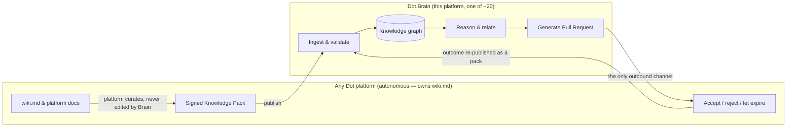
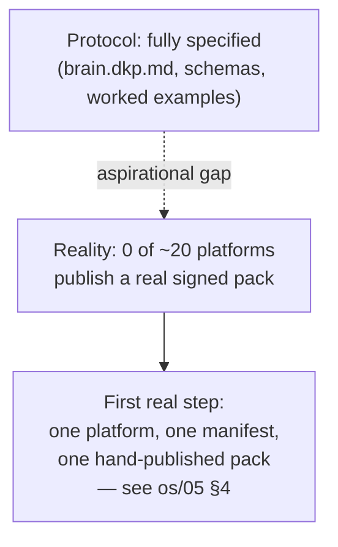

# 04 — Dot.Brain, In Brief

Purpose: an OS-altitude summary of what Dot.Brain is, why it exists, and where it actually stands today — written for someone who will never read the 35+ `brain.*.md` technical specs. It states the ownership boundary, the publish→ingest→reason→PR loop, and the honest gap between the protocol as specified and the protocol as adopted. It links out to the detailed specs rather than re-deriving them.

> **Related documents:** [MANIFESTO.md](../MANIFESTO.md) · [brain.identity.md](../brain.identity.md) · [brain.architecture.md](../brain.architecture.md) · [brain.dkp.md](../brain.dkp.md) · [brain.platforms.md](../brain.platforms.md) · [os/05-Knowledge-Protocol.md](05-Knowledge-Protocol.md) · [os/19-Knowledge-Packs.md](19-Knowledge-Packs.md) · [os/11-AI-Decision-Engine.md](11-AI-Decision-Engine.md) · [os/02-Engineering-Loop.md](02-Engineering-Loop.md)

---

## 1. What Dot.Brain is, in one paragraph

Dot.Brain is one of ~20 platforms in the Dot Ecosystem — not the ecosystem itself. Its job is narrow and specific: be the place where knowledge from every other platform gets related, reasoned over, and turned into evidence-backed proposals. It is a knowledge graph, a reasoning engine, a learning engine, and a memory orchestrator (working with Dot.Memory) — never an application with end-user UI, never a database platforms build directly against, and never an oracle whose word is final. The full definition, including its relationship to Dot.Memory (storage) and Dot.Agents (execution), lives in [brain.identity.md](../brain.identity.md); the four-layer component model that implements it lives in [brain.architecture.md](../brain.architecture.md).

## 2. The ownership boundary — the one fact that matters most

Every platform in the ecosystem — Dot.Billing, Dot.Emall, Dot.Agents, all of them — owns its own knowledge in its own repository, in a file it controls: `wiki.md`. Dot.Brain never writes to that file, or to any platform-owned file. It has no write credential to any platform repository at all; the boundary is architectural, not a policy someone could forget to enforce.

Knowledge only crosses the boundary in one direction as a signed **Knowledge Pack (DKP)**; intelligence only flows back as a **Pull Request** the platform can accept, reject, or let expire. Silence is not consent — an unanswered PR expires and that expiry is itself recorded as knowledge. See [brain.identity.md](../brain.identity.md) §3 for the full boundary statement and [brain.dkp.md](../brain.dkp.md) §7 for the PR contract.

*Knowledge enters only as a signed pack; intelligence leaves only as a PR; the outcome of that PR — accepted, rejected, or expired — is ingested back as new knowledge, closing the loop.*

## 3. The promise

If every platform actually spoke the protocol, the payoff described in [brain.identity.md](../brain.identity.md) §6 would be real: a lesson learned by one platform — an incident, a metric anomaly, a successful fix — becomes a candidate lesson for every structurally similar platform, with full evidence and without any platform losing control of its own decisions. A mining-fleet dispatch lesson generalizing to agricultural harvest logistics is the worked example the technical spec uses; the mechanism is domain-agnostic by design (see [brain.relationships.md](../brain.relationships.md) §7 and [brain.reasoning.md](../brain.reasoning.md) §7 for the audited chain).

## 4. The current reality

The protocol above is fully specified and, as documentation, treats every registered platform as already `publishing` ([brain.platforms.md](../brain.platforms.md) §2 lists all 21 platforms at `publishing` or `full-loop`). That registry status describes the *intended* integration contract each platform's `platforms/<id>.md` document was written against — it does not describe what is actually running in any platform's codebase today.

This session built real Laravel/Jetstream applications for 15 of the ~20 platforms, each with its own `wiki.md` reflecting the actual shipped code (see [os/02-Engineering-Loop.md](02-Engineering-Loop.md) for how). Across all 15, the finding was the same, every time: **there is no real DKP integration.** No platform has a signing key provisioned, a `platform.dkp.json` manifest committed in its own repo, or a publish job/command that emits a pack. Three platforms — Dot.Central, Dot.Design, and Dot.Finance — additionally have a documented mismatch between what their `platforms/<id>.md` ingestion doc in this repo describes and what the real application does (for example, Dot.Design's ingestion doc describes an enterprise design-token system; the real, shipped app is an AI canvas tool with a token system added alongside it, not the system the doc centers on).

In plain terms: the protocol is production-grade on paper and has zero real adoption. Every platform is, in the honest sense of the word, still at step 0 of onboarding ([os/05-Knowledge-Protocol.md](05-Knowledge-Protocol.md) §3), regardless of what the registry column says.

## 5. Why this gap is stated here, not hidden

Manifesto principle 4 — "no placeholder content" — cuts both ways: it forbids fake features, and it forbids pretending a specification is a running system. This document exists so anyone reading the OS layer sees the gap in the first document they open, not the thirty-fifth.

## 6. Where to go next

- The protocol itself, framed for a non-specialist and with a realistic near-term roadmap: [os/05-Knowledge-Protocol.md](05-Knowledge-Protocol.md).
- A hands-on worked example of a real pack, and exactly what blocks each of the 15 real platforms from publishing today: [os/19-Knowledge-Packs.md](19-Knowledge-Packs.md).
- Who actually makes AI-driven decisions in this ecosystem right now, and how that differs from the automated reasoning/recommendation engines this document describes: [os/11-AI-Decision-Engine.md](11-AI-Decision-Engine.md).
- The full technical detail this document deliberately does not repeat: [brain.architecture.md](../brain.architecture.md), [brain.dkp.md](../brain.dkp.md), [brain.relationships.md](../brain.relationships.md), [brain.reasoning.md](../brain.reasoning.md), [brain.learning.md](../brain.learning.md).

---

## Change Log

| Version | Date | Author | Change |
|---|---|---|---|
| 1.0.0 | 2026-08-01 | Sakhile Bhayi | Initial OS-layer executive summary of Dot.Brain: ownership boundary, publish→ingest→reason→PR loop, honest statement of zero real DKP adoption across the 15 real platforms built this session. |

## Open Questions

- Once a platform publishes its first real pack, should `brain.platforms.md`'s status column be corrected to reflect real (`registered`) rather than aspirational (`publishing`) state, or should a second column track "documented contract" vs. "verified live" separately? Leaning toward the latter — the documented contract is still useful design work and shouldn't be discarded, just distinguished from live status.
- Should this document's §4 be regenerated automatically from each platform's `wiki.md` roadmap section rather than hand-maintained, so it can't silently go stale as platforms actually onboard?
