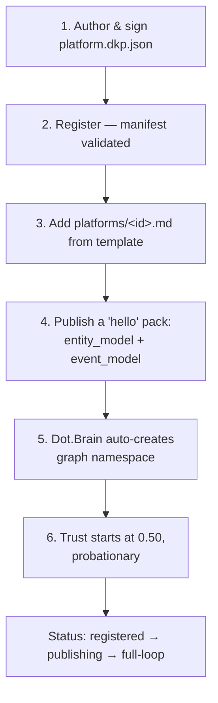

# 05 — The Knowledge Protocol, Plainly

Purpose: an OS-altitude explanation of the Dot Knowledge Pack (DKP) protocol — what it is in plain terms, why every platform eventually needs to speak it, the six-step onboarding path already defined in the technical spec, and a realistic near-term roadmap given that 15 platforms now have real code and zero real DKP integration. This document summarizes; it does not redefine anything already specified in [brain.dkp.md](../brain.dkp.md) or [brain.platforms.md](../brain.platforms.md).

> **Related documents:** [os/04-Dot-Brain.md](04-Dot-Brain.md) — why this protocol exists · [brain.dkp.md](../brain.dkp.md) — the full normative spec · [brain.platforms.md](../brain.platforms.md) §3 — the universal onboarding procedure summarized in §3 below · [templates/knowledge-pack.template.md](../templates/knowledge-pack.template.md) · [templates/knowledge-pack.example.md](../templates/knowledge-pack.example.md) · [os/19-Knowledge-Packs.md](19-Knowledge-Packs.md) — worked examples and platform-by-platform blockers.

---

## 1. What DKP is, in plain terms

A Knowledge Pack is a signed, dated envelope one platform sends to Dot.Brain saying, in effect: *"here is something true about my domain — a definition, an observation, a finding, or a lesson from something that broke — here is my evidence for it, and here is who (human or AI) is accountable for saying it."* It is never a request and never a command. Dot.Brain reads packs, relates them to everything else it knows, and if it finds something actionable, it opens a Pull Request against the *originating or another* platform's repository. The platform decides what happens next.

Four kinds of pack exist, and almost everything a platform will ever publish fits one of them (full schema detail: [brain.dkp.md](../brain.dkp.md) §1.4):

| Payload | Answers | Everyday example |
|---|---|---|
| `observation` (metric) | "What did we measure?" | Checkout completion rate this week |
| `insight` | "What pattern did we find?" | Cart abandonment spikes on mobile after a specific step |
| `recommendation` / `outcome` | "What should change, and what happened when it did?" | Simplify that step; conversion rose 4% after the fix shipped |
| `incident_report` | "What broke, and what did we learn?" | A stock race condition let two buyers purchase the last unit |

## 2. Why every platform needs to eventually speak it

The ecosystem's central bet — every failure and success anywhere becomes knowledge everywhere — only pays off if platforms actually publish. A platform that never sends a pack is invisible to the graph: its lessons stay local, and it never receives the cross-platform advisories other platforms' incidents could have warned it about (see [brain.dkp.md](../brain.dkp.md) §9 on incident lesson propagation). DKP is also the *only* channel: there is no side door, no admin API, no shared database Dot.Brain reads from directly. A platform that wants the ecosystem's collective intelligence to include it has exactly one way in.

## 3. The six-step onboarding procedure (as specified)

Already fully defined in [brain.platforms.md](../brain.platforms.md) §3 — restated here at OS altitude, not redefined:

*Six steps, identical for every platform — the same path a mining ERP and a trading platform both take, per the registry-driven extensibility invariant.*

Two details worth carrying up to this altitude:

- **Step 1 is the load-bearing one.** Everything after it is process; step 1 is the only step that requires infrastructure a platform does not yet have — an Ed25519 signing key and a manifest file — and it is exactly where all 15 real platforms in this ecosystem currently stop.
- **Trust starts at zero-plus, not zero.** A brand-new publisher starts at 0.50 trust, not 0.00 — the protocol assumes good faith and lets accuracy earn or lose trust from there ([brain.dkp.md](../brain.dkp.md) §3.2).

## 4. The realistic gap, stated plainly

`brain.platforms.md` currently lists all registered platforms as `publishing` or `full-loop`. That reflects the documentation work done to specify each platform's *intended* integration contract — not a verified live state. As of 2026-08-01, the honest status of every one of the platforms with actual shipped code was **step 0** across the board: no `platform.dkp.json`, no provisioned signing key, no publish job or CLI command. **That is no longer universally true — see §5.** Dot.Billing closed all three gaps for real on 2026-08-02, the first platform in the ecosystem to do so. Every other platform remains at step 0; [os/19-Knowledge-Packs.md](19-Knowledge-Packs.md) §4 lists the blocker for each individually.

## 5. What "first, real step" looks like — now proven, not just worked, for Dot.Billing

Not "adopt the protocol" — that is too large a step to review or trust in one pass. This section originally laid out the concrete first move as a recipe; **Dot.Billing has now actually followed it**, on 2026-08-02, and the recipe held up:

1. **Generate one Ed25519 keypair** for Dot.Billing and store the private half wherever the platform already keeps secrets. *Done* — Dot.Billing has no PHP/sodium runtime in this environment either, so the key was generated once via Node's `crypto.generateKeyPairSync('ed25519')` and the raw seed extracted from its PKCS8 DER export; the public half is committed, the private half lives at `storage/app/private/dkp-signing.key`, gitignored.
2. **Commit a real `platform.dkp.json`.** *Done* — but note the actual, normative shape turned out to differ from the illustrative one this step originally pointed to ([platforms/dot-agents.md](../platforms/dot-agents.md) §12, which has no `publishes`/`subscribes`/`tenancy` fields in the real schema): the real required shape is `platform`, `display_name`, `dkp_version`, `endpoints` (`publish_topic`/`response_topic`/`pr_repository`), `keys[]`, `contacts[]`, per [`schemas/platform-manifest.schema.json`](../schemas/platform-manifest.schema.json) — hand-validated field by field, not assumed from the illustrative example.
3. **Write one publish script.** *Done* — [`app/Console/Commands/PublishDkpMetricPack.php`](https://github.com/sakhilebhayi/Dot.Billing/blob/main/app/Console/Commands/PublishDkpMetricPack.php), a single hand-run Artisan command, not a scheduler or pipeline. It computes `billing.invoice_payment_success_rate` from real `billing_invoices` columns, wraps it in the `metric` payload shape, canonicalizes and signs it, and writes the resulting JSON to a file. It still does not transmit anywhere — DKP's transport layer (§6 below) remains unbuilt.
4. **Hand-validate that one file** against `schemas/knowledge-pack.schema.json` and read it end to end. *Done* — see [os/19-Knowledge-Packs.md](19-Knowledge-Packs.md) §4a for the full account, including the independent signature re-verification performed outside the PHP command itself.
5. Step 2 (registration) is now the real next action for Dot.Billing specifically — no longer a documentation exercise, since step 1 is genuinely behind it.

This was deliberately smaller than "build the DKP integration" — sized to fit inside one reviewable pass, same discipline as every other change in this ecosystem. The fact that it held up when actually attempted (only the manifest shape needed a correction against the real schema) is itself useful signal for whichever platform attempts it next.

## 6. What is explicitly *not* part of the near-term roadmap

- A shared publish/subscribe transport (mTLS, tenant topics) — real infrastructure, not a per-platform task, and premature before any platform has even one real pack.
- Automated PR generation against a real platform repo from a real pack — depends on the Reasoning Engine having real data to reason over at all (see [os/11-AI-Decision-Engine.md](11-AI-Decision-Engine.md) §3).
- A contributor-key registry for AI agents' individual signatures ([brain.dkp.md](../brain.dkp.md) §5.2) — needed eventually, not for a first hand-published pack.

## 7. Metrics that will tell us this is real

`brain.platforms.md` §5 and `brain.identity.md` §7 already define the target metrics (`registry.median_onboarding_time ≤ 5 days`, `dkp.pr_decision_rate ≥ 80%`, etc.). None of them have any real data behind them yet. The first honest data point this ecosystem needs is not a target being hit — it is **one platform completing step 1**, with a real signature that verifies against a real public key.

---

## Change Log

| Version | Date | Author | Change |
|---|---|---|---|
| 1.0.0 | 2026-08-01 | Sakhile Bhayi | Initial OS-layer framing of DKP: plain-language explanation, four payload types at a glance, onboarding procedure summarized (not redefined), honest gap statement, concrete five-step first move for Dot.Billing. |
| 1.1.0 | 2026-08-02 | Sakhile Bhayi | **§5's five-step recipe actually executed, not just proposed** — Dot.Billing cleared onboarding step 1 for real (key, manifest, publish script, one validated signed pack). §4 updated to state Dot.Billing is no longer at step 0. §5's manifest step corrected against the real normative schema, which differs from the illustrative dot-agents.md example it originally pointed to. |

## Open Questions

- Should the ecosystem standardize on a single secrets convention for platform signing keys before any other platform does step 1? Dot.Billing's answer — a `.env`-referenced raw-seed file under a gitignored `storage/app/private/`, documented in a README there — is now a real precedent other platforms could copy rather than reinvent, but it hasn't been declared a standard.
- Is a hand-run publish script (§5, step 3) an acceptable permanent shape for low-volume platforms, or should every platform eventually be expected to run a scheduled job? Dot.Billing's command still has to be invoked by hand — no evidence yet on whether that scales past one platform.
