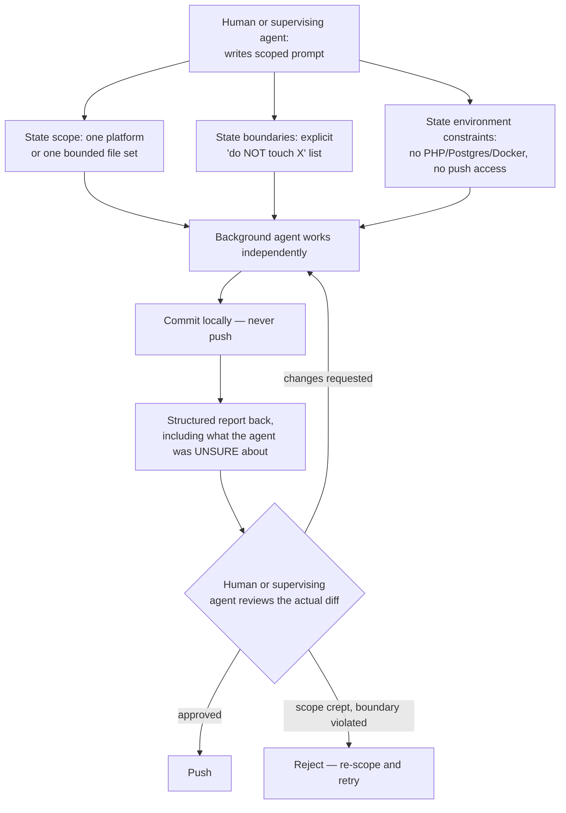
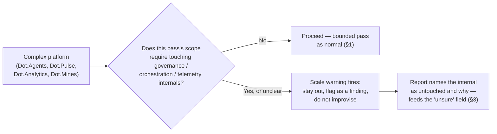

# 08 — Agent System

Purpose: to document, as working doctrine rather than theory, how AI agents actually operate as the engineering workforce of the Dot Ecosystem — the scoping pattern that let one owner direct real work across fifteen live platforms this session without losing the ability to review it. This is not a proposal for how agents *should* work; it is a record of the pattern that was used, that produced the real fixes catalogued in [02-Engineering-Loop.md](02-Engineering-Loop.md) and [17-Security.md](17-Security.md), and that is running again right now — five parallel background agents, including the one that wrote this document, are authoring the twenty files in this `os/` set concurrently, each scoped to its own file set, none touching another's.

> **Related documents:** [os/02-Engineering-Loop.md](02-Engineering-Loop.md) — the per-platform loop these agents execute inside · [os/07-Development-Standards.md](07-Development-Standards.md) — the coding standards agents are held to · [os/09-Business-Operating-System.md](09-Business-Operating-System.md) §4 — the three-tier decision model this document's review gate implements at the individual-agent level · [os/10-Owner-Control.md](10-Owner-Control.md) — the human-authority boundary this whole pattern exists to protect · [brain.agents.md](../brain.agents.md) — Dot.Brain's own internal agent colony (a different, narrower thing: agents operating *inside* the knowledge graph, not across platform codebases) · [MANIFESTO.md](../MANIFESTO.md) principle 2 — explainability is the test every agent report below is designed to pass.

---

## 1. The core pattern, stated plainly

An agent is given a **tightly-scoped prompt** covering exactly one platform (or, for this document set, exactly one small group of files), with three things stated up front, every time, without exception:

1. **The scope.** One platform, or one bounded file set. Not "improve the ecosystem" — "extend Dot.Tasks per the bounded checklist in 02-Engineering-Loop.md §5."
2. **Explicit "do NOT touch" boundaries.** Named files, directories, or subsystems the agent must leave alone, even if it notices something it could plausibly improve there. A scope with no stated boundary is not a scope.
3. **Explicit environment constraints.** Stated before the agent starts work, not discovered mid-task: no local PHP/Composer/Postgres/Docker (see [02-Engineering-Loop.md](02-Engineering-Loop.md) §2), no git push access without human confirmation, no ability to execute or test what it writes.

The agent then works independently: reads what it needs, writes the change, **commits locally, never pushes**, and reports back. It does not wait for mid-task check-ins — the check-in happens once, at the end of the bounded pass, not throughout it. That is what makes the pattern scale to twenty platforms without becoming twenty standing conversations.

*Nothing in this loop lets an agent's own confidence substitute for a human looking at the diff — see [10-Owner-Control.md](10-Owner-Control.md) for why that gate is non-negotiable.*

## 2. Why "commit, never push" is the load-bearing rule

A local commit is reversible, inspectable, and diffable before it has any external effect. A push is not something an agent should ever be the one to decide is ready — pushing is a judgment call about production risk, and per [09-Business-Operating-System.md](09-Business-Operating-System.md) §4, judgment calls are Tier 3, reserved for the owner. Separating "agent finishes work" from "work reaches the remote" is what makes it safe to let an agent work unsupervised for the duration of a bounded pass: the worst a misscoped or wrong agent run can do is produce a bad local commit, which costs nothing to discard.

This is also why GitHub push access in this ecosystem is deliberately gated on the owner's own SSH key rather than an agent-held credential — an agent that cannot push cannot cause an incident by pushing, no matter how confidently wrong it is.

## 3. The structured report, and why "unsure" is a required field

Every agent report back from a bounded pass follows the same shape, because a report a human cannot quickly triage is a report that gets rubber-stamped instead of reviewed — the opposite of the point:

- **What was done** — the actual change, in the terms of the checklist item it maps to (branding, tests, a specific security fix), not a restatement of the diff.
- **What was explicitly out of scope and left untouched** — confirms the boundary held.
- **What the agent was UNSURE about** — this is the field that matters most and the one a report is most tempted to skip. An agent that found a plausible authorization gap but wasn't confident the fix was complete, or that hand-authored a scaffold it could not verify boots, says so here explicitly, by name. Every real vulnerability found this session (cross-tenant Dot.Tasks access, the Dot.Emall stock race, Dot.Auction's reserve-price leak, Dot.Mines' missing tenant-scoping trait, Dot.Finance's IDOR-prone CRUD) was the kind of finding a rushed or self-certifying report would have buried; the "unsure" field exists specifically so those don't get lost between agent and human.
- **Test status** — written-but-unexecuted, per [07-Development-Standards.md](07-Development-Standards.md) §4, stated plainly rather than implied.

An agent report with an empty "unsure" section on a nontrivial pass is itself a signal worth double-checking, not a sign the pass went cleanly.

## 4. The scale-warning pattern for complex codebases

Some platforms are not "one bounded pass" simple — Dot.Agents (AI orchestration itself), Dot.Pulse (social graph + feed ranking), Dot.Analytics (the analytics computation core), and Dot.Mines (a mining ERP with real domain complexity: fleet, dispatch, safety compliance) each have internal subsystems that are easy to break in a way that isn't visible from a diff alone — governance rules, orchestration internals, telemetry pipelines, safety-compliance logic. For these, the scoping prompt adds a **scale warning**: an explicit instruction to stay out of the named internals entirely, even when the requested change looks adjacent to them, because understanding those internals well enough to touch them safely was never asked for and was not verified as part of this pass.

Concretely, this looked like: "Do not modify anything under `app/Orchestration/` in Dot.Agents — you have not been asked to understand agent-orchestration internals, and a plausible-looking change there is more dangerous than an obviously wrong one elsewhere." The warning is not a statement that the agent is incapable — it is a statement that the *pass* was never scoped to include the judgment required for that subsystem, and scope discipline (per [02-Engineering-Loop.md](02-Engineering-Loop.md) §5) means not improvising past it.

*The scale warning converts "this looks complex, I'll be careful" — an unverifiable promise — into "this is out of scope, I didn't touch it" — a checkable fact.*

## 5. What this pattern is not

- **It is not full autonomy.** [02-Engineering-Loop.md](02-Engineering-Loop.md) §1 already retracted the original "never ask permission" instruction for exactly this reason; this document is the agent-system-level statement of the same retraction.
- **It is not a claim that agents are interchangeable with a verified CI pipeline.** Nothing an agent writes in this environment has been executed — see [17-Security.md](17-Security.md) §3 for what that means for production readiness.
- **It is not a excuse to skip the boundary because "the agent seemed confident."** Confidence is not evidence; the diff is.

## 6. Self-referential note: this document set as a live example

The five documents in this `os/` set that this agent wrote — this one, [16-Disaster-Recovery.md](16-Disaster-Recovery.md), [17-Security.md](17-Security.md), [18-Platform-Lifecycle.md](18-Platform-Lifecycle.md), and [README.md](README.md) — were produced under exactly this pattern: a scoped prompt naming exactly these five files, an explicit instruction not to run any git command (another process commits all twenty-one files together to avoid concurrent-commit conflicts with four other agents writing different files in this same repository right now), and a requirement to report back honestly on anything uncertain (see the closing report of this session, and the Open Questions section below). The pattern documented itself while running.

## 7. Health signals

| Signal | What it would mean if it degraded |
|---|---|
| Every agent report includes a non-empty "what was done" / "what was left untouched" / "what I was unsure about" triad | A report missing the "unsure" field is a report optimized for looking finished, not for being reviewable |
| Zero agent-initiated pushes | If this ever becomes nonzero outside an explicitly re-delegated exception, the commit-never-push rule (§2) has been silently weakened |
| Scale-warning boundary violations | Should stay at zero; any violation is a Tier 3 finding for the owner, not a routine fix |
| Time from agent report to human diff review | Tracks the same baseline as [09-Business-Operating-System.md](09-Business-Operating-System.md) §7's vulnerability-to-sign-off metric — drift upward means review is becoming the bottleneck the pattern was built to avoid |

---

## Change Log

| Version | Date | Author | Change |
|---|---|---|---|
| 1.0.0 | 2026-08-01 | Background agent (os/ document set, session 1) | Initial doctrine, written from the real scoped-agent pattern used across 15 platforms and self-applied while authoring this document set |

## Open Questions

| Question | Owner |
|---|---|
| Should the structured report format in §3 be enforced by a template file (like [templates/incident-report.template.md](../templates/incident-report.template.md) in Dot.Brain) rather than left as prose convention? | Sakhile Bhayi |
| At what platform or agent-count does "the owner reviews every diff personally" (§1, §3) stop being viable, and what is the first reviewable delegation — a second reviewing agent with a narrower gate, not a second human — that could be introduced without weakening §1's non-negotiable review step? | Sakhile Bhayi |
| Should scale-warning subsystem lists (§4) be centralized per platform in [13-Engineering-State.md](13-Engineering-State.md) rather than re-specified in each scoping prompt, so they don't drift out of date as platforms grow? | Sakhile Bhayi |
