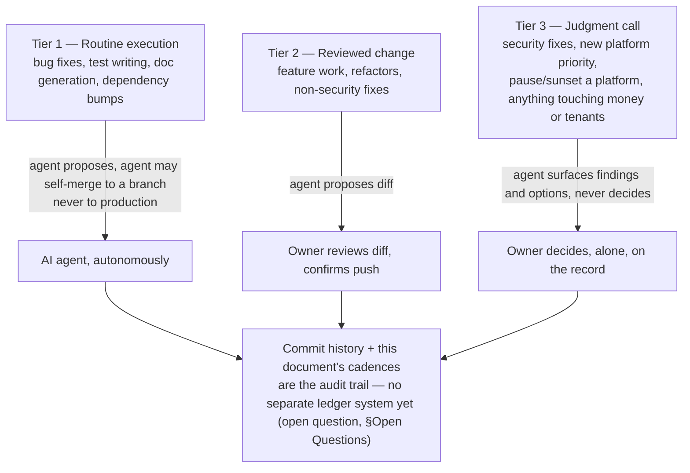

# 09 — Business Operating System

Purpose: to describe how the Dot Ecosystem actually runs day to day — what recurring cadences exist or should exist for reviewing platform health, revenue, security findings, and backlog; how decisions get made when there is exactly one owner and the execution workforce is AI agents; and what an "operating rhythm" looks like at this scale, deliberately sized for one person overseeing twenty AI-built platforms rather than borrowed from a 500-person company's OKR calendar.

> **Related documents:** [os/01-Executive-Vision.md](01-Executive-Vision.md) — the "why" this rhythm serves · [os/10-Owner-Control.md](10-Owner-Control.md) — the approval boundaries this rhythm operates inside · [os/20-Continuous-Evolution.md](20-Continuous-Evolution.md) — the platform-loop this rhythm schedules · [brain.operating_model.md](../brain.operating_model.md) — Dot.Brain's own internal operating model, one layer down, whose cadence table this document deliberately does not copy wholesale (see §5) · [brain.governance.md](../brain.governance.md) §7 — governance cadences specific to the brain · [MANIFESTO.md](../MANIFESTO.md).

---

## 1. The one-sentence model

**AI agents run the recurring execution; the owner runs the recurring judgment; nothing recurring survives without a place on the calendar it actually happens.** A cadence that exists only in a document and never on a real week is not a cadence — it is aspiration, and this document is explicitly scoped to avoid that failure mode: every ritual below is sized to fit inside the time one person actually has, not the time a document author wished they had.

## 2. Why normal OKR/exec cadences do not apply

A quarterly OKR cycle, a weekly all-hands, a monthly board deck — these exist to synchronize *many people* who would otherwise drift out of alignment. With one owner, there is no alignment problem to solve; there is a **coverage** problem (does every platform get looked at often enough that a regression is caught before a tenant finds it) and a **judgment** problem (does the owner spend their limited attention on the things only a human can decide). The operating rhythm below is built to solve those two problems specifically, and nothing else. Any cadence proposed for this ecosystem that doesn't map to coverage or judgment should be cut.

## 3. The operating cadences

| Cadence | What happens | Who does the work | What the owner actually reviews |
|---|---|---|---|
| **Per-platform loop** (event-driven, not calendar-driven) | Audit → fix → test → document → commit, one platform at a time (see [os/20-Continuous-Evolution.md](20-Continuous-Evolution.md)) | Background AI agent, end to end through "propose" | The diff, before push — every time, no exceptions (see [os/10-Owner-Control.md](10-Owner-Control.md) §2) |
| **Weekly platform health scan** | Automated check across all live platforms: failing tests, open security findings, deploy freshness, uncaught errors in logs | AI agent produces a single rendered summary, not raw logs | 10–15 minutes: does anything on the list need to jump the queue |
| **Weekly security digest** | Roll-up of any findings from the week's audit passes (severity, platform, fix status) — modeled on the real findings already produced this session (cross-tenant access, race conditions, IDOR, reserve-price leakage, tenant-scoping gaps) | Agent drafts the digest from commit history and audit notes | Anything unresolved above low severity gets the owner's explicit sign-off before it's considered closed |
| **Monthly revenue & platform-viability review** | For each live platform: is it earning, is it costing more attention than it returns, is it a candidate to pause or sunset | Agent prepares a one-page-per-platform snapshot (MRR/usage proxy if no revenue yet, support load, incident count) | The owner makes the keep/invest/pause call per platform — this is a judgment call, never automated |
| **Monthly backlog & next-platform review** | Which of the five remaining scaffolds (Dot.Plug, Dot.Farms, Dot.HR, Dot.Dopemine, Dot.Memory) is next, and what changed in priority since last month | Agent surfaces backlog state, dependency notes (e.g. Dot.Memory's relationship to Dot.Brain's own memory model), open questions from prior `os/` and `brain.*` documents | Owner sets the next platform's order — again explicitly a judgment call |
| **Quarterly ecosystem review** | Zoom out: is the 20-platform shape still right (see [os/01-Executive-Vision.md](01-Executive-Vision.md) §6 open question), is the brain's cross-platform recommendation flow actually producing value, is the owner-control model (§[os/10-Owner-Control.md](10-Owner-Control.md)) still fit for the current scale | Agent compiles metrics (platforms live, security findings closed vs. open, DKP packs ingested, PRs merged from the brain) | Full review — the only ritual on this table that reliably needs more than 30 minutes |

## 4. How decisions get made with one owner and an AI execution layer

There is no meeting, because there is no one to meet with. Decisions happen at three altitudes, and the altitude determines who decides:

*Three tiers, one deciding human at the top two — the structure that makes "one owner" survive twenty platforms without becoming a bottleneck on routine work or a blind spot on judgment calls.*

This mirrors, at business-operations scale, the same T1–T4 escalation discipline Dot.Brain applies internally to knowledge ([brain.governance.md](../brain.governance.md) §1) — the pattern recurs because it is the right shape for "agents propose, a human is accountable," not because the two documents were written to match each other.

## 5. Deliberate divergence from `brain.operating_model.md`

[brain.operating_model.md](../brain.operating_model.md) describes a nine-role human catalog (Executive Sponsor, Chief AI Engineer, Chief Knowledge Engineer, Security Officer, Ethics Officer, and so on) as Dot.Brain's *internal* governance framing — useful as a separation-of-concerns model for Dot.Brain's own documentation, and explicitly designed to still work if the ecosystem someday has more than one human in it. This document does not adopt that catalog as the real org chart, because there isn't one. Today, every one of those nine roles is the same person: Sakhile Bhayi. Where `brain.operating_model.md` says "Security Officer," read "the owner, wearing the security hat, on a Tuesday." The role catalog is not fiction — it is a naming convention that keeps Dot.Brain's internal documents coherent and future-proof — but this document is the one that says plainly: one human currently holds all nine roles, and the operating cadences above are sized for that reality, not for the nine-person team the role catalog could someday describe.

## 6. What "operating rhythm" is not

- It is not a promise that every cadence in §3 has already run on schedule since the ecosystem's founding — several are newly formalized by this document, having previously happened ad hoc during build sessions. Marking them here converts them from habit to commitment; the next quarterly review should audit adherence.
- It is not OKR theater. There are no quarterly objectives scored for their own sake. The monthly platform-viability review (§3) is the closest analog, and it is scoped to a real decision (keep/invest/pause), not a scorecard.
- It is not a substitute for the per-platform loop's own discipline — see [os/20-Continuous-Evolution.md](20-Continuous-Evolution.md) for that cycle in full.

## 7. Health signals

| Signal | What it would mean if it degraded |
|---|---|
| Weekly security digest produced every week, no gaps | If it stops, coverage is silently lapsing — this is the earliest warning of the operating system breaking down |
| Time from finding a vulnerability to owner sign-off on the fix | Should track the five real findings from this session (same-day to few-day turnaround) as the baseline; drift upward means review is becoming a bottleneck |
| Monthly backlog review actually changes the next-platform order at least sometimes | If it never changes anything, it is a rubber stamp and should be cut or replaced (same principle as `brain.operating_model.md` §7's rubber-stamp finding) |
| Quarterly ecosystem review produces at least one written decision (continue, adjust, or pause something ecosystem-wide) | A quarter with zero decisions recorded is a quarter the ritual didn't happen in substance, only in name |

---

## Change Log

| Version | Date | Author | Change |
|---|---|---|---|
| 1.0.0 | 2026-08-01 | Owner + AI (os/ document set, session 1) | Initial operating cadence set, formalizing ad hoc build-session practice into a standing rhythm |

## Open Questions

| Question | Owner |
|---|---|
| Should commit history remain the sole audit trail for Tier 2/3 decisions, or does the ecosystem need a lightweight decision log (a much smaller cousin of Dot.Brain's hash-chained ledger, [brain.governance.md](../brain.governance.md) §2) once platform count or decision volume grows? | Sakhile Bhayi |
| At what point does the monthly revenue review need real MRR/usage data pipelines (likely via Dot.Analytics) rather than manual snapshotting? | Sakhile Bhayi |
| Is quarterly the right interval for the ecosystem-wide review, or should it tighten to monthly until all 20 platforms are live? | Sakhile Bhayi |
