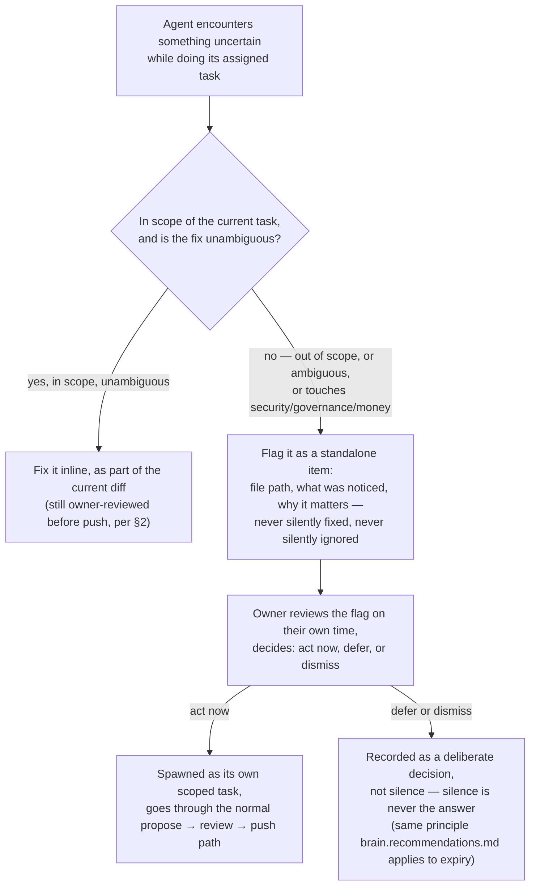

# 10 — Owner Control

Purpose: to make explicit and binding the control model that this session already used in practice — what the owner must personally approve versus what AI agents may do autonomously, what "the owner is the only one with GitHub push credentials" means operationally, who owns secrets and credentials, and the escalation path for when an agent finds something it is unsure about. This is not a new policy invented for the document; it is the standing policy, written down, from a pattern already exercised across every platform audited this session.

> **Related documents:** [os/01-Executive-Vision.md](01-Executive-Vision.md) — what this control model protects · [os/09-Business-Operating-System.md](09-Business-Operating-System.md) §4 — the tiered decision model this document specifies in full · [os/20-Continuous-Evolution.md](20-Continuous-Evolution.md) — the loop this control model gates · [brain.governance.md](../brain.governance.md) — Dot.Brain's internal decision-rights matrix and audit trail, the closest analog for a multi-agent knowledge system · [brain.security.md](../brain.security.md) — data classification and compliance controls the owner is accountable for · [MANIFESTO.md](../MANIFESTO.md) — principle 2 (explainable) and principle 4 (proposes, does not decide) are this document's foundation.

---

## 1. The one-sentence model

**AI agents propose; the owner disposes — and the one irreversible action in the entire ecosystem, pushing code to a shared branch or production, never happens without the owner personally confirming it.** Everything else in this document is detail underneath that sentence.

## 2. What the owner must personally approve

This list is not aspirational — it describes the pattern already used across all fifteen platforms audited this session, and is now binding standing policy for everything after it:

| Action | Why it requires the owner |
|---|---|
| Any `git push` to a shared branch or any deploy to production, on any platform | This is the one truly irreversible action available to the workflow (see §4) — history can be rewritten locally, but a push is public the instant it lands |
| Merging a fix for any security finding (e.g., the cross-tenant task access fix in Dot.Tasks, the checkout race condition in Dot.Emall, the IDOR hardening in Dot.Finance, the reserve-price leakage fix in Dot.Auction, the tenant-scoping fix in Dot.Mines) | Security fixes are exactly the class of change where a subtly wrong fix is worse than the original bug; the owner reviews the actual diff, not a summary of it |
| Any change to authentication, authorization, tenant-scoping, or billing logic, even outside a formal "security audit" | These are the categories where a bug is a breach or a bill, not an inconvenience |
| Any change to `MANIFESTO.md`, `CLAUDE.md`, ADRs, or this `os/` document set | Frozen-floor documents in Dot.Brain's own language ([brain.evolution.md](../brain.evolution.md) §1) — agents may propose changes here, never execute them |
| Committing or exposing anything touching credentials, API keys, or secrets, even accidentally | See §4 |
| Deciding to pause, sunset, or reprioritize a platform | A judgment call about resource allocation, not an execution task |
| Accepting a cross-platform recommendation that Dot.Brain proposes as a Pull Request into a platform's own codebase | Mirrors the ecosystem-wide rule that Dot.Brain proposes, platforms decide (MANIFESTO principle 4) — here, the platform's "decision" is the owner's, since there is no separate platform team |

## 3. What AI agents may do autonomously

Agents do not need permission to:

- Read any code, log, or document in the repositories they have access to.
- Run tests, linters, and static analysis.
- Draft fixes, tests, documentation, and audit findings on a local branch or in a background session.
- Propose a diff for owner review.
- Flag a concern for a separate, smaller task rather than fixing it inline (§5) — this itself requires no approval, because it changes nothing until the owner acts on the flag.

The boundary is precise: agents may do unlimited *work*, but zero *unreviewed, irreversible action*. Drafting a fix for the Dot.Auction reserve-price leakage required no permission; merging it did.

## 4. What "the owner is the only one with GitHub push credentials" means operationally

This is not a symbolic statement — it is the actual mechanism that makes §2 enforceable rather than aspirational:

- No AI agent, background session, or automation holds a GitHub personal access token, deploy key, or any credential capable of pushing to a remote branch on any Dot repository. Agents work in local worktrees or branches; the push step is a human action, full stop.
- This means the owner's review of a diff is not a formality that could theoretically be skipped by a misconfigured agent — it is a hard technical gate, not just a policy one. Even a fully autonomous, highly capable agent cannot ship a change the owner has not looked at, because it cannot reach the remote.
- The same logic extends to production deploy credentials, database credentials for production tenants, and payment-processor API keys (relevant to Dot.Billing, Dot.Finance, Dot.Emall): these live in the owner's own credential store, never in an agent's environment, and any agent needing to *reference* one (not use it) does so through environment variables the owner provisions per session, never through a value written into code, commit history, or a document.
- Multiple background agents may be drafting changes to multiple platforms concurrently (as during this session's 15-platform build-out) without risk of a race condition on production, precisely because none of them can independently reach production — the owner is the serialization point by construction, not by discipline alone.

## 5. Escalation: what an agent does when it's unsure

This mirrors the "flag rather than fix" pattern already used this session for governance-adjacent code in Dot.Agents and Dot.Pulse — where an agent noticed something outside the scope of its current task and, instead of quietly fixing it inline (which would hide a decision inside an unrelated diff), raised it as a separate, explicit item for the owner to see and choose whether to act on.

*The rule that makes this safe: an agent that is unsure never guesses inside someone else's diff — uncertainty always surfaces as a separate, visible item, never as a quiet judgment call buried in unrelated code.*

The two failure modes this guards against are symmetric and both real: an agent silently "fixing" something out of scope (which hides a decision the owner never got to make) and an agent silently ignoring something it noticed but wasn't asked about (which lets a real problem go unrecorded). Flagging is the only response that avoids both.

## 6. Credential and secrets ownership

- The owner is the sole holder of: GitHub push/admin credentials across all Dot repositories, production database credentials, payment-processor keys (Stripe or equivalent, relevant to Dot.Billing/Dot.Finance/Dot.Emall), and any third-party API keys used in production.
- Development and CI environments use scoped, revocable credentials distinct from production, provisioned by the owner per session or per environment — never the production credential reused for convenience.
- No credential is ever written into a commit, a document (including this one), or a Knowledge Pack. If an agent needs to reference that a credential exists or where it's configured, it references the environment variable name, never the value.
- If an agent ever encounters what looks like an exposed secret (in a log, a commit, a config file), that is an automatic Tier-3 flag under §5, treated with the same urgency as a security finding under §2 — never fixed silently, because "silently rotate a key an agent found" is itself a security-relevant action requiring the owner.

## 7. Why this model, not a lighter one

A lighter model — where agents could push directly, or where review was optional for "small" changes — was available and was deliberately not chosen. The reason is the same one that shows up in the real findings from this session: five real, exploitable vulnerabilities were found across fifteen platforms *during a deliberate audit pass*, which means the base rate of subtle security bugs in fast-moving code is not low enough to trust to an unreviewed pipeline. The cost of this model is owner time on every diff; the alternative cost is a tenant's data. That trade was made deliberately, and it does not get relaxed as the ecosystem scales — see the open question on whether it can hold at 20 platforms.

---

## Change Log

| Version | Date | Author | Change |
|---|---|---|---|
| 1.0.0 | 2026-08-01 | Owner + AI (os/ document set, session 1) | Codified the propose/review/push pattern already used across the 15-platform audit session as standing policy |

## Open Questions

| Question | Owner |
|---|---|
| Does the "owner reviews every diff before push" model remain viable once all 20 platforms are live and in maintenance, or does it need a tiered fast-path for low-risk, well-tested change classes (e.g., dependency bumps) without weakening §2's security-relevant list? | Sakhile Bhayi |
| Should flagged items (§5) get a formal tracking surface (issue tracker, or a Dot.Projects/Dot.Tasks board within the ecosystem itself) rather than living only in session transcripts? | Sakhile Bhayi |
| At what point, if ever, does a second trusted human get scoped (not full) push credentials — and what would have to be true first? | Sakhile Bhayi |
