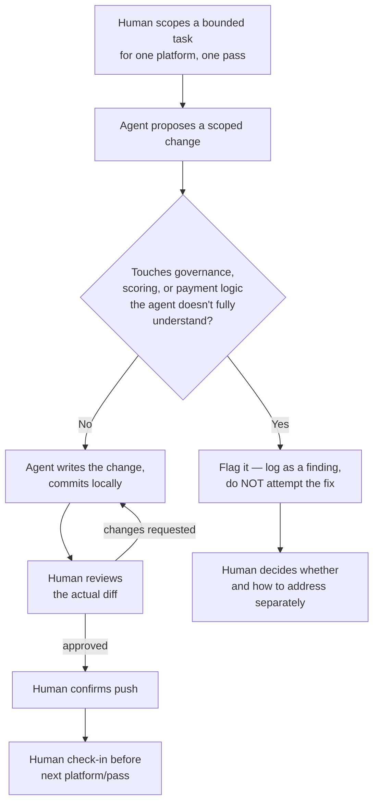
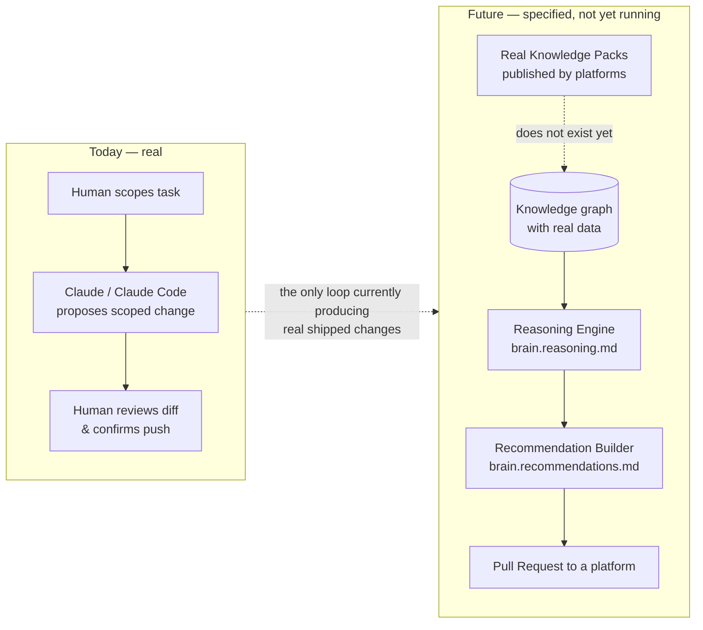

# 11 — How AI-Driven Decisions Actually Get Made

Purpose: an honest description of how AI actually drives decisions across the Dot Ecosystem today, as distinct from the automated "AI Decision Engine" that Dot.Brain's reasoning and recommendation machinery will become once real knowledge flows into it. Today's real decision loop is Claude, via Claude Code, doing scoped engineering work under direct human review — not an autonomous system making unsupervised calls. This document says so plainly, because Manifesto principle 2 ("if a human cannot understand why, it does not ship") applies to how this ecosystem describes itself, not only to what it recommends to platforms.

> **Related documents:** [os/04-Dot-Brain.md](04-Dot-Brain.md) · [os/02-Engineering-Loop.md](02-Engineering-Loop.md) — the loop this document's §2 restates at decision-altitude · [brain.reasoning.md](../brain.reasoning.md) — the future automated reasoning engine · [brain.recommendations.md](../brain.recommendations.md) — the future automated recommendation contract · [brain.dkp.md](../brain.dkp.md) — the data pipeline that must exist before either engine has anything real to reason over · [platforms/dot-agents.md](../platforms/dot-agents.md) §7 — the colony runtime contract's escalation bounds, the closest real analogue to a decision gate in this ecosystem today.

---

## 1. The honest headline

There is no live "AI Decision Engine" in the Dot Ecosystem today. There is Claude, operating through Claude Code, doing real engineering work across ~20 platform codebases, with every change subject to human review before it ships. The phrase "AI decision engine" describes a piece of *future* infrastructure — the automated layer [brain.reasoning.md](../brain.reasoning.md) and [brain.recommendations.md](../brain.recommendations.md) specify — that cannot function yet because it has nothing to reason over: zero real Knowledge Packs exist anywhere in the ecosystem (see [os/05-Knowledge-Protocol.md](05-Knowledge-Protocol.md) §4). Calling the current state an "AI decision engine" would overclaim; this document exists to stop that overclaim before it spreads into the wrong document.

## 2. The real decision loop, today

*The loop that actually ran across 15 real platforms this session — restated from [os/02-Engineering-Loop.md](02-Engineering-Loop.md) §4–6 at decision-altitude: every "decision" is a human confirming or rejecting a proposal, never an agent acting unsupervised.*

Three things about this loop are load-bearing, not incidental:

- **The agent proposes; it does not decide.** Every change that ships passes through an explicit human review of the actual diff, and an explicit human confirmation before push ([os/02-Engineering-Loop.md](02-Engineering-Loop.md) §6). No change in this ecosystem this session shipped without both steps.
- **Flagging, not fixing, is the correct move for anything the agent doesn't fully understand — and this happened repeatedly, not hypothetically.** Two concrete instances from this session:
  - **Dot.Agents' governance stack** — the colony runtime contract's escalation bounds ([platforms/dot-agents.md](../platforms/dot-agents.md) §7) govern how confidently an agent may act before a human must be looped in; changes that would touch those thresholds were treated as out of scope for a bounded engineering pass and left for dedicated governance review rather than adjusted inline.
  - **Dot.Central's AI-agent domain** — where the platform's own documented ingestion mismatch ([os/04-Dot-Brain.md](04-Dot-Brain.md) §4) meant the agent could not be confident it correctly understood what the "real" governance/scoring behavior was supposed to be; rather than guess and ship a fix against an uncertain spec, the mismatch was logged as a finding for a human to resolve.
- **This is a norm, not a one-off exception.** [os/02-Engineering-Loop.md](02-Engineering-Loop.md) §6 states it as mandatory, no exceptions, for anything security-adjacent — authorization, tenant scoping, payment or stock logic, any change touching a Policy. The real bugs found this session (cross-tenant task access in Dot.Tasks, the checkout stock race in Dot.Emall documented in [os/19-Knowledge-Packs.md](19-Knowledge-Packs.md) §2.4, reserve-price leakage in Dot.Auction, IDOR gaps in Dot.Finance) were found *because* a human was reviewing diffs — not because an agent self-certified its own governance judgment.

## 3. What "AI Decision Engine" will mean once it's real

[brain.reasoning.md](../brain.reasoning.md) and [brain.recommendations.md](../brain.recommendations.md) already specify, in full technical detail, what an automated decision layer over the knowledge graph should look like: a deterministic, rule-enumerated inference engine (seven permitted inference types, four forbidden ones — [brain.reasoning.md](../brain.reasoning.md) §3) that only ever produces a *recommendation asking for a decision*, never a decision itself ([brain.recommendations.md](../brain.recommendations.md) §1). Every conclusion it could produce requires a complete, machine-checked evidence chain before it can be shipped — "unexplainable ⇒ unshippable" is enforced at the object-serialization level, not by convention.

That specification is sound and does not need to be re-derived here. What it needs, and does not have, is **data**. Every inference type in [brain.reasoning.md](../brain.reasoning.md) §3 — aggregation, correlation, causal promotion, analogy transfer — operates over nodes and edges that only exist once real Knowledge Packs have been ingested. With zero packs published anywhere in the ecosystem, the Reasoning Engine has an empty graph to reason over, and the Recommendation Builder has nothing to build from. The two engines are correctly specified, fully idle, and will stay idle until [os/05-Knowledge-Protocol.md](05-Knowledge-Protocol.md) §5's first concrete step happens somewhere.

*Two separate systems, deliberately drawn apart: the loop on the left ships real code today; the loop on the right is fully specified infrastructure waiting on data that does not exist yet.*

## 4. Why the distinction matters

Conflating the two loops would be exactly the kind of unexplainable claim Manifesto principle 2 forbids: it would let this ecosystem describe itself as running an autonomous AI decision system when what is actually running is a human-in-the-loop engineering process, however AI-assisted. It would also set the wrong expectation for governance review — the Reasoning Engine's guardrails (causal bar, forbidden inferences, human sign-off on every causal promotion) are designed to govern *automated* graph inference; they say nothing about, and cannot substitute for, the human-review gate that actually governs today's engineering changes ([os/02-Engineering-Loop.md](02-Engineering-Loop.md) §6).

## 5. What would have to be true before this document's title stops being aspirational

In order, not all at once:

1. At least one platform completes real DKP onboarding and publishes a real, signed pack ([os/05-Knowledge-Protocol.md](05-Knowledge-Protocol.md) §5).
2. The graph has enough real nodes and edges for at least one inference type in [brain.reasoning.md](../brain.reasoning.md) §3 to run on real data, not the worked hypothetical (Dot.Mines/Kolomela) used throughout the technical spec.
3. A Recommendation Builder output reaches a real PR against a real platform repository, and a human decides it — accept, reject, or let it expire — for real.
4. That real outcome is ingested back and actually moves a trust score or calibration parameter ([brain.learning.md](../brain.learning.md) Loop A/B).

Until step 1 happens, everything in this section is a roadmap, not a system, and should be described as one.

---

## Change Log

| Version | Date | Author | Change |
|---|---|---|---|
| 1.0.0 | 2026-08-01 | Sakhile Bhayi | Initial honest account of the real human-reviewed engineering decision loop versus the specified-but-idle automated Reasoning/Recommendation engines; two concrete flagging examples (Dot.Agents governance stack, Dot.Central AI-agent domain mismatch) documented. |

## Open Questions

- Should "flag, don't fix" findings (like the two in §2) be tracked in a structured location visible across platforms, rather than left inside individual session commit messages and wiki.md roadmap notes? Currently there is no single index of them.
- Once step 1 in §5 happens for real, should this document be split — a permanent "how engineering decisions get made" doctrine (which will stay true regardless of DKP adoption) versus a "AI Decision Engine adoption status" tracker that updates as steps 2–4 land?
