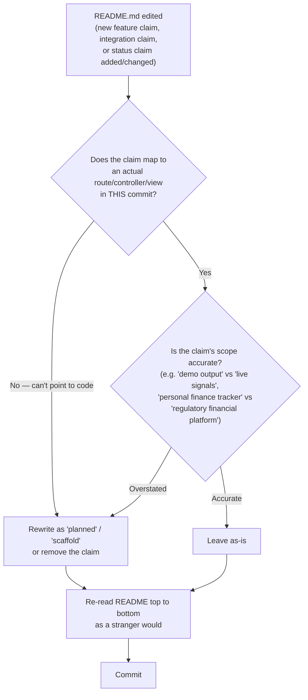

# 12 — README Automation

Purpose: to define a practical, honest convention for keeping every platform's `README.md` accurate, given that this session's audit pass found multiple platform READMEs describing features and integrations that did not exist in the actual code — and given that the environment this document set was written in has no CI runner and no local PHP available to verify anything automatically. This document proposes what is actually achievable now (a manual-review checklist, applied every time a README changes) and names what a future CI job would need, without pretending that job exists.

> **Related documents:** [01-Executive-Vision.md](01-Executive-Vision.md) · [14-Credit-Optimization.md](14-Credit-Optimization.md) — same discipline of not building automation you can't verify · [brain.governance.md](../brain.governance.md) · [platforms/dot-analytics.md](../platforms/dot-analytics.md) · [platforms/dot-ehail.md](../platforms/dot-ehail.md) · [platforms/dot-pulse.md](../platforms/dot-pulse.md) · [platforms/dot-charts.md](../platforms/dot-charts.md)

---

## 1. What actually happened this session

During the audit pass, multiple platform READMEs were found to describe functionality that did not exist in the corresponding codebase:

- **Dot.Analytics** — README described integrations and reporting capabilities beyond what the actual controllers/views implemented.
- **Dot.Ehail** — README described features not present in the live e-hailing entrepreneurship flow.
- **Dot.Pulse** — README described social/community capabilities ahead of the real implementation.
- **ChartSense (Dot.Charts)** — README implied production trading-signal capability where the real state is an early-stage tool with honestly-labeled demo output.
- Others surfaced smaller instances of the same pattern (a described endpoint that didn't exist, a claimed integration that was scaffolding only).

None of this was malicious — it is the predictable failure mode of README-writing happening ahead of or disconnected from the code it describes, especially across fifteen fast-moving platforms maintained by one operator directing AI agents. The fix applied this session was manual: read the actual code, correct the README to match, in each platform's own pass. That correction is not a standing process yet — it was a one-time cleanup. This document turns it into one.

## 2. Why "just add CI" is not an honest answer today

The obvious-sounding fix is "add a CI job that lints README claims against the codebase." That is the right target, but it is not achievable in the environment this document set was authored in:

- **No CI runner is available in this session's working environment.** There is nowhere to point a GitHub Actions-style job right now, so proposing one as if it already runs would repeat the exact failure this document exists to prevent — a claim ahead of the code.
- **No local PHP toolchain is available**, so even a locally-run static check against the Laravel codebases (route lists, controller method names, feature flags) cannot be executed from here to validate this document's own recommendations before writing them down.

So: this document proposes a **manual convention that works today with zero new infrastructure**, and names the **future CI job** as a distinct, clearly-labeled recommendation — not something claimed to exist.

## 3. The manual convention (usable today)

Applied by whoever (owner or agent) edits a platform's `README.md`, every time:

*A five-question mental pass, applied at edit time — cheap enough that "no CI" is not an excuse to skip it.*

Concretely, the checklist each editor applies before committing a README change:

1. **Every feature claim traces to a route/controller/view that exists in this commit.** If you can't name the file, don't make the claim.
2. **Every integration claim (payment processor, third-party API, another Dot platform) traces to actual code, not a `config/` placeholder or a commented-out stub.**
3. **Status words are accurate and specific.** "Live", "in production", "supports X" are claims of fact — reserve them for what is actually deployed and working. Use "planned", "scaffolded", "early-stage", or "demo output" (as this session did for ChartSense) when that is what the code actually is.
4. **Scope claims match retracted or narrowed vision, not the original brief.** The clearest failure mode this session found: a platform's README (or Dot.Brain's own docs) describing an earlier, larger vision — e.g. Dot.Finance as a regulatory financial-products platform — after the real build turned out to be a simpler personal finance tracker. When a platform's actual scope has been retracted or narrowed, the README must say what it is now, not what it was pitched as.
5. **Read it top to bottom as a stranger would**, immediately after editing — not from memory of what you meant to write. This is the single check that caught the most drift this session, because it's the only one that surfaces a claim that's individually true but collectively misleading.

This checklist is intentionally not a script. Nothing here needs a compiler, a test runner, or PHP — it needs the editor (owner or agent) to actually reread the file against the actual code before committing. That is why it is honest to call this "automation": it is a fixed, repeatable procedure, applied every time, not a one-off cleanup. It just runs in a human's or an agent's head rather than in CI.

## 4. The future CI job (recommended, not built)

Once a CI runner exists for these repositories, the following job is the natural upgrade path — named here so it is a tracked recommendation, not invented as if already running:

| Check | What it would do | Requires |
|---|---|---|
| Route/claim cross-reference | Extract feature nouns from README (e.g. "supports webhook retries") and confirm a matching route or class name exists | A lightweight parser + the Laravel route list (`php artisan route:list`) — needs local PHP, unavailable in this environment |
| Dead-link / dead-integration check | Flag any README reference to an env var, package, or service binding not present in `.env.example` / `composer.json` | PHP + Composer, unavailable here |
| Staleness flag | Fail if README's "last updated" claim is older than N commits touching `app/` without a corresponding README diff | Just `git`, no PHP needed — the most achievable near-term addition even without a full CI runner |
| Cross-platform terminology check | Confirm platform names, scope claims, and status words match the canonical entries in this repo's [indexes/GLOSSARY.md](../indexes/GLOSSARY.md) and the platform's own `platforms/<name>.md` | Text diff only, no PHP needed |

Of these four, the **staleness flag** and **terminology check** are achievable without PHP or a CI runner — they could run as a plain git pre-commit hook today, on this machine, without waiting for CI infrastructure. That is the recommended first increment, not the full route/claim cross-reference, which does require a working Laravel environment this session does not have.

## 5. Ownership

This convention applies per-platform, at README edit time, by whoever makes the edit — owner or agent. It is not a Dot.Brain responsibility (Dot.Brain does not edit platform-owned files, MANIFESTO principle 4) and it is not gated on the DKP prerequisite discussed in [03-Business-Automation.md](03-Business-Automation.md) — this is intra-repo hygiene, achievable today, independent of cross-platform automation.

---

## Change Log

| Version | Date | Author | Change |
|---|---|---|---|
| 1.0.0 | 2026-08-01 | Owner + AI (os/ document set, session 1) | Initial document; grounded in this session's audit-pass README corrections on Dot.Analytics, Dot.Ehail, Dot.Pulse, and ChartSense |

## Open Questions

| Question | Owner |
|---|---|
| Should the manual checklist (§3) be copy-pasted into each platform's own `CONTRIBUTING.md`, or does it stay centralized here and get linked? | Sakhile Bhayi |
| Is a git pre-commit hook (staleness flag, terminology check) worth building now, ahead of full CI, given it needs no PHP? | Sakhile Bhayi |
| Which platform should pilot the future CI job first once a runner exists — the one with the worst README-drift history (Dot.Analytics), or the newest platform, to get it right from day one? | Sakhile Bhayi |

