# 13 — Engineering State

Purpose: a living record of where each Dot platform stands against the [Engineering Loop](02-Engineering-Loop.md) — which have real Laravel/Jetstream code and have been through a bounded pass, which are still empty scaffolds, and which environment gaps remain open. This document is a snapshot in time, not a fixed spec — it must be updated as platforms move through the loop, as environment constraints change, and as gaps close. Treat any date on this document older than a few weeks as a signal to re-verify before relying on it.

> **Related documents:** [os/02-Engineering-Loop.md](02-Engineering-Loop.md) — the process that produced this state · [os/07-Development-Standards.md](07-Development-Standards.md) — standards applied during each pass · [os/06-Design-System.md](06-Design-System.md) — UI patterns applied during each pass · [brain.platforms.md](../brain.platforms.md) — the platform registry this document tracks against.

> **⚠️ Living document.** Update this file every time a platform completes a pass, a new platform is hand-authored, or an environment gap closes. Do not let this drift into an outdated snapshot presented as current state — that would itself violate the no-placeholder-content principle.

---

## 1. Status overview

```mermaid
flowchart LR
    subgraph Done["15 platforms — real app, through the loop"]
        direction TB
        D1[Dot.Analytics]
        D2[Dot.Pulse]
        D3[Dot.Mines]
        D4[Dot.Notify]
        D5[Dot.Billing]
        D6[Dot.Charts]
        D7[Dot.Emall]
        D8[Dot.Ehail]
        D9[Dot.Agents]
        D10[Dot.Auction]
        D11[Dot.Central]
        D12[Dot.Projects]
        D13[Dot.Tasks]
        D14[Dot.Design]
        D15[Dot.Finance]
    end
    subgraph Empty["5 platforms — empty scaffold, not yet started"]
        direction TB
        E1[Dot.Plug]
        E2[Dot.Farms]
        E3[Dot.HR]
        E4[Dot.Dopemine]
        E5[Dot.Memory]
    end
    Empty -->|next: hand-author,\nflag unverified| Done
```

Dot.Brain itself (this repository) is out of scope for this loop — it is the ecosystem's intelligence layer, not a Jetstream application, and is governed by its own [CLAUDE.md](../CLAUDE.md) instead.

## 2. Platforms with real code, through the loop (15)

Each has had at least one bounded pass per [02-Engineering-Loop.md](02-Engineering-Loop.md) §5 (branding, dark/light toggle, notification bell where a real trigger exists, Feature tests written-but-unexecuted, docs accuracy pass, one security/tech-debt scan). The note below each name is its standout finding from that pass, where a specific issue was identified and fixed; platforms with no specific finding noted had a clean scan at the time of their pass — that is a statement about what was checked, not a guarantee nothing remains.

| Platform | Standout finding this pass |
|---|---|
| **Dot.Tasks** | Cross-tenant task access — a controller path loaded tasks by ID without a Policy check against the current team; fixed with team-scoped Policy (see [07-Development-Standards.md](07-Development-Standards.md) §2). |
| **Dot.Emall** | Checkout stock race condition — concurrent checkouts could oversell limited stock; addressed with a locking/atomic-decrement fix at the stock-check step. |
| **Dot.Auction** | Reserve-price leakage — the reserve price was reachable by a bidder before the auction met it, undermining the auction mechanic; scoped the reserve price out of the bidder-facing payload. |
| **Dot.Mines** | Unenforced tenant-scoping trait — a shared scoping trait existed but was not applied on one model, leaving that resource unscoped; applied the trait consistently. |
| **Dot.Finance** | IDOR gaps — several finance record endpoints were reachable cross-user via ID guessing; closed with per-record Policies. |
| **Dot.Charts** | A feature ("ChartSense") presented a fixed demo "AI analysis" result as if it were live output; relabeled honestly as a demo rather than removed or left mislabeled (see [07-Development-Standards.md](07-Development-Standards.md) §3, the canonical example for this rule). |
| **Dot.Billing** | Missing invoice-access authorization — an invoice could be viewed by ID without checking it belonged to the requesting team; closed with a per-record Policy. |
| **Dot.Ehail** | Missing driver-profile authorization — the same class of gap as Dot.Billing, on driver-profile records; closed with a Policy. |
| **Dot.Agents** | Dead notification bell — the backend notification pipeline was fully built but nothing rendered it in the UI; wired up the existing data to a real bell component rather than building new backend logic. |
| **Dot.Notify** | No inbound webhook endpoint exists at all, despite the platform's purpose being webhook-driven notifications — flagged as a gap for a future pass, not fixed in this one (building the endpoint was out of this pass's bounded scope). |
| **Dot.Pulse** | Feed pagination was missing on the main social feed, effectively capping visible content; added standard pagination. |
| **Dot.Analytics** | A dead, duplicate API route registration existed (two routes resolving to the same handler); removed the duplicate. |
| **Dot.Projects** | Task assignment had no server-side check that the assignee actually belonged to the task's team — a client could assign a task to an arbitrary user ID; added the team-membership check. |
| **Dot.Central** | UI parity pass only — brought the mining-dispatch scaffold's UI up to the same bar as the rest of the ecosystem (branding, theme toggle, empty/loading states); no new security finding this pass. |
| **Dot.Design** | UI parity pass only — brought the design-token/component scaffold's UI up to the same bar, including rendering real color/spacing token values instead of raw text; no new security finding this pass. |

## 3. Empty scaffolds — not yet started (5)

These platforms have no existing Jetstream application to extend. Per [02-Engineering-Loop.md](02-Engineering-Loop.md) §4, when their first pass runs, an agent must **hand-author** a Jetstream Teams scaffold matching the other 15 repos' conventions, and that scaffold must be **explicitly flagged as unverified** in its commit/PR description — it cannot be run or tested in this environment.

| Platform | Status |
|---|---|
| **Dot.Plug** | Empty scaffold. Not started. |
| **Dot.Farms** | Empty scaffold. Not started. |
| **Dot.HR** | Empty scaffold. Not started. |
| **Dot.Dopemine** | Empty scaffold. Not started. |
| **Dot.Memory** | Empty scaffold. Not started. |

## 4. Known outstanding environment gaps

Two gaps are open as of this writing and should be tracked until closed:

1. **No local PHP, PostgreSQL, or Docker — nothing has been test-executed.** Every Feature test written across all 15 completed platforms, and everything that will be hand-authored for the 5 empty ones, has been written and reviewed but never run. CI or a real developer environment must execute the full test suite for each platform before any of this reaches production. This is not a one-time caveat — it applies to every future pass until the executing environment changes.
2. **Branch protection on Dot.Brain's `main` is being bypassed via admin override, not a real PR flow.** Commits to this repository are currently landing directly on `main` through an administrator bypass rather than going through pull-request review, which is the intended flow per [CLAUDE.md](../CLAUDE.md)'s non-negotiable rules on auditability. This should be corrected — either by routing future changes through actual PRs, or by explicitly documenting why the bypass is temporarily acceptable and for how long.

## 5. How to update this document

When a platform completes a pass: move it from §3 to §2 (if it was empty) or update its row in §2 with the new pass's standout finding. When an environment gap closes (e.g. CI is stood up, or PR flow is restored), move the corresponding item from §4 into the change log below with the date it closed, and remove it from the open list.

---

## Change Log

| Version | Date | Author | Change |
|---|---|---|---|
| 1.0.0 | 2026-08-01 | Sakhile Bhayi | Initial state snapshot — 15 platforms through the loop, 5 empty scaffolds, 2 open environment gaps. |

## Open Questions

- 13 of the 15 platforms had a specific, real finding fixed this pass; only Dot.Central and Dot.Design did not (both were UI-parity passes on an already-scaffolded domain, not fresh full scans). Should those two get a dedicated security pass rather than relying on their earlier scaffold-stage review? Recommend not assuming a clean UI pass means nothing security-relevant is there.
- What is the target date or trigger condition for closing the branch-protection bypass on Dot.Brain's `main` (§4, item 2)? Not yet decided — needs an owner and a deadline.
