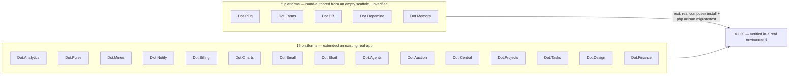

# 13 — Engineering State

Purpose: a living record of where each Dot platform stands against the [Engineering Loop](02-Engineering-Loop.md) — which platforms extended a real, already-installed Jetstream app versus which were hand-authored from an empty scaffold, and which environment gaps remain open. This document is a snapshot in time, not a fixed spec — it must be updated as platforms get further passes, as environment constraints change, and as gaps close. Treat any date on this document older than a few weeks as a signal to re-verify before relying on it.

> **Related documents:** [os/02-Engineering-Loop.md](02-Engineering-Loop.md) — the process that produced this state · [os/07-Development-Standards.md](07-Development-Standards.md) — standards applied during each pass · [os/06-Design-System.md](06-Design-System.md) — UI patterns applied during each pass · [brain.platforms.md](../brain.platforms.md) — the platform registry this document tracks against.

> **⚠️ Living document.** Update this file every time a platform completes a pass, a new platform is hand-authored, or an environment gap closes. Do not let this drift into an outdated snapshot presented as current state — that would itself violate the no-placeholder-content principle.

---

## 1. Status overview

All 20 Dot platforms now have real, committed code as of this update. **None of it has been executed** — every platform in both groups was written and reviewed without a local PHP/Postgres/Docker runtime; see §4. The distinction between the two groups is provenance, not quality: the 15 "extended" platforms started from a real `composer create-project`/`jetstream:install` output and had a domain added or polished on top; the 5 "hand-authored" platforms had their entire Jetstream Teams shell (auth, teams, 2FA, API tokens) copied file-by-file from Dot.Billing's already-real install and adapted, then given a from-scratch domain layer — a materially higher-risk path since no tool ever actually ran `jetstream:install` against these five.

Dot.Brain itself (this repository) is out of scope for this loop — it is the ecosystem's intelligence layer, not a Jetstream application, and is governed by its own [CLAUDE.md](../CLAUDE.md) instead.

## 2. Platforms extended from a real, already-installed Jetstream app (15)

Each has had at least one bounded pass per [02-Engineering-Loop.md](02-Engineering-Loop.md) §5 (branding, dark/light toggle, notification bell where a real trigger exists, Feature tests written-but-unexecuted, docs accuracy pass, one security/tech-debt scan). The note below each name is its standout finding from that pass, where a specific issue was identified and fixed; platforms with no specific finding noted had a clean scan at the time of their pass — that is a statement about what was checked, not a guarantee nothing remains.

| Platform | Standout finding this pass |
|---|---|
| **Dot.Tasks** | Cross-tenant task access — a controller path loaded tasks by ID without a Policy check against the current team; fixed with team-scoped Policy (see [07-Development-Standards.md](07-Development-Standards.md) §2). |
| **Dot.Emall** | Checkout stock race condition — concurrent checkouts could oversell limited stock; addressed with a locking/atomic-decrement fix at the stock-check step. |
| **Dot.Auction** | Reserve-price leakage — the reserve price was reachable by a bidder before the auction met it, undermining the auction mechanic; scoped the reserve price out of the bidder-facing payload. |
| **Dot.Mines** | Unenforced tenant-scoping trait — a shared scoping trait existed but was not applied on one model, leaving that resource unscoped; applied the trait consistently. |
| **Dot.Finance** | IDOR gaps — several finance record endpoints were reachable cross-user via ID guessing; closed with per-record Policies. |
| **Dot.Charts** | A feature ("ChartSense") presented a fixed demo "AI analysis" result as if it were live output; relabeled honestly as a demo rather than removed or left mislabeled (see [07-Development-Standards.md](07-Development-Standards.md) §3, the canonical example for this rule). |
| **Dot.Billing** | Missing invoice-access authorization — an invoice could be viewed by ID without checking it belonged to the requesting team; closed with a per-record Policy. |
| **Dot.Ehail** | Missing driver-profile authorization — the same class of gap as Dot.Billing, on driver-profile records; closed with a Policy. |
| **Dot.Agents** | Dead notification bell — the backend notification pipeline was fully built but nothing rendered it in the UI; wired up the existing data to a real bell component rather than building new backend logic. |
| **Dot.Notify** | No inbound webhook endpoint exists at all, despite the platform's purpose being webhook-driven notifications — flagged as a gap for a future pass, not fixed in this one (building the endpoint was out of this pass's bounded scope). |
| **Dot.Pulse** | Feed pagination was missing on the main social feed, effectively capping visible content; added standard pagination. |
| **Dot.Analytics** | A dead, duplicate API route registration existed (two routes resolving to the same handler); removed the duplicate. |
| **Dot.Projects** | Task assignment had no server-side check that the assignee actually belonged to the task's team — a client could assign a task to an arbitrary user ID; added the team-membership check. |
| **Dot.Central** | UI parity pass only — brought the mining-dispatch scaffold's UI up to the same bar as the rest of the ecosystem (branding, theme toggle, empty/loading states); no new security finding this pass. |
| **Dot.Design** | UI parity pass only — brought the design-token/component scaffold's UI up to the same bar, including rendering real color/spacing token values instead of raw text; no new security finding this pass. |

## 3. Platforms hand-authored from an empty scaffold (5)

Per [02-Engineering-Loop.md](02-Engineering-Loop.md) §4, each was built by copying the real, already-verified Jetstream Teams shell from Dot.Billing file-by-file (auth, teams, 2FA, API tokens, profile — never re-invented from memory), then adding a from-scratch domain layer. Every one is **explicitly flagged as unverified** in its own commit message and `wiki.md` — none has been installed, migrated, or test-executed.

| Platform | Domain built | Standout characteristic |
|---|---|---|
| **Dot.Memory** | Storage-tier/index/retrieval-class/retrieval-observation/durability-outcome telemetry models | "Store without reading" enforced structurally — every column across all 5 tables is a number, enum, or timestamp, no content-shaped field is possible, backed by a dedicated regression test (`StoreWithoutReadingInvariantTest`) that scans `$fillable` for forbidden fragments. |
| **Dot.Plug** | Extension/ExtensionVersion/Installation marketplace | Certification gate enforced before install (`abort_if($extension->status !== 'certified', ...)`); correctly team-scoped install/uninstall. |
| **Dot.HR** | Position/Employee/LeaveRequest | Built with authorization from the first commit, not audited-in later — but a docblock initially overclaimed role-gating beyond team-membership that didn't actually exist in the code; caught in review and corrected (see [17-Security.md](17-Security.md) §2 pattern: no-placeholder-content applies to code comments too, not just UI). Real remaining gap: any team member, not just an admin, can mutate employee records today. |
| **Dot.Dopemine** | Mechanic/MechanicDeployment/ProhibitedMetricPattern catalog | The ecosystem's manifesto-mandated ethics constraint (never optimize for addiction/screen-time) enforced at three independent layers: a closed PHP enum with no loss-framed case possible, an action-level acid-test check, and a model `saving` listener backstop that holds even against direct mass assignment. Verified line-by-line against its own claims before push. |
| **Dot.Farms** | Farm/Field/Crop/CropCycle/PlantingRecord/HarvestRecord | `FarmPolicy` modeled directly on Dot.Billing's fix; verified every child-resource controller (Field, CropCycle, PlantingRecord, HarvestRecord) resolves back to the owning Farm and authorizes against it — the one resource without by-ID routes (Crop) was confirmed to have no cross-team access surface at all. |

## 4. Known outstanding environment gaps

Two gaps are open as of this writing and should be tracked until closed:

1. **No local PHP, PostgreSQL, or Docker — nothing has been test-executed, across all 20 platforms.** Every Feature test written, every migration, and — for the 5 hand-authored platforms — the entire Jetstream install itself, has been written and reviewed but never run. CI or a real developer environment must execute `composer install && php artisan migrate && php artisan test` for each platform before any of this reaches production. This is not a one-time caveat — it applies to every future pass until the executing environment changes, and it is a strictly bigger risk for the 5 hand-authored platforms in §3 than for the 15 in §2.
2. **Branch protection on Dot.Brain's `main` is being bypassed via admin override, not a real PR flow.** Commits to this repository are currently landing directly on `main` through an administrator bypass rather than going through pull-request review, which is the intended flow per [CLAUDE.md](../CLAUDE.md)'s non-negotiable rules on auditability. This should be corrected — either by routing future changes through actual PRs, or by explicitly documenting why the bypass is temporarily acceptable and for how long.

## 5. How to update this document

All 20 platforms now have code; there is no longer an "empty" category to promote platforms out of. Going forward: when a platform gets a further pass, update its row in §2 or §3 with the new finding. When §4's environment gaps close, move the corresponding item into the change log below with the date it closed, and remove it from the open list. If a 21st platform is ever added to the ecosystem, give it its own row in whichever of §2/§3 fits once it has code, per the pattern already established here.

---

## Change Log

| Version | Date | Author | Change |
|---|---|---|---|
| 1.0.0 | 2026-08-01 | Sakhile Bhayi | Initial state snapshot — 15 platforms through the loop, 5 empty scaffolds, 2 open environment gaps. |
| 2.0.0 | 2026-08-01 | Sakhile Bhayi | All 5 previously-empty platforms (Dot.Plug, Dot.Farms, Dot.HR, Dot.Dopemine, Dot.Memory) hand-authored and pushed. §3 rewritten from "not started" to a completion table with each platform's standout characteristic. All 20 Dot platforms now have real code; the "empty scaffold" category no longer exists. |

## Open Questions

- 13 of the 15 §2 platforms had a specific, real finding fixed this pass; Dot.Central and Dot.Design did not (both were UI-parity passes on an already-scaffolded domain, not fresh full scans). Should those two get a dedicated security pass rather than relying on their earlier scaffold-stage review? Recommend not assuming a clean UI pass means nothing security-relevant is there.
- Dot.HR's real remaining gap (any team member can mutate employee records, not just an admin) is the most concrete, actionable finding to come out of the 5 hand-authored platforms — should it be prioritized over the Central/Design re-scan above? Both are real gaps in different platforms; no ranking has been decided yet.
- What is the target date or trigger condition for closing the branch-protection bypass on Dot.Brain's `main` (§4, item 2)? Not yet decided — needs an owner and a deadline.
- The 5 hand-authored platforms have never had `composer install` run against their copied `composer.lock` — several agents flagged this as likely stale relative to the edited `composer.json` `name` field. This should be the very first verification step once a real PHP/Composer environment is available, before anything else in §4 item 1.
