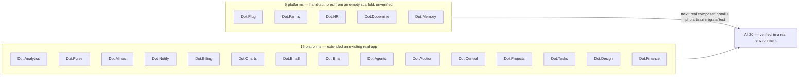

# 13 — Engineering State

Purpose: a living record of where each Dot platform stands against the [Engineering Loop](02-Engineering-Loop.md) — which platforms extended a real, already-installed Jetstream app versus which were hand-authored from an empty scaffold, and which environment gaps remain open. This document is a snapshot in time, not a fixed spec — it must be updated as platforms get further passes, as environment constraints change, and as gaps close. Treat any date on this document older than a few weeks as a signal to re-verify before relying on it.

> **Related documents:** [os/02-Engineering-Loop.md](02-Engineering-Loop.md) — the process that produced this state · [os/07-Development-Standards.md](07-Development-Standards.md) — standards applied during each pass · [os/06-Design-System.md](06-Design-System.md) — UI patterns applied during each pass · [brain.platforms.md](../brain.platforms.md) — the platform registry this document tracks against.

> **⚠️ Living document.** Update this file every time a platform completes a pass, a new platform is hand-authored, or an environment gap closes. Do not let this drift into an outdated snapshot presented as current state — that would itself violate the no-placeholder-content principle.

---

## 1. Status overview

All 20 Dot platforms now have real, committed code as of this update. **None of it has been executed** — every platform in both groups was written and reviewed without a local PHP/Postgres/Docker runtime; see §4. The distinction between the two groups is provenance, not quality: the 15 "extended" platforms started from a real `composer create-project`/`jetstream:install` output and had a domain added or polished on top; the 5 "hand-authored" platforms had their entire Jetstream Teams shell (auth, teams, 2FA, API tokens) copied file-by-file from Dot.Billing's already-real install and adapted, then given a from-scratch domain layer — a materially higher-risk path since no tool ever actually ran `jetstream:install` against these five.

Dot.Brain itself (this repository) is out of scope for this loop — it is the ecosystem's intelligence layer, not a Jetstream application, and is governed by its own [CLAUDE.md](../CLAUDE.md) instead.

## 2. Platforms extended from a real, already-installed Jetstream app (15)

Each has had at least one bounded pass per [02-Engineering-Loop.md](02-Engineering-Loop.md) §5 (branding, dark/light toggle, notification bell where a real trigger exists, Feature tests written-but-unexecuted, docs accuracy pass, one security/tech-debt scan). The note below each name is its standout finding from that pass, where a specific issue was identified and fixed; platforms with no specific finding noted had a clean scan at the time of their pass — that is a statement about what was checked, not a guarantee nothing remains.

| Platform | Pass 1 finding | Pass 2 finding |
|---|---|---|
| **Dot.Tasks** | Cross-tenant task access — a controller path loaded tasks by ID without a Policy check against the current team; fixed with team-scoped Policy. | Re-verified: prior fix intact; spot-checked every other component for the same pattern — none found. Clean. |
| **Dot.Emall** | Checkout stock race condition — concurrent checkouts could oversell limited stock; fixed with locking/atomic-decrement. | Dispatched the platform's first real domain event (`OrderPlaced`) from the checkout flow — previously purely conceptual. |
| **Dot.Auction** | Reserve-price leakage — reachable by a bidder before the auction met it; scoped out of the bidder-facing payload (hardened via `$hidden`). | Investigated the missing real-time bid-update wiring; found it's bigger than it looked (broadcasting never bootstrapped server-side at all) — correctly declined a partial fix, flagged as a follow-up task instead. |
| **Dot.Mines** | Unenforced tenant-scoping trait on one model; applied consistently. | Found and fixed a **second, actually-reachable** cross-tenant leak: a user belonging to no team could hit an unscoped `Model::all()` fallback in `ReportController::view2()`, exposing every team's data. Also confirmed a pre-existing Tailwind v4/PostCSS build mismatch, flagged (not fixed — touches the whole build pipeline). |
| **Dot.Finance** | IDOR gaps across finance endpoints; closed with per-record Policies. | Re-verified fixes intact (no Livewire in this app, so the IDOR-via-Livewire-argument pattern doesn't apply); generated the missing `AiInsight` model, replacing a hardcoded `0` with a real (honestly-still-zero) query. |
| **Dot.Charts** | Fixed "AI analysis" demo output was presented as live; relabeled honestly. | Reviewed — nothing else bounded to fix at current maturity; correctly declined to invent work. |
| **Dot.Billing** | Missing invoice-access authorization; closed with a Policy. | Found and fixed a real dead-code bug: wrong config key (`services.anthropic.key` vs. the real `services.anthropic.api_key`) silently disabled the AI spend-insights feature since it was written, with no error surfaced. |
| **Dot.Ehail** | Missing driver-profile authorization; closed with a Policy. | Wired a fully-built `RideCompletedNotification` to a real trigger (ride status → completed) — it existed but nothing had ever called it. |
| **Dot.Agents** | Dead notification bell — fully-built backend, nothing rendered it; wired up. | **Deep security pass on the governance stack (closing the S=1 gap):** found and fixed a real cross-org IDOR — two Livewire components (`ApprovalQueue`, `KnowledgeManager`) looked up records by unchecksummed method arguments, letting any authenticated user read another organization's approval details and knowledge-base content. Delusion-risk scoring, approval-workflow server-side checks, the digital immune system, and the prompt-injection guard all checked out clean. |
| **Dot.Notify** | No inbound webhook endpoint existed at all; flagged, not fixed. | **Built it.** HMAC-SHA256 signature verification, timing-safe comparison, identical generic 401 for unknown-token vs. bad-signature (no enumeration oracle), rate-limited, routes into the existing notification pipeline. |
| **Dot.Pulse** | Feed pagination was missing; added. | **Deep security pass on the moderation pipeline (closing the S=1 gap):** found and fixed a real cross-tenant IDOR across 6 entry points (web, API, Livewire) exposing private-community posts to any authenticated user, plus a moderation fail-open where permanently-failed AI jobs auto-published unmoderated content. Two deeper issues flagged, not fixed: no tenant scoping on the (currently unused) knowledge-graph tables, and a fail-open path inside the moderation service itself on unparseable AI responses. |
| **Dot.Analytics** | Dead duplicate API route removed. | **Deep security pass on the intelligence engines (closing the S=1 gap):** cross-tenant isolation across the 17-engine service, knowledge graph, Business DNA profiling, and reports/briefings all confirmed clean — every query is team-scoped. One real bug found in a more mundane spot: the feature-flags API leaked other teams'/users' IDs to any authenticated user; fixed with role-based field visibility. |
| **Dot.Projects** | Task assignment had no server-side team-membership check; fixed. | Wired the milestone/project status-transition events (`MilestoneReached`, `ProjectClosed`) that existed as enums but were never dispatched. |
| **Dot.Central** | UI parity pass only; no fresh security scan. | **AI-agent domain security review (closing the S=1 gap):** conversation/message/usage-log isolation, the IDOR-via-Livewire-argument pattern, and response caching all checked out clean — genuinely clean, not just "not yet checked." |
| **Dot.Design** | UI parity pass only; no fresh security scan. | **AI canvas-domain security review (closing the S=1 gap):** safe by omission — no per-ID routes/controllers exist yet for Project/Canvas/Asset, so there's no reachable IDOR surface today. Documented for whoever builds that surface next, since it's not tenant-scoped and needs ownership checks from day one. |

## 3. Platforms hand-authored from an empty scaffold (5)

Per [02-Engineering-Loop.md](02-Engineering-Loop.md) §4, each was built by copying the real, already-verified Jetstream Teams shell from Dot.Billing file-by-file (auth, teams, 2FA, API tokens, profile — never re-invented from memory), then adding a from-scratch domain layer. Every one is **explicitly flagged as unverified** in its own commit message and `wiki.md` — none has been installed, migrated, or test-executed.

| Platform | Domain built | Pass 1 characteristic | Pass 2 finding |
|---|---|---|---|
| **Dot.Memory** | Storage-tier/index/retrieval-class/retrieval-observation/durability-outcome telemetry models | "Store without reading" enforced structurally — every column across all 5 tables is a number, enum, or timestamp; backed by `StoreWithoutReadingInvariantTest`. | Re-verified both the access model (correctly ecosystem-wide, not team-scoped) and the invariant — still fully intact. Found and fixed a real UX gap: two real pages (Index Inventory, Durability Outcomes) had no navigation links, reachable only by hand-typing the URL. |
| **Dot.Plug** | Extension/ExtensionVersion/Installation marketplace | Certification gate enforced before install; correctly team-scoped install/uninstall. | Found and fixed a real IDOR: draft/decertified extension listings were readable by any team via direct ID, bypassing the marketplace index's own status filter. |
| **Dot.HR** | Position/Employee/LeaveRequest | Authorization built in from the first commit — but any team member, not just an admin, could mutate employee records. Flagged as the ecosystem's top-priority gap. | **Closed.** `create`/`update`/`delete` on Employee/LeaveRequest/Position now require the team's `admin` role or ownership; `view` stays open team-wide. (The dedicated agent for this hit a session limit mid-task; recovered and completed manually, including the test suite it hadn't finished writing.) |
| **Dot.Dopemine** | Mechanic/MechanicDeployment/ProhibitedMetricPattern catalog | The manifesto's ethics constraint enforced at three structural layers (closed enum, action-level check, model `saving` listener). | Re-verified all three layers still fully intact and unweakened. Found and closed a real test-coverage gap: `MechanicDeployment` tenancy was correctly enforced in code but had no regression test — added one. |
| **Dot.Farms** | Farm/Field/Crop/CropCycle/PlantingRecord/HarvestRecord | `FarmPolicy` verified across every child-resource controller; the one by-ID-route-free resource (Crop) confirmed to have no cross-team surface. | Re-verified — `FarmPolicy` coverage still complete and unweakened across all 6 controllers. Clean. |

## 4. Known outstanding environment gaps

Two gaps are open as of this writing and should be tracked until closed:

1. **No local PHP, PostgreSQL, or Docker — nothing has been test-executed, across all 20 platforms.** Every Feature test written, every migration, and — for the 5 hand-authored platforms — the entire Jetstream install itself, has been written and reviewed but never run. CI or a real developer environment must execute `composer install && php artisan migrate && php artisan test` for each platform before any of this reaches production. This is not a one-time caveat — it applies to every future pass until the executing environment changes, and it is a strictly bigger risk for the 5 hand-authored platforms in §3 than for the 15 in §2.
2. **Branch protection on Dot.Brain's `main` is being bypassed via admin override, not a real PR flow.** Commits to this repository are currently landing directly on `main` through an administrator bypass rather than going through pull-request review, which is the intended flow per [CLAUDE.md](../CLAUDE.md)'s non-negotiable rules on auditability. This should be corrected — either by routing future changes through actual PRs, or by explicitly documenting why the bypass is temporarily acceptable and for how long.

## 5. How to update this document

All 20 platforms now have code; there is no longer an "empty" category to promote platforms out of. Going forward: when a platform gets a further pass, update its row in §2 or §3 with the new finding. When §4's environment gaps close, move the corresponding item into the change log below with the date it closed, and remove it from the open list. If a 21st platform is ever added to the ecosystem, give it its own row in whichever of §2/§3 fits once it has code, per the pattern already established here.

---

## Change Log

| Version | Date | Author | Change |
|---|---|---|---|
| 1.0.0 | 2026-08-01 | Sakhile Bhayi | Initial state snapshot — 15 platforms through the loop, 5 empty scaffolds, 2 open environment gaps. |
| 2.0.0 | 2026-08-01 | Sakhile Bhayi | All 5 previously-empty platforms (Dot.Plug, Dot.Farms, Dot.HR, Dot.Dopemine, Dot.Memory) hand-authored and pushed. §3 rewritten from "not started" to a completion table with each platform's standout characteristic. All 20 Dot platforms now have real code; the "empty scaffold" category no longer exists. |
| 3.0.0 | 2026-08-02 | Sakhile Bhayi | **Second pass across all 20 platforms**, run in 4 batches with periodic check-ins. §2/§3 tables restructured to show pass-1 vs. pass-2 findings side by side. Found and fixed **8 more real bugs**, including two serious cross-tenant/cross-org IDOR vulnerabilities (Dot.Agents' governance stack, Dot.Pulse's private communities) and a second, actually-reachable cross-tenant leak in mines (distinct from pass 1's fix). Closed the `S=1` gap on all 5 previously-fenced-off platforms (Dot.Agents, Dot.Pulse, Dot.Analytics, Dot.Central, Dot.Design) with a dedicated deep pass on exactly the internals pass 1 declined to touch. Closed Dot.HR's top-priority role-gating gap. Dot.Auction and ChartSense correctly declined to force a fix where investigation showed the real gap was bigger than it looked, or nothing bounded existed. |

## Open Questions

- **Resolved:** the Central/Design re-scan question from v2.0.0 — both got a dedicated pass this round; both are clean.
- **Resolved:** Dot.HR's role-gating gap — closed this round.
- What is the target date or trigger condition for closing the branch-protection bypass on Dot.Brain's `main` (§4, item 2)? Not yet decided — needs an owner and a deadline.
- The 5 hand-authored platforms have never had `composer install` run against their copied `composer.lock` — this should be the very first verification step once a real PHP/Composer environment is available, before anything else in §4 item 1.
- Dot.Pulse's two deep-pass findings that were flagged but not fixed (knowledge-graph tenant scoping, moderation-service fail-open on unparseable AI responses) and Dot.Auction's full broadcasting gap (Reverb never bootstrapped server-side) are the highest-value named follow-ups now that the broader sweep is done — should one of these be the next dedicated pass?
