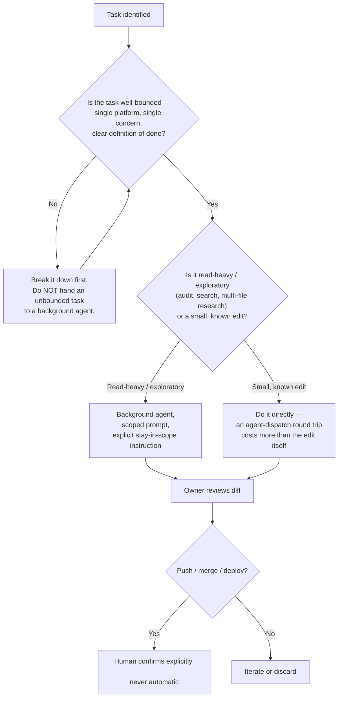

# 14 — Credit Optimization

Purpose: to document the cost-discipline pattern this operator actually used to build fifteen platforms with AI agents as the primary engineering workforce — bounded-scope background agents, one platform per pass, explicit "stay in scope" instructions, and human review before expensive or irreversible actions — as a standing convention, not a one-session accident. "Credit" here means AI/compute spend (agent sessions, tokens, background-agent runtime), never financial credit or lending — that retracted scope belongs to Dot.Finance's earlier vision, not this document.

> **Related documents:** [01-Executive-Vision.md](01-Executive-Vision.md) · [10-Owner-Control.md](10-Owner-Control.md) — the human-review gate this document's discipline feeds into · [03-Business-Automation.md](03-Business-Automation.md) · [brain.agents.md](../brain.agents.md) · [platforms/dot-finance.md](../platforms/dot-finance.md) — note on the retracted financial-products scope this document is explicitly NOT about

---

## 1. Naming the confusion this document exists to prevent

"Credit optimization" reads, at first glance, like it belongs to Dot.Finance — the platform whose original vision was a regulatory financial-products system, later retracted in favor of what the real code turned out to be: a personal finance tracker. It is not that. This document is about a completely different resource: **the AI/compute budget a solo operator spends running agents to do the engineering work**, and how to spend it well. Anywhere this document says "credit," read "agent session, token spend, or background-agent runtime" — never "line of credit" or "loan."

## 2. What this session's working pattern actually was

Across the fifteen-platform build-out, the pattern was consistent and deliberate:

- **One platform per pass.** Each background agent was scoped to a single platform's audit, fix, or build task — never "go audit the whole ecosystem." A pass on Dot.Auction did not also touch Dot.Emall, even where the two share obvious structural similarity (both handle bidding/checkout logic).
- **Explicit "stay in scope" instructions in every agent prompt.** Agents were told directly not to expand into adjacent files, adjacent platforms, or adjacent concerns beyond the task at hand — because unbounded agents are the single biggest cost-and-risk multiplier available in this workflow.
- **Bounded scope over the full master-loop spec.** Dot.Brain's own documentation describes an aspirational continuous platform-loop (audit → fix → test → document → commit, running indefinitely, ecosystem-wide). This session deliberately did **not** attempt that unbounded version. It ran bounded, single-platform passes instead — precisely because an unbounded loop against an ecosystem this size, with no prior audit baseline, is not something a solo operator can review carefully enough to trust. Bounding scope was the cost-control decision, not an oversight.
- **Human review before expensive or irreversible actions.** Nothing was pushed, merged, or deployed without the owner reviewing the diff first. Background agents propose; the owner decides. This is the same gate documented as standing policy in [10-Owner-Control.md](10-Owner-Control.md) — this document names why it is also a cost-discipline pattern, not only a governance one: a bad push that has to be reverted costs more (in agent-time to diagnose and fix, in trust, in risk) than the review step ever costs.

## 3. Why this is a cost-discipline pattern, not just a safety one

| Discipline applied | Cost risk it actually prevents |
|---|---|
| One platform per pass | An agent "helpfully" touching a second, unrelated platform doubles the diff to review and the blast radius of a mistake, for work nobody asked for |
| Explicit scope boundary in the prompt | Agents left to infer scope tend to over-explore — reading far more of the codebase than the task needs, which is where token spend actually goes on long sessions |
| Bounded passes over the unbounded master-loop | An unbounded loop compounds errors silently across many platforms before a human ever looks — the cost of the eventual cleanup pass dwarfs the cost saved by not stopping to review sooner |
| Human review before push | Reverting a bad merge costs a full re-diagnosis pass; catching it at review costs one read of a diff |

The throughline: **the expensive failure mode in this workflow is not "the agent used too many tokens on one task." It's "an under-scoped agent did unreviewed, unwanted work that then needs a second, more expensive pass to find and undo."** Every element of §2's pattern is aimed at that failure mode specifically.

## 4. When to use a background agent vs. do something directly

*The decision that actually saves cost is the top one — refusing to dispatch an unbounded task — not the bottom one, which is a safety gate that happens to also be a cost gate (§3).*

Practical rule of thumb used this session: if the task can be described in one sentence with a single named platform and a single named outcome ("audit Dot.Auction's bidding flow for tenant-isolation bugs"), it is background-agent-shaped. If it needs "and also check the related platforms" or "and then decide what else needs fixing," it is not yet bounded enough to dispatch — narrow it first.

## 5. What this document is not proposing

This is not a formal budget, a token-metering dashboard, or a cost-tracking tool — none of that exists today and building it would itself be exactly the kind of scope creep §2–3 warn against. This document names the pattern that was already followed, so it persists as a deliberate convention on the next fifteen platforms (and the five remaining scaffolds) rather than being quietly abandoned once nobody remembers why it mattered.

---

## Change Log

| Version | Date | Author | Change |
|---|---|---|---|
| 1.0.0 | 2026-08-01 | Owner + AI (os/ document set, session 1) | Initial document; codifies the bounded-scope, one-platform-per-pass pattern actually used across the 15-platform build-out |

## Open Questions

| Question | Owner |
|---|---|
| Is there value in lightweight, manual cost logging (which passes were expensive, which were cheap) before building any tooling for it? | Sakhile Bhayi |
| At what point (if any) does the five-platform scaffold build-out (Plug, Farms, HR, Dopemine, Memory) justify relaxing the one-platform-per-pass rule, e.g. batching genuinely near-identical scaffold setup? | Sakhile Bhayi |
| Should "stay in scope" as an explicit prompt instruction be standardized into a template agents are always launched with, rather than re-written per pass? | Sakhile Bhayi |
