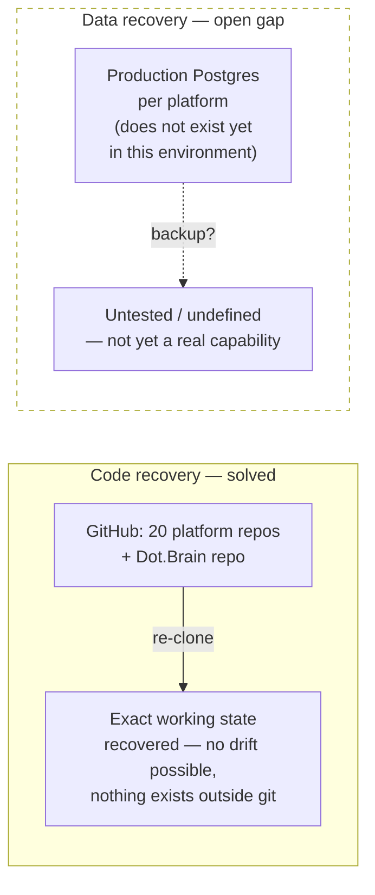

# 16 — Disaster Recovery

Purpose: to state, honestly, what disaster recovery means for the Dot Ecosystem today — not what it will mean once every platform is in production with real users and real data, and not a copy of Dot.Brain's own recovery framework restated as if it already covered the platforms. It does not. This document draws the real recovery boundary as it exists right now, names the part that is solved, names the part that is an open gap, and explains how [ADR-0007](../adr/ADR-0007-rto-rpo-tier-model.md)'s tier model — built for Dot.Brain's internal services — should extend to the platforms once they hold production data.

> **Related documents:** [brain.resilience.md](../brain.resilience.md) — Dot.Brain's own six-capability resilience framework (Prevention → Detection → Response → Recovery → Learning → Continuous Improvement), which this document deliberately does not re-derive · [brain.resilience.md](../brain.resilience.md) Capability 4 and [adr/ADR-0007-rto-rpo-tier-model.md](../adr/ADR-0007-rto-rpo-tier-model.md) — the RTO/RPO tier model this document extends to platform scope · [os/02-Engineering-Loop.md](02-Engineering-Loop.md) §2 — the environment-reality section this document's code-recovery claim depends on · [os/17-Security.md](17-Security.md) — the sibling gap analysis for security posture · [os/13-Engineering-State.md](13-Engineering-State.md) — current per-platform status, the input any recovery drill would need.

---

## 1. The honest question this document answers

"If something is lost, can we get it back?" splits into two completely different questions at the platform layer, and conflating them is the single biggest risk in how disaster recovery gets talked about here:

1. **Can we recover the code?** — Yes, verifiably, today.
2. **Can we recover the data?** — Unknown. Not yet established. This is a real, unresolved gap, not a solved problem being under-communicated.

## 2. What is actually solved: code recovery

Every platform's code lives in git, hosted on GitHub. Because this session's entire engineering loop (see [02-Engineering-Loop.md](02-Engineering-Loop.md)) never executed anything locally — no PHP, no Composer, no Postgres, no Docker — there is, by construction, no local state anywhere that isn't also in a commit. Nothing was ever generated, run, or persisted outside of what got committed. That means the recovery test for code is unusually clean: **re-clone every repository and the exact state is recovered, because there was never a second copy of "true" state anywhere else to fall out of sync with.**

*The left half of this diagram is a fact, verified by construction. The right half is a placeholder for a capability that does not exist yet — drawn deliberately unresolved rather than papered over.*

This is a stronger recovery guarantee than most teams have for their code, and it is worth stating why: normal engineering environments have local uncommitted state, in-progress migrations, or environment-specific config drift that a bare "re-clone" would not reproduce. This environment has none of that, because it was never able to run anything in the first place. The constraint that makes local execution impossible ([02-Engineering-Loop.md](02-Engineering-Loop.md) §2) is the same fact that makes code recovery trivially complete.

**What this does not cover:** repository metadata that isn't in the tree itself — GitHub Issues, PR review history, branch-protection configuration, Actions secrets. A full GitHub account loss would lose those even though the code survives. This is a smaller, more tractable gap than the data question below, but it is not zero, and it is not addressed by anything in this document beyond naming it.

## 3. What is not solved: production data recovery

None of the fifteen "live" platforms have ever run against a real database in this working environment — see [02-Engineering-Loop.md](02-Engineering-Loop.md) §2. There is, as of this document, no production Postgres instance, no backup schedule, no restore drill, and no tested recovery procedure for any platform's data, because no platform has yet reached the point of holding real data. Stating this as a gap rather than a solved problem matters for the same reason [17-Security.md](17-Security.md) insists nothing has been penetration-tested: pretending a capability exists before it has been built or verified is exactly the placeholder-content failure Manifesto principle 4 exists to prevent.

Concretely, the following do not exist yet and must before any platform takes real user data:

- A defined backup schedule and retention policy, per platform, per the tier it will be assigned (§4).
- A tested restore procedure — per [brain.resilience.md](../brain.resilience.md) Capability 4, "an untested backup is not a backup," and that principle applies at least as strongly here, where *no* backup of any kind exists yet to even become untested.
- Multi-region or off-site replication for anything above the lowest tier.
- A defined RPO for each platform's transactional data (order records, financial ledgers, task state) — currently undefined because no platform has transactional data in a real database at all.

## 4. Applying ADR-0007's tier model to platforms

[ADR-0007](../adr/ADR-0007-rto-rpo-tier-model.md) defines four RTO/RPO tiers for Dot.Brain's *internal* services (ledger, graph, reasoning, dashboards). It was not written with the platforms in mind, but its central argument — recovery investment must be proportional to blast radius, and tier assignment happens at design review, not retrofitted after an incident — applies just as well one layer up, to the ~20 platforms once they hold production data. A first-pass mapping, to be formalized once real production databases exist:

| Tier (per ADR-0007's model) | Platform-layer analog | Example |
|---|---|---|
| 0 — near-zero RPO | Financial ledgers, payment records, audit trails | Dot.Finance transaction records, Dot.Billing invoices |
| 1 — near-irreplaceable | Core tenant business data | Dot.Tasks task state, Dot.Mines operational records, Dot.Auction bid history |
| 2 — recomputable | Derived/aggregate data | Dot.Analytics rollups, Dot.Central dashboards (rebuildable from tier-1 sources) |
| 3 — convenience | Caches, drafts, non-critical UI state | Session data, unsent draft content |

This table is explicitly a **proposal for how the model should extend**, not a claim that it has been applied — no platform has a production database against which to assign a real tier yet. It is recorded here so that when the first platform goes to production, tier assignment is a design-review decision (per ADR-0007's own discipline) rather than an afterthought discovered during the first incident.

## 5. What "BCP" means at the platform layer today

[brain.resilience.md](../brain.resilience.md) Capability 4 states Dot.Brain's business continuity plan is architectural: no platform's critical path depends on a live Dot.Brain, because the ownership boundary (Manifesto principle 4 — platforms own their data, Dot.Brain only proposes) means platforms function autonomously even if the brain is fully unavailable. That guarantee holds and is inherited by this document without restatement. What it does **not** say anything about is whether an individual platform can survive the loss of *its own* database — that is a separate, platform-local continuity question this document is flagging as unanswered, not one that Dot.Brain's architecture already answers by design.

## 6. What must happen before this gap is closed

In order, before any platform takes real production data or payments:

1. **Stand up a real Postgres instance** (or managed equivalent) for the first platform going to production, outside this development environment.
2. **Define and test a backup schedule** for that platform against the tier it is assigned (§4) — snapshot frequency matching the RPO target, not a default.
3. **Run an actual restore drill** before declaring the backup real, per [brain.resilience.md](../brain.resilience.md)'s own standard: "an untested backup is not a backup."
4. **Repeat per platform** as each reaches production, not as a one-time ecosystem-wide project — each platform's data profile and tier may differ.
5. **Only after step 3 succeeds for a given platform** should this document's status for that platform change from "gap" to "solved" — and that change should be recorded in this document's change log, named per platform, not asserted in the abstract.

## 7. Metrics of success (once applicable)

| Metric | Target | Status today |
|---|---|---|
| Platforms with a defined backup schedule | All platforms holding production data | 0 — no platform has production data yet |
| Platforms with a passed restore drill in the last quarter | 100% of platforms with production data | Not applicable yet |
| Recovery-time claims backed by a tested drill vs. asserted untested | 100% tested | 0% tested (none exist to test) |

---

## Change Log

| Version | Date | Author | Change |
|---|---|---|---|
| 1.0.0 | 2026-08-01 | Background agent (os/ document set, session 1) | Initial honest gap analysis: code recovery solved, production data recovery explicitly unresolved; proposed extension of ADR-0007's tier model to platform scope |

## Open Questions

| Question | Owner |
|---|---|
| Which platform reaches production data first, and does its backup/restore drill become the template the rest follow, or does each platform need a bespoke plan given differing data sensitivity (e.g. Dot.Finance vs. Dot.Pulse)? | Sakhile Bhayi |
| Should platform-layer tier assignment (§4) be formalized as its own ADR once the first platform goes to production, rather than living as a proposal inside this document? | Sakhile Bhayi |
| Does GitHub-account-level loss (§2, "what this does not cover") warrant its own mitigation (e.g. a secondary git remote, exported Issues/PR archive) given how cheap that insurance would be relative to the code-recovery guarantee already in place? | Sakhile Bhayi |
