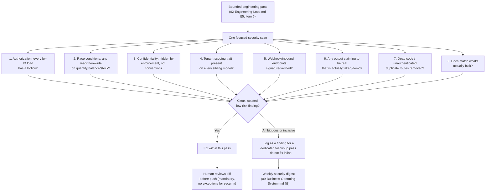

# 17 — Security

Purpose: an ecosystem-wide security doctrine for the ~20 Dot platforms, grounded in the real findings from this session's audit pass across fifteen live platforms — not a generic security checklist, but the recurring vulnerability *classes* actually found, turned into a standing checklist future platform work must specifically audit for. This document sits above [os/07-Development-Standards.md](07-Development-Standards.md) §2–3 (which already codify the authorization and no-placeholder-output rules these findings produced) and is the honest statement of where the ecosystem's security posture actually stands: hand-reviewed, never verified.

> **Related documents:** [os/02-Engineering-Loop.md](02-Engineering-Loop.md) §2 — the environment constraint (no local execution) that defines what "hand-reviewed, not verified" means throughout this document · [os/07-Development-Standards.md](07-Development-Standards.md) §2–3 — the coding standards these findings produced · [brain.security.md](../brain.security.md) — Dot.Brain's own threat model for *its own* trust boundaries (the knowledge graph, DKP transport, agent colony) — a different, narrower scope than this document, which covers the platforms themselves · [os/16-Disaster-Recovery.md](16-Disaster-Recovery.md) — the sibling gap analysis for recovery posture · [os/18-Platform-Lifecycle.md](18-Platform-Lifecycle.md) — where a security audit pass sits in a platform's lifecycle.

---

## 1. Relationship to brain.security.md

[brain.security.md](../brain.security.md) is a rigorous, STRIDE-organized threat model — but it is scoped to Dot.Brain's own trust zones: the knowledge graph, the DKP transport, the agent colony, the ledger. It says nothing about authorization logic inside an individual platform's Laravel application, because that was never its job — platform-owned code is outside Dot.Brain's boundary by design (Manifesto principle 4). This document is that missing layer: ecosystem-wide doctrine for the security posture *of the platforms themselves*, written from what was actually found auditing fifteen of them, not derived abstractly. Where the two documents overlap (e.g. both care about authentication and boundary integrity), this document defers to brain.security.md's framing rather than restating it.

## 2. The real findings this session, and the vulnerability class each represents

Every fix below was real: a genuine defect found in genuine application code, not a hypothetical.

| # | Platform | What was found | Vulnerability class |
|---|---|---|---|
| 1 | **Dot.Tasks** | Any authenticated user could view/edit any other team's tasks by ID — zero authorization check on the record, only on the session. The most serious finding this session. | Missing/incomplete authorization policy |
| 2 | **Dot.Emall** | Checkout could oversell stock under concurrent requests — a classic check-then-act race between "read stock" and "decrement stock," allowing negative inventory. | Race condition in a mutating, financially-relevant operation |
| 3 | **Dot.Auction** | Reserve price confidentiality relied on the frontend simply not rendering it — the value was still present in the payload/response, protected by convention, not enforcement. Fixed via Eloquent's `$hidden`. | Confidentiality-by-convention instead of by-enforcement |
| 4 | **Dot.Mines** | The `MineArea` model was missing the tenant-scoping trait present on every sibling model in the same platform — one code path silently unscoped while the rest of the platform was correctly scoped. | Missing tenant-scoping trait (inconsistent application of an otherwise-correct pattern) |
| 5 | **Dot.Finance** | Financial CRUD had to be built from scratch with explicit ownership Policies — an IDOR risk by default for any financial record reachable by ID without one. | Missing/incomplete authorization policy (financial-data variant) |
| 6 | **Dot.Charts (ChartSense)** | An "AI analysis" endpoint returned hardcoded results presented to users as real inference. Fixed by honestly labeling it as a demo rather than removing it. | Faked output presented as real (Manifesto principle 4 violation in production code, not just docs) |
| 7 | **Dot.Notify** | No inbound webhook signature verification exists — the endpoint doesn't even exist yet, despite a model implying it should. | Missing/unverified webhook authenticity |
| 8 | *(several platforms)* | Unauthenticated dead code and duplicate route groups left reachable. | Unauthenticated dead code / attack-surface bloat |
| 9 | *(several platforms)* | README and wiki content describing features that were never built. | Stale/fictional documentation (a trust and audit-integrity issue, not just a cosmetic one) |

## 3. The standing checklist — what every future platform pass must audit for

Derived directly from §2, in the order a reviewer should check them:

1. **Authorization.** Every controller action reachable by more than one user that loads a model by ID must authorize via a Laravel Policy, not an inline ownership check and not the query alone. This is [07-Development-Standards.md](07-Development-Standards.md) §2's rule, restated here as a security-audit checklist item because findings #1 and #5 above are what happens when it is skipped.
2. **Race conditions in mutating operations.** Anything that reads a quantity (stock, balance, seat count, bid amount) and then writes a decremented/incremented value must use a database-level lock or atomic operation, not a read-then-write pattern vulnerable to concurrent requests. Finding #2.
3. **Confidentiality by enforcement, not convention.** Any field a user should not see (reserve prices, other tenants' data, internal flags) must be excluded at the model or query layer (`$hidden`, explicit `select()`, scoped queries) — never merely omitted from the view that happens to render it. Finding #3.
4. **Tenant-scoping trait consistency.** Where a platform has an established tenant-scoping trait or pattern, every model in that platform's domain must use it — a per-model audit, not a spot check, because the gap that matters is exactly the one model that was missed while its siblings were correct. Finding #4.
5. **Webhook and inbound-integration authenticity.** Any endpoint that accepts data from an external system (payment webhooks, third-party integrations) must verify a signature or shared secret before trusting the payload. An endpoint that doesn't exist yet but is implied by a model or feature name should be built with verification from the start, not retrofitted. Finding #7.
6. **No faked output presented as real.** Any UI element showing AI-generated, computed, or "smart" output must be backed by real computation or explicitly labeled as a demo — this is [07-Development-Standards.md](07-Development-Standards.md) §3's rule; a security audit checks for it because a user cannot make an informed decision against output they believe is real but isn't. Finding #6.
7. **Dead code and unreachable route groups.** Duplicate or leftover route groups, especially unauthenticated ones, should be removed, not left "harmless because nothing links to it" — attack surface is attack surface whether or not it's currently linked. Finding #8.
8. **Documentation accuracy.** Platform docs (README, wiki.md-adjacent notes) describing unbuilt features are a security-adjacent issue, not just a quality one — they misrepresent what the system actually does to anyone auditing it, including future agents. Finding #9.

*The eight items are what the "one security/technical-debt scan" in [02-Engineering-Loop.md](02-Engineering-Loop.md) §5 item 6 actually checks — this diagram makes that scan concrete instead of open-ended.*

## 4. What has not happened — stated plainly

Nothing in these fifteen platforms has been penetration-tested. No dependency vulnerability scanner has been run. No automated static-analysis security tool has touched this code. Every fix listed in §2 was a **hand-reviewed, syntax-checked, logically-reasoned patch** — an agent or the owner read the code, reasoned about the vulnerability, wrote a fix that looks correct, and it was committed. None of it has been *executed*, because this working environment has no PHP, Composer, PostgreSQL, or Docker (see [02-Engineering-Loop.md](02-Engineering-Loop.md) §2). A patch that looks correct on read-through and a patch that is verified correct under a real test run are not the same claim, and this document does not conflate them.

This is not a criticism of the fixes — cross-tenant access, race conditions, and confidentiality leaks are exactly the class of bug that careful code review reliably catches, and the findings in §2 prove the review process worked. It is a statement about what "fixed" does and does not mean here: fixed-on-review, not fixed-and-verified.

## 5. What must happen before any platform takes real user data or payments

In order, non-negotiable, before production launch for any given platform:

1. **A real test run.** Every feature test written this session (per [07-Development-Standards.md](07-Development-Standards.md) §4) executes, for the first time, in a genuine PHP + Postgres environment or CI. Written-but-unexecuted tests are not evidence of correctness until this happens.
2. **Dependency vulnerability scanning.** Composer dependencies scanned (e.g. `composer audit` or an equivalent SCA tool) — this session never ran `composer install`, so no dependency in any of these fifteen platforms has ever been checked against a known-vulnerability database.
3. **A proper penetration test.** Human- or tool-led, against a real running instance — not a hand-review, an actual attempted exploit of the classes in §3 and anything else a reviewer with adversarial intent finds.
4. **Static analysis in CI**, ideally before step 3, to catch the mechanical subset of §3's checklist automatically rather than relying solely on a human/agent read-through every time (see the open question in [07-Development-Standards.md](07-Development-Standards.md) on adopting Larastan/PHPStan).
5. **Sign-off recorded**, per [09-Business-Operating-System.md](09-Business-Operating-System.md) §4's Tier 3 judgment-call discipline — a platform does not go to production on an agent's or a document's assertion that it's ready; the owner decides, on the record.

## 6. Health metrics

| Metric | Target | Status today |
|---|---|---|
| Security findings from this session's audit pass, fixed | 5/5 (Tasks, Emall, Auction, Mines, Finance) plus ChartSense honesty fix and Notify gap flagged | 5/5 hand-reviewed fixes committed; Notify webhook verification not yet built |
| Platforms with a passed dependency vulnerability scan | 0 today; target 100% before that platform's production launch | 0 — `composer audit` has never run in this environment |
| Platforms with a completed penetration test | 0 today; target: every platform, before it holds real user data or payments | 0 |
| Weekly security digest produced (per [09-Business-Operating-System.md](09-Business-Operating-System.md) §3) | Every week, no gaps | Newly formalized this session — adherence to be tracked going forward |

---

## Change Log

| Version | Date | Author | Change |
|---|---|---|---|
| 1.0.0 | 2026-08-01 | Background agent (os/ document set, session 1) | Initial ecosystem security doctrine derived from the real 15-platform audit pass; eight-item checklist, honest statement of unverified status, pre-production requirements |

## Open Questions

| Question | Owner |
|---|---|
| Which platform should be the first to go through the full §5 sequence (test run, dependency scan, pentest), given it will also serve as the template drill for the rest? | Sakhile Bhayi |
| Should Dot.Notify's missing webhook signature verification (finding #7) be treated as a Tier 2 build item or escalated given it blocks any platform integration that depends on inbound webhooks? | Sakhile Bhayi |
| Should the eight-item checklist in §3 be promoted into a machine-checkable static-analysis ruleset once CI exists, rather than remaining a human/agent read-through checklist indefinitely? | Sakhile Bhayi |
