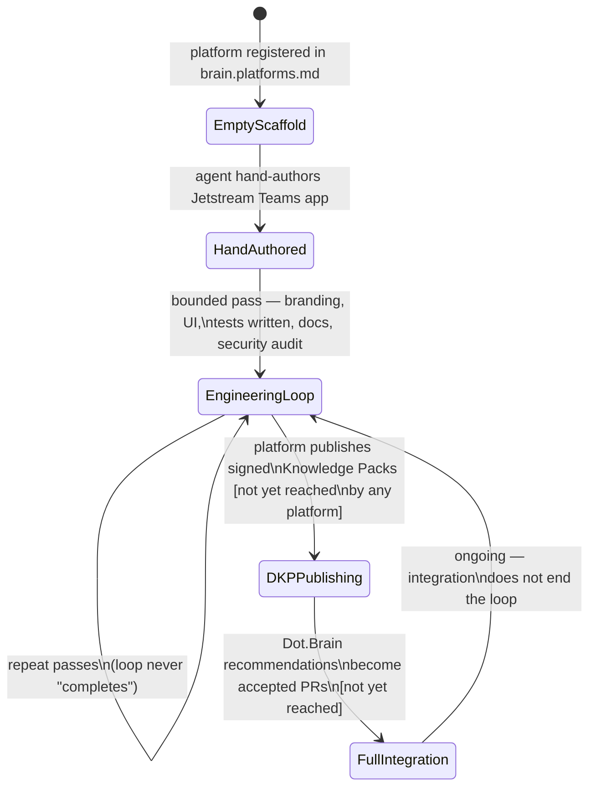
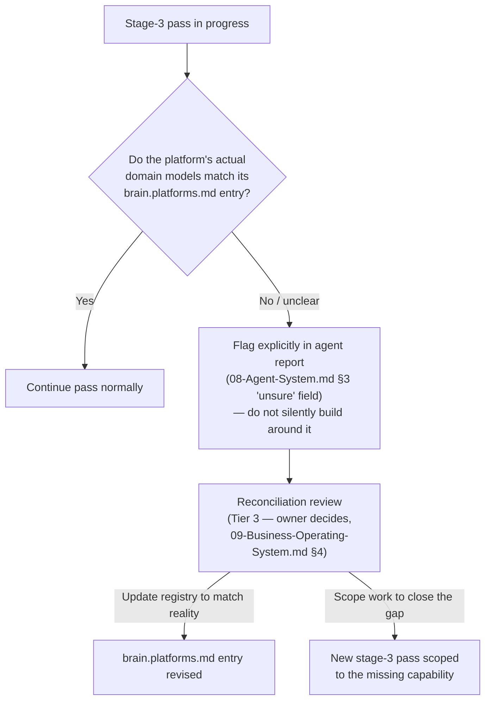

# 18 — Platform Lifecycle

Purpose: to name the stages a Dot platform actually moves through, grounded in what has been observed across the fifteen live platforms and five remaining scaffolds this session — not an idealized product-maturity model, but the real sequence, including the two stages no platform has reached yet. It also documents the domain-mismatch failure mode discovered this session (Dot.Central, Dot.Design, and Dot.Finance each had a real, documented gap between what [brain.platforms.md](../brain.platforms.md) envisioned and what was actually built) and what should trigger a reconciliation review when it happens again.

> **Related documents:** [os/02-Engineering-Loop.md](02-Engineering-Loop.md) — the bounded pass that constitutes stage 3 below · [os/13-Engineering-State.md](13-Engineering-State.md) — the live status tracker this document's stage model organizes · [os/17-Security.md](17-Security.md) — the security-audit component of stage 3 · [brain.platforms.md](../brain.platforms.md) — the platform registry and the source of the "envisioned" side of the domain-mismatch check · [brain.dkp.md](../brain.dkp.md) — the Knowledge Pack protocol that stage 4 depends on, not yet reached by any platform.

---

## 1. The five stages

*Every platform today sits at stage 1 (5 platforms) or stage 3 (15 platforms). No platform has reached stage 4 or 5 — stated plainly rather than implied as "in progress."*

**Stage 1 — Empty scaffold.** Registered in [brain.platforms.md](../brain.platforms.md) with a responsibility statement, but no application exists — only a `wiki.md` (platform-owned, per Manifesto principle 4) describing intent. As of this document: Dot.Plug, Dot.Farms, Dot.HR, Dot.Dopemine, Dot.Memory.

**Stage 2 — Hand-authored / extended Jetstream app with real domain models.** An agent builds (for empty scaffolds) or already finds (for the fifteen live platforms) a genuine Laravel/Jetstream Teams application with real, platform-specific Eloquent models — not a generic CRUD shell. For the five stage-1 platforms, this step is explicitly flagged **unverified**: hand-authored to match the other fifteen repos' conventions, but never installed, migrated, or run, because this environment has no PHP/Composer/Postgres/Docker (see [02-Engineering-Loop.md](02-Engineering-Loop.md) §2).

**Stage 3 — The engineering-loop pass.** The bounded checklist from [02-Engineering-Loop.md](02-Engineering-Loop.md) §5: branding, dark/light toggle, notification bell where a real trigger exists, feature tests written (unexecuted), a docs-accuracy pass, and one focused security/technical-debt scan (see [17-Security.md](17-Security.md) §3's eight-item checklist). This stage **repeats** — it is not a box a platform checks once. All fifteen live platforms are here, at varying pass counts; this session's audit findings (cross-tenant Dot.Tasks access, the Dot.Emall race condition, and the rest catalogued in [17-Security.md](17-Security.md) §2) were all found *during* a stage-3 pass, which is the stage's entire purpose.

**Stage 4 — Real DKP Knowledge Pack publishing.** *[Not yet reached by any platform.]* A platform publishes signed Knowledge Packs per [brain.dkp.md](../brain.dkp.md) — structured, versioned, provenance-carrying knowledge the graph can ingest. This requires a live platform capable of generating real signed packs from real operational data, which no platform has, because no platform has production data yet (see [16-Disaster-Recovery.md](16-Disaster-Recovery.md) §3). Naming this stage explicitly, rather than letting "eventually it'll talk to the brain" stay implicit, is the point: it makes the gap checkable instead of assumed away.

**Stage 5 — Full ecosystem integration via Dot.Brain recommendations/PRs.** *[Not yet reached.]* The brain analyzes ingested packs, builds cross-platform relationships, and opens reviewed Pull Requests back to platforms per the ownership boundary (Manifesto principle 4: Dot.Brain proposes, platforms decide). This is the stage the entire "one brain" claim in [01-Executive-Vision.md](01-Executive-Vision.md) §1 depends on being real eventually — and it cannot be real until stage 4 is real for at least two platforms with a plausible cross-platform relationship between them.

## 2. Why stage 3 "repeats" instead of completing

Unlike a typical product roadmap where a stage is checked off, stage 3 is designed to run again indefinitely — a platform is never "done" being audited and extended, only "current as of its last pass." This mirrors [os/20-Continuous-Evolution.md](20-Continuous-Evolution.md)'s framing directly: the loop is the steady state, not a phase before a steady state. A platform that has had one stage-3 pass and is never revisited is not more "finished" than one that hasn't started — it is simply less examined, and less examined is a security posture problem (see [17-Security.md](17-Security.md) §4) more than it is an achievement.

## 3. The domain-mismatch failure mode

Three platforms this session revealed the same failure mode independently: **what [brain.platforms.md](../brain.platforms.md) described the platform as being, and what actually got built, diverged** — not through malice or carelessness, but because the registry entry was written at a different time, with different assumptions, than the actual build session.

- **Dot.Central** — registered as an "Operational Intelligence Center" working with Dot.Mines on fleet optimization, dispatch intelligence, and digital twins. The built platform's actual surface covers a narrower slice of that vision, with some registry-described capabilities (digital twins specifically) not represented in the real application.
- **Dot.Design** — registered as an "Enterprise design system." What was actually built during this session's stage-3 pass leans toward a specific, concrete component/pattern library rather than the full governance-and-tooling surface a platform-scale "design system" registry entry implies.
- **Dot.Finance** — registered simply as "Financial platform." The actual build required inventing real domain models and Policies from scratch (see [17-Security.md](17-Security.md) §2 finding #5) because the registry entry didn't specify enough domain shape to build against without that invention — meaning the built platform's actual scope was decided *during* the build, not before it, which is itself the mismatch.

The common thread: a registry entry written as aspiration (what the platform *should* eventually be) gets treated, months or sessions later, as if it were a specification (what to build now) — and the two are not the same document, even when they share a file.

## 4. What should trigger a reconciliation review

A reconciliation review — comparing a platform's [brain.platforms.md](../brain.platforms.md) entry against what stage-3 passes have actually built, and either updating the registry entry or scoping new work to close the gap — should trigger on any of:

1. **A stage-3 pass discovers the built platform's actual domain models don't match the registry's stated responsibility** (as happened with all three platforms in §3) — the discovering pass should flag this explicitly in its report (per [08-Agent-System.md](08-Agent-System.md) §3's "unsure" field) rather than silently building around the mismatch.
2. **A platform reaches its third stage-3 pass** without ever having its registry entry re-read against its current code — staleness compounds quietly otherwise.
3. **Before a platform is proposed for stage 4** (DKP publishing) — publishing knowledge packs under a registry-described responsibility the platform doesn't actually fulfill would itself be a form of the placeholder-content problem Manifesto principle 4 exists to prevent, one layer up from code.
4. **The monthly backlog and next-platform review** ([09-Business-Operating-System.md](09-Business-Operating-System.md) §3) surfaces a registry entry for one of the five stage-1 scaffolds that looks aspirational rather than buildable — better to catch this before stage 2's hand-authoring begins than after.

A reconciliation review's output is a judgment call — update the registry, or scope a follow-up build pass to close the gap — and per [09-Business-Operating-System.md](09-Business-Operating-System.md) §4, that decision sits with the owner (Tier 3), not with the agent that discovered the mismatch.

*The mismatch is not itself a failure — building surfaced real information a stale registry entry couldn't have had. Silently building around it, rather than flagging it, would be the actual failure.*

## 5. Stage summary table

| Stage | Name | Platforms currently here | Verified? |
|---|---|---|---|
| 1 | Empty scaffold | Dot.Plug, Dot.Farms, Dot.HR, Dot.Dopemine, Dot.Memory | N/A — nothing built yet |
| 2 | Hand-authored / extended Jetstream app | All 20, in varying states — the 5 stage-1 platforms will pass through this next | Extended (15 platforms): building on a previously-installed real app. Hand-authored (5 platforms): explicitly unverified |
| 3 | Engineering-loop pass (repeats) | Dot.Billing, Dot.Ehail, Dot.Auction, Dot.Agents, Dot.Emall, Dot.Notify, Dot.Pulse, Dot.Analytics, Dot.Mines, Dot.Projects, Dot.Tasks, Dot.Finance, Dot.Charts, Dot.Central, Dot.Design | Hand-reviewed, not executed — see [17-Security.md](17-Security.md) §4 |
| 4 | DKP Knowledge Pack publishing | None | Not reached |
| 5 | Full ecosystem integration | None | Not reached |

---

## Change Log

| Version | Date | Author | Change |
|---|---|---|---|
| 1.0.0 | 2026-08-01 | Background agent (os/ document set, session 1) | Initial five-stage lifecycle model grounded in the real 15-platform build session; documented the domain-mismatch failure mode found in Dot.Central, Dot.Design, and Dot.Finance and its reconciliation trigger |

## Open Questions

| Question | Owner |
|---|---|
| Should stage 4 (DKP publishing) require a platform to have passed [17-Security.md](17-Security.md) §5's full pre-production sequence (real test run, dependency scan, pentest) first, or can a platform publish knowledge packs from a non-production instance before that sequence completes? | Sakhile Bhayi |
| Should the three domain-mismatch cases in §3 be resolved now (registry updated or gap-closing work scoped) or left as known, documented gaps until each platform's next stage-3 pass reaches them naturally? | Sakhile Bhayi |
| Is a numbered five-stage model the right shape long-term, or will stage 4/5 need to be split further once a platform actually reaches them and the real mechanics turn out more granular than this document can anticipate from stage 3? | Sakhile Bhayi |
