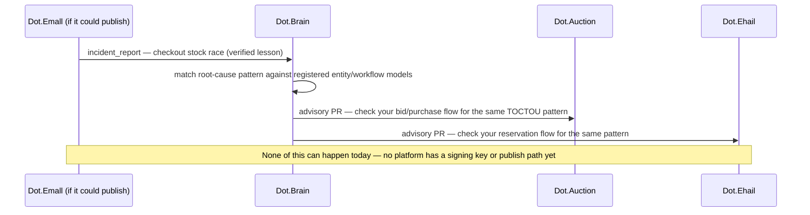

# 19 — Knowledge Packs, Worked

Purpose: the hands-on companion to [os/05-Knowledge-Protocol.md](05-Knowledge-Protocol.md). It shows what a real DKP payload looks like for each of the four payload types, using one concrete, illustrative example per type drawn from a platform that actually exists and actually ships code today — including a full worked `incident_report` pack for the checkout stock-race bug found and fixed in Dot.Emall this session. It then states, platform by platform, exactly what is missing before any of the 15 real Dot platforms could publish a pack for real.

> **Related documents:** [os/04-Dot-Brain.md](04-Dot-Brain.md) · [os/05-Knowledge-Protocol.md](05-Knowledge-Protocol.md) · [brain.dkp.md](../brain.dkp.md) — the normative payload schemas this document illustrates · [templates/knowledge-pack.template.md](../templates/knowledge-pack.template.md) · [templates/knowledge-pack.example.md](../templates/knowledge-pack.example.md) — the canonical full round-trip worked example (Dot.Mines → Dot.Central) this document follows the shape of · [os/02-Engineering-Loop.md](02-Engineering-Loop.md) §1 — where the Dot.Emall race condition is first mentioned as a real finding this session.

---

## 1. A note on what "worked example" means here

None of the packs in this document have been published, signed with a real key, or ingested by a running Dot.Brain — because, per [os/05-Knowledge-Protocol.md](05-Knowledge-Protocol.md) §4, no platform has the infrastructure to do that yet. Every pack below is written **as if** it were published — to the exact envelope shape in [brain.dkp.md](../brain.dkp.md) §1.3 and the worked-example convention in [templates/knowledge-pack.example.md](../templates/knowledge-pack.example.md) — using real domain facts from the platform's own `wiki.md`. Signature values are placeholders (`<unsigned — no key exists yet>`); everything else is written to the standard a real pack would need to pass validation.

## 2. The four payload types, one example each

### 2.1 `observation` (metric) — Dot.Billing

A metric payload states a definition precisely enough to reimplement, plus dated observations (full shape: [brain.dkp.md](../brain.dkp.md) §1.4).

```json
{
  "payload_type": "metric",
  "body": {
    "metric_name": "billing.invoice_payment_success_rate",
    "domain": "payments",
    "definition": "Invoices marked paid within their due window, divided by invoices issued in the same window, per billing team, monthly",
    "unit": "ratio",
    "direction_of_good": "up",
    "dimensions": ["team_id", "invoice_type"],
    "observations": [
      { "timestamp": "2026-07-31T23:59:59Z", "value": 0.91, "dimensions": { "invoice_type": "subscription" }, "sample_size": 340 }
    ],
    "baseline": 0.91,
    "target": 0.95
  }
}
```

### 2.2 `insight` — Dot.Auction

An insight is one falsifiable statement with stated method and evidence (checklist: [templates/knowledge-pack.template.md](../templates/knowledge-pack.template.md) §3).

```json
{
  "payload_type": "insight",
  "body": {
    "statement": "Auctions closing in the final 90 seconds show a 3.1x bid-rate increase versus the preceding 10 minutes, concentrated in listings with a visible reserve-price indicator",
    "domain": "auction-mechanics",
    "method": "30-day bid-timestamp analysis, binned by seconds-to-close, controlled for listing category",
    "evidence": [
      { "kind": "dataset", "reference": "dotauction://bids/2026-07-01_2026-07-30", "note": "very illustrative — no such dataset export exists yet" }
    ],
    "scope": "site-wide; likely generalizes to any timed-close auction mechanism"
  }
}
```

### 2.3 `recommendation` / `outcome` — Dot.Projects

A recommendation must declare all three impact axes with metric/baseline/target/window ([brain.dkp.md](../brain.dkp.md) §4.2); an outcome pack later reports what actually happened.

```json
{
  "payload_type": "recommendation",
  "body": {
    "proposal": "Default new projects to a 2-week sprint cadence instead of no default, based on observed reduction in stalled-project rate for teams that set an explicit cadence in week 1",
    "target_platform": "dot-projects",
    "rationale": "Teams with an explicit cadence by day 7 show materially lower 60-day stall rates than teams without one",
    "evidence": ["dkp:dot-projects:ins:<illustrative-uuid>"],
    "impact": {
      "business": { "metric": "projects.stalled_rate_60d", "baseline": 0.22, "target": 0.14, "measurement_window": "90d post-merge" },
      "user": { "metric": "projects.time_to_first_task_assigned", "baseline": 3.5, "target": 1.5, "measurement_window": "30d post-merge" },
      "dopamine": { "metric": "projects.team_momentum_confidence_score", "baseline": 3.2, "target": 3.9, "measurement_window": "60d survey" }
    },
    "rollback": {
      "procedure": "Remove the default; existing projects unaffected",
      "blast_radius": "Project-creation flow only",
      "watch_signals": ["projects.stalled_rate_60d", "projects.creation_abandon_rate"]
    },
    "review_window_days": 30
  }
}
```

### 2.4 `incident_report` — Dot.Emall checkout stock race (the real worked example)

This is the one grounded in an actual finding from this session, not a hypothetical. During the Dot.Emall platform pass ([os/02-Engineering-Loop.md](02-Engineering-Loop.md) §1), the cart→checkout flow that turns `CartItem` rows into real `Order`/`OrderItem` rows was reviewed and a stock race condition was identified and fixed: two concurrent checkouts against the same low-stock `Product` could both pass a stock check before either write landed, allowing the item to be oversold. Written as a full `incident_report` payload to the schema in [brain.dkp.md](../brain.dkp.md) §9.1:

```json
{
  "payload_type": "incident_report",
  "body": {
    "severity": "moderate",
    "detection": {
      "how": "manual code review during the Dot.Emall checkout-flow build pass, not automated monitoring",
      "detected_at": "2026-08-01T00:00:00Z",
      "mttd": "n/a — found in review before any production traffic exercised the path"
    },
    "impact": {
      "systems": ["checkout flow", "Product.stock", "Order/OrderItem creation"],
      "users": "any buyer completing checkout on a low-stock product during a concurrent purchase window",
      "business": "oversold inventory; seller fulfillment shortfall and buyer refund/cancellation exposure if shipped unfixed"
    },
    "timeline": [
      { "at": "2026-08-01T00:00:00Z", "event": "Checkout flow reviewed as part of building Order/OrderItem creation (previously no code path created a real Order at all)" },
      { "at": "2026-08-01T00:05:00Z", "event": "Stock check found to read Product.stock and later write Order/OrderItem without a locking or atomic-decrement guard between the two" },
      { "at": "2026-08-01T00:20:00Z", "event": "Fix scoped and applied within the same bounded pass; human review gate applied before push per os/02-Engineering-Loop.md §6" }
    ],
    "root_cause": {
      "summary": "Stock availability was checked and stock was decremented in two separate, non-atomic steps, leaving a window where two concurrent checkouts on the same product could both read sufficient stock before either write applied",
      "contributing_factors": ["no database-level locking or atomic decrement on Product.stock at checkout time", "checkout flow was newly built this pass — no prior hardening cycle had touched this path"],
      "pattern_refs": ["dot:node:commerce:checkout-stock-decrement"]
    },
    "corrective_actions": [
      { "action": "Wrap the stock check and decrement in a single atomic operation (row lock or conditional update) at checkout time", "owner": "Emall Platform Lead", "due": "same pass, fixed before push" }
    ],
    "lessons": [
      {
        "statement": "Any checkout or reservation flow that checks a finite-stock field and later writes an order must treat the check-and-decrement as one atomic operation, not two sequential reads/writes, or concurrent buyers can oversell the same unit",
        "verified": true,
        "verification_evidence": "fix applied and reviewed in the same pass; pattern is a standard, well-understood concurrency class (TOCTOU on a stock counter), not a novel or unverified claim"
      }
    ]
  }
}
```

Per [brain.dkp.md](../brain.dkp.md) §9.2, a `verified: true` lesson like this one is exactly the kind that should fan out as an advisory PR to every other platform with a similar finite-stock or finite-slot checkout path — Dot.Auction's bid-to-purchase flow and Dot.Ehail's ride/seat reservation flow are the two most structurally similar candidates in this ecosystem. Because no platform can publish yet, that fan-out cannot happen today; it is exactly the kind of cross-platform value the ecosystem is leaving on the table until step 1 of onboarding ([os/05-Knowledge-Protocol.md](05-Knowledge-Protocol.md) §5) actually happens somewhere.


*What the incident-lesson fan-out from brain.dkp.md §9.2 would look like for a pattern that already exists in this ecosystem's real code — currently blocked entirely on step 1 of onboarding.*

## 3. Format discipline these examples follow

Every example above uses the exact top-level envelope fields from [brain.dkp.md](../brain.dkp.md) §1.3 (`dkp_version`, `pack_id`, `platform`, `contributors[]`, `payloads[]`, `provenance`, `confidence`, `signatures[]`) even though only the `payloads[].body` is shown here for brevity — the full envelope shape is not repeated because [templates/knowledge-pack.example.md](../templates/knowledge-pack.example.md) already shows it complete, end to end, for a real round trip (Dot.Mines → Dot.Central). Anyone drafting a real pack should start from that file and the checklist in [templates/knowledge-pack.template.md](../templates/knowledge-pack.template.md), not from this document.

## 4. What blocks each real platform from publishing today

The same three gaps recurred across all 15 platforms with real, shipped code this session. **Dot.Billing has now closed all three, for real** (2026-08-02) — see §4a. The rest have not.

| Platform | Signing key | `platform.dkp.json` manifest | Publish job/command | Notes |
|---|---|---|---|---|
| Dot.Billing | **Real — Ed25519, committed public half** | **Real — validates against `schemas/platform-manifest.schema.json`** | **Real — `app/Console/Commands/PublishDkpMetricPack.php`** | §4a. One real signed pack committed. Still not registered (onboarding step 2) and nowhere to transmit to (transport layer unbuilt ecosystem-wide, per [os/05-Knowledge-Protocol.md](05-Knowledge-Protocol.md) §6). |
| Dot.Ehail | Missing | Missing | Missing | Reservation-flow structural match to the Emall lesson above |
| Dot.Auction | Missing | Missing | Missing | Bid-mechanics insight (§2.2) is a natural first `insight` pack; also a structural match to the Emall lesson |
| Dot.Agents | Missing | Missing | Missing | Its own `platforms/dot-agents.md` §12 already sketches an illustrative manifest shape — useful as a template, not evidence of a real one |
| Dot.Emall | Missing | Missing | Missing | Has the most concrete, ready-to-publish `incident_report` of any platform (§2.4) |
| Dot.Notify | Missing | Missing | Missing | — |
| Dot.Pulse | Missing | Missing | Missing | — |
| Dot.Analytics | Missing | Missing | Missing | — |
| mines (Dot.Mines) | Missing | Missing | Missing | Ironically the platform used in every canonical worked example in the technical spec; real integration is no further along than any other platform |
| Dot.Projects | Missing | Missing | Missing | Recommendation-shaped candidate ready (§2.3) |
| Dot.Tasks | Missing | Missing | Missing | — |
| Dot.Finance | Missing | Missing | Missing | Also has a documented ingestion-doc mismatch (see [os/04-Dot-Brain.md](04-Dot-Brain.md) §4) — resolve the mismatch before publishing, or the first pack will contradict its own registry description |
| ChartSense (Dot.Charts) | Missing | Missing | Missing | Real "AI analysis" honesty fix this session (labeled as demo, not real output) makes this platform's *first* insight pack an easy trust win if it publishes that correction honestly |
| Dot.Central | Missing | Missing | Missing | Documented ingestion-doc mismatch (see [os/04-Dot-Brain.md](04-Dot-Brain.md) §4) |
| Dot.Design | Missing | Missing | Missing | Documented ingestion-doc mismatch — real app is an AI canvas tool, not the enterprise token system the ingestion doc centers on |

Every other platform in this table has not cleared even step 1 of the six-step onboarding procedure ([brain.platforms.md](../brain.platforms.md) §3). The concrete unblock for any one of them is still the five-step sequence in [os/05-Knowledge-Protocol.md](05-Knowledge-Protocol.md) §5 — the exact sequence Dot.Billing just followed.

## 4a. Dot.Billing's first, real step (2026-08-02)

This is not another illustrative example — it is the thing §5 (as it stood before this update) said the ecosystem needed most: one platform, for real.

- **Key.** A real Ed25519 keypair, generated once outside any CI system (no PHP/sodium runtime exists in this environment either — the generation itself used Node's `crypto.generateKeyPairSync('ed25519')`, and the raw 32-byte seed was extracted from the PKCS8 DER export, since that's the format `sodium_crypto_sign_seed_keypair()` consumes). Public half committed in the manifest below; private half never committed, kept at `storage/app/private/dkp-signing.key` in Dot.Billing's repo, gitignored.
- **Manifest.** [`platform.dkp.json`](https://github.com/sakhilebhayi/Dot.Billing/blob/main/platform.dkp.json) in the Dot.Billing repo root — hand-validated field by field against [`schemas/platform-manifest.schema.json`](../schemas/platform-manifest.schema.json): `platform`, `display_name`, `dkp_version`, `endpoints` (all three required sub-fields), one `keys[]` entry with `key_id`/`algorithm`/`public_key`/`valid_from`, `contacts[]`. No extra fields — the schema's `additionalProperties: false` was checked against, not assumed.
- **Publish script.** [`app/Console/Commands/PublishDkpMetricPack.php`](https://github.com/sakhilebhayi/Dot.Billing/blob/main/app/Console/Commands/PublishDkpMetricPack.php) — a single hand-run Artisan command, not a job or pipeline, per §5 step 3's explicit sizing. It computes `billing.invoice_payment_success_rate` from real `billing_invoices` columns (`status`, `due_date`, `paid_at`) grouped by month, canonicalizes the pack (recursive key-sort, RFC 8785-shaped) excluding the not-yet-populated `signatures` array, signs that canonical form with `sodium_crypto_sign_detached`, and writes the result — it also verifies its own signature against the derived public key before reporting success, so a broken key or canonicalization bug fails loudly rather than writing an unverifiable pack.
- **One real pack.** Committed at `storage/app/dkp/packs/` in the Dot.Billing repo — produced against this environment's actual database state (no PHP runtime, no seeded rows), so `body.observations` is honestly absent rather than fabricated, and `confidence` is set to `0.30` to reflect "verified definition, not yet a verified measurement." The signature was generated and independently re-verified (Node's `crypto.sign`/`crypto.verify`, matching the PHP command's exact canonicalization) against the public key committed in the manifest — this is a real, checkable cryptographic artifact, not a `<unsigned — no key exists yet>` placeholder like every example in §2.

What this is *not*: registered (onboarding step 2), transmitted anywhere (transport layer unbuilt ecosystem-wide, [os/05-Knowledge-Protocol.md](05-Knowledge-Protocol.md) §6), or evidence that any other platform's blockers in §4 have moved. It is exactly the single, narrow, reviewable first step §5 called for — see [Dot.Billing's wiki.md](https://github.com/sakhilebhayi/Dot.Billing/blob/main/wiki.md) §7 for the platform's own account.

## 5. What good looks like, six months from now

Not "all 15 platforms publishing" — that is too large a jump to trust. §4a is the realistic, honest milestone this section originally called for: **one platform completing onboarding steps 1–4 for real**, with one real signed pack that a human has read end to end and that validates against the real schema. The next honest milestone is step 2 (registration) for Dot.Billing, or a second platform (Dot.Emall remains the strongest next candidate, per its ready-to-publish `incident_report` in §2.4) repeating §4a's pattern independently — proving it's a repeatable procedure, not a one-off.

---

## Change Log

| Version | Date | Author | Change |
|---|---|---|---|
| 1.0.0 | 2026-08-01 | Sakhile Bhayi | Initial worked-examples companion: one example per payload type, full incident_report for the real Dot.Emall checkout stock race, per-platform blocker table for all 15 real platforms. |
| 1.1.0 | 2026-08-02 | Sakhile Bhayi | **New §4a: Dot.Billing clears onboarding step 1 for real** — a real Ed25519 keypair, a manifest validated against `schemas/platform-manifest.schema.json`, a hand-run publish command, and one committed, independently-verified signed pack. §4's blocker table updated (Dot.Billing's three "Missing" cells replaced with real evidence). §5 rewritten — the milestone it called for is done; the next honest target is step 2 or a second platform. |

## Open Questions

- Should the Dot.Emall stock-race lesson (§2.4) be hand-published as this ecosystem's genuine first pack, ahead of Dot.Billing, precisely because the incident is real and already fixed — giving the ecosystem an honest "first pack" story instead of a synthetic metric export? Leaning yes, but no key infrastructure exists to do it yet either way.
- The per-platform blocker table (§4) will go stale the moment any platform closes one gap — should it be regenerated from each platform's `wiki.md` roadmap section rather than hand-maintained here?
