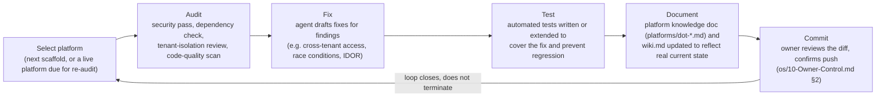

# 20 — Continuous Evolution

Purpose: to describe how the Dot Ecosystem is meant to keep improving after this session ends — the platform-loop pattern (audit → fix → test → document → commit) as a repeatable cycle rather than a one-time event, how Dot.Brain's Knowledge Pack ingestion is meant to eventually let platforms teach each other, and what "done" is never allowed to mean for a system built to run for twenty years.

> **Related documents:** [os/01-Executive-Vision.md](01-Executive-Vision.md) — the horizon this cycle serves · [os/09-Business-Operating-System.md](09-Business-Operating-System.md) §3 — the cadence table this loop is scheduled into · [os/10-Owner-Control.md](10-Owner-Control.md) — the review gate every cycle of this loop passes through · [brain.dkp.md](../brain.dkp.md) — the Knowledge Pack protocol §4 describes platforms eventually using to teach each other · [brain.evolution.md](../brain.evolution.md) — Dot.Brain's own evolution-vs-drift discipline, the closest sibling framework · [brain.failures.md](../brain.failures.md) — how incidents become knowledge, the anti-fragility principle this document extends to the whole ecosystem · [MANIFESTO.md](../MANIFESTO.md) principle 6.

---

## 1. The platform-loop pattern

This session established the pattern, one platform at a time, fifteen times: **audit → fix → test → document → commit**, each step gated by owner review before the next platform starts. It is not a one-time onboarding ritual for a new platform — it is the unit of work this ecosystem runs on, repeatable indefinitely on any platform, live or newly built.


*Five steps, one platform, owner sign-off before the diff ever leaves the local branch — then the loop selects its next platform and runs again.*

Each step matters in this order specifically: fixing before testing invites a fix that looks right but isn't verified; documenting before or instead of testing produces documentation of intent rather than of verified behavior; committing before owner review breaks the entire control model in [os/10-Owner-Control.md](10-Owner-Control.md). The order is not arbitrary sequencing — it is the order that makes each step trustworthy input to the next.

## 2. What the loop has already proven, and what's next

Fifteen platforms have been through at least one full pass of this loop: Dot.Billing, Dot.Ehail, Dot.Auction, Dot.Agents, Dot.Emall, Dot.Notify, Dot.Pulse, Dot.Analytics, Dot.Mines, Dot.Projects, Dot.Tasks, Dot.Finance, Dot.Charts, Dot.Central, and Dot.Design. The loop found real, previously-shipped vulnerabilities in at least five of them — cross-tenant task access (Dot.Tasks), a checkout race condition (Dot.Emall), IDOR exposure hardened from scratch (Dot.Finance), reserve-price leakage (Dot.Auction), and missing tenant-scoping (Dot.Mines). That hit rate — five real findings across fifteen platforms on a first pass — is itself the argument for why the loop must repeat rather than run once: a platform audited once and never again is a platform whose findings rate is unknown for every day after the audit.

Five platforms have not yet had a first pass: Dot.Plug, Dot.Farms, Dot.HR, Dot.Dopemine, Dot.Memory — currently empty scaffolds. They enter the same loop as the first fifteen, in the order the monthly backlog review ([os/09-Business-Operating-System.md](09-Business-Operating-System.md) §3) sets, with no shortcut through audit or test on the theory that "it's new, so it's clean" — new code has different failure modes (missing tenant-scoping from day one, unfinished auth) but not fewer of them.

## 3. The loop repeats — this is the load-bearing claim

A platform that passed audit once is not "secure" in perpetuity; it is secure as of the commit that closed that audit. Dependencies get updated, features get added, and the same category of bug that was fixed once (a missing tenant-scope check, a race condition under load) can be reintroduced by a later, unrelated change that nobody thought to re-audit against. The loop's repeat trigger is therefore not purely calendar-driven:

| Trigger | Example |
|---|---|
| Scheduled re-audit | Each live platform gets a full loop pass at least annually, tracked via the quarterly ecosystem review ([os/09-Business-Operating-System.md](09-Business-Operating-System.md) §3) |
| Significant feature addition | Any platform that adds a new tenant-facing surface (new billing flow, new data export, new API endpoint) gets an audit pass scoped to that surface before it ships |
| A finding on one platform that generalizes | If an audit finds a category of bug (e.g., a tenant-scoping gap) on one platform, every other live platform gets checked for the same category — this is the ecosystem-level version of the anti-fragility principle in MANIFESTO principle 6: one failure strengthens the whole ecosystem, not just the platform where it was found |
| Owner-initiated | The owner can trigger a loop pass on any platform at any time, no justification required |

## 4. How Dot.Brain lets platforms eventually teach each other

Today, the loop's findings live mostly in commit history and per-platform documentation. The designed end state — not yet fully realized, and explicitly marked forward-looking — is that a finding from one platform's loop pass becomes ecosystem-wide knowledge through the same Knowledge Pack protocol Dot.Brain already defines for platform-to-platform intelligence ([brain.dkp.md](../brain.dkp.md)):

```mermaid
sequenceDiagram
    participant P1 as Platform A (e.g. Dot.Tasks)
    participant B as Dot.Brain
    participant P2 as Platform B (e.g. Dot.Mines)
    P1->>B: Publish Knowledge Pack — incident payload<br/>(cross-tenant access finding, root cause, fix pattern)
    B->>B: Validate, relate to graph,<br/>compute confidence, generate Why block
    B->>P2: Pull Request — "this class of vulnerability<br/>found and fixed elsewhere; check for the same pattern here"
    P2->>P2: Owner reviews the PR, accepts, rejects, or defers<br/>(P2's own team — here, the same owner — decides; Dot.Brain never merges directly)
    P2-->>B: Outcome reported back (fixed, false positive, deferred)
    B->>B: Confidence and trust scores update from the real outcome
```
*This is the mechanism by which the tenant-scoping gap found in Dot.Mines could, in the designed end state, become a proactive check surfaced to every other platform holding tenant-scoped data — without a human having to remember to go looking.*

This is forward-looking design, not yet-observed behavior: as of this document's last review, the fifteen audited platforms' findings have not yet been round-tripped through DKP packs into Dot.Brain and back out as cross-platform recommendations. Doing so is the natural next extension of the loop in §1 — audit findings are exactly the kind of high-confidence, well-evidenced knowledge DKP packs are designed to carry (`incident` payload type, per [platforms/dot-brain.md](../platforms/dot-brain.md) §4) — but it has not been wired up yet, and this document does not claim otherwise.

## 5. What "done" never means

For a system designed to run for twenty years, "done" cannot mean any of the following, and this document exists partly to say so explicitly so it cannot be quietly assumed later:

- **"Audited" does not mean "permanently secure.**" It means secure as of that commit, under that audit's scope. See §3.
- **"Documented" does not mean "will stay accurate.**" A platform knowledge doc that isn't updated when the platform changes becomes actively misleading — worse than no documentation, because it's trusted. Documentation updates are part of the loop (§1), not a separate, skippable step.
- **"Fifteen platforms built" does not mean "the ecosystem is fifteen-twentieths complete.**" The five remaining scaffolds are not a finish line to cross; once built, they enter the same repeating loop as the first fifteen, and the ecosystem's actual state of completeness is better measured by loop-freshness across all twenty than by a platform count.
- **"The brain is fully speced" does not mean "the brain is finished.**" ~35 `brain.*.md` documents, 21 platform docs, and 11 ADRs describe a system whose entire design premise (MANIFESTO principle 1: every interaction makes the ecosystem smarter) is that it keeps learning. A fully-speced brain that stops ingesting knowledge has stopped doing the one thing it exists to do.
- **"This `os/` document set is written" does not mean "the strategy is fixed.**" These four documents are dated 2026-08-01 and versioned 1.0.0 for a reason — they are expected to be revised as the ecosystem's real state changes, the same discipline MANIFESTO applies to every other document in this repository.

## 6. What continuous evolution costs, honestly

Running the loop repeatedly, forever, on twenty platforms is not free. It costs owner review time (see [os/09-Business-Operating-System.md](09-Business-Operating-System.md) §7 for the health signals that catch this becoming a bottleneck) and it means "feature velocity" is permanently shared with "re-audit velocity" rather than treated as a phase that ends once the product is "mature." That trade is deliberate: the alternative — auditing once and trusting the result indefinitely — is precisely the failure mode that produced the five real vulnerabilities this session found in code that had, by definition, already shipped once without being caught.

---

## Change Log

| Version | Date | Author | Change |
|---|---|---|---|
| 1.0.0 | 2026-08-01 | Owner + AI (os/ document set, session 1) | Initial formalization of the platform-loop as a repeatable cycle, with the DKP cross-platform-teaching mechanism marked explicitly as forward-looking design, not yet-observed behavior |

## Open Questions

| Question | Owner |
|---|---|
| What is the actual re-audit interval per platform — is annual sufficient, or should platforms handling money or PII (Dot.Billing, Dot.Finance, the future Dot.HR) get a tighter cycle? | Sakhile Bhayi |
| When does the round-trip in §4 (audit finding → DKP pack → cross-platform PR) actually get built, and does it require new Dot.Brain capability or just disciplined use of the existing `incident` payload type? | Sakhile Bhayi |
| Should loop-freshness (time since each platform's last full pass) become a tracked metric surfaced in the weekly platform health scan ([os/09-Business-Operating-System.md](09-Business-Operating-System.md) §3), rather than living only in commit history? | Sakhile Bhayi |
