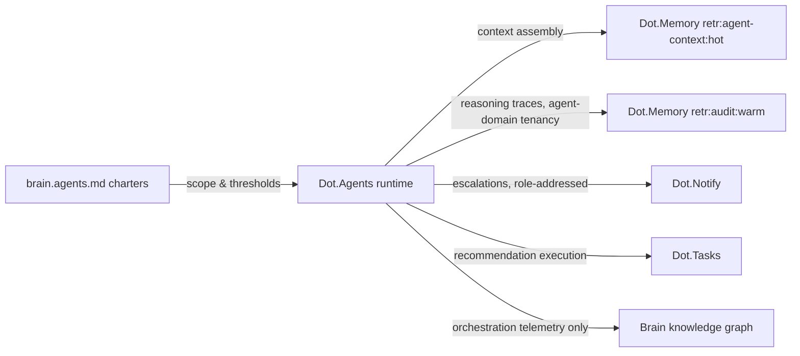

# Dot.Agents

> **Platform-owned source:** [Dot.Agents's wiki.md](https://github.com/sakhilebhayi/Dot.Agents/blob/main/wiki.md) — the platform's own knowledge home. This document is Dot.Brain's ingested view; the wiki is authoritative for what the platform actually is.

## 1. Purpose & Business Domain

AI agent orchestration: the runtime the Brain's colony executes on — agent lifecycle, task routing, tool-call mediation, and the execution telemetry that makes agent behavior auditable. Owns the orchestration domain. Like Dot.Memory, this is a self-hosting integration, and the same layer separation applies: **Dot.Agents the runtime executes agents without owning their knowledge; Dot.Agents the platform publishes only orchestration telemetry.** What an agent concluded belongs to that agent's domain and its platform's packs; *how the run went* — latency, tool-call failure rates, escalation frequency, context-staleness incidents — belongs here. The **colony runtime contract** (registry gap) is closed in §7, and the five domain-agent assignments accumulated across platform sessions are recorded in §7.1 for promotion into brain.agents.md.

## 2. Entities Owned

| Entity | Graph node type | Natural key | Notes |
|---|---|---|---|
| Agent instance | `entity:agent` | agent ID + charter version | Runtime registration of a chartered agent |
| Runtime contract | `entity:asset` | `runc:<agent-class>` | The colony runtime contract's unit (§7) |
| Run observation | `observation` | agent × window | Execution telemetry aggregates — never reasoning content |
| Escalation outcome | `outcome` | escalation ID | Human-decision results on escalated recommendations |
| Agent reasoning traces | — | — | **Never graphed as Dot.Agents content.** Traces are audit-logged to Dot.Memory (`retr:audit:warm`) under the *agent's domain* tenancy; the runtime carries them without claiming them |

## 3. Events Emitted

| Event | Trigger | Consumers | Frequency |
|---|---|---|---|
| `agents.run.contract_breach` | Agent exceeds runtime contract bounds (§7) | Colony Agent, SRE Lead | low — target 0 |
| `agents.escalation.raised` | Confidence/impact/ethics threshold trips per charter | Assigned human approver, Notify (role-addressed) | per escalation |
| `agents.charter.drift_detected` | Runtime behavior diverges from charter scope | Governance review queue | rare — mandatory pack |

## 4. Knowledge Packs Published

| Payload type | Cadence | Example pack ID |
|---|---|---|
| observation (colony execution aggregates) | weekly | `dkp:agents:obs:2026-07-06:0012` |
| insight (orchestration findings — routing, batching, escalation patterns) | per finding | `dkp:agents:ins:2026-05-19:0002` |
| outcome (escalation decisions, contract attainment) | per period | `dkp:agents:out:2026-07-28:0001` |
| incident (charter drift, runaway runs, contract breaches) | per incident | `dkp:agents:inc:2026-03-09:0001` |

## 5. Intelligence Consumed

| Recommendation type | Metric expected to move | Baseline |
|---|---|---|
| Routing-policy suggestions (which agent class handles which task shapes) | `colony.task_routing_accuracy` | 2026 H1 |
| Escalation-threshold calibration (per-charter, evidence-backed) | `colony.escalation_precision` | per agent class |
| Context-assembly batching (jointly with Memory's SLA classes) | `colony.run_latency_p95` | per class |

## 6. Cross-Platform Relationships



Charters govern *what* an agent may do (brain.agents.md); the runtime contract governs *how* it runs (§7). Drift between the two is a governance event, not an ops event: `agents.charter.drift_detected` files a mandatory incident pack.

## 7. Tenancy Model & Colony Runtime Contract (registry gap closed)

Tenant key = agent's domain platform (an agent working Farms data runs under Farms tenancy — the runtime never launders tenancy through itself); Dot.Agents' own telemetry is infrastructure data, floors n/a by construction. The **colony runtime contract** — every chartered agent class runs under a named `runc:<agent-class>` contract binding four things:

| Bound | Contract term | Breach consequence |
|---|---|---|
| Resource | Per-run tool-call budget and wall-clock ceiling per class | Run suspended, `agents.run.contract_breach`, human resume required |
| Context | Assembled context must meet Memory's `retr:agent-context:hot` freshness; stale context ⇒ mandatory disclosure in output (the 2026-01 Memory incident lesson, enforced runtime-side) | Output flagged degraded; recommendations from stale context capped below the 0.80 recommendable line |
| Escalation | Charter thresholds (confidence, impact, ethics-guard trips) mechanically enforced — an agent *cannot* ship past its charter's ceiling; escalation is a runtime function, not agent discretion | n/a — by construction |
| Audit | Every run's trace lands in `retr:audit:warm` under agent-domain tenancy before the run's outputs are usable | Outputs withheld until trace is durable |

Contract governance: contracts owned by the Colony Agent, co-signed by each charter's human approver, reviewed semi-annually alongside charter reviews.

### 7.1 Domain-agent assignments recorded (for promotion into brain.agents.md)

Platform integration sessions corrected five registry placeholders; the runtime records the operating assignments pending brain.agents.md's next touch:

| Agent | Platform(s) | Charter status |
|---|---|---|
| Documentation | dot-notify | charter exists |
| People | dot-hr | chartered 2026-08-01 ([charter](../agents/people.charter.md)) |
| Logistics | dot-ehail | chartered 2026-08-01 ([charter](../agents/logistics.charter.md)) |
| Delivery | dot-projects, dot-tasks | chartered 2026-08-01 ([charter](../agents/delivery.charter.md)) |
| Extension | dot-plug | chartered 2026-08-01 ([charter](../agents/extension.charter.md)) |

Runtime rule: agents with pending charters run under the most restrictive default contract (`runc:provisional` — lowest budgets, all recommendations escalated) until their charter lands. **Escalation cleared 2026-08-01:** all four charters authored per [ADR-0010](../adr/ADR-0010-domain-agent-roster-extension.md); the four agents exit `runc:provisional` on charter co-signature and remain in trust probation (0.50) until earned.

## 8. Dopamine Surface

None for end users; withheld for operators: per-agent "productivity" leaderboards (recommendation-count targets are the proxy failure applied to agents — an agent optimized for shipping recommendations ships worse ones). Shared: escalation-precision and outcome-verification rates per class, plainly.

## 9. Active Recommendations

Maintained by the Registry Agent. Current: escalation-threshold calibration for Registry Agent class `verified` — see §13; context-assembly batching `open` jointly with Memory (expiry 2026-09-30).

## 10. Incident History Summary

One incident pack (2026-03): a retry loop on a failing tool call consumed a class's full daily budget in 40 minutes — no data harm, but it produced the resource bound's current design (per-run ceilings rather than daily pools, so one runaway run cannot starve siblings). Consumed: Memory's degraded-mode lesson (context bound), Notify's attention economics (escalations are role-addressed and never absence-triggered).

## 11. Domain Metrics (registered per brain.metrics.md §4.8)

| ID | Type | Definition |
|---|---|---|
| `colony.escalation_precision` | ratio | Escalations where the human changed or blocked the action / all escalations, per class, monthly — measures thresholds neither crying wolf nor rubber-stamping |
| `colony.task_routing_accuracy` | ratio | Tasks completed by first-routed agent class without re-route, weekly |
| `colony.run_latency_p95` | duration | End-to-end run latency per agent class, p95 |

## 12. Manifest (platform.dkp.json example)

```json
{
  "platform_id": "dot-agents",
  "dkp_version": "1.0.0",
  "signing_key_ref": "vault://keys/dot-agents/dkp-signing/v1",
  "publishes": ["observation", "insight", "outcome", "incident"],
  "subscribes": ["routing-policy", "escalation-calibration", "context-batching"],
  "schemas": { "knowledge-pack": "1.0.0", "metric": "1.0.0" },
  "default_classification": "ecosystem",
  "tenancy": {
    "key": "infrastructure",
    "aggregation_floor": 0,
    "publication_rules": [
      { "rule": "telemetry-only-no-reasoning-content", "note": "traces audit-logged under agent-domain tenancy, never published as agents packs", "enforcement": "by-construction" },
      { "rule": "provisional-contract-for-uncharted-agents", "enforcement": "runtime" }
    ]
  }
}
```

## 13. Worked round-trip

1. **Pack:** `dkp:agents:obs:2026-07-06:0012` — escalation aggregates: Registry Agent class escalations approved-unchanged at 96% over two quarters — thresholds set for a younger, less-verified corpus now rubber-stamp.
2. **Validation → graph:** `OBSERVED_WITH` edge between threshold setting and unchanged-approval rate, 0.74; corroborated by the same pattern in outcome packs from two independent quarters (×1.10 → 0.81).
3. **PR back (escalation calibration):** raise the Registry Agent class's impact-escalation floor for routine registry updates (scope-limited: metric registrations and status advances only; ethics-guard and confidence thresholds untouched); confidence 0.81, impact `colony.escalation_precision` +20 pts predicted, guards: zero governance-relevant actions auto-shipped (audit sampling ×4 for one quarter), expiry 60 days, co-signed by the charter's human approver per §7.
4. **Outcome:** `dkp:agents:out:2026-07-28:0001` — escalation volume −38%, precision 0.04 → 0.31, audit sampling found zero improper auto-ships. Human attention reallocated to the escalations that actually needed it — the colony learning to calibrate its own asking.

## Change Log

| Version | Date | Author | Change |
|---|---|---|---|
| 1.0.0 | 2026-08-01 | Platform Integrator (prompt 05, AI) | Initial integration package: runtime/knowledge layer separation, colony runtime contract closed (four bounds: resource, context, escalation, audit; `runc:provisional` default for uncharted agents), five domain-agent assignments recorded for brain.agents.md promotion (four charters pending — operational escalation), 3 domain metrics, worked round-trip |
| 1.0.1 | 2026-08-01 | Agent Colony Architect (prompt 04, AI) | §7.1 escalation cleared: four charters authored (ADR-0010); charter-authoring OQ struck |

| 1.0.2 | 2026-08-01 | Repository Steward Agent | Linked to Dot.Agents's own wiki.md (platform repo) as the platform-owned source of truth |

## Open Questions

| Question | Owner → Approver |
|---|---|
| Third-party extension-hosted agents (Dot.Plug): do they run on this runtime under `runc:provisional`, or is a separate `runc:external` class with stricter audit needed? | Colony Agent → Security Officer |
| ~~Charter authoring for People, Logistics, Delivery, Extension: single batch session (prompt 04) or per-domain sessions?~~ **Resolved 2026-08-01:** single batch session per [ADR-0010](../adr/ADR-0010-domain-agent-roster-extension.md) | Colony Agent → Governance Board |
