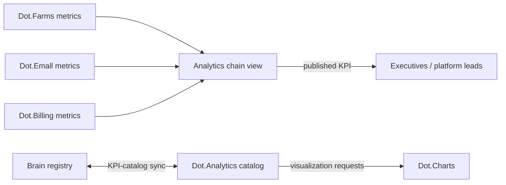

# Dot.Analytics

## 1. Purpose & Business Domain

Business intelligence and KPI reporting across the ecosystem. Owns the reporting domain: KPI definitions as published to humans, dashboard products, and cross-platform composite views. Analytics does not own any operational data — every number it shows is derived from a metric owned elsewhere; its distinct contribution is *composition* (chain-level views, §6) and *presentation* (per brain.design.md). The boundary with the Brain itself matters most here: the Brain reasons over evidence; Analytics reports agreed KPIs. The KPI-catalog sync (§7 of the registry's gap column) is this document's closure.

## 2. Entities Owned

| Entity | Graph node type | Natural key | Notes |
|---|---|---|---|
| KPI definition | `entity:asset` | `kpi:<domain>:<name>` | Human-facing definition, always mapped to a source metric ID |
| Dashboard product | `entity:asset` | product ID | Question-shaped per design §4 |
| Composite view | `entity:asset` | view ID | Multi-platform assemblage, e.g. the chain view (§6) |
| View-usage observation | `observation` | product + window | Aggregate audience only |
| Reporting-accuracy outcome | `outcome` | KPI + period | Restated vs. first-published figures |

## 3. Events Emitted

| Event | Trigger | Consumers | Frequency |
|---|---|---|---|
| `analytics.kpi.published/restated` | KPI period close / correction | Brain ingestion, subscribing platforms | monthly cycles |
| `analytics.view.created/retired` | Composite-view lifecycle | Brain, Dot.Design | low |
| `analytics.catalog.synced` | KPI-catalog sync run (§7) | Brain registry, Dot.Charts | daily |

## 4. Knowledge Packs Published

| Payload type | Cadence | Example pack ID |
|---|---|---|
| observation (KPI-period aggregates, view-usage) | monthly / weekly | `dkp:analytics:obs:2026-07-01:0009` |
| insight (cross-KPI correlation findings) | per finding | `dkp:analytics:ins:2026-05-12:0001` |
| outcome (restatement / accuracy verifications) | per period | `dkp:analytics:out:2026-07-05:0002` |
| incident (reporting errors, restatements above threshold) | per incident | `dkp:analytics:inc:2026-04-02:0001` |

Analytics insights carry an inherited-provenance obligation: a cross-KPI correlation pack must cite the source platforms' pack IDs in its W5 chain, so graph confidence composes from the originals rather than restarting at Analytics' trust score.

## 5. Intelligence Consumed

| Recommendation type | Metric expected to move | Baseline |
|---|---|---|
| Dashboard rationalization (retire unused views) | `analytics.view_utilization_rate` | 2026 H1 |
| KPI-definition drift alerts | `analytics.restatement_rate` | 2026 H1 |
| Composite-view composition suggestions (which owned segments answer an executive question) | `analytics.view_utilization_rate` | per view |

## 6. Cross-Platform Relationships & the Chain View



**The harvest→payout chain view (delegated by Billing §6):** Analytics owns the composite `analytics.view:value-chain:agri` assembling four owned segments — Farms' `agriculture.harvest_logistics_delay_p50` and `produce_time_to_market_p50`, Emall's `commerce.listing_time_to_first_order_p50`, Billing's `finance.settlement_latency_p95` and `payout_delay_p50`. Composition rules: each segment cites its owning platform's metric ID unchanged (no re-derivation); the chain total is a *view*, never a new registered metric; a segment owner's restatement automatically restates the chain. This is the pattern for all future chain views — Analytics composes, never re-measures.

## 7. Tenancy Model & KPI-Catalog Sync (registry gap closed)

Tenant key = subscribing organization; views scoped per tenant, cross-tenant composites only from `ecosystem`-classified aggregates, floors inherited from each source platform (Analytics never relaxes a source floor — the strictest input floor governs the composite).

**KPI-catalog sync contract:** every Analytics KPI definition must map 1:1 to a registered metric ID (brain.metrics.md §4.8/§4.9 or a platform doc §11). Daily sync job diffs the catalog against the registry both ways: a KPI with no registered source metric is a **defect** (blocked from publication); a registered metric with no KPI is fine (not everything is reported). Renames and definition changes flow registry → catalog only; Analytics may not fork a definition. Sync results emitted as `analytics.catalog.synced` with a drift count; drift > 0 for two consecutive runs opens an F-KNOW incident.

## 8. Dopamine Surface

Shares: view-utilization and restatement-rate performance (its own product quality). Withheld: viewer leaderboards, "most-watched dashboard" rankings, per-user viewing streaks — attention to a dashboard is not an outcome, and rewarding it would manufacture exactly the busy-but-off-course failure vision's anti-goals name.

## 9. Active Recommendations

Maintained by the Registry Agent. Current: dashboard rationalization `open` (12 candidate views, expiry 2026-09-15); chain-view composition for the agri value chain `verified` — see §13.

## 10. Incident History Summary

One incident pack (2026-04): a KPI published from a stale metric definition after a registry rename — F-KNOW; direct cause of the sync contract in §7 (registry→catalog one-way flow, drift-count alarm). No consumed incidents yet.

## 11. Domain Metrics (registered per brain.metrics.md §4.8)

| ID | Type | Definition |
|---|---|---|
| `analytics.catalog_drift_count` | count | KPIs without a registered source metric, per sync run — target 0 |
| `analytics.restatement_rate` | ratio | Restated KPI-periods / published KPI-periods, quarterly |
| `analytics.view_utilization_rate` | ratio | Views opened by ≥ 1 intended audience member in period / active views |

## 12. Manifest (platform.dkp.json example)

```json
{
  "platform_id": "dot-analytics",
  "dkp_version": "1.0.0",
  "signing_key_ref": "vault://keys/dot-analytics/dkp-signing/v1",
  "publishes": ["observation", "insight", "outcome", "incident"],
  "subscribes": ["dashboard-rationalization", "kpi-drift-alert", "view-composition"],
  "schemas": { "knowledge-pack": "1.0.0", "metric": "1.0.0" },
  "default_classification": "ecosystem",
  "tenancy": {
    "key": "org_id",
    "aggregation_floor": 20,
    "floor_inheritance": "strictest-source"
  }
}
```

## 13. Worked round-trip

The value chain's final link — the view that makes the first three links visible:

1. **Pack:** `dkp:analytics:obs:2026-07-01:0009` — view-usage aggregates plus the assembled agri chain view's first full period; every segment cites its source pack ID (Farms/Emall/Billing outcome packs from the three prior round-trips), so W5 provenance composes.
2. **Validation → graph:** composite-view node linked to all five source metrics; the Brain can now see the chain end-to-end without any platform owning another's segment.
3. **PR back:** view-composition — add Billing's `payout_delay_p50` as the chain's terminal segment (it was initially drafted ending at settlement); confidence 0.81, impact `analytics.view_utilization_rate` for the chain view, guard `analytics.restatement_rate` flat.
4. **Outcome:** `dkp:analytics:out:2026-07-05:0002` — chain view opened by all four intended executive audiences in its first period; utilization 1.0 for the cohort; zero restatements. The 2026 wet-season story — harvest to payout, four platforms, three verified interventions — is now one legible view.

## Change Log

| Version | Date | Author | Change |
|---|---|---|---|
| 1.0.0 | 2026-08-01 | Platform Integrator (prompt 05, AI) | Initial integration package: reporting-domain ownership (composes, never re-measures), KPI-catalog sync contract (registry gap closed), agri chain view as delegated Analytics product, inherited-provenance rule for insight packs, strictest-source floor inheritance, 3 domain metrics, worked round-trip |
| 1.0.1 | 2026-08-01 | Repository Reviewer (prompt 07, AI) | Rendering-path OQ reworded (Charts misattribution corrected) and struck (resolved by dot-design.md §7.1) |

## Open Questions

| Question | Owner → Approver |
|---|---|
| ~~Chart rendering: does Dot.Charts consume the catalog directly or via Analytics view definitions?~~ **Resolved 2026-08-01** by [dot-design.md](dot-design.md) §7.1 — and reworded: the question was misattributed to Dot.Charts (a trading platform) during its domain correction; the real question was rendering-path policy. Answer: all consumers render via `analytics.view:*` endpoints, never the catalog directly | Analytics Agent → Chief Architect |
| Should chain-view composition rules (§6) be promoted to a pattern entry (P-) once a second chain view replicates them? | Architecture Agent → Chief Architect |
