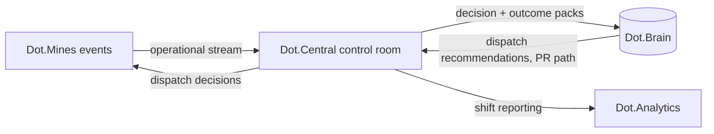

# Dot.Central

> **Platform-owned source:** [Dot.Central's wiki.md](https://github.com/sakhilebhayi/Dot.Central/blob/main/wiki.md) — the platform's own knowledge home. This document is Dot.Brain's ingested view; the wiki is authoritative for what the platform actually is.

## 1. Purpose & Business Domain

Operational Intelligence Center — real-time dispatch, fleet monitoring, and control-room decision support for heavy operations (today: mining sites running Dot.Mines). Central owns the *decision moment*: it consumes operational events, surfaces the control-room picture, and executes dispatch decisions whose outcomes flow back as knowledge. It shares the Mining domain agent with Dot.Mines: Mines owns the operational *record*; Central owns the operational *decision*.

## 2. Entities Owned

| Entity | Graph node type | Natural key | Notes |
|---|---|---|---|
| Control room | `entity:site` | `dot:node:mining:controlroom:<id>` | Tenant root, maps 1:n to Mines sites |
| Dispatch decision | `entity:process` | room + timestamp + seq | The unit of record — see workflow node IDs below |
| Dispatch workflow | `entity:process` | `dot:node:mining:dispatch:<site>:<workflow>` | **Registry open-gap closure:** canonical ID scheme `dot:node:mining:dispatch:<site>:<assign\|reroute\|hold\|stagger>` — four workflow types, one node each per site, decisions link to them via `PART_OF` |
| Alert | `observation` | room + timestamp | Threshold and sentinel trips |
| Operator session | `entity:process` | operator + shift | Control-room staffing context (no individual performance surface — §8) |

## 3. Events Emitted

| Event | Trigger | Consumers | Frequency |
|---|---|---|---|
| `mining.dispatch.decided` | Decision executed | Brain ingestion, Dot.Mines | ~10³/day |
| `mining.dispatch.outcome` | Cycle(s) affected by a decision close | Brain (verification path) | ~10³/day |
| `mining.alert.raised/cleared` | Threshold/sentinel trip | Brain, control room | bursty |
| `mining.controlroom.shift_summary` | Shift end | Brain, Dot.Analytics | 2–3/room/day |

## 4. Knowledge Packs Published

| Payload type | Cadence | Example pack ID |
|---|---|---|
| observation (decision + outcome telemetry) | hourly batch | `dkp:central:obs:2026-07-22:0088` |
| insight (dispatch-pattern findings) | per finding | `dkp:central:ins:2026-05-09:0003` |
| outcome (dispatch-recommendation verification) | per verified recommendation | `dkp:central:out:2026-07-30:0002` |
| incident (misroutes, alert storms) | per incident | `dkp:central:inc:2026-02-04:0002` — the F-PROC misroute, from the receiving side |

## 5. Intelligence Consumed

| Recommendation type | Metric expected to move | Baseline |
|---|---|---|
| Dispatch load-balancing | `mining.cycle_time_p50` (defined in [dot-mines.md](dot-mines.md) §11) | per site/shift |
| Alert-threshold tuning | `central.alert_precision` | 2026 H1 |
| Staffing/shift-pattern advisories | `central.decision_latency_p95` | per room |

## 6. Cross-Platform Relationships & the Loop-Latency Contract



**Loop-latency contract (canonical statement — settles the dot-mines open question; dot-mines defers here):**

- **Operational lane** (Mines events → Central decision): p95 ≤ 30 s, direct platform-to-platform — this lane never routes through the Brain; the Brain is not in the real-time path, by design.
- **Knowledge lane** (Central packs → Brain, Brain PRs → Central): standard contracts apply (`dkp.ingest_latency_p95` ≤ 15 min; recommendations via W5, decided in days). The two lanes never blur: a Brain recommendation cannot steer an in-flight dispatch, and real-time telemetry becomes knowledge only via signed packs through the front door.

## 7. Tenancy Model

Tenant key = control-room ID, sub-scoped to Mines site IDs; topics `mining.<room>.<event>`. Central inherits the contractor sub-tenant tagging of the Mines data it processes; cross-room aggregation observes the n ≥ 20 floor.

## 8. Dopamine Surface

Shares: alert-response completeness at room level (outcome-anchored). Explicitly withheld: individual operator decision-speed or override metrics — mirroring dot-mines' leaderboard refusal; rewarding fast dispatch decisions buys haste with safety, and operator overrides of automation are Loop B teaching signal, never a performance demerit ([brain.operating_model.md](../brain.operating_model.md) §5's blameless symmetry).

## 9. Active Recommendations

Maintained by the Registry Agent. Current: dispatch load-balancing `open` (expiry 2026-08-20); alert-threshold tuning `verified` (alert precision 0.61 → 0.78).

## 10. Incident History Summary

One incident pack (2026): dispatch misroute F-PROC (shared with dot-mines — Central's decision, Mines' consequence; single failure-catalog entry, two platform perspectives, blameless on both). Lesson: reroute workflows require a haul-cycle state check — now a validation rule on `dot:node:mining:dispatch:*:reroute` decisions.

## 11. Domain Metrics (registered per brain.metrics.md §4.8)

| ID | Type | Definition |
|---|---|---|
| `central.decision_latency_p95` | duration | Event arrival to dispatch decision executed, p95 per room |
| `central.alert_precision` | ratio | Alerts leading to an action or explicit stand-down / total alerts |
| `central.dispatch_override_rate` | ratio | Operator overrides of recommended dispatch — Loop B input, reviewed not targeted |

## 12. Manifest (platform.dkp.json example)

```json
{
  "platform_id": "dot-central",
  "dkp_version": "1.0.0",
  "signing_key_ref": "vault://keys/dot-central/dkp-signing/v1",
  "publishes": ["observation", "insight", "outcome", "incident"],
  "subscribes": ["dispatch-balancing", "alert-threshold-tuning", "staffing-advisory"],
  "schemas": { "knowledge-pack": "1.0.0", "metric": "1.0.0" },
  "tenancy": { "key": "controlroom_id", "aggregation_floor": 20, "subtenant": "site_id" }
}
```

## 13. Worked round-trip

1. **Pack:** `dkp:central:obs:2026-07-22:0088` — 940 dispatch decisions + outcomes, Kolomela room, one week; `mining.dispatch.decided`/`outcome` pairs joined; signed, `ecosystem`.
2. **Validation → graph:** decision nodes linked `PART_OF` → `dot:node:mining:dispatch:kolomela:reroute` (the workflow-node scheme in action); `OBSERVED_WITH` edge between post-rain reroute clustering and cycle-time variance at 0.68.
3. **PR back:** dispatch load-balancing recommendation — stagger reroutes across benches during moisture-flagged shifts (evidence chain cites the P-2026-001 pattern's moisture ancestry, conditions checked); confidence 0.81, impact `mining.cycle_time_p50` −8% predicted, guard `central.alert_precision` flat, expiry 21 days.
4. **Outcome:** control room accepts; `dkp:central:out:*` verification due next month — the loop's knowledge lane closing at knowledge speed while the operational lane keeps 30-second time.

## Change Log

| Version | Date | Author | Change |
|---|---|---|---|
| 1.0.0 | 2026-08-01 | Platform Integrator (prompt 05, AI) | Initial integration package: decision-moment ownership, dispatch-workflow node ID scheme (registry gap closed), canonical two-lane loop-latency contract, tenancy, withheld operator-speed surface, 3 domain metrics, manifest, worked round-trip |

| 1.0.1 | 2026-08-01 | Repository Steward Agent | Linked to Dot.Central's own wiki.md (platform repo) as the platform-owned source of truth |

## Open Questions

| Question | Owner → Approver |
|---|---|
| Operational-lane 30 s p95 is asserted from current control-room practice — needs measurement once `central.decision_latency_p95` has a quarter of data | Mining Agent → SRE Lead |
| Should `central.dispatch_override_rate` feed the colony's Loop B directly (structured override reasons), reusing brain.learning.md's taxonomy question? | Learning Agent → Chief AI Engineer |
| **Domain mismatch (flagged 2026-08-01):** Dot.Central's actual repository implements an AI-agent command center (conversations, agent skills, usage logs) — not the mining-dispatch/control-room platform this document describes. Either this document is describing a future rebuild, or the registry entry is wrong. Needs human reconciliation before this doc's contents are treated as authoritative. See [Dot.Central's wiki.md](https://github.com/sakhilebhayi/Dot.Central/blob/main/wiki.md) for what's actually built. | Registry Agent → Chief Knowledge Engineer |
