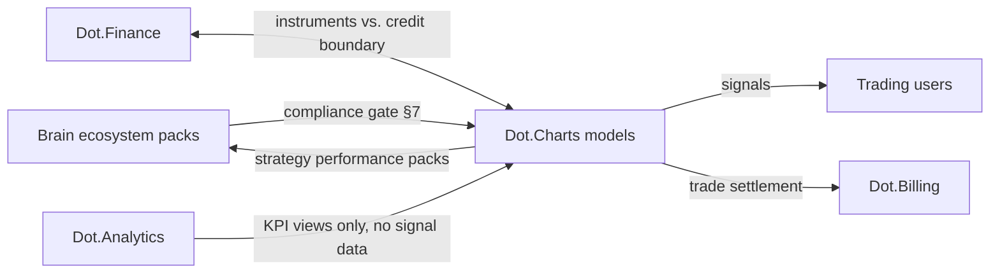

# Dot.Charts

> **Platform-owned source:** [Dot.Charts's wiki.md](https://github.com/sakhilebhayi/ChartSense/blob/main/wiki.md) — the platform's own knowledge home. This document is Dot.Brain's ingested view; the wiki is authoritative for what the platform actually is.

## 1. Purpose & Business Domain

AI-powered trading: market analysis, signal generation, and trade execution support for retail and institutional users across instruments (equities, commodities — including the agri and mining commodities the ecosystem's platforms physically produce). Owns the trading domain: instruments-as-watched, signals, and execution outcomes. Charts is the ecosystem's only *regulated-market* platform, which is why its registry gap is the **compliance gate** (closed in §7): a wired, auditable checkpoint between anything the Brain knows and anything a trading surface shows, because knowledge that is routine elsewhere in the ecosystem (a harvest forecast, a mine's production outlook) can constitute **material non-public information** in a market context. The gate's core rule: *the Brain may make Charts smarter about markets; it may never make Charts' users insiders.*

## 2. Entities Owned

| Entity | Graph node type | Natural key | Notes |
|---|---|---|---|
| Watchlist instrument | `entity:asset` | instrument ID (exchange symbology) | Public-market referents only |
| Trading signal | `entity:process` | signal ID | Model-attributed, confidence-banded, compliance-tagged |
| Strategy template | `entity:asset` | strategy ID | Rules, not positions |
| Execution outcome | `outcome` | signal + period | Signal performance ground truth, incl. losses |
| Position / order (operational) | — | — | **Never graphed.** User positions are the platform's most sensitive data — the HR-exclusion pattern applied to financial holdings |
| Signal-performance observation | `observation` | strategy-class × instrument-class × window | Aggregate only, n ≥ 50 accounts |

## 3. Events Emitted

| Event | Trigger | Consumers | Frequency |
|---|---|---|---|
| `trading.signal.issued/expired` | Signal lifecycle | Brain (aggregate performance only), user surfaces | ~10²/day |
| `trading.compliance.gate_rejected` | Gate blocks an ingestion or signal | Security Agent, audit log | low — target 0 |
| `trading.strategy.performance_cycle` | Strategy evaluation close | Brain, Dot.Analytics | monthly |

## 4. Knowledge Packs Published

| Payload type | Cadence | Example pack ID |
|---|---|---|
| observation (strategy-class performance aggregates) | monthly | `dkp:charts:obs:2026-07-01:0007` |
| insight (signal-effectiveness findings) | per finding | `dkp:charts:ins:2026-06-16:0001` |
| outcome (recommendation verifications) | per verified recommendation | `dkp:charts:out:2026-07-27:0001` |
| incident (compliance events, model failures) | per incident | `dkp:charts:inc:2026-04-10:0001` |

Loss-honesty rule: strategy performance publishes with drawdowns and losing periods included — survivorship-filtered signal marketing is Charts' domain instantiation of success theater, and it is also a regulatory violation.

## 5. Intelligence Consumed — Through the Gate Only

| Recommendation type | Metric expected to move | Baseline |
|---|---|---|
| Model-feature suggestions (which *public* ecosystem aggregates improve signal quality) | `trading.signal_hit_rate` | 2026 H1, per strategy class |
| Strategy-retirement candidates (decayed edge) | `trading.strategy_decay_findings` | 2026 H1 |
| Risk-regime alerts (volatility-regime shifts from public market data) | `trading.risk_adjusted_return_p50` | per strategy class |

**The MNPI boundary:** Charts may consume ecosystem knowledge only if it is (a) `ecosystem`-classified, (b) already effectively public or non-material to any traded instrument, and (c) gate-stamped (§7). Farms' aggregate regional yield packs pass once publicly reportable; a single large farm's harvest outlook does not, ever. The gate decides per pack, and its decisions are logged for regulatory audit.

## 6. Cross-Platform Relationships



Seams: settlement is Billing's (same pattern as Emall/Auction/Ehail); Finance owns credit and financial products while Charts owns traded instruments (a margin-lending product would be Finance's, consuming Charts' exposure aggregates); Analytics may render Charts' *published* performance KPIs but signal internals never leave the platform. The regulatory-watch coordination flagged by Auction's sealed-bid OQ lands with Finance's session.

## 7. Tenancy Model & Compliance-Gate Wiring (registry gap closed)

Tenant key = account-holding organization or retail cohort; user positions and order flow never publish (type-level exclusion, §2). The **compliance gate** is wired as a bidirectional checkpoint — unique in the corpus, it governs *inbound* knowledge as strictly as outbound:

| Direction | Check | Failure behavior |
|---|---|---|
| Inbound | MNPI screen: is the pack's content material to any traded instrument and non-public? | Reject ingestion; log for audit; alert Security Agent |
| Inbound | Classification and floor verification against the owning platform's manifest | Reject ingestion |
| Outbound | Signal disclosure standards: confidence band, model attribution, and risk disclosure rendered with every signal (design §2 banding, regulatory form) | Reject signal publication |
| Outbound | Performance-claim audit: published performance must include losses (loss-honesty rule) | Reject pack |

Gate configuration is signed, versioned, and dual-controlled (Security Agent + Compliance role at the platform); no self-service changes. Every gate decision — pass or reject — is written to an append-only audit log with the pack ID and rule version, because the regulator's question is never "did you block it" but "prove it."

## 8. Dopamine Surface

Trading is gambling's regulatory next-door neighbor, and every prohibited-list pattern has a lucrative trading instantiation: trade-frequency streaks, P&L leaderboards, win-rate badges, one-tap re-entry nudges after losses. All withheld — most fail the prohibited list outright; the rest fail the acid test the moment "encourages overtrading" is named as the intent, and overtrading harms users *and* attracts regulatory action. Shared: strategy-class performance with full drawdown context, risk-adjusted (never raw-return) comparisons at strategy level. Signal notifications ride Notify's *actionable decision* class with position-relevance filtering — a signal alert is legitimate decision support; a "market is moving!" FOMO push is an absence-adjacent nudge and is not a registered class.

## 9. Active Recommendations

Maintained by the Registry Agent. Current: model-feature suggestion `verified` — see §13; strategy-retirement review for two decayed momentum strategies `open` (expiry 2026-09-02).

## 10. Incident History Summary

One incident pack (2026-04): a draft model-feature ingestion included a regional logistics aggregate whose window was narrow enough to be material to a listed logistics operator — caught by the inbound MNPI screen pre-ingestion, published as a near-miss (Pulse/HR/Auction precedent), lesson added instrument-mapping to the screen (every inbound pack is checked against a maintained map of ecosystem domains → listed instruments). Consumed: Billing's corridor-outage lesson for settlement resilience.

## 11. Domain Metrics (registered per brain.metrics.md §4.8)

| ID | Type | Definition |
|---|---|---|
| `trading.signal_hit_rate` | ratio | Signals meeting stated target within horizon / signals issued, per strategy class |
| `trading.risk_adjusted_return_p50` | ratio | Median risk-adjusted return per strategy class, monthly — never raw return |
| `trading.gate_rejection_count` | count | Gate rejections per quarter, by direction and rule — the guardrail-visibility metric (Dopemine's pattern), also a regulatory artifact |

## 12. Manifest (platform.dkp.json example)

```json
{
  "platform_id": "dot-charts",
  "dkp_version": "1.0.0",
  "signing_key_ref": "vault://keys/dot-charts/dkp-signing/v1",
  "publishes": ["observation", "insight", "outcome", "incident"],
  "subscribes": ["model-feature-suggestion", "strategy-retirement", "risk-regime-alert"],
  "schemas": { "knowledge-pack": "1.0.0", "metric": "1.0.0" },
  "default_classification": "restricted",
  "tenancy": {
    "key": "org_id",
    "aggregation_floor": 50,
    "publication_rules": [
      { "rule": "compliance-gate", "directions": ["inbound", "outbound"], "checks": ["mnpi-screen", "classification-floors", "signal-disclosure", "loss-honesty"], "config_change_review": "dual-control", "audit_log": "append-only", "enforcement": "reject" }
    ]
  }
}
```

## 13. Worked round-trip

1. **Pack (inbound, gate-stamped):** Farms' publicly-reportable regional yield aggregates and Ehail's corridor-congestion cells pass the MNPI screen (regional, public-equivalent granularity; instrument map clean) and enter Charts' agri-commodity models as features.
2. **Validation → graph:** Charts' own back-testing observation `dkp:charts:obs:2026-07-01:0007` shows the ecosystem-feature model variant improving hit rate on agri-commodity signals; `OBSERVED_WITH` 0.72, corroborated across two strategy classes (×1.10 → 0.79).
3. **PR back (model-feature suggestion):** promote the ecosystem-feature variant to the default agri-commodity strategy class; confidence 0.79 provisional — ships as a suggested default with human trader-desk confirmation; impact `trading.signal_hit_rate` +8% predicted, guards: `trading.risk_adjusted_return_p50` flat-or-better, zero inbound gate violations, expiry 60 days.
4. **Outcome:** `dkp:charts:out:2026-07-27:0001` — hit rate +11% verified over the evaluation window with losses fully reported; both guards held; confidence 0.84, third provisional-band graduation. The gate's audit log for the period is itself cited in the outcome pack — compliance as evidence, not overhead.

## Change Log

| Version | Date | Author | Change |
|---|---|---|---|
| 1.0.0 | 2026-08-01 | Platform Integrator (prompt 05, AI) | Initial integration package: trading-domain ownership, bidirectional compliance gate closed (inbound MNPI screen with instrument mapping, outbound disclosure and loss-honesty, dual-control config, append-only audit), position data excluded at type level, trading instantiations of prohibited patterns withheld, 3 domain metrics, worked round-trip |
| 1.0.1 | 2026-08-01 | Repository Reviewer (prompt 07, AI) | Both OQs struck (instrument map joint ownership, retail defaults + Loop C comprehension — resolved by dot-finance.md and dot-design.md) |

| 1.0.2 | 2026-08-01 | Repository Steward Agent | Linked to Dot.Charts's own wiki.md (platform repo) as the platform-owned source of truth |

## Open Questions

| Question | Owner → Approver |
|---|---|
| ~~Instrument-mapping maintenance: who owns the ecosystem-domain → listed-instrument map as listings change — Trading Agent alone or jointly with Finance's regulatory watch?~~ **Resolved 2026-08-01** by [dot-finance.md](dot-finance.md): joint ownership with the regulatory watch | Trading Agent → Security Officer |
| **Naming discrepancy (flagged 2026-08-01):** this registry entry is `dot-charts`, but the actual GitHub repository is named `ChartSense` — github.com/sakhilebhayi/ChartSense. Registry should either rename the repo or record the alias formally. Also, the live codebase is early-stage (market-data aggregation, chart OCR, backtesting scaffolding) — SMC/ICT strategy builders and trading journals described here are not yet built; see [Dot.Charts's wiki.md](https://github.com/sakhilebhayi/ChartSense/blob/main/wiki.md). | Registry Agent → Chief Knowledge Engineer |
| ~~Retail vs. institutional signal surfaces: same disclosure standards or stricter retail defaults? Coordinate with dot-finance's regulatory-watch session~~ **Resolved 2026-08-01** by [dot-finance.md](dot-finance.md): stricter retail defaults via the watch; disclosure comprehension measured per [dot-design.md](dot-design.md) §7.1 (Loop C — gate-passed but incomprehensible returns as a defect) | Trading Agent → Ethics Officer |
