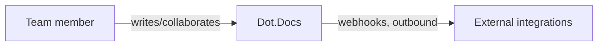

# Dot.Docs

> **Platform-owned source:** [Dot.Docs's wiki.md](https://github.com/sakhilebhayi/Dot.docs/blob/main/wiki.md) — the platform's own knowledge home. This document is Dot.Brain's ingested view; the wiki is authoritative for what the platform actually is.

## 1. Purpose & Business Domain

A real-time collaborative document/wiki platform (Notion/Confluence-shaped): documents with version history, threaded comments, AI-assisted writing (OpenAI `gpt-4o`, not Anthropic Claude as earlier docs claimed — corrected), slash commands, templates, and inbound/outbound webhooks. Genuine Reverb-broadcast presence and collaboration events back this, not a simulated realtime layer.

## 2. Entities Owned

| Entity | Graph node type | Natural key | Notes |
|---|---|---|---|
| Document | `entity:asset` | document ID | Core content unit |
| DocumentVersion | `observation` | document × version | Full version history with diff/restore |
| DocumentCollaborator | `entity:process` | document × user | Real-time presence/collaboration |
| Comment | `entity:asset` | comment ID | Threaded, document-scoped |
| DocumentTemplate | `entity:asset` | template ID | Global, team, or author-scoped visibility |
| DocumentSlashCommand | `entity:asset` | command ID | In-editor slash-command catalog |
| DocumentWebhook | `entity:process` | webhook ID | Outbound integration point |
| AiSuggestion | `observation` | suggestion ID | AI-assist output, logged |

## 3. Events Emitted

Real-time Reverb broadcast events for presence/collaboration exist within the app but are not yet DKP-mapped ecosystem events — internal only, not published outward.

## 4. Knowledge Packs Published

None. No DKP manifest or publish pipeline exists.

## 5. Intelligence Consumed

None currently subscribed.

## 6. Cross-Platform Relationships

No cross-platform data exchange with other Dot Ecosystem platforms yet beyond shared ecosystem SSO and the shared `infodot` database.

## 7. Tenancy Model

Team/collaborator-scoped. The integration pass found and closed two real IDOR gaps: `VersionHistory`'s diff/preview actions used unscoped `DocumentVersion::find($id)` (cross-document content disclosure), and `TemplateGallery::useTemplate()` used unscoped `DocumentTemplate::findOrFail($id)` (could pull another team's private template). Both fixed to match the visibility rules already used elsewhere in the app.

## 8. Dopamine Surface

None identified as in-scope; not audited for engagement mechanics this pass (not this platform's stated purpose).

## 9. Active Recommendations

None — no Knowledge Pack publishing yet.

## 10. Incident History Summary

None recorded as a live incident. Real findings from the 2026-08-02 integration pass: `.env.example` had `DB_DATABASE` commented out, silently falling back to a nonexistent `laravel` database instead of the shared `infodot` instance — fixed before it could cause a real outage.

## Change Log

| Version | Date | Author | Change |
|---|---|---|---|
| 1.0.0 | 2026-08-02 | Repository Steward Agent | Initial registration. Platform audited: SSO contract verified, DB_DATABASE misconfiguration fixed, two real IDOR gaps closed (VersionHistory, TemplateGallery), favicon wired into the main app-shell layout (previously missing), README corrected (Laravel 12→13, Anthropic→OpenAI, unshipped Redis/Horizon/Scout/Meilisearch removed). |

## Open Questions

| Question | Owner → Approver |
|---|---|
| `Document::cachedContent()`'s public-only caching strategy — reviewed for correctness under private/collaborative documents? | Docs Platform Lead → Architecture Agent |
| The public `/shared/{uuid}` password/expiry routes were not fully security-reviewed this pass — worth a dedicated look. | Docs Platform Lead → Security Agent |
