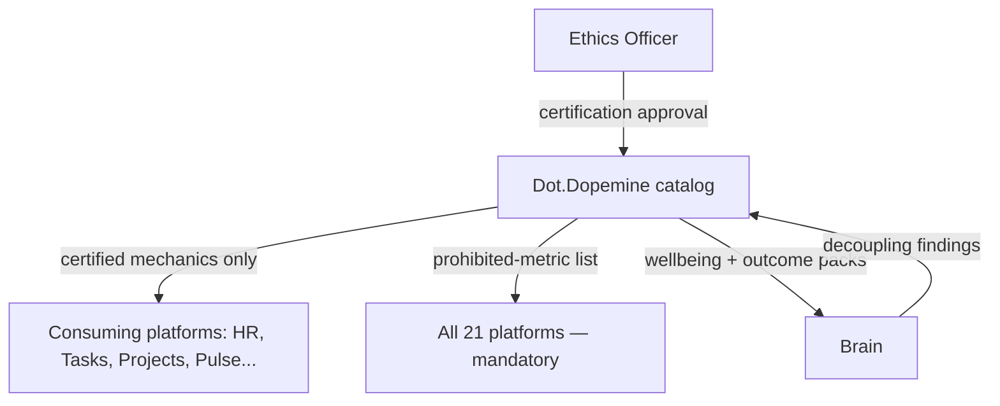

# Dot.Dopemine

## 1. Purpose & Business Domain

The ecosystem's engagement and motivation platform: progress surfaces, recognition mechanics, and habit scaffolding delivered *as a service* to other platforms. Highest governance stakes in the fleet — this platform's product is precisely the thing brain.dopemine.md exists to constrain. The resolution is not exemption but inversion: Dot.Dopemine operates under the strictest interpretation of the policy it embodies, and its distinctive contribution to the Brain is *negative knowledge* — the prohibited-metric list (§7, registry gap closed) and evidence about which engagement mechanics helped versus harmed.

**The acid test, applied to itself (§8):** every other platform answers "would you show this mechanic to the person it targets, with its intent labeled?" Dopemine must answer it for every mechanic it *offers*, not just uses. A mechanic that fails the test may not be in the service catalog at all — there is no "the consuming platform decides" escape hatch, because offering a dark pattern is manufacturing one.

## 2. Entities Owned

| Entity | Graph node type | Natural key | Notes |
|---|---|---|---|
| Engagement mechanic | `entity:asset` | `mech:<name>` | Catalog entry, each with a recorded acid-test verdict |
| Deployment | `entity:process` | mechanic + platform | A mechanic live on a consuming platform |
| Wellbeing observation | `observation` | mechanic + cohort + window | Aggregate only, n ≥ 50 |
| Mechanic outcome | `outcome` | deployment + period | Outcome-metric movement vs. engagement movement, always paired |
| Prohibited-metric entry | `entity:asset` | metric pattern | The negative catalog (§7) |

## 3. Events Emitted

| Event | Trigger | Consumers | Frequency |
|---|---|---|---|
| `engagement.mechanic.certified/decertified` | Acid-test verdict recorded / revoked | Brain, all consuming platforms | low |
| `engagement.deployment.started/retired` | Mechanic lifecycle on a platform | Brain, Dot.Design | low |
| `engagement.prohibited_list.updated` | Prohibited-metric list change | Brain registry, **all platforms** (mandatory subscription) | rare |

## 4. Knowledge Packs Published

| Payload type | Cadence | Example pack ID |
|---|---|---|
| observation (mechanic outcome/engagement pairs) | monthly | `dkp:dopemine:obs:2026-07-01:0004` |
| insight (mechanic effectiveness/harm findings) | per finding | `dkp:dopemine:ins:2026-06-02:0001` |
| outcome (deployment verifications) | per verified deployment | `dkp:dopemine:out:2026-07-15:0001` |
| incident (mechanic-harm findings, decertifications) | per incident | `dkp:dopemine:inc:2026-05-10:0001` |

Publication rule unique to this platform: an observation pack pairing engagement movement with outcome movement is publishable; engagement movement *alone* is not — it is a prohibited-metric pattern (§7) and validation rejects it at ingestion.

## 5. Intelligence Consumed

| Recommendation type | Metric expected to move | Baseline |
|---|---|---|
| Mechanic-retirement candidates (engagement up, outcomes flat) | `engagement.decoupling_findings` | 2026 H1 |
| Deployment-fit suggestions (which certified mechanic suits a platform's outcome goal) | consuming platform's outcome metric | per deployment |

## 6. Cross-Platform Relationships



Every platform doc's "Dopamine Surface" section (§8 in each) is downstream of this catalog: what Farms, Mines, Emall, Billing, and Analytics chose to *withhold* are instances of prohibited-metric patterns published here. Consuming platforms deploy only certified mechanics; certification is Ethics-Officer-approved and revocable.

## 7. Tenancy Model & the Prohibited-Metric List (registry gap closed)

Tenant key = consuming platform + org; wellbeing aggregates at n ≥ 50 individuals (behavioral data — stricter than default). The **prohibited-metric list** is the platform's flagship published artifact, `ecosystem`-classified and mandatorily subscribed:

| Pattern | Why prohibited | Example already withheld |
|---|---|---|
| Raw engagement volume as a target (dwell time, session count, opens) | Rewards attention, not outcomes | Emall browse-time; Analytics dashboard-view rankings |
| Individual streaks with loss framing | Manufactures compulsion via loss aversion | Emall visit streaks; Billing payment streaks |
| Person-vs-person leaderboards on rate metrics | Rewards speed over safety/quality | Mines operator speed leaderboards |
| Variable-ratio reward schedules | Slot-machine mechanics | None deployed (blocked at catalog) |
| Abandonment/re-engagement pressure nudges | Exploits incompleteness anxiety | Emall cart-abandonment nudges; Billing dunning-pressure |

List governance: additions by Ethics Agent proposal → Ethics Officer approval; *removals* require full governance review (an evolution-rules change, not an update). Every entry cites the evidence or reasoning that put it there. Validation enforces the list mechanically: any platform's pack or PR targeting a prohibited pattern is rejected with the list entry cited.

## 8. Dopamine Surface (the platform's own)

Shares: certified-mechanic outcome performance, decoupling-finding counts — its own product honesty. Withheld: *adoption metrics of its own mechanics as success* — "12 platforms use streaks" is precisely the engagement-as-outcome error applied reflexively. Dopemine's success metric is outcome movement on consuming platforms, per §11.

## 9. Active Recommendations

Maintained by the Registry Agent. Current: mechanic-retirement review for two catalog entries showing decoupling `open` (expiry 2026-09-01); one deployment-fit recommendation `verified` — see §13.

## 10. Incident History Summary

One incident pack (2026-05): a pilot completion-streak mechanic on Dot.Tasks showed task-completion inflation with quality flat — engagement/outcome decoupling caught by the paired-publication rule; mechanic decertified, incident published, lesson became prohibited-list entry evidence (loss-framed streaks row). This incident is the platform's founding credibility artifact: it decertified its own product.

## 11. Domain Metrics (registered per brain.metrics.md §4.8)

| ID | Type | Definition |
|---|---|---|
| `engagement.outcome_coupling_rate` | ratio | Deployments where outcome metric moved with engagement / all active deployments |
| `engagement.decoupling_findings` | count | Engagement-up-outcome-flat findings per quarter (each triggers retirement review) |
| `engagement.prohibited_list_rejections` | count | Packs/PRs rejected by list enforcement per quarter — visibility of the guardrail working |

## 12. Manifest (platform.dkp.json example)

```json
{
  "platform_id": "dot-dopemine",
  "dkp_version": "1.0.0",
  "signing_key_ref": "vault://keys/dot-dopemine/dkp-signing/v1",
  "publishes": ["observation", "insight", "outcome", "incident"],
  "subscribes": ["mechanic-retirement", "deployment-fit"],
  "schemas": { "knowledge-pack": "1.0.0", "metric": "1.0.0" },
  "default_classification": "ecosystem",
  "tenancy": {
    "key": "platform_org_id",
    "aggregation_floor": 50,
    "publication_rules": [
      { "rule": "engagement-outcome-pairing", "enforcement": "reject-at-ingestion" }
    ]
  }
}
```

## 13. Worked round-trip

1. **Pack:** `dkp:dopemine:obs:2026-07-01:0004` — paired engagement/outcome aggregates for the certified "milestone recognition" mechanic on Dot.Projects, 3 months, n = 74 (≥ 50 floor holds).
2. **Validation → graph:** `OBSERVED_WITH` edge between milestone recognition and on-time phase completion at 0.71; corroborated by an independent HR-deployment observation (×1.10 → 0.78).
3. **PR back (deployment-fit):** offer milestone recognition to Dot.Farms for harvest-plan phase tracking; confidence 0.80, impact on Farms' `agriculture.harvest_logistics_delay_p50`, guard: paired wellbeing aggregate flat-or-better, expiry 60 days. Farms' human lead accepts — sovereignty intact; the mechanic ships with its intent label visible to end users (the acid test, literally rendered).
4. **Outcome:** `dkp:dopemine:out:2026-07-15:0001` — outcome metric −9% (verified against counterfactual plan), engagement and outcome coupled, wellbeing guard flat. `engagement.outcome_coupling_rate` holds at 1.0 for the deployment.

## Change Log

| Version | Date | Author | Change |
|---|---|---|---|
| 1.0.0 | 2026-08-01 | Platform Integrator (prompt 05, AI) | Initial integration package: inverted-strictness posture, catalog-level acid test (no consuming-platform escape hatch), prohibited-metric list published (registry gap closed) with mechanical enforcement, engagement-outcome pairing publication rule, self-decertification incident, 3 domain metrics, worked round-trip |
| 1.0.1 | 2026-08-01 | Repository Reviewer (prompt 07, AI) | Intent-label wording OQ struck (resolved by dot-design.md §7.1) |

## Open Questions

| Question | Owner → Approver |
|---|---|
| Should prohibited-list enforcement rejections be surfaced to the offending platform's human lead automatically, or batched in governance review? | Ethics Agent → Ethics Officer |
| ~~End-user-visible intent labels (§13): standard wording per persona token set — coordinate with Dot.Design's session~~ **Resolved 2026-08-01** by [dot-design.md](dot-design.md) §7.1: labels word in outcome terms, never engagement terms; jointly certified (Dopemine certifies the mechanic, Design the label) | UX Agent → UX Architect |
