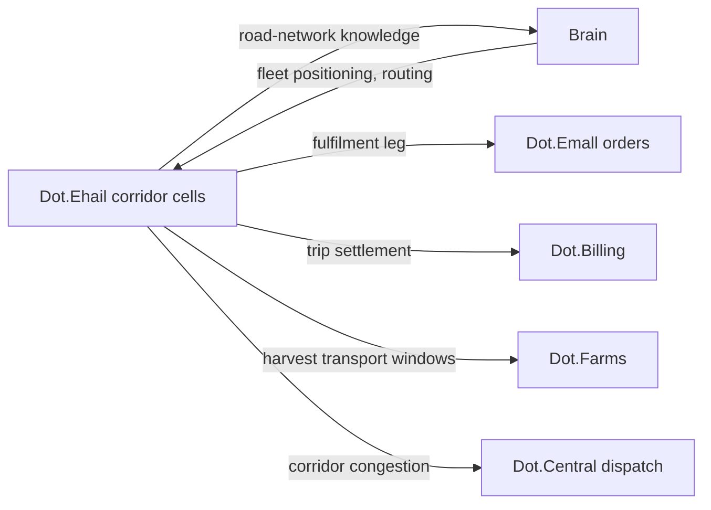

# Dot.Ehail

## 1. Purpose & Business Domain

Ride-hailing and light logistics: passenger trips, courier deliveries, and fleet operations for owner-operators and fleet companies. Owns the movement domain: vehicles, trips, corridors, and fleet economics. Ehail's data problem is location: a trip trace is simultaneously operational gold (corridor knowledge, demand patterns) and a movement diary of identifiable people — drivers *and* passengers. The corpus's aggregation discipline applies with a spatial twist (§7): floors are counted in **distinct vehicles and distinct trips per corridor-cell × window**, and precision is degraded spatially (corridor cells, not coordinates) before it is degraded statistically. The fleet entity model (registry gap) is closed in §2.

## 2. Entities Owned (fleet entity model — registry gap closed)

| Entity | Graph node type | Natural key | Notes |
|---|---|---|---|
| Fleet | `entity:site` | `dot:node:logistics:fleet:<id>` | Tenant root — from single owner-operator (fleet of 1) to company fleets |
| Vehicle | `entity:asset` | fleet + VIN | Class-attributed (sedan, van, bakkie, truck) |
| Driver role-assignment | `entity:process` | assignment ID | Links a driver *role* to a vehicle-shift; the person behind it is HR-style excluded (no individual node) |
| Corridor cell | `entity:site` | geohash-5 cell + road class | The spatial publication unit — trips aggregate to cells, never to traces |
| Trip (operational) | — | — | **Never graphed individually.** Platform-internal; only corridor-cell aggregates cross |
| Corridor observation | `observation` | cell × vehicle-class × window | ≥ 30 vehicles, ≥ 100 trips per cell-window |
| Delivery outcome | `outcome` | recommendation + period | Verification ground truth |

The model resolves the gap's core question: the graph's unit is the **fleet and the corridor, not the vehicle-journey**. Individual trips follow employment records (HR §2) in having no graph representation by design.

## 3. Events Emitted

| Event | Trigger | Consumers | Frequency |
|---|---|---|---|
| `logistics.trip.completed/cancelled` | Trip lifecycle | Brain (cell aggregates only), Dot.Billing | ~10⁴/day |
| `logistics.corridor.congestion_shift` | Cell-level travel-time regime change | Brain, Dot.Central, subscribing fleets | low |
| `logistics.fleet.utilization_cycle` | Fleet reporting cycle | Brain, Dot.Analytics | daily |

## 4. Knowledge Packs Published

| Payload type | Cadence | Example pack ID |
|---|---|---|
| observation (corridor-cell travel-time/demand aggregates) | daily batch | `dkp:ehail:obs:2026-07-14:0021` |
| insight (corridor-regime findings) | per finding | `dkp:ehail:ins:2026-06-25:0001` |
| outcome (recommendation verifications) | per verified recommendation | `dkp:ehail:out:2026-07-30:0001` |
| incident (safety events, aggregation-gate events) | per incident | `dkp:ehail:inc:2026-05-05:0001` |

Corridor knowledge is Ehail's distinctive export: no other platform observes road-network conditions continuously. Mines' haul-road findings were pit-internal; Ehail covers the public network between farm gate, market, and depot — the physical substrate of the Farms→Emall value chain's fulfilment leg.

## 5. Intelligence Consumed

| Recommendation type | Metric expected to move | Baseline |
|---|---|---|
| Fleet-positioning (pre-position by predicted cell demand) | `logistics.pickup_wait_p50` | 2026 H1, per cell class |
| Corridor-routing (avoid regime-shifted cells) | `logistics.trip_duration_vs_estimate` | per corridor |
| Maintenance-scheduling (vehicle-class wear patterns — Mines' moisture-indexed inspection pattern P-2026-001 is a candidate transfer, pending condition checks: public roads ≠ lateritic haul roads, so C fails on road-surface condition; recorded as a known non-transfer candidate rather than silently analogized) | `logistics.vehicle_downtime_rate` | 2026 H1 |

## 6. Cross-Platform Relationships



Seams: trip payment is Billing's (Ehail owns the trip record, Billing the settlement — same pattern as Emall orders); Emall fulfilment delivery is a Ehail trip with an order reference; Farms' harvest-logistics delay has a public-road component that Ehail's corridor cells can now explain — a three-platform evidence join (Farms delay × Ehail corridor × Emall listing timing) available to Analytics.

## 7. Tenancy Model & Location-Sensitive Publication

Tenant key = fleet; owner-operators are fleets of one, protected by the same floors as company drivers (no small-fleet carve-out — a fleet of one is maximally identifiable). Publication discipline, spatial-first:

| Gate | Rule |
|---|---|
| Spatial degradation | Publication unit is the geohash-5 corridor cell; no coordinates, traces, or origin-destination pairs ever publish |
| Cell floor | ≥ 30 distinct vehicles AND ≥ 100 trips per cell × window; sparse cells merge to neighbors or suppress |
| O-D exclusion | Origin-destination *pairs* are prohibited even in aggregate — pair patterns re-identify at much larger n than single-cell counts |
| Temporal floor | Minimum window 1 hour urban, 24 hours rural (rural cells are sparse and identifying) |
| Driver/passenger exclusion | Per-person data (ratings, earnings, behavior) never publishes; HR's work-not-workers principle applies to drivers verbatim |

## 8. Dopamine Surface

Withheld: driver earnings leaderboards and acceptance-rate pressure (rate-metric leaderboards — the gig-economy instantiations of the prohibited list, named explicitly because the industry default is to deploy them), streak bonuses on consecutive trips (loss-framed streaks driving fatigued driving — a *safety* failure mode, not just an ethical one), passenger surge-gamification. Shared: fleet-level utilization and safety-incident-free performance, cell-level demand forecasts to fleets (legible, collective, decision-shaped).

## 9. Active Recommendations

Maintained by the Registry Agent. Current: fleet-positioning `verified` — see §13; corridor-routing for two regime-shifted rural cells `open` (expiry 2026-08-25).

## 10. Incident History Summary

One incident pack (2026-05): a rural cell-window published with 4 vehicles — floor breach caught post-publication by a consuming platform's validation (defense in depth working from the consumer side); pack revoked per lifecycle rules, cell-merge logic fixed, published as an incident with the revocation chain intact. Consumed: HR's region-rollup lesson (direct input to the cell-merge fix) and Central's alert-precision pattern for congestion-shift events.

## 11. Domain Metrics (registered per brain.metrics.md §4.8)

| ID | Type | Definition |
|---|---|---|
| `logistics.pickup_wait_p50` | duration | Request to pickup, median, per cell class |
| `logistics.trip_duration_vs_estimate` | ratio | Actual / estimated trip duration, p50 per corridor |
| `logistics.vehicle_downtime_rate` | ratio | Vehicle-days unavailable / fleet vehicle-days, monthly |

## 12. Manifest (platform.dkp.json example)

```json
{
  "platform_id": "dot-ehail",
  "dkp_version": "1.0.0",
  "signing_key_ref": "vault://keys/dot-ehail/dkp-signing/v1",
  "publishes": ["observation", "insight", "outcome", "incident"],
  "subscribes": ["fleet-positioning", "corridor-routing", "maintenance-scheduling"],
  "schemas": { "knowledge-pack": "1.0.0", "metric": "1.0.0" },
  "default_classification": "ecosystem",
  "tenancy": {
    "key": "fleet_id",
    "aggregation_floor": 30,
    "publication_rules": [
      { "rule": "spatial-cell-only", "cell": "geohash-5", "enforcement": "reject-at-ingestion" },
      { "rule": "no-origin-destination-pairs", "enforcement": "reject-at-ingestion" },
      { "rule": "cell-trip-floor", "min_trips": 100, "enforcement": "reject-at-ingestion" }
    ]
  }
}
```

## 13. Worked round-trip

1. **Pack:** `dkp:ehail:obs:2026-07-14:0021` — corridor-cell demand and travel-time aggregates for Northern Cape market-town cells during the harvest-transport window; 47 vehicles, 380 trips per qualifying cell-window (all §7 gates pass).
2. **Validation → graph:** `OBSERVED_WITH` edge between Farms' harvest-dispatch windows and cell demand spikes 2–4 hours later, 0.73; corroborated by Emall's order-fulfilment timing (×1.10 → 0.80) — the fulfilment leg's physics made visible.
3. **PR back (fleet-positioning):** pre-position van-class vehicles to market-town cells in the 2-hour window after harvest-dispatch peaks; confidence 0.80, impact `logistics.pickup_wait_p50` −25% predicted for those cell-windows, guards: `logistics.vehicle_downtime_rate` flat, no driver-hours ceiling breach, expiry 45 days.
4. **Outcome:** `dkp:ehail:out:2026-07-30:0001` — −29% pickup wait verified against non-positioned cell cohort; guards held. Downstream, Farms' `agriculture.produce_time_to_market_p50` gains its third contributing platform — the value chain's fulfilment leg now has corridor-level evidence Analytics can join into the chain view.

## Change Log

| Version | Date | Author | Change |
|---|---|---|---|
| 1.0.0 | 2026-08-01 | Platform Integrator (prompt 05, AI) | Initial integration package: fleet entity model closed (fleet + corridor cell as graph units, individual trips excluded by design), spatial-first publication discipline (geohash-5 cells, O-D pair prohibition, dual floors), gig-economy prohibited-list instantiations named, P-2026-001 recorded as non-transfer candidate with failed condition, 3 domain metrics, worked round-trip |

## Open Questions

| Question | Owner → Approver |
|---|---|
| Geohash-5 cell size (~5 km) vs. urban density — should urban cells refine to geohash-6 with proportionally raised floors? | Logistics Agent → Security Officer |
| The three-platform evidence join (Farms × Ehail × Emall) — assemble as an Analytics chain-view extension, and does it trip patterns' second-chain-view P-entry trigger? | Analytics Agent → Chief Architect |
