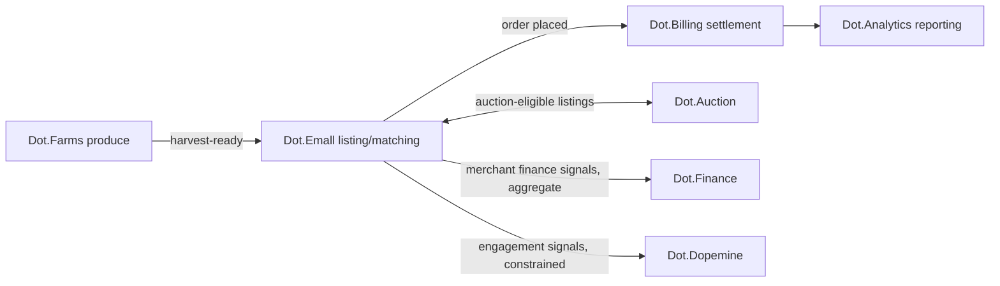

# Dot.Emall

## 1. Purpose & Business Domain

Marketplace platform — product listings, storefronts, ordering, and buyer–seller matching for the ecosystem's commerce, serving merchants (including Dot.Farms producers) and buyers. Owns the commerce *matching* domain: listings, demand signals, and order flow. Settlement belongs to Dot.Billing; seller finance to Dot.Finance; auctions to Dot.Auction (§6).

## 2. Entities Owned

| Entity | Graph node type | Natural key | Notes |
|---|---|---|---|
| Storefront | `entity:site` | `dot:node:commerce:store:<id>` | Tenant root (merchant) |
| Listing | `entity:asset` | store + SKU + version | Carries category taxonomy terms ([brain.semantic.md](../brain.semantic.md) topics) |
| Order | `entity:process` | order ID | Handoff key to Dot.Billing settlement |
| Demand signal | `observation` | category + region + window | Aggregate only — never individual buyer behavior |
| Fulfilment record | `outcome` | order ID | Ground truth for listing-timing verification |

## 3. Events Emitted

| Event | Trigger | Consumers | Frequency |
|---|---|---|---|
| `commerce.listing.published/expired` | Listing lifecycle | Brain ingestion, Dot.Analytics | ~10³/day |
| `commerce.order.placed/fulfilled` | Order flow | Brain, Dot.Billing (settlement trigger) | ~10³/day |
| `commerce.demand.window` | Aggregate demand summary per category/region | Brain | daily |
| `commerce.listing.unsold_expiry` | Listing expires unsold | Brain (negative outcome — file-drawer guard) | ~10²/day |

## 4. Knowledge Packs Published

| Payload type | Cadence | Example pack ID |
|---|---|---|
| observation (demand/fulfilment aggregates) | daily batch | `dkp:emall:obs:2026-07-18:0061` |
| insight (demand-pattern findings) | per finding | `dkp:emall:ins:2026-04-12:0009` |
| outcome (listing-timing verification) | per verified recommendation | `dkp:emall:out:2026-07-29:0004` |
| incident (matching/pricing anomalies) | per incident | `dkp:emall:inc:2026-05-03:0001` |

## 5. Intelligence Consumed

| Recommendation type | Metric expected to move | Baseline |
|---|---|---|
| Listing-timing (the surface [dot-farms.md](dot-farms.md) §5 subscribes to from the producer side — Emall consumes the marketplace side: *when* to feature seasonal categories) | `commerce.listing_time_to_first_order_p50` | 2026 H1, per category |
| Category-demand forecasting | `commerce.unsold_expiry_rate` | 2026 H1 |
| Cross-platform supply matching (Farms harvest → regional demand) | `commerce.supply_demand_match_rate` | 2026 wet season |

The listing-timing recommendation is one finding, two PRs: Farms gets "list within N days of harvest," Emall gets "feature the category in window W" — same evidence chain, per-platform sovereignty, neither PR commits the other (the value-chain rule, [brain.business.md](../brain.business.md) §4).

## 6. Cross-Platform Relationships



## 7. Tenancy Model

Tenant key = storefront ID; topics `commerce.<tenant>.<event>`. Buyer-side data is never tenant-published at individual resolution: demand signals aggregate at category × region × window with the n ≥ 20 distinct-buyer floor before any pack leaves the platform. Cross-merchant insights come only from published aggregates — merchant competitive data never leaks through the graph.

## 8. Dopamine Surface

Shares: listing completeness, fulfilment reliability (outcome-anchored merchant quality). Explicitly withheld: buyer browse-time, cart-abandonment nudge metrics, and repeat-visit streaks — buyer engagement mechanics are exactly the marketplace temptation dopemine §2's prohibited list names; the acid test ("would the buyer thank us?") gates every proposed signal.

## 9. Active Recommendations

Maintained by the Registry Agent. Current: seasonal category-featuring `open` (expiry 2026-08-25); listing-timing (wet-season produce) `verified` — see §13.

## 10. Incident History Summary

One incident pack (2026-05): category-taxonomy mismatch caused mispriced produce matching — F-KNOW class; lesson: listing category terms must resolve against the semantic taxonomy at publish time, now a validation rule. Consumed: aggregation-floor practice from community's intersection-attack rule.

## 11. Domain Metrics (registered per brain.metrics.md §4.8)

| ID | Type | Definition |
|---|---|---|
| `commerce.listing_time_to_first_order_p50` | duration | Listing published to first order, median per category |
| `commerce.unsold_expiry_rate` | ratio | Listings expiring unsold / listings published |
| `commerce.supply_demand_match_rate` | ratio | Harvest-window supply matched to demand windows / total seasonal supply |

## 12. Manifest (platform.dkp.json example)

```json
{
  "platform_id": "dot-emall",
  "dkp_version": "1.0.0",
  "signing_key_ref": "vault://keys/dot-emall/dkp-signing/v1",
  "publishes": ["observation", "insight", "outcome", "incident"],
  "subscribes": ["listing-timing", "category-demand-forecast", "supply-matching"],
  "schemas": { "knowledge-pack": "1.0.0", "metric": "1.0.0" },
  "tenancy": { "key": "storefront_id", "aggregation_floor": 20 }
}
```

## 13. Worked round-trip

The value chain's middle link, closed:

1. **Pack:** `dkp:emall:obs:2026-07-18:0061` — demand aggregates: fresh-produce category, Northern Cape region, 4 weeks; 3,200 orders across 87 storefronts (floor holds); signed, `ecosystem`.
2. **Validation → graph:** demand-window nodes; `OBSERVED_WITH` edge between Farms harvest-completion events and regional demand peaks at 0.71 (two seasons, corroborated by Farms' own packs — two independent sources, ×1.10).
3. **PR back (pair):** to Emall — feature fresh-produce category days 2–9 post-harvest-peak, confidence 0.82, impact `commerce.listing_time_to_first_order_p50` −25% predicted, guard `commerce.unsold_expiry_rate` flat; to Farms — the listing-timing PR its §5 subscribes to. Same chain, two sovereign decisions.
4. **Outcome:** `dkp:emall:out:2026-07-29:0004` verifies −31% time-to-first-order with unsold expiry flat — the chain's first two links now verified end-to-end; Billing's settlement-latency link is the next seam.

## Change Log

| Version | Date | Author | Change |
|---|---|---|---|
| 1.0.0 | 2026-08-01 | Platform Integrator (prompt 05, AI) | Initial integration package: matching-domain ownership, entities, aggregate-only demand signals, paired listing-timing PR surface, buyer-engagement withholdings, 3 domain metrics, manifest, value-chain round-trip |
| 1.0.1 | 2026-08-01 | Repository Reviewer (prompt 07, AI) | Auction-handoff OQ struck (resolved by dot-auction.md) |
| 1.0.2 | 2026-08-01 | DKP Architect (prompt 02, AI) | Taxonomy OQ struck (schemas/taxonomy.json published) |

## Open Questions

| Question | Owner → Approver |
|---|---|
| ~~Listing category terms now validate against the semantic taxonomy — does Emall need the machine-readable taxonomy export (brain.semantic.md's schemas/taxonomy.json open question) more urgently than other platforms?~~ **Resolved 2026-08-01:** [schemas/taxonomy.json](../schemas/taxonomy.json) published; `commerce.listing.category` frozen | Marketplace Agent → Chief Architect |
| ~~Auction-eligible listing handoff to Dot.Auction: entity ownership during an active auction — Emall's listing or Auction's lot?~~ **Resolved 2026-08-01** by [dot-auction.md](dot-auction.md): exclusive ownership transfer to the lot; `unsold_expiry` clock paused | Marketplace Agent → Chief Knowledge Engineer |
