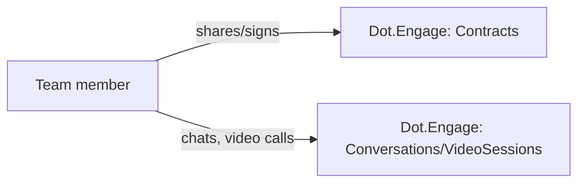

# Dot.Engage

> **Platform-owned source:** [Dot.Engage's wiki.md](https://github.com/sakhilebhayi/Dot.Engage/blob/main/wiki.md) — the platform's own knowledge home. This document is Dot.Brain's ingested view; the wiki is authoritative for what the platform actually is.

## 1. Purpose & Business Domain

**Domain correction (2026-08-02):** despite the ecosystem registry's `campaign` icon suggesting a marketing/engagement-campaign product, the real, built codebase is a contract-sharing, real-time chat, and video-call document-signing platform — not CRM/proposals/scheduling as an earlier README claimed. Real entities: Contract, ContractSignature, ContractVersion, Conversation, Message, VideoSession, VideoSessionSignature. The icon/name mismatch is a registry-side issue, not a code issue — flagged for whoever owns `os/Appendix.md`'s icon mapping.

## 2. Entities Owned

| Entity | Graph node type | Natural key | Notes |
|---|---|---|---|
| Contract | `entity:asset` | contract ID | Team-scoped |
| ContractVersion | `observation` | contract × version | Versioned document content |
| ContractSignature | `outcome` | signature ID | Signing record |
| Conversation | `entity:process` | conversation ID | Real-time chat, team-scoped |
| Message | `observation` | message ID | Chat message |
| VideoSession | `entity:process` | session ID | Live video-call, team-scoped |
| VideoSessionSignature | `outcome` | session × signature | In-call document signing |

## 3. Events Emitted

Two dead events found during integration: `VideoSessionStarted` and `ContractShared` are declared and have listeners registered, but nothing in the codebase actually dispatches them — flagged as a real gap, not fixed (dispatch-point decision belongs to the platform team).

## 4. Knowledge Packs Published

None. No DKP manifest or publish pipeline exists.

## 5. Intelligence Consumed

None currently subscribed.

## 6. Cross-Platform Relationships

No cross-platform data exchange with other Dot Ecosystem platforms yet beyond shared ecosystem SSO and the shared `infodot` database.

## 7. Tenancy Model

Team-scoped via `team_id` on Contract/Conversation/VideoSession. The integration pass found and fixed the most severe issue across all 7 newly-integrated platforms' dashboard code: a prior commit added `/dashboard` stat queries (`Contract::count()`, `Conversation::whereNotNull(...)->count()`, etc., plus actual `recentContracts`/`activeConversations` record listings) with **zero team scoping** — every team's dashboard showed every other team's aggregate counts and actual contract/conversation records. This was a live, exploitable cross-tenant data leak, not a theoretical one. Fixed by scoping every query to `Auth::user()->currentTeam->id`. Also closed a missing-authorization gap in three Livewire components (`VersionHistory`, `InCallDocumentViewer`, `ParticipantList`) that performed by-ID lookups with no Policy check.

## 8. Dopamine Surface

Explicitly checked given the platform's name and original "engagement" framing — clean. No streak/badge/points/leaderboard/dark-pattern mechanics found anywhere in the codebase; the notification/unread-count components are plain inbox-style counters, not attention-capture loops. Consistent with the manifesto's ethical-engagement principle.

## 9. Active Recommendations

None — no Knowledge Pack publishing yet.

## 10. Incident History Summary

**Real, live cross-tenant data leak** (§7) — the most severe finding across this 7-platform integration batch. Closed 2026-08-02, same day it was found, before any known exploitation. Introduced by an incomplete prior "fix" commit (`5dae85f`) that added the dashboard queries without team scoping.

## Change Log

| Version | Date | Author | Change |
|---|---|---|---|
| 1.0.0 | 2026-08-02 | Repository Steward Agent | Initial registration. Platform audited: real domain corrected (contract/chat/video-signing, not CRM), a live cross-tenant dashboard data leak fixed, three Livewire IDOR gaps closed, favicon added (was completely missing), README corrected. |

## Open Questions

| Question | Owner → Approver |
|---|---|
| `os/Appendix.md`'s `campaign` icon for this platform no longer matches its real domain — should it be updated to something contract/signing-related? | Registry Agent → Chief Knowledge Engineer |
| `VideoSessionStarted`/`ContractShared` events are declared but never dispatched — should they be wired now, or is this intentionally deferred? | Engage Platform Lead → Architecture Agent |
| `routes/channels.php` broadcast-authorization callbacks were not audited this pass. | Engage Platform Lead → Security Agent |
