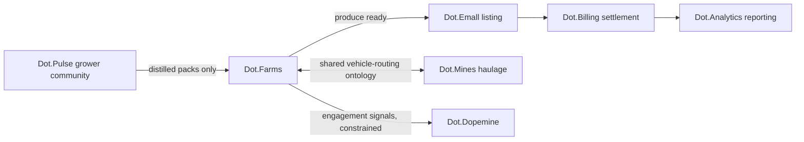

# Dot.Farms

## 1. Purpose & Business Domain

Agriculture ERP for farming operations — crop planning, planting/harvest execution, irrigation and moisture management, input logistics, and yield tracking — serving farm owners, agronomists, and field operators. Owns the agriculture domain end-to-end from paddock to gate; downstream commerce (produce listing, settlement) belongs to Dot.Emall and Dot.Billing via the value chain in §6.

## 2. Entities Owned

| Entity | Graph node type | Natural key | Notes |
|---|---|---|---|
| Farm | `entity:site` | `dot:node:agriculture:farm:<id>` | Tenant root |
| Field/paddock | `entity:asset` | farm + field code | Carries soil-type and moisture-zone attributes |
| Crop cycle | `entity:process` | field + season + crop | Planting → harvest lifecycle |
| Planting/harvest log | `observation` | cycle + timestamp | The dopemine §6 conditional-pass case's subject |
| Moisture reading | `observation` | sensor + timestamp | Daily resolution; feeds the wet-season pattern's condition C |
| Yield record | `outcome` | cycle | Ground truth for seasonal verification |

## 3. Events Emitted

| Event | Trigger | Consumers | Frequency |
|---|---|---|---|
| `agriculture.cycle.started/completed` | Crop cycle state change | Brain ingestion, Dot.Analytics | ~10²/day ecosystem-wide |
| `agriculture.moisture.threshold` | Reading crosses configured band | Brain ingestion, irrigation advisories | bursty, seasonal |
| `agriculture.harvest.recorded` | Yield record committed | Brain, Dot.Emall (listing trigger) | seasonal peaks |
| `agriculture.incident.reported` | Crop loss/equipment failure | Brain (incident pack path) | low |

## 4. Knowledge Packs Published

| Payload type | Cadence | Example pack ID |
|---|---|---|
| observation (moisture/operations) | daily batch | `dkp:farms:obs:2026-07-14:0032` |
| insight (agronomic correlations) | per finding | `dkp:farms:ins:2026-06-02:0004` |
| outcome (seasonal yield verification) | per harvest | `dkp:farms:out:2026-05-30:0011` |
| incident (crop-loss lessons) | per incident | `dkp:farms:inc:2026-01-19:0002` |

## 5. Intelligence Consumed

| Recommendation type | Metric expected to move | Baseline |
|---|---|---|
| Irrigation/moisture scheduling | `agriculture.water_use_per_ton` (registered here, §11) | 2026 season avg |
| Planting-window optimization | `agriculture.yield_per_hectare_p50` | per crop, per region |
| Logistics pre-positioning (wet-season pattern P-2026-001, conditions checked) | `agriculture.harvest_logistics_delay_p50` | 2026 wet season |
| Value-chain listing timing (via Dot.Emall) | `agriculture.produce_time_to_market_p50` | 2026 season |

## 6. Cross-Platform Relationships



The Farms→Emall→Billing→Analytics chain is the canonical value chain ([brain.business.md](../brain.business.md) §4); each link is a separate per-platform recommendation — no link commits the next.

## 7. Tenancy Model

Tenant key = farm ID; event topics `agriculture.<tenant>.<event>`; cross-tenant aggregation only above the n ≥ 20 distinct-contributor floor ([brain.community.md](../brain.community.md) §3 rules apply to grower-sourced content). Reasoning may generalize across tenants only from published packs, never raw tenant rows.

## 8. Dopamine Surface

Shares: planting-log completeness, seasonal-goal progress (outcome-anchored classes only). The streak mechanic runs under the dopemine §6 conditional pass — quality guard and dispersion sentinels attached, prohibited list applies in full. No notification-CTR or session-length signals shared.

## 9. Active Recommendations

Maintained by the Registry Agent. Current: wet-season logistics recommendation `verified` (closed); dry-climate E2 probe pending ([brain.patterns.md](../brain.patterns.md) §5).

## 10. Incident History Summary

One incident pack (frost-window forecast miss, 2026-01) — lesson contributed to seasonal-assumption checking; consumed lesson F-KNOW-2026-001's ancestry-check practice via propagation.

## 11. Domain Metrics (registered per brain.metrics.md §4.8)

| ID | Type | Definition |
|---|---|---|
| `agriculture.yield_per_hectare_p50` | gauge | Median yield per hectare, per crop cycle |
| `agriculture.water_use_per_ton` | ratio | Irrigation volume per ton yielded |
| `agriculture.harvest_logistics_delay_p50` | duration | Harvest-ready to transport-dispatched median |
| `agriculture.produce_time_to_market_p50` | duration | Gate to live Emall listing median |

## 12. Manifest (platform.dkp.json example)

```json
{
  "platform_id": "dot-farms",
  "dkp_version": "1.0.0",
  "signing_key_ref": "vault://keys/dot-farms/dkp-signing/v1",
  "publishes": ["observation", "insight", "outcome", "incident"],
  "subscribes": ["irrigation-scheduling", "planting-window", "logistics-prepositioning", "listing-timing"],
  "schemas": { "knowledge-pack": "1.0.0", "metric": "1.0.0" },
  "tenancy": { "key": "farm_id", "aggregation_floor": 20 }
}
```

## 13. Worked round-trip

1. **Pack:** `dkp:farms:obs:2026-11-03:0117` — moisture observations, 14 fields, Vaalharts farm cluster, wet-season onset; signed, classification `ecosystem`, sample_size 14 sensors.
2. **Validation:** schema pass; metric IDs resolve (§11); classification and tenancy fields present — ingested in 4 min (`dkp.ingest_latency_p95` contract).
3. **Graph:** 14 `observation` nodes; `OBSERVED_WITH` edges to harvest-logistics-delay nodes at 0.66 (two seasons' corroboration ×1.10).
4. **PR back:** logistics pre-positioning recommendation citing P-2026-001 *with condition checklist recorded* (lateritic access roads: yes; rainfall band: yes; daily moisture telemetry: yes) — confidence 0.84, impact `agriculture.harvest_logistics_delay_p50` −30% predicted, guard `agriculture.water_use_per_ton` flat, expiry 21 days. Farm team accepts; verification lands next harvest as an outcome pack.

## Change Log

| Version | Date | Author | Change |
|---|---|---|---|
| 1.0.0 | 2026-08-01 | Platform Integrator (prompt 05, AI) | Initial integration package: entities, events, packs, consumed intelligence, value chain, tenancy, dopamine surface, 4 domain metrics registered, manifest, worked round-trip |

## Open Questions

| Question | Owner → Approver |
|---|---|
| Seasonal scope fields (registry open gap): add `season` as a first-class pack field or keep in payload context? | Agriculture Agent → Chief Knowledge Engineer |
| Grower-community packs arrive via Dot.Pulse — does Farms need its own distillation view or is Pulse's sufficient? | Community Agent → Chief Knowledge Engineer |
