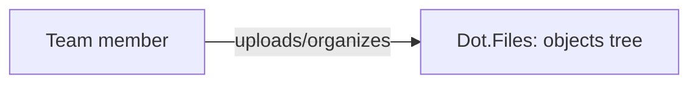

# Dot.Files

> **Platform-owned source:** [Dot.Files's wiki.md](https://github.com/sakhilebhayi/Dot.Files/blob/main/wiki.md) — the platform's own knowledge home. This document is Dot.Brain's ingested view; the wiki is authoritative for what the platform actually is.

## 1. Purpose & Business Domain

A team-scoped file and folder manager: upload, organize into folders, search, download. Built on a single self-referential `objects` table (polymorphic File/Folder via `staudenmeir/laravel-adjacency-list`) rather than separate tables per type. One Livewire component (`FileBrowser`) drives the whole UI. No previews, versioning, granular sharing, or S3 backing exist yet, despite earlier README claims to the contrary — corrected during this platform's integration pass.

## 2. Entities Owned

| Entity | Graph node type | Natural key | Notes |
|---|---|---|---|
| Object (File/Folder) | `entity:asset` | object ID | Polymorphic, self-referential tree; team-scoped |

## 3. Events Emitted

None currently. No domain events are dispatched — uploads/renames/deletes persist directly with no event bus integration. Roadmap, not shipped.

## 4. Knowledge Packs Published

None. No DKP manifest, signing key, or publish pipeline exists.

## 5. Intelligence Consumed

None currently subscribed.

## 6. Cross-Platform Relationships

No cross-platform integration exists beyond the shared ecosystem SSO (InfoDot handoff, verified working) and the shared `infodot` PostgreSQL database.

## 7. Tenancy Model

Team-scoped via `team_id` on the `objects` table, enforced consistently — the integration-pass security scan found every by-ID lookup already routed through `Obj::forCurrentTeam()` or an explicit Policy check.

## 8. Dopamine Surface

None. A file manager has no engagement mechanics in scope.

## 9. Active Recommendations

None — no Knowledge Pack publishing yet, so nothing for the Registry Agent to act on.

## 10. Incident History Summary

None recorded. One real defect (a migration typo, `contrained()` instead of `constrained()`, which would fatal on first real `php artisan migrate`) was found and fixed during this platform's 2026-08-02 integration pass — caught before it ever reached a real environment, not a live incident.

## Verified Infrastructure State (2026-08-07)

Confirmed directly against the real repo during the ecosystem-wide standardization + code-quality pass (full 26-platform summary: [brain.platforms.md](../brain.platforms.md) change log, v1.0.21):

- **Legal/branding/auth** — branded Markdown-mail theme, complete POPIA-aligned Privacy Policy/Terms/Cookie Policy naming **BluePin Inc**, guest auth pages restyled to match the welcome-page hero.
- **Laravel Boost** — `laravel/boost` ^2.5 installed; `.mcp.json`/`boost.json`/`CLAUDE.md` guideline block in place.
- **Code-quality pass** — this platform was one of only two in the ecosystem (with InfoDot) missing `laravel/pint` entirely despite Boost's own `pint/core` guideline assuming its presence — installed it as part of this pass. Pint: 31 files reformatted, formatting-only. `composer audit`: patched 6 `league/commonmark` DoS advisories. `npm audit`: patched postcss path-traversal (2 rounds — a `postcss` and later a `shell-quote` advisory each needed their own `npm audit fix` pass). Full suite reconfirmed green (5 passed / 9 assertions) after every change. (This repo's `public/build/*` and `storage/objects.index` are tracked but not part of this pass's scope — pre-existing Vite build-hash churn was reverted before each commit, not shipped.)

## Change Log

| Version | Date | Author | Change |
|---|---|---|---|
| 1.0.0 | 2026-08-02 | Repository Steward Agent | Initial registration. Platform audited during the ecosystem-wide integration pass: SSO contract verified against the shared standard, one real migration-typo bug fixed, branding completed (3 of 4 auth pages were on the default Jetstream placeholder), README corrected to match real code (no S3/previews/versioning/Reverb). |

## Open Questions

| Question | Owner → Approver |
|---|---|
| Should file versioning and previews be built, or is the platform intentionally scoped to plain storage+organize? | Files Platform Lead → Chief Architect |
| The wiki flags legacy Bootstrap/now-ui-kit CSS and a CDN-loaded FilePond script mixed into the Tailwind layout — cleanup or intentional? | Files Platform Lead → UX Agent |
