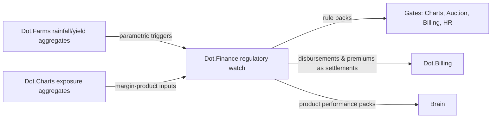

# Dot.Finance

## 1. Purpose & Business Domain

Financial products and services: credit and lending, insurance products, savings instruments, and financial-product design for ecosystem participants (from smallholder harvest credit to fleet asset financing). Owns the financial-products domain, and hosts the ecosystem's **regulatory watch** (registry gap, closed in §7) — the shared function that tracks financial-services, market-conduct, and disclosure regulation and translates it into machine-checkable rules other platforms' gates consume. Three requests were already queued against it before this document existed: Auction's sealed-bid disclosure question, and Charts' instrument-map ownership and retail-disclosure questions — evidence the function was needed before it was built.

**The three-way money boundary,** drawn once, canonically:

| Platform | Owns | Test question |
|---|---|---|
| Dot.Billing | *Settlement* — money movement for things already agreed (orders, payouts, subscriptions) | "Is money moving because of a completed transaction?" |
| Dot.Charts | *Traded instruments* — signals and execution on public markets | "Is this an exchange-traded position?" |
| Dot.Finance | *Financial products* — credit, insurance, savings: contracts that create future obligations | "Does this create a new obligation or risk transfer?" |

Composites split along the same lines: a margin-lending product is Finance's (credit), consuming Charts' exposure aggregates; loan *disbursement* is a Billing settlement; crop insurance is Finance's product even when its trigger data comes from Farms.

## 2. Entities Owned

| Entity | Graph node type | Natural key | Notes |
|---|---|---|---|
| Product definition | `entity:asset` | product ID | Terms structure, not customer instances |
| Credit facility (aggregate class) | `entity:asset` | product × segment | Portfolio-level; individual accounts never graphed |
| Insurance product | `entity:asset` | product ID | Incl. parametric triggers referencing platform data |
| Regulatory rule | `entity:asset` | `reg:<jurisdiction>:<domain>:<rule>` | The watch's output — versioned, machine-checkable |
| Portfolio observation | `observation` | product × segment × window | n ≥ 100, quarterly (Billing's dunning-tier discipline) |
| Product outcome | `outcome` | product + period | Repayment/claims performance vs. design assumptions |
| Customer account / application | — | — | **Never graphed.** Creditworthiness data is `prohibited`-tier (HR §7 pattern); individual credit decisions never touch the Brain |

## 3. Events Emitted

| Event | Trigger | Consumers | Frequency |
|---|---|---|---|
| `finproduct.product.launched/retired` | Product lifecycle | Brain, Dot.Analytics | low |
| `finproduct.regwatch.rule_updated` | Regulatory-watch rule change | **Subscribing gates: Charts, Auction, Billing, HR** | low, priority delivery |
| `finproduct.parametric.triggered` | Parametric insurance trigger fires | Brain, affected product holders via Notify | rare |

## 4. Knowledge Packs Published

| Payload type | Cadence | Example pack ID |
|---|---|---|
| observation (portfolio-performance aggregates) | quarterly | `dkp:finance:obs:2026-07-01:0003` |
| insight (product-fit findings) | per finding | `dkp:finance:ins:2026-06-08:0001` |
| outcome (recommendation verifications) | per verified recommendation | `dkp:finance:out:2026-07-30:0001` |
| incident (regulatory events, product failures) | per incident | `dkp:finance:inc:2026-05-20:0001` |

Default classification `restricted` (Billing's rationale, amplified: credit-portfolio patterns are competitively and personally sensitive). Regulatory-rule packs are the exception — `ecosystem`, because a compliance rule that isn't distributed is a liability.

## 5. Intelligence Consumed

| Recommendation type | Metric expected to move | Baseline |
|---|---|---|
| Product-fit suggestions (which product structures fit which segments — e.g. harvest-cycle-aligned repayment schedules from Farms' seasonal data) | `finproduct.repayment_on_schedule_rate` | 2026 H1 |
| Parametric-trigger calibration (platform data as insurance triggers — rainfall indices from Farms, corridor disruption from Ehail) | `finproduct.parametric_basis_gap` | per product |
| Portfolio-risk regime alerts (aggregate, segment-level) | `finproduct.portfolio_at_risk_rate` | 2026 H1 |

Consumption rule inherited from HR/Billing: recommendations target product *structures* and segment terms, never individual credit decisions — "align repayment schedules to harvest cycles for this segment" is valid; any form of individual scoring input is rejected at the manifest.

## 6. Cross-Platform Relationships



Answers to the queued questions: **(Auction)** sealed-bid public-procurement disclosure is jurisdiction-specific — the watch maintains it as `reg:<jurisdiction>:procurement:disclosure` rules that Auction's gate consumes; where disclosure law applies, it overrides reserve confidentiality and the lot is flagged at consignment, before bidding. **(Charts, instrument map)** joint ownership: the watch owns the regulatory feed of listings/delistings; the Trading Agent owns materiality mapping — split along expertise, wired as one signed artifact. **(Charts, retail disclosure)** stricter retail defaults, maintained as watch rules so they update with conduct regulation rather than by platform initiative.

## 7. Tenancy Model & Regulatory-Watch Setup (registry gap closed)

Tenant key = institution/org; portfolio floors n ≥ 100, quarterly (financial-distress-adjacent data). The **regulatory watch**, wired:

| Element | Design |
|---|---|
| Scope | Financial-services, market-conduct, disclosure, and procurement regulation across operating jurisdictions; explicitly *not* domain safety regs (mining/agri safety stay with their platforms) |
| Output | Versioned, machine-checkable rule packs (`reg:<jurisdiction>:<domain>:<rule>`), signed and `ecosystem`-classified |
| Subscribers | Any platform gate; current: Charts (MNPI/disclosure), Auction (procurement), Billing (payments regulation), HR (labour-law overlaps, via its POPIA/GDPR tier mapping) |
| Cadence | Continuous monitoring; rule updates as priority events; quarterly attestation that the ruleset is current, signed by the Security Officer |
| Change control | New/changed rules take effect only after the affected platform's gate acknowledges the version — no silent rule swaps under a running gate |
| Escalation | A regulation the ruleset cannot express machine-checkably becomes a governance OQ, not a silent judgment call |

The watch is a *service* Finance hosts, not knowledge Finance owns: rules cite their statutory source, and disputes route to the Security Officer, not the Finance lead.

## 8. Dopamine Surface

Credit and engagement mechanics are a predatory combination — spend-milestone rewards, credit-utilization gamification, borrow-again nudges are the prohibited list's financial instantiations plus a conduct-regulation exposure. All withheld, including savings streaks: even virtuous-seeming streak mechanics fail the loss-framing test when the underlying behavior is financial. Shared: product-level performance honesty (repayment and claims rates with adverse periods included — the loss-honesty rule generalized from Charts) and parametric-trigger transparency (holders can always see the index their product references, and the trigger's intent label is the product contract itself).

## 9. Active Recommendations

Maintained by the Registry Agent. Current: product-fit `verified` — see §13; parametric-trigger calibration for a corridor-disruption courier product `open` (expiry 2026-09-25).

## 10. Incident History Summary

One incident pack (2026-05): a parametric crop-insurance trigger referenced a Farms rainfall index whose station coverage had degraded — basis-gap widened and two payouts misfired (one over, one under); published with both directions disclosed; lesson: trigger indices carry data-quality SLAs and the `finproduct.parametric_basis_gap` metric was created from this incident. Consumed: Billing's corridor-outage lesson; Charts' instrument-mapping near-miss (direct input to the joint-ownership design in §6).

## 11. Domain Metrics (registered per brain.metrics.md §4.8)

| ID | Type | Definition |
|---|---|---|
| `finproduct.repayment_on_schedule_rate` | ratio | Scheduled repayments met / due, per product × segment, quarterly |
| `finproduct.parametric_basis_gap` | ratio | Parametric payouts diverging from actual-loss assessment beyond tolerance / triggers fired |
| `finproduct.regwatch_ack_latency_p95` | duration | Rule update published to subscriber-gate acknowledgment, p95 — the watch's own health metric |

Namespace note: `finproduct.*` is deliberately distinct from Billing's `finance.*` — the prefix coordination flagged at Billing's session, resolved by giving the later platform the new prefix.

## 12. Manifest (platform.dkp.json example)

```json
{
  "platform_id": "dot-finance",
  "dkp_version": "1.0.0",
  "signing_key_ref": "vault://keys/dot-finance/dkp-signing/v1",
  "publishes": ["observation", "insight", "outcome", "incident", "regulatory-rule"],
  "subscribes": ["product-fit", "parametric-trigger-calibration", "portfolio-risk-alert"],
  "schemas": { "knowledge-pack": "1.0.0", "metric": "1.0.0" },
  "default_classification": "restricted",
  "classification_overrides": [{ "payload": "regulatory-rule", "classification": "ecosystem" }],
  "tenancy": {
    "key": "org_id",
    "aggregation_floor": 100,
    "min_window": "quarter",
    "publication_rules": [
      { "rule": "no-individual-credit-data", "enforcement": "reject-at-ingestion" },
      { "rule": "structure-only-recommendations", "applies_to": "inbound-recommendations", "enforcement": "reject" },
      { "rule": "regwatch-version-acknowledgment", "enforcement": "block-rule-activation" }
    ]
  }
}
```

## 13. Worked round-trip

1. **Pack:** `dkp:finance:obs:2026-07-01:0003` — repayment aggregates for smallholder seasonal credit, Northern Cape agri segment, n = 460 accounts: fixed-monthly products underperforming (0.71 on-schedule) against the segment's income seasonality.
2. **Validation → graph:** `OBSERVED_WITH` edge between repayment-schedule shape and Farms' harvest-cashflow timing (the payout-cycle thread from Billing §5), 0.73; corroborated by Billing's payout-timing aggregates (×1.10 → 0.80).
3. **PR back (product-fit):** offer a harvest-aligned repayment variant (grace through planting, stepped payments post-harvest) for the segment; confidence 0.80, impact `finproduct.repayment_on_schedule_rate` +12% predicted, guards: portfolio-at-risk flat, no term-cost increase to borrowers (an ethics guard — better repayment must not be priced as worse credit), expiry 120 days (one season).
4. **Outcome:** `dkp:finance:out:2026-07-30:0001` — early-cohort on-schedule rate 0.86 vs. 0.71 baseline, both guards held; full-season verification pending expiry. The chain now runs the value loop end to end in *money terms*: Farms' seasonality → Billing's payout timing → Finance's product design → measurably better repayment without extracting more from the borrower.

## Change Log

| Version | Date | Author | Change |
|---|---|---|---|
| 1.0.0 | 2026-08-01 | Platform Integrator (prompt 05, AI) | Initial integration package: three-way money boundary (settlement/instruments/products) drawn canonically, regulatory watch closed as a hosted service with versioned machine-checkable rule packs and gate-acknowledgment change control, three queued questions answered, individual credit data excluded at type level, `finproduct.*` namespace resolving the Billing prefix flag, 3 domain metrics, worked round-trip |

## Open Questions

| Question | Owner → Approver |
|---|---|
| Watch jurisdiction expansion: which jurisdictions beyond ZA at launch, and who funds monitoring per jurisdiction? | Finance Agent → Executive Sponsor |
| Parametric triggers referencing platform data: do source platforms owe a data-quality SLA to Finance's products (per the 2026-05 incident), and in what contractual form? | Finance Agent → Chief Architect |
