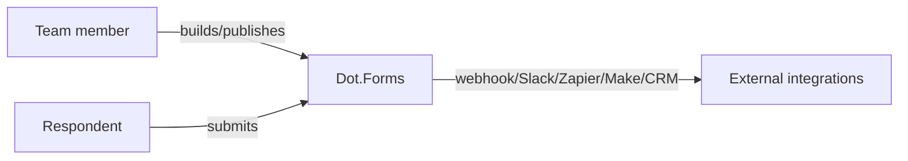

# Dot.Forms

> **Platform-owned source:** [Dot.Forms's wiki.md](https://github.com/sakhilebhayi/Dot.Forms/blob/main/wiki.md) — the platform's own knowledge home. This document is Dot.Brain's ingested view; the wiki is authoritative for what the platform actually is.

## 1. Purpose & Business Domain

A team-scoped form-builder: field builder, publish/draft/archive lifecycle, per-form collaborator roles, versioning with revert, CSV/XLSX export, GDPR per-user data export, and outbound dispatch on submission (webhook, Slack, Zapier, Make, CRM connectors). AI form generation via OpenAI with an honest heuristic fallback (not a faked result when the AI call is unavailable), plus a separate non-LLM rule-based submission analyzer.

## 2. Entities Owned

| Entity | Graph node type | Natural key | Notes |
|---|---|---|---|
| Form | `entity:asset` | form ID | Draft/published/archived lifecycle |
| FormVersion | `observation` | form × version | Versioned with revert |
| Submission | `observation` | submission ID | Per-response record |
| FormCollaborator | `entity:process` | form × user | Role-based collaboration |
| IntegrationDispatch | `entity:process` | dispatch ID | Webhook/Slack/Zapier/Make/CRM outbound |

## 3. Events Emitted

Internal dispatch events exist (submission → integration fan-out) but are not yet DKP-mapped ecosystem events.

## 4. Knowledge Packs Published

None. No DKP manifest or publish pipeline exists.

## 5. Intelligence Consumed

None currently subscribed.

## 6. Cross-Platform Relationships

No cross-platform data exchange with other Dot Ecosystem platforms yet beyond shared ecosystem SSO and the shared `infodot` database.

## 7. Tenancy Model

Team-scoped. The integration pass's IDOR-focused security scan found this already correctly enforced: every by-ID form/submission/version lookup routes through team/form relations with `Gate::authorize` plus explicit team-match checks in every `mount()`. No fix needed here.

## 8. Dopamine Surface

None identified as in-scope.

## 9. Active Recommendations

None — no Knowledge Pack publishing yet.

## 10. Incident History Summary

None recorded as a live incident. Real finding from the 2026-08-02 integration pass: `.env.example` had `DB_DATABASE` commented out despite `DB_USERNAME=infodot` already being set — fixed to `DB_DATABASE=infodot`. The SSRF gap flagged in that same pass (see 1.0.0 changelog) was closed in a follow-up second pass the same day — see 1.1.0.

## Change Log

| Version | Date | Author | Change |
|---|---|---|---|
| 1.0.0 | 2026-08-02 | Repository Steward Agent | Initial registration. Platform audited: SSO contract verified, DB_DATABASE misconfiguration fixed, favicon/branding consistency completed across two parallel layout systems, IDOR scan came back clean, README corrected (Laravel version, OpenAI vs. Anthropic, unshipped Reverb/Scout/Horizon claims removed). |
| 1.1.0 | 2026-08-02 | Sakhile Bhayi | **SSRF gap closed** — `App\Support\SsrfGuard` rejects webhook/CRM URLs resolving to loopback/private/link-local addresses (incl. cloud metadata endpoints), enforced at both settings-save time and dispatch time; outbound requests no longer follow redirects. |

## Open Questions

| Question | Owner → Approver |
|---|---|
| The custom-CSS sanitizer for form theming is non-exhaustive — worth a dedicated review before this handles untrusted input at scale. | Forms Platform Lead → Security Agent |
