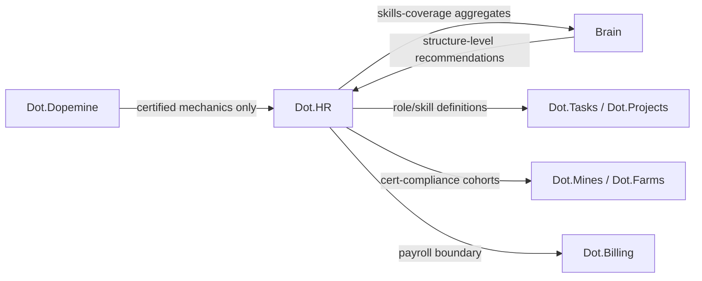

# Dot.HR

## 1. Purpose & Business Domain

Workforce management: employment records, skills and certifications, scheduling, leave, and workforce planning. Owns the people domain — the ecosystem's most person-sensitive data, where nearly every field is PII and the data subjects are also employees, with a power asymmetry no consent checkbox resolves. The governing principle, stated once and enforced everywhere below: **the Brain learns about work, never about workers.** Publishable knowledge concerns roles, skills profiles, schedules, and workforce structures; no pack, insight, or recommendation may model, rank, or predict an identified or identifiable individual. The PII-classification review (registry gap) is closed in §7.

## 2. Entities Owned

| Entity | Graph node type | Natural key | Notes |
|---|---|---|---|
| Role definition | `entity:asset` | `role:<domain>:<name>` | Publishable — describes work, not a worker |
| Skill/certification type | `entity:asset` | skill ID | Publishable; individual attainment records are not |
| Roster/schedule template | `entity:asset` | template ID | Publishable as structure |
| Workforce observation | `observation` | role × site-cohort × window | Aggregate only, per §7 |
| Employment record | — | — | **Never graphed.** Platform-internal; no node type exists for it by design |

The absent row is the point: employment records have no knowledge-graph representation at all. Exclusion at the type level, not the review level.

## 3. Events Emitted

| Event | Trigger | Consumers | Frequency |
|---|---|---|---|
| `people.certification.expiring_cohort` | Cohort of certs nearing expiry (aggregate, ≥ threshold) | Brain, domain platforms (compliance) | weekly |
| `people.roster.published` | Schedule cycle close | Brain (structure only), Dot.Tasks | per cycle |
| `people.vacancy.aging` | Role unfilled past threshold | Brain, Dot.Analytics | low |

## 4. Knowledge Packs Published

| Payload type | Cadence | Example pack ID |
|---|---|---|
| observation (skills-coverage, roster-pattern aggregates) | monthly | `dkp:hr:obs:2026-07-01:0006` |
| insight (workforce-structure findings) | per finding | `dkp:hr:ins:2026-05-30:0001` |
| outcome (recommendation verifications) | per verified recommendation | `dkp:hr:out:2026-07-25:0001` |
| incident (PII-gate events, scheduling failures) | per incident | `dkp:hr:inc:2026-03-20:0001` |

Default classification `restricted`; every pack passes the §7 field-classification gate before signing.

## 5. Intelligence Consumed

| Recommendation type | Metric expected to move | Baseline |
|---|---|---|
| Skills-gap alerts (role coverage vs. demand forecast) | `people.critical_role_coverage_rate` | 2026 H1 |
| Roster-pattern suggestions (structure-level, e.g. shift-overlap design) | `people.unfilled_shift_rate` | per site cohort |
| Certification-renewal scheduling (cohort-level) | `people.cert_lapse_rate` | 2026 H1 |

Consumption rule: recommendations may target structures (rosters, role definitions, renewal calendars), never individuals. "Schedule person X differently" is not a valid PR; "this shift-overlap pattern reduces unfilled shifts" is.

## 6. Cross-Platform Relationships



Seams: payroll execution is Billing's (HR owns the roster, Billing owns the money movement); task assignment is Tasks' (HR owns role definitions, Tasks owns who-does-what-today); mining cert compliance surfaces in Mines' UX but the cohort data is HR's.

## 7. Tenancy Model & PII-Classification Review (registry gap closed)

Tenant key = employing organization; sub-scoped by site. The **field-classification register** — every schema field classified into one of four tiers, reviewed by the Security Officer, re-reviewed on any schema change:

| Tier | Treatment | Examples |
|---|---|---|
| `prohibited` | Never leaves the platform in any form, aggregate or not | Names, IDs, health/disability data, disciplinary records, union membership, salary |
| `aggregate-only` | Publishable at n ≥ 100 distinct individuals, quarterly windows | Leave patterns, turnover, tenure distributions |
| `aggregate-standard` | Publishable at n ≥ 50 | Skills coverage, cert-expiry cohorts, roster structures |
| `open` | Publishable as-is | Role definitions, skill taxonomies, template structures |

Rules with no counterpart elsewhere: (1) inference-resistance — a pack combination that would let a consumer infer a `prohibited` field (e.g., leave patterns × small site × date range ⇒ an individual's medical leave) fails the gate even if each pack passes alone; the intersection check runs across HR's *publication history*, not just within a pack. (2) Worker visibility — the aggregate categories HR publishes about its workforce are themselves published to that workforce (the acid test applied to data, not just mechanics). (3) POPIA/GDPR mapping maintained per field tier, pending brain.identity.md's legal-identity resolution (shared OQ with Billing's dunning floor).

## 8. Dopamine Surface

The highest-risk platform for engagement mechanics aimed at workers by their employer. Withheld: individual productivity scores, attendance streaks, peer comparison of any kind, "top performer" surfaces — most are prohibited-list instantiations; the remainder fail the acid test the moment the power asymmetry is named. Shared: team-level skills-coverage progress and cert-compliance status — legible, collective, and about the work. The only certified mechanic deployed is milestone recognition on *team* certification goals (the same mechanic verified in dopemine §13, deployed at team granularity only).

## 9. Active Recommendations

Maintained by the Registry Agent. Current: roster-pattern suggestion `verified` — see §13; skills-gap alert for a critical maintenance role cohort `open` (expiry 2026-09-20).

## 10. Incident History Summary

One incident pack (2026-03): a skills-coverage pack for a nine-person site would have made two named-role holders identifiable — caught by the inference-resistance check (small-cell intersection with the public roster structure), published as a near-miss; lesson: site-level aggregates below 15 individuals roll up to region automatically. Consumed: Pulse's near-miss transparency precedent, cited in the decision to publish rather than silently fix.

## 11. Domain Metrics (registered per brain.metrics.md §4.8)

| ID | Type | Definition |
|---|---|---|
| `people.critical_role_coverage_rate` | ratio | Critical roles with qualified coverage ≥ plan / all critical roles |
| `people.cert_lapse_rate` | ratio | Certifications lapsed while role-active / certifications due, quarterly |
| `people.unfilled_shift_rate` | ratio | Shifts unfilled at cycle close / shifts planned |

## 12. Manifest (platform.dkp.json example)

```json
{
  "platform_id": "dot-hr",
  "dkp_version": "1.0.0",
  "signing_key_ref": "vault://keys/dot-hr/dkp-signing/v1",
  "publishes": ["observation", "insight", "outcome", "incident"],
  "subscribes": ["skills-gap-alert", "roster-pattern", "cert-renewal-scheduling"],
  "schemas": { "knowledge-pack": "1.0.0", "metric": "1.0.0" },
  "default_classification": "restricted",
  "tenancy": {
    "key": "org_id",
    "aggregation_floor": 50,
    "floor_overrides": [
      { "data_class": "aggregate-only-tier", "floor": 100, "min_window": "quarter" }
    ],
    "publication_rules": [
      { "rule": "field-classification-gate", "enforcement": "reject-at-ingestion" },
      { "rule": "inference-resistance-history-check", "enforcement": "reject-at-ingestion" },
      { "rule": "no-individual-targets", "applies_to": "inbound-recommendations", "enforcement": "reject" }
    ]
  }
}
```

## 13. Worked round-trip

1. **Pack:** `dkp:hr:obs:2026-07-01:0006` — roster-structure and unfilled-shift aggregates across Northern Cape mining-region sites, n = 340 individuals under region rollup (all §7 gates pass, publication-history intersection clean).
2. **Validation → graph:** `OBSERVED_WITH` edge between a shift-overlap roster template and lower unfilled-shift rates, 0.71; corroborated by Mines' site observations of handover-delay differences on the same sites (×1.10 → 0.78).
3. **PR back (roster-pattern):** adopt the 30-minute-overlap template for wet-season rosters; confidence 0.80, impact `people.unfilled_shift_rate` −15% predicted, guards: overtime-hours aggregate flat, team wellbeing aggregate flat-or-better, expiry 60 days. Targets a template — no individual named anywhere in the chain.
4. **Outcome:** `dkp:hr:out:2026-07-25:0001` — −19% unfilled shifts verified against non-adopting site cohort; both guards held. Downstream, Mines' shift-handover delays improved without Mines acting — the second cross-platform passive benefit in the corpus (after Billing→Farms).

## Change Log

| Version | Date | Author | Change |
|---|---|---|---|
| 1.0.0 | 2026-08-01 | Platform Integrator (prompt 05, AI) | Initial integration package: work-not-workers principle, PII-classification review closed as four-tier field register with inference-resistance history check and worker-visibility rule, employment records excluded at the type level, structure-only recommendation rule, 3 domain metrics, worked round-trip |
| 1.0.1 | 2026-08-01 | Repository Reviewer (prompt 07, AI) | Worker-visibility channel OQ struck (resolved by dot-design.md §7.1) |

## Open Questions

| Question | Owner → Approver |
|---|---|
| POPIA/GDPR field-tier mapping final sign-off — blocked on brain.identity.md legal-identity resolution (shared with Billing) | Security Agent → Security Officer |
| ~~Worker-visibility rule (§7): delivery channel for publishing aggregate categories to the workforce — via Dot.Notify digest or in-platform page?~~ **Resolved 2026-08-01** by [dot-design.md](dot-design.md) §7.1: certified `my-work-structure` component with a verbatim "what the Brain does not see" panel | People Agent → Ethics Officer |
