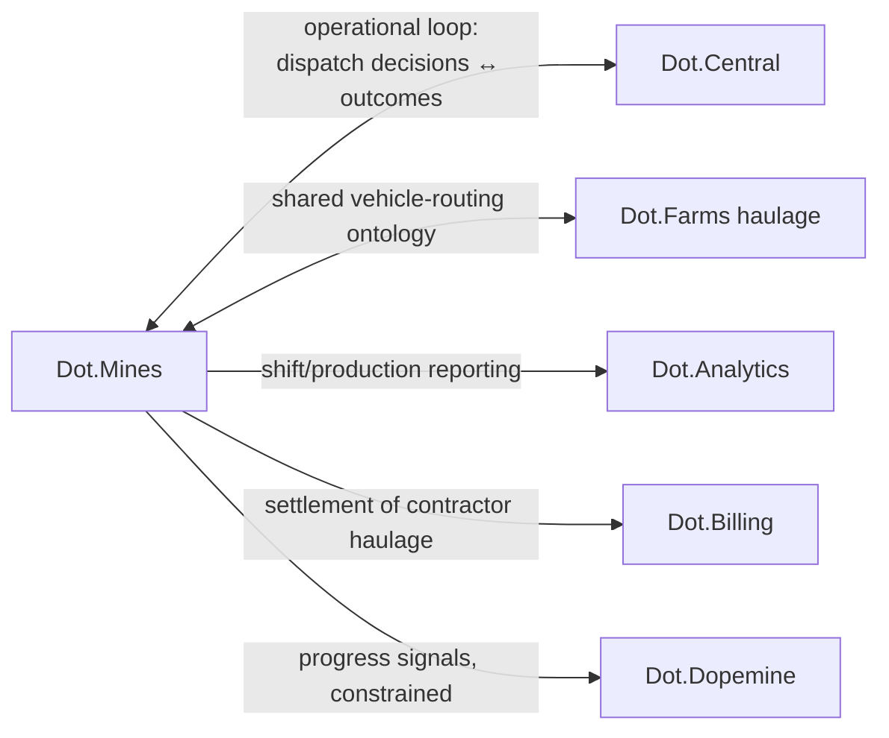

# Dot.Mines

## 1. Purpose & Business Domain

Mining ERP for open-pit operations — haul-cycle management, machine and shift scheduling, pit planning, maintenance, and safety — serving mine planners, dispatchers, and operators. Owns the mining operational domain; real-time dispatch intelligence is the Dot.Central operational loop (§6). This is the platform behind the repository's canonical worked thread (Kolomela wet-season cycle-time) and the [knowledge-pack example](../templates/knowledge-pack.example.md).

## 2. Entities Owned

| Entity | Graph node type | Natural key | Notes |
|---|---|---|---|
| Mine site | `entity:site` | `dot:node:mining:site:<id>` | Tenant root (Kolomela, Sishen, …) |
| Machine | `entity:asset` | site + fleet number | Trucks, loaders, drills |
| Pit / bench | `entity:asset` | site + pit code | Carries road-base attributes (lateritic flag = P-2026-001 condition C) |
| Shift | `entity:process` | site + date + shift code | Crew and dispatch context |
| Haul cycle | `entity:process` | machine + timestamp | The `mining.cycle_time_p50` unit of record |
| Inspection finding | `observation` | route + timestamp | Moisture-indexed under the wet-season pattern |
| Incident | `outcome` | site + incident ID | Feeds the failure-catalog path |

## 3. Events Emitted

| Event | Trigger | Consumers | Frequency |
|---|---|---|---|
| `mining.haulcycle.completed` | Cycle close | Brain ingestion, Dot.Central | ~10⁴/day |
| `mining.inspection.finding` | Road/equipment inspection | Brain, maintenance planning | ~10²/day |
| `mining.shift.summary` | Shift end | Brain, Dot.Analytics | 2–3/site/day |
| `mining.incident.reported` | Safety/operational incident | Brain (incident path), Dot.Central | low, paged |

## 4. Knowledge Packs Published

| Payload type | Cadence | Example pack ID |
|---|---|---|
| observation (cycle/inspection telemetry) | hourly batch | `dkp:mines:obs:2026-07-22:0410` |
| insight (operational correlations) | per finding | `dkp:mines:ins:2026-03-11:0007` — the wet-season insight |
| outcome (verification packs) | per verified recommendation | `dkp:mines:out:2026-06-28:0003` — the −64% verification |
| incident (lessons) | per incident | `dkp:mines:inc:2026-02-04:0001` |

## 5. Intelligence Consumed

| Recommendation type | Metric expected to move | Baseline |
|---|---|---|
| Inspection scheduling (moisture-indexed) | `mining.false_finding_rate` | pre-E3 2026 |
| Haul-route optimization | `mining.cycle_time_p50` | per site/pit |
| Maintenance windowing | `mining.unplanned_downtime_hours` | 2026 H1 |
| Dispatch load-balancing (via Dot.Central) | `mining.cycle_time_p50` | per shift |

## 6. Cross-Platform Relationships



The Mines↔Central loop is the ecosystem's tightest: Central consumes Mines events in near-real-time and returns dispatch recommendations; both share the Mining domain agent, and packs crossing the loop still take the front door (no side channel, per the boundary invariant).

## 7. Tenancy Model

Tenant key = site ID; topics `mining.<tenant>.<event>`. Cross-site reasoning from published packs only — the Kolomela→Sishen transfer ran as an I4 analogy then a replication, never as raw cross-tenant reads. Contractor data (haulage partners) carries sub-tenant tagging; contractor-identifiable aggregation observes the n ≥ 20 floor.

## 8. Dopamine Surface

Shares: shift-completion quality, safety-checklist completeness (outcome-anchored only). Explicitly withheld: individual operator speed rankings — a leaderboard on cycle time is a proxy that pays for haste with safety, pre-rejected under dopemine §2's acid test.

## 9. Active Recommendations

Maintained by the Registry Agent. Current: moisture-indexed inspection scheduling `verified` (Kolomela, Sishen); maintenance-windowing proposal `open`, expiry 2026-08-14.

## 10. Incident History Summary

Two incident packs (2026): dispatch misroute (F-PROC class, lesson propagated to Central), moisture-sensor outage (F-INFRA, drove the P-2026-001 sensor-coverage sentinel). Consumed: F-KNOW-2026-001's near-miss lesson (this platform's data was its subject).

## 11. Domain Metrics (registered per brain.metrics.md §4.8)

| ID | Type | Definition |
|---|---|---|
| `mining.cycle_time_p50` | duration | Median haul-cycle time, per site/pit — the canonical example's home |
| `mining.false_finding_rate` | ratio | Inspection findings not confirmed on follow-up |
| `mining.unplanned_downtime_hours` | gauge | Machine-hours lost to unplanned maintenance |
| `mining.cost_per_false_finding` | ratio | Platform-attested dispatch cost — the [brain.business.md](../brain.business.md) §5 pricing input |

## 12. Manifest (platform.dkp.json example)

```json
{
  "platform_id": "dot-mines",
  "dkp_version": "1.0.0",
  "signing_key_ref": "vault://keys/dot-mines/dkp-signing/v1",
  "publishes": ["observation", "insight", "outcome", "incident"],
  "subscribes": ["inspection-scheduling", "haul-route-optimization", "maintenance-windowing", "dispatch-balancing"],
  "schemas": { "knowledge-pack": "1.0.0", "metric": "1.0.0" },
  "tenancy": { "key": "site_id", "aggregation_floor": 20, "subtenant": "contractor_id" }
}
```

## 13. Worked round-trip

The canonical thread, restated as the test fixture:

1. **Pack:** `dkp:mines:ins:2026-03-11:0007` — insight: wet-season moisture correlates with false cycle-time findings, Kolomela, evidence 3 seasons of observations; signed, `ecosystem`, metric IDs resolve against §11.
2. **Validation → graph:** insight node; `OBSERVED_WITH` edge moisture↔false-findings at 0.72; E3 experiment promotes to `CAUSES` 0.83.
3. **PR back:** moisture-indexed inspection scheduling — confidence 0.83, impact `mining.false_finding_rate` −40% predicted, guards (maintenance backlog, operator workload) declared, expiry 30 days. Accepted at Kolomela.
4. **Outcome:** `dkp:mines:out:2026-06-28:0003` verifies −64%; S-2026-001 opens, Sishen replication follows, P-2026-001 promotes — one pack ID traceable from field observation to proven pattern.

## Change Log

| Version | Date | Author | Change |
|---|---|---|---|
| 1.0.0 | 2026-08-01 | Platform Integrator (prompt 05, AI) | Initial integration package: entities, events, packs, consumed intelligence, Central loop, tenancy with sub-tenants, dopamine surface with withheld-leaderboard decision, 4 domain metrics registered, manifest, canonical round-trip |
| 1.0.1 | 2026-08-01 | Platform Integrator (prompt 05, AI) | Loop-latency OQ resolved: canonical two-lane contract lives in dot-central.md §6 |

## Open Questions

| Question | Owner → Approver |
|---|---|
| ~~Dot.Central shares the Mining domain agent — does the Mines↔Central loop need its own latency contract in both platform docs, or one canonical statement in dot-central.md?~~ Resolved 2026-08-01: one canonical statement in [dot-central.md](dot-central.md) §6 (two-lane contract); this doc defers there | Registry Agent → Chief Knowledge Engineer |
| Contractor sub-tenant floor: is n ≥ 20 right for small contractor pools, or does it need the Dot.HR-style stricter review? | Security Agent → Security Officer |
